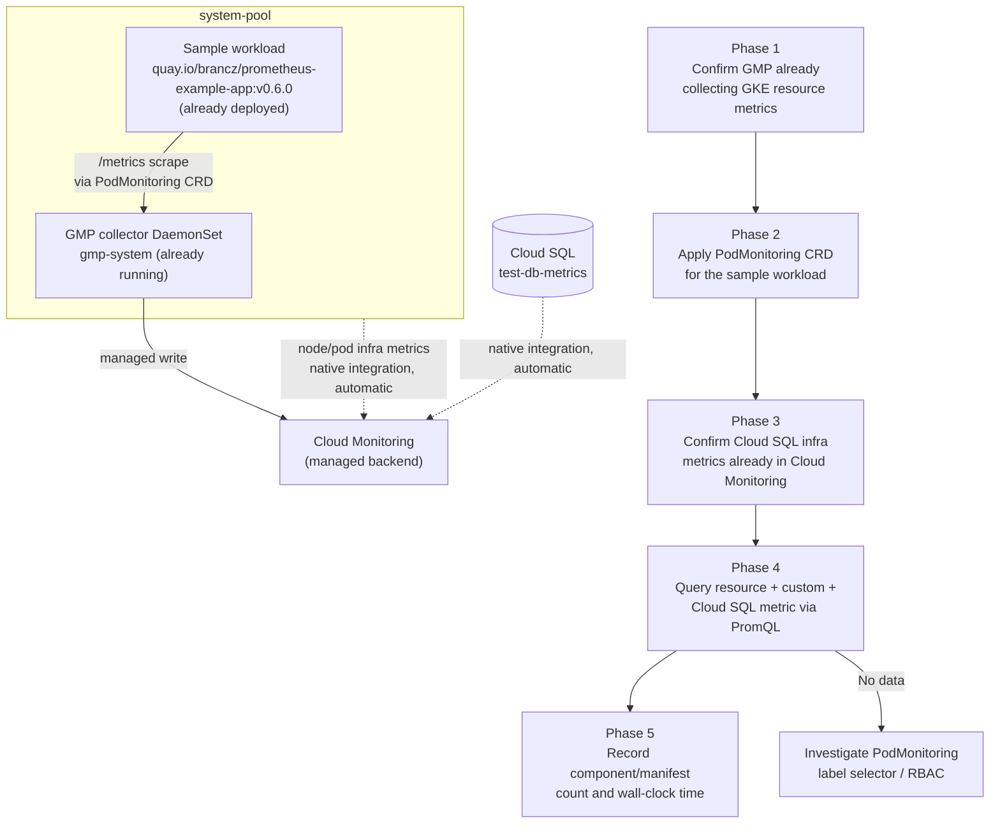

# Cloud Monitoring (GMP) — GKE Sandbox PoC — Design

Human review document. Read this before the PoC starts executing.

| | |
|---|---|
| **Ticket** | MCUCP-259 |
| **Parent research** | [System Resource Monitoring — Cloud Monitoring (GCP) vs MonaaS](../../research/system-resource-monitoring.md) |
| **Related PoC** | [MonaaS OTel Collector Variant — Design](../monaas-otel-collector/design.md) — the Option B counterpart; its numbers are combined with this PoC's numbers in the parent research, not within either PoC |

---

## Research Question

> What is the actual operational overhead of Option A — GCP Cloud Monitoring with Google
> Managed Service for Prometheus (GMP) — measured as component count and manifest count on the
> sandbox GKE cluster — for GKE resource metrics, a custom application metric, and Cloud SQL
> infra metrics?

The parent research's Analysis and Recommendation depend on two claims about Option A: that
GKE and Cloud SQL system metrics are collected automatically with no self-managed collector,
and that a custom application metric only needs a `PodMonitoring` CRD (see [Findings — Option
A](../../research/system-resource-monitoring.md)). This PoC verifies both claims hands-on and
produces Option A's measured overhead figure. The [MonaaS OTel Collector Variant
PoC](../monaas-otel-collector/poc-report.md) already produced the equivalent measurement for
Option B — comparing the two is explicitly out of scope for this PoC's own report; that
comparison is written into the parent research document once both PoCs have run.

---

## Hypothesis

Option A delivers all three metric categories — GKE resource metrics, the custom application
metric, and Cloud SQL infra metrics — with zero self-managed collector components and a single
`PodMonitoring` CRD as the only authored manifest, at materially lower manifest and component
count than Option B's OTel Collector variant (3 self-managed components, 6 manifests). One-time
setup duration is not a factor either way — it is upfront effort spent once, not recurring
overhead.

---

## Scope

| Item | In scope | Out of scope |
|------|----------|--------------|
| Sandbox GKE cluster (same cluster as the MonaaS OTel Collector PoC) | ✅ | |
| Verifying GMP's existing GKE resource-metric collection (`gmp-system` DaemonSet, already enabled) | ✅ | |
| `PodMonitoring` CRD scraping the same sample workload used in the OTel Collector PoC (`quay.io/brancz/prometheus-example-app:v0.6.0`, already deployed at `prometheus-example-app.default.svc.cluster.local:8080` on `system-pool` — reused, not redeployed) | ✅ | |
| Verifying Cloud SQL's native, automatic infra-metric emission into Cloud Monitoring for the `test-db-metrics` instance | ✅ | |
| PromQL query against Cloud Monitoring confirming all three metric categories are present | ✅ | |
| Component/manifest count recorded for Option A, comparable in shape to the MonaaS OTel Collector PoC's Option B numbers | ✅ | |
| Installing or configuring GMP itself | | ✅ — already enabled cluster-wide on this sandbox cluster (`managedPrometheusConfig.enabled: true`, `collector`/`gmp-operator` already running in `gmp-system`); not a step this PoC performs |
| Deploying the sample workload | | ✅ — already deployed for the OTel Collector PoC; the workload being observed is not part of the monitoring stack itself, same treatment as in that PoC's component count |
| Alert policy configuration | | ✅ — not part of the component/manifest/wall-clock comparison Option B measured; alerting mechanics are a separate concern from operational overhead |
| Producing the Option A vs Option B comparison itself | | ✅ — written into the parent research document once both PoCs have run, not into this PoC's own report |
| Native Cloud Monitoring Dashboards vs Grafana as the UI layer | | ✅ — an open question in the parent research (see Portability), not resolved by this PoC; querying here is for verification, not UI selection |
| Cost measurement at production scale | | ✅ — sandbox traffic is not representative |

---

## Approach

### Phase 1 — Confirm GMP is already collecting GKE resource metrics

1. Query Cloud Monitoring for a node/pod resource metric (e.g. CPU or memory utilization) with
   no new deployment, confirming GMP's existing collection is already producing data for this
   cluster's nodes across both `system-pool` and `spot-pool`.
2. Record that this required zero manifests and zero new components — the collector was already
   running before this PoC started.

### Phase 2 — Scrape the custom application metric

1. Confirm the sample workload from the OTel Collector PoC is still running and exposing
   `/metrics` on port 8080.
2. Author and apply a single `PodMonitoring` CRD targeting that workload's Service/label
   selector.
3. Confirm GMP's collector picks up the new scrape target with no additional RBAC or
   configuration beyond the CRD itself.

### Phase 3 — Confirm Cloud SQL infra metrics

1. Confirm `test-db-metrics`'s CPU, memory, and disk utilization metrics are already present in
   Cloud Monitoring — Cloud SQL emits these automatically on creation, with no manifest, CRD, or
   IAM grant required (unlike Option B's `googlecloudmonitoringreceiver`, which needed an IAM
   grant to poll the same data from outside Cloud Monitoring).

### Phase 4 — Query the metrics

1. Query Cloud Monitoring via PromQL for a node/pod resource metric, the sample workload's
   `http_requests_total` counter, and a Cloud SQL infra metric, confirming all three are
   present. Confirm the exact query surface (Cloud Monitoring's Metrics Explorer PromQL mode, or
   the GMP Prometheus-compatible query API) during execution rather than assuming one here.

### Phase 5 — Record

1. Record: number of distinct manifests applied (expected: 1 — the `PodMonitoring` CRD) and
   number of distinct self-managed software components deployed (expected: 0). One-time setup
   duration is not recorded as a comparison metric — it is upfront effort spent once, not
   recurring overhead, so it does not factor into the operational-overhead comparison.
2. Hand these numbers to the parent research document, where they are compared against the
   MonaaS OTel Collector PoC's Option B numbers for the same metric categories.

---

## Success Criteria

| Criterion | Pass condition |
|-----------|---------------|
| GKE resource metrics queryable | Node/pod resource metric visible via PromQL against Cloud Monitoring, with zero components deployed by this PoC |
| Custom app metric queryable | Sample workload's `http_requests_total` counter visible via PromQL, sourced only via the `PodMonitoring` CRD |
| Cloud SQL metric queryable | A `test-db-metrics` infra metric (e.g. CPU utilization) visible via PromQL, with zero manifests or IAM grants added by this PoC |
| Overhead measured, not estimated | Component count and manifest count recorded for Option A, in a form directly comparable to the existing MonaaS OTel Collector PoC's Option B numbers |

---

## Risks

| Risk | Mitigation / fallback |
|------|---------------------|
| `PodMonitoring`'s label selector doesn't match the sample workload's existing Service/Pod labels | Inspect the existing Deployment/Service from the OTel Collector PoC before authoring the CRD, rather than guessing selector labels |
| GMP's default scrape interval or retention delays visibility of the custom metric long enough to look like a failure | Budget a short wait matching GMP's documented scrape interval before treating an empty query as a failure; record the actual observed delay |
| Cloud SQL's native metric emission has its own ingestion delay separate from GMP's scrape interval | Acceptable for this PoC; record the actual observed delay rather than treating an initial empty query as a failure, mirroring the same risk already recorded in the OTel Collector PoC |
| Querying via the wrong surface (native Cloud Monitoring vs GMP's Prometheus-compatible endpoint) produces a false negative | Confirm the correct query surface during Phase 4 rather than assuming one in this design |

---

## Sandbox cluster

| | |
|---|---|
| **Project** | `sub-gcp-ucp-clsd-sandbox` |
| **Cluster** | `ucp-agent-cluster` (region `asia-northeast1`, GKE `1.35.7-gke.1027000`) |
| **Node pools** | `system-pool` (e2-small, 3 nodes running) and `spot-pool` (n2-standard-2, scaled up for the OTel Collector PoC) |
| **GMP** | Already enabled (`managedPrometheusConfig.enabled: true`); `collector` DaemonSet and `gmp-operator` already running in `gmp-system` — this PoC does not install or configure GMP itself |
| **Cloud SQL instance** | `test-db-metrics` — PostgreSQL, `asia-northeast1`, already provisioned for the OTel Collector PoC; reused here, not recreated |

The sample workload and `test-db-metrics` are shared with the OTel Collector PoC rather than
duplicated — both PoCs observe the same app and the same database instance, which is what makes
their component/manifest numbers comparable in the parent research document.
