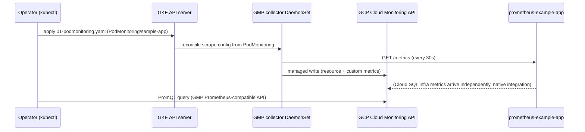

# Cloud Monitoring (GMP) — GKE Sandbox PoC — Implementation

Supporting proof document. See [design.md](design.md) for scope and [poc-report.md](poc-report.md)
for the verdict.

## Source Code

- Repository: `kitchen-sink` (`aripermana-putra/kitchen-sink`, local path
  `cloud-monitoring-poc/`)
- Authored manifest: `cloud-monitoring-poc/deploy/k8s/01-podmonitoring.yaml`
  (`PodMonitoring/sample-app`, namespace `default`)
- Commit: not yet committed to git

## Sandbox cluster

| | |
|---|---|
| Project | `sub-gcp-ucp-clsd-sandbox` |
| Cluster | `ucp-agent-cluster` (region `asia-northeast1`, GKE `1.35.7-gke.1027000`) |
| GMP | Already enabled (`managedPrometheusConfig.enabled: true`); `collector` DaemonSet (4 pods, one per node across `system-pool` and `spot-pool`) and `gmp-operator` already running in `gmp-system` before this PoC started |
| Sample workload | `prometheus-example-app` — reused from the [MonaaS OTel Collector PoC](../monaas-otel-collector/implementation.md), not redeployed |
| Cloud SQL instance | `test-db-metrics` — reused from the same PoC, not recreated |

## Sequence



## What was built

| Step | Manifest / command | Notes |
|------|--------------------|-------|
| `PodMonitoring` CRD | `deploy/k8s/01-podmonitoring.yaml` | Selects `app: prometheus-example-app`, scrapes port `http` (8080) at `/metrics` every 30s. The only manifest this PoC applies — GMP's collector, `gmp-operator`, GKE resource-metric collection, and Cloud SQL's infra-metric emission all pre-exist with zero setup |

No other manifest, component, or IAM binding was created. GMP's collector was already running
and already collecting GKE resource metrics before this PoC started; Cloud SQL's infra metrics
were already present in Cloud Monitoring with no receiver, exporter, or IAM grant required
(contrast with the [MonaaS OTel Collector PoC](../monaas-otel-collector/implementation.md),
which needed a project-level `roles/monitoring.viewer` grant to poll the same data from outside
Cloud Monitoring).

## Verification

Queried via the GMP Prometheus-compatible query API:
`https://monitoring.googleapis.com/v1/projects/sub-gcp-ucp-clsd-sandbox/location/global/prometheus/api/v1/query`,
authenticated with `gcloud auth print-access-token`.

**GKE resource metric** — `kubernetes_io:node_cpu_core_usage_time` returned one distinct series
per node across both `system-pool` and `spot-pool`, with no manifest or component involved:
```json
{"metric":{"__name__":"kubernetes_io:node_cpu_core_usage_time","cluster_name":"ucp-agent-cluster","node_name":"gke-ucp-agent-cluster-spot-pool-76eae683-qlt9", ...},"value":[1788314816.797,"3164.681"]}
{"metric":{"__name__":"kubernetes_io:node_cpu_core_usage_time","cluster_name":"ucp-agent-cluster","node_name":"gke-ucp-agent-cluster-system-pool-40e9e664-j33y", ...},"value":[1788314816.797,"41685.456747"]}
```

**Custom app metric** — the `PodMonitoring` CRD's `ConfigurationCreateSuccess` condition was
`True` immediately, with no scrape/permission errors. After generating a few requests against
the sample workload (`kubectl port-forward` + `curl`), `http_requests_total` appeared with full
Kubernetes-resource labels (`pod`, `container`, `namespace`, `top_level_controller_name`) added
automatically by GMP's `targetLabels.metadata`:
```json
{"metric":{"__name__":"http_requests_total","cluster":"ucp-agent-cluster","code":"200","container":"prometheus-example-app","namespace":"default","pod":"prometheus-example-app-849cf95954-5nxhh","top_level_controller_name":"prometheus-example-app","top_level_controller_type":"Deployment"},"value":[1788315051.194,"10"]}
```
The value (`10`) is lower than the raw counter exposed by the pod's own `/metrics` endpoint
(`69`, accumulated across earlier PoC sessions) at the same moment — GMP establishes a start
time at first scrape and reports the counter as cumulative-since-that-start, not the pod
process's raw lifetime value. This is expected behavior for GMP's Prometheus-to-Cloud-Monitoring
counter translation, not a data-loss or scrape failure; the metric is present, correctly
labeled, and increasing.

**Cloud SQL infra metric** — `cloudsql_googleapis_com:database_cpu_utilization` returned one
series carrying a `database_id` resource label identifying the instance:
```json
{"metric":{"__name__":"cloudsql_googleapis_com:database_cpu_utilization","database_id":"sub-gcp-ucp-clsd-sandbox:test-db-metrics","monitored_resource":"cloudsql_database","project_id":"sub-gcp-ucp-clsd-sandbox","region":"asia-northeast1"},"value":[1788314950.193,"0.09330182984680893"]}
```
Unlike the [MonaaS OTel Collector PoC's `googlecloudmonitoringreceiver`
output](../monaas-otel-collector/implementation.md#verification), which carried no
resource-identifying label, this series is already disambiguated per Cloud SQL instance —
querying Cloud Monitoring directly preserves the resource label that `googlecloudmonitoringreceiver`
drops on the way to a Prometheus-style metric.
