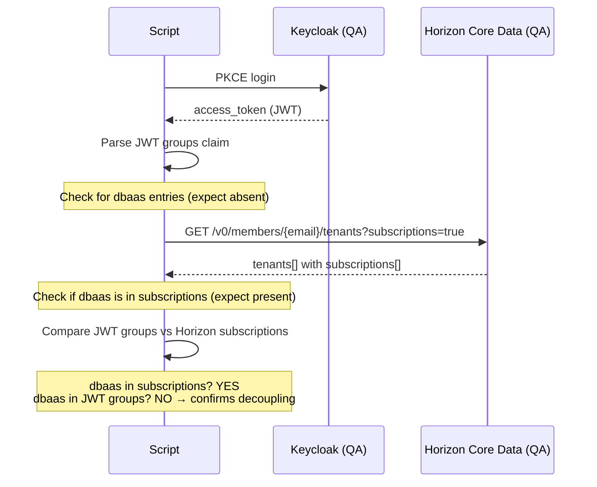
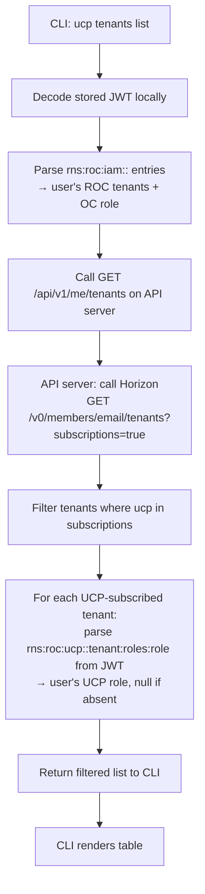

# Design: Core Data UCP Subscription Discovery

## Research Question

Can the Horizon Core Data API serve as the source of truth for UCP service subscription status, removing the need for UCP to maintain its own `ucp_registered_tenants` table?

**Jira:** MCUCP-130 (ucp tenants list), MCUCP-263

---

## Hypothesis

The Horizon Core Data API endpoint `GET /v0/members/{email}/tenants?subscriptions=true` returns a user's ROC tenant memberships with their service subscription lists. If UCP is registered as a service in Core Data, a subscribed tenant will include `ucp` in its `subscriptions[]` array. Combined with the JWT `groups` claim (which carries the user's UCP role per tenant when assigned), this provides everything needed to render `ucp tenants list` without any server-side UCP state.

---

## Scope

**In scope:**
- Verify that `GET /v0/members/{email}/tenants?subscriptions=true` returns subscription data the CLI can use
- Confirm that a subscribed service appears in `subscriptions[]` regardless of whether the user has a role in it (using DBaaS as a proxy — tenant is subscribed, user has no role)
- Confirm that the JWT `groups` claim is absent for a subscribed service when the user has no role (already confirmed in the keycloak-session-revoke PoC)
- Define the data sources for each field in `ucp tenants list`

**Out of scope:**
- UCP service subscription setup in ROC Portal (UCP is not yet subscribed in the test tenant)
- Testing with a tenant that has UCP subscribed (deferred until ROC team registers UCP service)

---

## Approach

Since UCP is not yet subscribed in any test tenant, DBaaS is used as a functional proxy:

- The `clsd-ucp` tenant is subscribed to DBaaS
- The test user has had their DBaaS role removed
- This mirrors the exact scenario: tenant subscribed to a service, user has no role in it

**Success criteria:**

| # | Criterion | Expected |
|---|---|---|
| SC-1 | DBaaS appears in `subscriptions[]` for clsd-ucp tenant | Pass |
| SC-2 | JWT `groups` claim has no DBaaS entry (user has no role) | Pass |
| SC-3 | `iam` entry for clsd-ucp is present in JWT (tenant membership) | Pass |
| SC-4 | Horizon API accessible with user's access token directly | Pass |

---

## Proposed data flow for `ucp tenants list`

---

## Risks and Open Questions

1. **UCP not yet subscribed in any test tenant** — DBaaS is used as a proxy. Full end-to-end confirmation with UCP requires the ROC team to subscribe a tenant to the UCP service.
2. **Horizon API network accessibility** — `qa-horizon-data-api.r-local.net` requires access to the Rakuten internal network. Confirm reachability from the kitchen-sink script.
3. **Latency** — calling Horizon at every `ucp tenants list` invocation adds one API call. Acceptable for a list command; not acceptable for every protected API endpoint.
