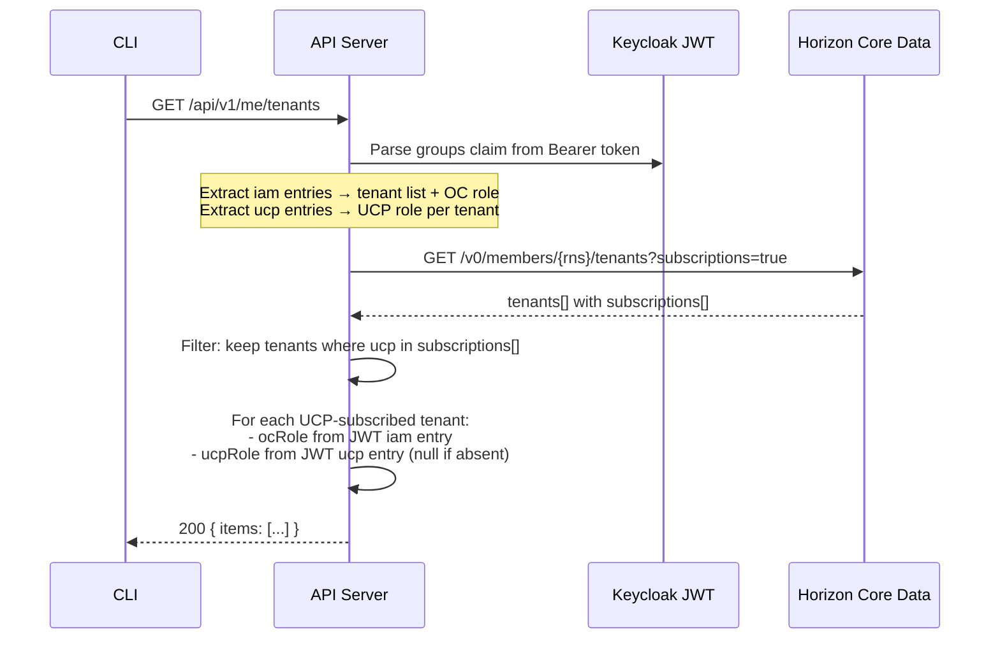

# Implementation: Core Data UCP Subscription Discovery

**Jira:** MCUCP-130, MCUCP-263
**Date:** 2026-08-03

---

## Source Code

- **Repository:** [aripermana-putra/kitchen-sink](https://github.com/aripermana-putra/kitchen-sink)
- **File:** `keycloak-session-revoke/main.go` — function `flowUCPSubscriptionDiscovery`
- **Commit:** `6937439` (latest — includes UCP subscription re-check run 2026-08-04)

---

## What Was Built

A Go script in `kitchen-sink/keycloak-session-revoke/main.go` (`flowUCPSubscriptionDiscovery` function) that:

1. Logs in via PKCE against ROC Keycloak QA
2. Parses the JWT `groups` claim — checks for DBaaS entries (absent, since user's DBaaS role was removed)
3. Calls `GET /v0/members/{memberRNS}/tenants?subscriptions=true` on Horizon Core Data QA
4. Verifies DBaaS appears in `subscriptions[]` despite the user having no DBaaS role
5. Checks whether UCP appears in subscriptions (not yet subscribed in test tenant)

**Horizon endpoint called:**
```
GET https://qa-horizon-data-api.r-local.net/v0/members/rns:roc:iam:::users:aripermana.putra/tenants?subscriptions=true
Authorization: Bearer <keycloak_access_token>
```

---

## Test Results

### Environment
- Keycloak QA: `https://qa2-accounts-onecloud.rakuten-it.com/auth/realms/roc`
- Horizon QA: `https://qa-horizon-data-api.r-local.net/v0`
- Tenant: `clsd-ucp`
- User: `aripermana.putra@rakuten.com` (Tenant Admin, DBaaS role removed prior to test)

### Success Criteria Results

| SC | Criterion | Result |
|---|---|---|
| SC-1 | DBaaS in `subscriptions[]` despite user having no DBaaS role | **PASS** |
| SC-2 | DBaaS absent from JWT `groups` (no role assigned) | **PASS** |
| SC-3 | `iam` entry present in JWT (tenant membership confirmed) | **PASS** |
| SC-4 | Horizon API accessible with user's access token | **PASS** |

### Raw Output (abridged)

**JWT groups (10 entries, dbaas absent):**
```
rns:roc:lbaas::clsd-ucp:roles:lbaas-viewer
rns:roc:caas::clsd-ucp:roles:admin
rns:roc:ucp:::roles:service-provider-admin
rns:roc:bmaas::clsd-ucp:roles:admin
rns:roc:lbaas::clsd-ucp:roles:lbaas-operator
rns:roc:iam::clsd-ucp:roles:admin
rns:roc:cicd-aas::clsd-ucp:roles:admin
rns:roc:registry-aas::clsd-ucp:roles:admin
rns:roc:computeapi::clsd-ucp:roles:admin
rns:roc:staas::clsd-ucp:roles:admin
```

**Horizon subscriptions for clsd-ucp (9 services):**
```
computeapi, caas, lbaas, staas, cicd-aas, billing, dbaas, registry-aas, bmaas
```

`dbaas` appears in subscriptions ✓ — UCP does not appear (not yet subscribed in test tenant).

---

## Key Observations

1. **Subscription status is independent of user role.** A service can be subscribed at the tenant level while the user has no assigned role in it. This decouples "is this tenant UCP-subscribed?" from "does the user have a UCP role?".

2. **UCP is registered in ROC Core Data** (`rns:roc:ucp:::roles:service-provider-admin` is in JWT groups) but not yet subscribed in the clsd-ucp test tenant.

3. **One Horizon call returns all needed subscription data.** `GET /v0/members/{rns}/tenants?subscriptions=true` returns all tenants the user belongs to with their subscription lists in a single response.

4. **Member RNS format.** The Horizon API requires the member identifier as an RNS string (`rns:roc:iam:::users:{username}`), not the raw email address. URL-encoding the `@` in the email causes a 404.

---

## Proposed `ucp tenants list` Data Flow



| Field | Source |
|---|---|
| Tenant list | JWT `rns:roc:iam::` entries |
| OC role (Tenant Admin / Tenant Member) | JWT `rns:roc:iam::{tenant}:roles:{role}` |
| UCP subscription status | Horizon `subscriptions[].name == "ucp"` |
| UCP role | JWT `rns:roc:ucp::{tenant}:roles:{role}` (null if absent) |
