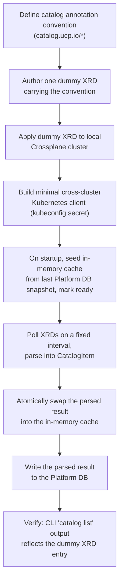

# Crossplane XRD as Catalog Source — Design

Human review document. Read this before the PoC starts executing.

| | |
|---|---|
| **Related story** | [MCUCP-144](https://jira.rakuten-it.com/jira/browse/MCUCP-144) — Browse Service Catalog |
| **Related TRD** | `docs/prd/PRD-005-service-catalog/MCUCP-144-browse-service-catalog.md` (static registry, current implementation path) |
| **Related future TRD** | `docs/prd/PRD-005-service-catalog/MCUCP-146-provision-catalog-entry.md` (defines the `CatalogRegistry` interface this PoC's registry implementation satisfies) |
| **Status** | Complete — see [poc-report.md](poc-report.md) |

## Research Question

> Can api-server derive catalog entries from Crossplane `CompositeResourceDefinition`
> metadata, persist that derived model in memory and in the Platform DB, and serve it
> through the catalog's existing `List`/`ResolveAvailability` contract — without a live
> cross-cluster call on the request path, and without requiring all 12 real entries to
> be authored first?

MCUCP-144's TRD implements the catalog as a hardcoded 12-entry Go table. That table has to
be edited by hand every time a provider or service is added or removed, and it duplicates
information (name, provider, category) that Crossplane already carries as XRD metadata once
an XRD exists for a service. This PoC tests whether XRD metadata can be the source of truth
instead, with api-server holding a derived copy of that metadata rather than Crossplane's own
object shape — isolating any future change to Crossplane's API surface to a single parsing
step instead of every reader.

Each catalog entry maps to exactly one `CompositeResourceDefinition` — one XRD per
provider+service, not one XRD shared across providers with a separate Composition per
provider — so a catalog entry's identity, parameter schema, and catalog metadata all live on
a single object.

## Hypothesis

A single `CompositeResourceDefinition` carrying a defined set of catalog annotations, listed
from a remote cluster on a fixed interval, can be parsed at poll time into the same
`CatalogItem` shape the static registry produces today. That derived `CatalogItem` — not the
raw XRD — is what gets cached in memory and written to the Platform DB. A pod seeds its
in-memory cache from the DB immediately at startup, reaching ready without waiting on the
Crossplane cluster, then replaces that seed with the first successful live poll's result once
available. The `GET /catalog` handler only ever reads the in-memory cache; it never calls the
Kubernetes API or the Platform DB on the request path.

## Scope

| In scope | Out of scope |
|---|---|
| ✅ Define the annotation/label convention XRDs must carry to be catalog entries | ❌ Authoring real XRDs for all 12 catalog entries |
| ✅ One dummy XRD carrying the convention, applied to a local Crossplane cluster | ❌ Editing MCUCP-146's real `gcp-cloud-sql` XRD |
| ✅ A minimal cross-cluster Kubernetes client (kubeconfig-style credentials, no in-cluster config) | ❌ Watch/informer-based caching |
| ✅ A background polling cache that derives `CatalogItem` at poll time (fixed-interval `LIST`, atomic snapshot swap) | ❌ Availability resolution (ROC/GCP) — unchanged, already separate from Crossplane |
| ✅ Persisting the derived `CatalogItem` list to the Platform DB on every successful poll | ❌ Provisioning dispatch changes |
| ✅ DB-seeded warm start at pod startup, reconciled against the first successful live poll | ❌ Cache invalidation on individual XRD changes (relies on next poll) |
| ✅ Parsing the XRD list into the existing `CatalogItem`/`CatalogRegistry` shape | ❌ A dedicated sync-job component — every api-server pod polls and writes independently |

Availability resolution (ROC subscription membership, GCP registration) stays exactly as
designed in MCUCP-144's TRD — it reads tenant/business data, not Crossplane, regardless of
where catalog metadata comes from.

## Approach



### Phase 1 — Annotation convention

Define the labels/annotations a `CompositeResourceDefinition` must carry to be picked up as a
catalog entry:

```yaml
metadata:
  labels:
    catalog.ucp.io/enabled: "true"
  annotations:
    catalog.ucp.io/service-id: gcp-cloud-sql
    catalog.ucp.io/name: Cloud SQL
    catalog.ucp.io/provider: GCP
    catalog.ucp.io/category: database
    catalog.ucp.io/description: Managed relational database on GCP
```

`catalog.ucp.io/enabled: "true"` is the label used for the `LIST` selector
(`catalog.ucp.io/enabled=true`), so the poller only fetches XRDs meant to be browsable,
not every XRD in the cluster.

MCUCP-144's TRD (`ucp-platform/docs/prd/PRD-005-service-catalog/MCUCP-144-browse-service-catalog.md`)
has since adopted this PoC's approach for production and extended the convention with one field,
`catalog.ucp.io/roc-subscription-name` (empty for GCP entries and for `roc-vlan`), so ROC
availability-resolution data lives on the XRD too instead of a separate static table. This PoC's
dummy XRD predates that field and does not carry it.

### Phase 2 — Dummy XRD

Author one throwaway `CompositeResourceDefinition` carrying the convention above, applied to
a local Crossplane cluster. It does not need a matching `Composition` or to provision
anything real — it only needs to exist and be listable, since this PoC tests the read path,
not provisioning.

### Phase 3 — Cross-cluster client

api-server's cluster and the Crossplane control-plane cluster are not the same cluster, so
`rest.InClusterConfig()` does not apply. Build a `rest.Config` from an explicit
Secret-backed kubeconfig (API server URL, CA cert, ServiceAccount token) — the same pattern
Argo CD and Cluster API use for managing remote clusters.

**Local environment:** two Colima profiles simulate the two clusters, so the cross-cluster
path is real rather than assumed:

- `ucp-crossplane` — runs Crossplane and the dummy XRD.
- `ucp-apiserver` — runs the Platform DB (PostgreSQL) and a small Go service standing in for
  api-server (in-memory cache, poller, `/catalog` and `/health/ready` handlers).

The api-server service in `ucp-apiserver` reaches `ucp-crossplane` using a kubeconfig for that
cluster's context (mounted as a file, not `rest.InClusterConfig()`), matching how a real
cross-cluster deployment would authenticate.

### Phase 4 — Poll and derive

A background goroutine calls `LIST` against the `CompositeResourceDefinition` resource on a
fixed interval. Each successful poll parses the returned XRDs' `catalog.ucp.io/*` annotations
directly into `CatalogItem` values — the raw XRD is not what gets cached or persisted, only
the derived result. The in-memory cache is replaced with the full derived list on every
successful poll (`sync.RWMutex`, replace-the-slice — not mutate-in-place — so no reader
observes a partial update). A failed poll logs the error and keeps serving the last-good
snapshot; it does not clear the cache.

### Phase 5 — Persistence and warm start

Every successful poll also writes the derived `CatalogItem` list to the Platform DB as an
upsert. Multiple api-server pods poll and write independently — this is safe without leader
election, since the write is idempotent and every pod derives the same result from the same
source.

At startup, a pod reads the most recent snapshot from the Platform DB into its in-memory
cache immediately and reports `/health/ready` as soon as that read succeeds, without waiting
on the Crossplane cluster. The background poller then runs as in Phase 4; the first
successful live poll replaces the DB-seeded snapshot in memory using the same atomic swap as
every subsequent poll. If the Crossplane cluster stays unreachable, the pod keeps serving the
DB-seeded snapshot indefinitely rather than failing requests.

On the very first deployment ever, the Platform DB has no snapshot row yet, since one only
exists after a poll has succeeded at least once. A DB read with zero rows is not an error — it
seeds the in-memory cache with an empty list, and the pod reports `/health/ready` immediately,
the same as any other startup. The catalog is empty until the first successful live poll
populates it; no separate bootstrap or seed-data mechanism exists to avoid this window, since
it only occurs once in the system's lifetime and resolves itself on the next successful poll.

### Phase 6 — Wiring and verification

Serve `CatalogItem` values from the in-memory cache through the same `Registry.List` contract
MCUCP-144's static registry implements. Verify with `ucp catalog list` against the PoC build,
confirming the dummy entry appears with the fields from its annotations, and that the entry
still appears after restarting the pod before the Crossplane cluster is reachable (DB-seeded
warm start).

## Success Criteria

| Criterion | Pass condition |
|---|---|
| Cross-cluster read | api-server, running with credentials for cluster B, lists `CompositeResourceDefinition` objects in cluster B without using in-cluster config |
| Annotation parsing | The dummy XRD's `catalog.ucp.io/*` annotations map correctly to `CatalogItem` fields |
| Derived persistence | The Platform DB row after a successful poll contains the derived `CatalogItem` list, not a raw XRD dump |
| Cache-only reads | `GET /catalog` never issues a Kubernetes API call or a Platform DB query on the request path — only the background poller does |
| DB-seeded warm start | A pod started while the Crossplane cluster is unreachable reports `/health/ready` using the last DB-persisted snapshot, without blocking on a live poll |
| Reconciliation | Once the Crossplane cluster becomes reachable, the first successful live poll replaces the DB-seeded snapshot in memory |
| Stale-on-failure | A poll failure after a successful warm-up keeps serving the previous snapshot, not an error or an empty list |
| Cold start | A pod started against an empty Platform DB (no prior snapshot) reports `/health/ready` immediately with an empty catalog, and populates it on the first successful live poll |

## Risks

| Risk | Mitigation |
|---|---|
| Cross-cluster network path (LB/firewall) blocks or drops the connection | Polling uses short-lived `LIST` calls, not long-lived streams — no watch/informer, so no idle-timeout exposure |
| Poller interval too long: stale catalog after a real XRD change | Not addressed by this PoC — interval value is an implementation.md decision, tunable without design changes |
| Poller interval too short: load on the Crossplane API server | Same as above — interval is tunable; `LIST` of XRDs is cheap relative to typical API server load |
| Multiple api-server pods write the same derived snapshot to the Platform DB concurrently | The write is an idempotent upsert of the same source data — no leader election or single-writer coordination needed |
| A parser bug writes an incorrect derived `CatalogItem` to the Platform DB | The DB snapshot is only a seed, not authoritative — the next successful live poll overwrites it with a freshly derived result once the parser is fixed |
| Annotation convention chosen here does not match what MCUCP-146's real XRD will need | This PoC's convention is not final — MCUCP-146's XRD is updated to carry it as a follow-up once the PoC concludes, not edited as part of this PoC |
| Kubeconfig secret for the remote cluster leaks or expires | Out of scope for this PoC — credential lifecycle is a production-implementation concern, not a read-path concern |

## Open Questions

- Final annotation/label key names and required-vs-optional fields — adopted and extended by
  MCUCP-144's TRD (see Phase 1 above); still open for MCUCP-146's real `gcp-cloud-sql` XRD,
  which has not yet been updated to carry the convention.
- Polling interval value — deferred to `implementation.md` here; MCUCP-144's TRD has since
  chosen a production value (24h steady-state, with a short check cadence, failure backoff,
  and an explicit refresh endpoint layered on top — not designed by this PoC).
- Whether the dummy XRD is deleted after the PoC or left in the sandbox cluster for reference.
- Platform DB schema for the derived snapshot (one row per catalog entry vs. a single JSON
  blob for the full list) — deferred to `implementation.md`.
- Whether MCUCP-146's provisioning design adopts the same derived-model/DB-seeded approach —
  under discussion alongside MCUCP-146's TRD; this PoC's read path does not depend on that
  outcome.
