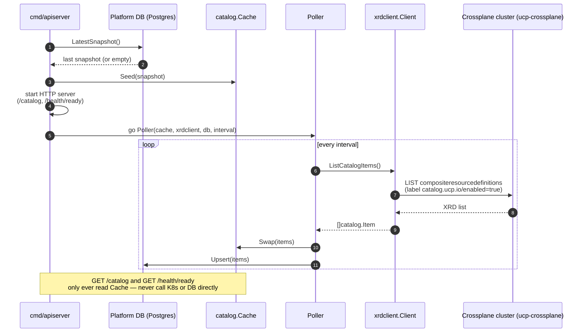

# Crossplane XRD as Catalog Source — Implementation

Supporting proof document. Tracks what has actually been built, deployed, and run against
the two-cluster local environment described in [design.md](design.md).

## Environment

Two Colima profiles simulate the two clusters from design.md's Phase 3:

| Profile | Role | Status |
|---|---|---|
| `ucp-crossplane` | Docker + k3s (Kubernetes), runs the Crossplane control plane | Running |
| `ucp-apiserver` | Docker only, no Kubernetes — hosts the Platform DB (`platform-db` container, Postgres 16) | Running |

`kubectl config get-contexts` exposes the crossplane cluster as context
`colima-ucp-crossplane`. A standalone kubeconfig for that context is extracted to
`kubeconfig-crossplane.yaml` (gitignored — carries a client certificate/key) for
`xrdclient.New()` to load, matching design.md's "mounted as a file" requirement.

The simulated api-server (`cmd/apiserver`) runs on the host via `go run`, not inside either
Colima VM — it reaches Postgres through the port Colima forwards to `localhost:5432`, and
reaches the Crossplane cluster through `kubeconfig-crossplane.yaml`. Neither Colima profile
runs the api-server binary itself; `ucp-apiserver`'s role in this PoC is limited to hosting
the Platform DB.

## Implementation

| Component | File | Status |
|---|---|---|
| Annotation convention (`catalog.ucp.io/*`) | — | Applied |
| Dummy XRD `xdummyservices.catalog.ucp.io` | applied directly via `kubectl apply`, no manifest committed to the repo | Applied, `Established` on `ucp-crossplane` |
| `catalog.Item` model + `Cache` (Seed/Swap/List/Ready) | `internal/catalog/catalog.go` | Implemented |
| `Poller` (fixed-interval LIST, atomic swap, persist-on-success) | `internal/catalog/poller.go` | Implemented |
| `db.Store` (Postgres, JSONB snapshot, `Upsert`/`LatestSnapshot`) | `internal/db/db.go` | Implemented |
| `xrdclient.Client` (kubeconfig-based dynamic client, label-selected LIST, annotation parsing) | `internal/xrdclient/xrdclient.go` | Implemented |
| Go module dependencies (`pgx`, `client-go`) | `go.mod`, `go.sum` | Resolved via `go mod tidy` |
| Standalone kubeconfig for cross-cluster access | `kubeconfig-crossplane.yaml` (gitignored) | Extracted, verified against the live cluster |
| Postgres instance on `ucp-apiserver` | `platform-db` container, port 5432 forwarded to host | Running |
| `cmd/apiserver/main.go` — wires cache + poller + db + xrdclient, `net/http` server | `cmd/apiserver/main.go` | Implemented, verified |
| `GET /catalog`, `GET /health/ready` handlers | `cmd/apiserver/main.go` | Implemented, verified |

## Flow



## Verification

| Scenario | Command | Result |
|---|---|---|
| Cold start, empty DB | start process against a fresh `platform-db`, `curl /health/ready` immediately | `200`, cache seeded with 0 items |
| First successful poll | `curl /catalog` after startup | Poll runs before the first tick — returns the dummy `gcp-cloud-sql` entry immediately, no wait for the interval |
| DB-seeded warm start | point `KUBECONFIG_PATH` at a kubeconfig with an unreachable server address (`192.0.2.1`), restart, `curl /health/ready` | `200` immediately, `/catalog` returns the last DB-persisted snapshot (1 item), without blocking on the live poll |
| Cross-cluster read | `xrdclient.Client` built from `kubeconfig-crossplane.yaml` (not `rest.InClusterConfig()`) | `LIST compositeresourcedefinitions` succeeds against `ucp-crossplane` from a process running outside that cluster |
| Derived persistence | inspect `catalog_snapshot` table after a poll | Contains the derived `CatalogItem` JSON, not the raw XRD |
| Stale-on-failure | started against the real kubeconfig, confirmed one successful live poll, then `colima stop --profile ucp-crossplane` while the process kept running | Every subsequent poll logged `poll failed, serving last-good snapshot`; `/catalog` and `/health/ready` (200) kept serving the last successful snapshot unchanged throughout the outage |
| Reconciliation | `colima start --profile ucp-crossplane` while the process kept running (same client, no restart), then mutated the dummy XRD's `catalog.ucp.io/description` annotation | The next poll after the cluster became reachable again succeeded; `/catalog` reflected the mutated annotation without a process restart, confirming the live poll — not the DB seed — is what's being served |

Commands used:

```bash
POLL_INTERVAL=3s go run ./cmd/apiserver
curl -s localhost:8080/health/ready
curl -s localhost:8080/catalog | jq .
```

## Open Items

- The dummy XRD exists only in the live `ucp-crossplane` cluster — no manifest is committed
  to the repo. Worth adding as a YAML file under the PoC directory for reproducibility.
- Poll interval value is not yet chosen for a real deployment — tracked as an open question
  in design.md; `3s` was used only for fast local verification.
- `xrdclient.New()` builds a `rest.Config` with no explicit timeout. During the outage test,
  failed polls took up to ~34s to return (OS TCP connect/`i/o timeout`) against a 5s configured
  interval — the single-goroutine poll loop blocks on each attempt, so ticks are effectively
  skipped while a poll is in flight. This did not block `/health/ready` or `/catalog`, but a
  bounded per-poll `context.WithTimeout` would make failure detection deterministic instead of
  depending on OS-level timeouts.
