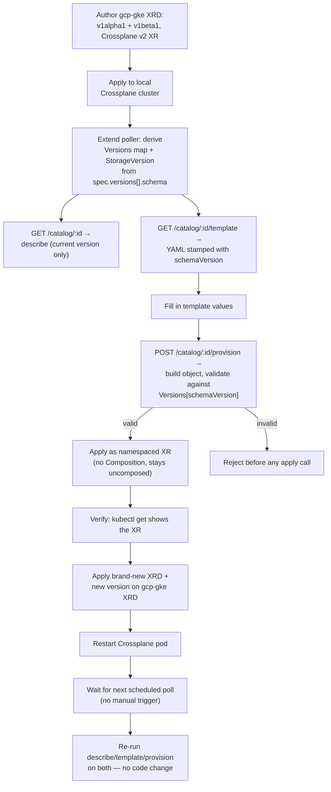

# Crossplane XRD Versioned Schema and Provisioning — Design

Human review document. Read this before the PoC starts executing.

| | |
|---|---|
| **Related story** | [MCUCP-145](https://jira.rakuten-it.com/jira/browse/MCUCP-145) — Service Detail View |
| **Related story** | [MCUCP-146](https://jira.rakuten-it.com/jira/browse/MCUCP-146) — Provision Catalog Entry |
| **Related TRD** | `docs/prd/PRD-005-service-catalog/MCUCP-145-service-detail-view.md` — defines the multi-version `EntrySchema`/`StorageVersion` model and the no-`--version`-selection rule this PoC proves |
| **Related future TRD** | `docs/prd/PRD-005-service-catalog/MCUCP-146-provision-catalog-entry.md` (branch `docs/mcucp-146-resource-api-redesign`, not yet on `main`) — defines the real `provision` submission this PoC's validate-then-apply path stands in for |
| **Related PoC** | [crossplane-xrd-catalog-source](../crossplane-xrd-catalog-source.md) — proved catalog *metadata* derivation (MCUCP-144); this PoC proves *schema* derivation and provisioning-submission instead |
| **Status** | In progress |

## Research Question

> Can api-server derive a per-served-version JSON Schema from a `CompositeResourceDefinition`'s
> own OpenAPI schema, serve it through `describe`/`generate-template`-equivalent reads that only
> ever show the current storage version, and then validate a filled-in submission against the
> exact version it was generated against before applying it as a namespaced Composite Resource —
> without an availability check and without a real provisioning backend?

MCUCP-145's TRD defines `EntrySchema.Versions` (every served version's `parameters` schema,
keyed by version name) and `EntrySchema.StorageVersion` (the one version `describe`/
`--generate-template` ever render), plus a `schemaVersion` stamp that lets a template generated
under an older version stay valid at provision time. This PoC tests whether that model holds up
against a real multi-version XRD and a real JSON Schema validator, end to end from schema
derivation through a validated apply — not just as a design on paper.

## Hypothesis

A `CompositeResourceDefinition` carrying two served versions (`v1alpha1`, `v1beta1`) can be
polled and parsed into a `map[string]map[string]any` keyed by version name, plus the name of
whichever version currently has `storage: true`. A `GET` endpoint renders that current version's
schema both as a describe response and as a template skeleton stamped with the version name. A
`POST` endpoint accepts a filled-in parameter payload tagged with the `schemaVersion` it was
generated against, converts it to an unstructured object, validates that object against the
exact stored schema for that version using a standard JSON Schema validator
(`github.com/santhosh-tekuri/jsonschema/v6`, matching MCUCP-145's TRD), and — only on successful
validation — applies the result as a Crossplane v2 namespaced XR (no Claim). No `Composition`
backs the XRD, so nothing is actually provisioned; the mechanics under test are schema
derivation, version-scoped rendering, and validate-then-apply — not real infrastructure.

## Scope

| In scope | Out of scope |
|---|---|
| ✅ One dummy multi-version XRD (`v1alpha1`→`v1beta1`, `cluster`/`nodepool`/`conn-secret` resource graph — reusing MCUCP-145's TRD's `gcp-gke` worked example directly) | ❌ Authoring a real production XRD (MCUCP-146's `gcp-cloud-sql`) |
| ✅ Crossplane v2 namespaced XR — no Claim, matching MCUCP-144's Design decisions | ❌ A `Composition` behind the XRD — the applied XR stays uncomposed by design |
| ✅ Extending `crossplane-xrd-catalog-source`'s cross-cluster poller to also derive a per-version JSON Schema, not just catalog metadata | ❌ Watch/informer-based caching, DB persistence, warm start — already proven by the prior PoC, not repeated |
| ✅ `GET /catalog/{serviceId}` — describe: current version's schema, resource graph grouping, version | ❌ Availability resolution (ROC/GCP) — every entry is always describable/provisionable regardless of tenant state |
| ✅ `GET /catalog/{serviceId}/template` — YAML skeleton stamped with `schemaVersion`, standing in for the CLI's `--generate-template` | ❌ A `ucp` CLI binary — describe/template/provision are plain HTTP endpoints, called directly |
| ✅ `POST /catalog/{serviceId}/provision` — fill values → unstructured object → validate against `Versions[schemaVersion]` → apply as XR | ❌ Multiple catalog entries — one dummy XRD only |
| ✅ Proving an older `schemaVersion` still validates and applies after a newer version becomes current | ❌ Provisioning status tracking, rollback, or any Temporal-equivalent async execution |
| ✅ Proving zero code change is needed for a brand-new XRD or a new version of the existing one — apply, restart Crossplane, wait for the next poll, re-run the same tests | ❌ A hot-reload or watch-triggered poll — the wait is for the existing fixed-interval poll, not a new invalidation mechanism |

Template rendering here happens server-side (`GET .../template`), which is a deliberate PoC
simplification: MCUCP-145's TRD keeps template rendering CLI-side, since there's no CLI in this
PoC. This does not change what's being tested — the schema being rendered and validated against
is identical either way.

## Approach

### Phase 1 — Multi-version dummy XRD

Author one `CompositeResourceDefinition` with two `served: true` versions, `v1beta1` carrying
`storage: true`, reusing MCUCP-145's TRD's `gcp-gke` worked example verbatim: `v1alpha1` without
`cluster.network`/`cluster.subnetwork`, `v1beta1` adding them (a `None`-safe, additive change).
Three resource-graph items (`cluster`, `nodepool`, `conn-secret`), `catalog.ucp.io/*` annotations
carried over from the prior PoC's convention. `apiextensions.crossplane.io/v2` group, applied
directly as an XR — no Claim.

### Phase 2 — Schema-deriving poller

Extend `crossplane-xrd-catalog-source`'s `xrdclient.Client` (same kubeconfig-based cross-cluster
pattern) to also read `spec.versions[].schema.openAPIV3Schema.properties.spec.properties.parameters`
per served version, copying each verbatim into a `Versions map[string]map[string]any`, and record
whichever version has `storage: true` as `StorageVersion`. Same fixed-interval `LIST`, atomic
cache swap as the prior PoC — no new caching mechanism.

### Phase 3 — Describe and template endpoints

`GET /catalog/{serviceId}` reads `Versions[StorageVersion]` and returns it alongside the resource
graph and version name — never any other stored version. `GET /catalog/{serviceId}/template`
renders the same schema as an empty, per-field YAML skeleton with a fixed `schemaVersion:
<StorageVersion>` line first, matching MCUCP-145's TRD's template shape.

### Phase 4 — Provision endpoint

`POST /catalog/{serviceId}/provision` accepts `{name, schemaVersion, parameters}`. Look up
`Versions[schemaVersion]` (not `Versions[StorageVersion]` — this is what proves an older
version still works); 404 if that version isn't stored. Build an unstructured object with
`parameters` under `spec.parameters` and `name` under `metadata.name`. Compile
`Versions[schemaVersion]` with `github.com/santhosh-tekuri/jsonschema/v6` and validate the
built object's `spec.parameters` against it. On failure, return the validator's errors and stop
— no apply call. On success, apply the object as an XR at `apiVersion: <group>/<schemaVersion>`
to the Crossplane cluster.

### Phase 5 — Verification

1. `describe` and `template` against `v1beta1` (the storage version) — confirm `v1alpha1` is
   never surfaced even though it's still stored.
2. Fill the `v1beta1` template, submit via `provision` — confirm the XR exists via `kubectl get`
   with no `Composition` bound (proves apply succeeded without proving real provisioning).
3. Submit a payload missing a required field or with an invalid enum value — confirm rejection
   before any apply call.
4. Submit a payload tagged `schemaVersion: v1alpha1` — confirm it still validates and applies,
   even though `v1beta1` is the current storage version, proving the "old version stays valid"
   claim end to end.

### Phase 6 — Zero-code-change extensibility

Proves the same claim the original `crossplane-xrd-catalog-source` PoC made for catalog
metadata (adding a service needs no api-server code change) now also holds for schema
derivation and provisioning — without touching any Go code between steps.

1. Author and apply a second, brand-new dummy XRD (a different `serviceId`, single version) to
   the Crossplane cluster — no changes to the poller, handlers, or any other PoC code.
2. Add a third version (e.g. `v1gamma1`) to the existing `gcp-gke` XRD, marking it `storage:
   true` and demoting `v1beta1` to `storage: false` while keeping both `v1alpha1` and `v1beta1`
   `served: true` — again with no code change.
3. Apply the updated `gcp-gke` XRD alongside the new XRD, then **restart the Crossplane pod**.
   This step exists because Crossplane is understood to need a restart to correctly pick up an
   XRD change — this PoC treats that as unconfirmed going in and records what's actually
   observed (Risks).
4. Wait for the poller's next regularly scheduled poll — no manual refresh, no restart of the
   PoC's own process.
5. Re-run Phase 5's full test sequence against **both** XRDs:
   - New XRD: `describe`, `template`, and `provision` all work with zero code change.
   - Updated `gcp-gke` XRD: `describe`/`template` now show `v1gamma1` as the current version;
     `provision` with `schemaVersion: v1gamma1` succeeds; `provision` with `schemaVersion:
     v1beta1` **and** `schemaVersion: v1alpha1` both still validate and apply successfully —
     proving old versions keep working across more than one version bump, not just one.

## Success Criteria

| Criterion | Pass condition |
|---|---|
| Multi-version derivation | Both `v1alpha1` and `v1beta1` schemas are stored in `Versions`, keyed by name; `StorageVersion` correctly names the `storage: true` version |
| Describe/template show only the current version | `GET .../catalog/:id` and `.../template` only ever render `Versions[StorageVersion]` — `v1alpha1` is never surfaced by either endpoint |
| Template stamps schemaVersion correctly | The generated YAML's `schemaVersion` field matches `StorageVersion` at generation time |
| Invalid input is rejected before apply | A `provision` payload missing a required field or violating an enum returns a validation error; no XR is created |
| Valid input applies cleanly | A `provision` payload satisfying `Versions[schemaVersion]` results in the XR existing in the Crossplane cluster, with no `Composition` required for the apply to succeed |
| Old version stays provisionable after a newer one exists | A payload tagged `schemaVersion: v1alpha1` validates and applies successfully even after `v1beta1` is the storage version |
| Brand-new XRD needs zero code change | A second, previously-unknown XRD is fully describable/templatable/provisionable after apply + Crossplane restart + next poll, with no changes to poller/handler code |
| New version of an existing XRD needs zero code change | Adding `v1gamma1` to `gcp-gke`'s XRD makes it the new current version after apply + restart + next poll, with no code change |
| Every prior version keeps working across more than one version bump | `schemaVersion: v1alpha1` and `schemaVersion: v1beta1` both still validate and apply successfully once `v1gamma1` is current — not just the immediately-previous version |

## Risks

| Risk | Mitigation |
|---|---|
| Kubernetes structural schema vs. the JSON Schema dialect the validator library expects diverge in some edge case | Test both a passing and a deliberately failing payload explicitly (Phase 5) rather than assuming compatibility |
| Crossplane rejects applying an XR with no `Composition` bound | Not expected — Crossplane accepts the write and leaves the XR unsynced/pending; verified directly in Phase 5, not assumed |
| Reusing the exact `gcp-gke` TRD example ties this PoC's success too tightly to one worked example | Acceptable — the goal is proving the TRD's documented behavior specifically, not general robustness across arbitrary schemas |
| Whether Crossplane actually requires a pod restart to pick up an XRD change is unconfirmed going in — a CRD update is normally something Kubernetes' API server serves immediately, with no controller restart needed | Phase 6 tests both ways if practical (with and without the restart) and records what's actually observed in `implementation.md`/`poc-report.md`, rather than asserting the restart is required because it was — this could turn out to be unnecessary, or necessary for a different reason (e.g. Crossplane's internal XRD-to-CRD reconciliation lag) |

## Open Questions

- Whether template rendering should move client-side once a real CLI exists — this PoC's
  server-side rendering is a known simplification (Scope), not a proposed production design.
- Whether the same `Versions[schemaVersion]` lookup-and-validate pattern generalizes cleanly to
  MCUCP-146's real provisioning flow once that TRD is finalized — this PoC's `provision` endpoint
  is a stand-in, not a claim about the real endpoint's shape.
