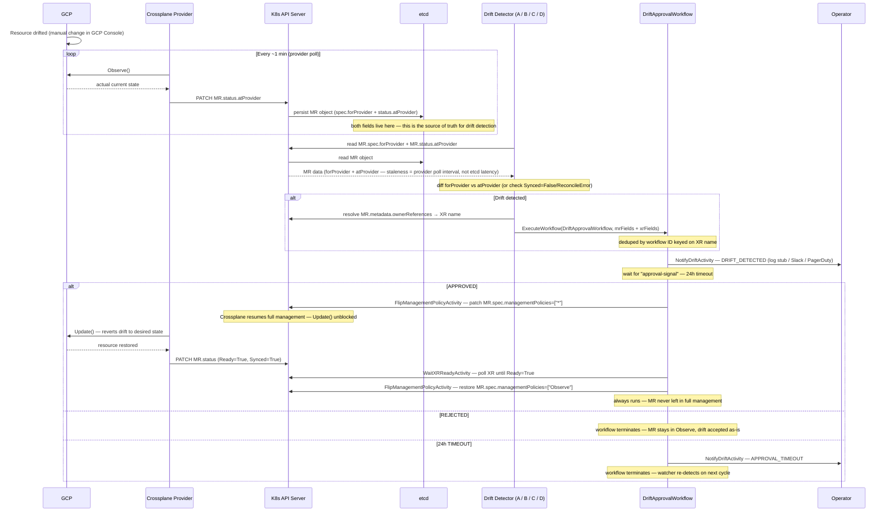

# Drift Detection + Human Approval — POC Overview

## Goal

Prevent Crossplane from silently auto-healing infrastructure drift. When external state
diverges from desired state, block reconciliation, notify operators, and wait for human
approval before proceeding.

**Scope:** All Crossplane-managed resource types (CloudSQL, GCE Compute, GKE, GCS, future
load balancers, VPCs, etc.) — not just databases. The POC is validated on CloudSQL first,
but the design is generic from day one.

---

## End-to-End Flow

This is the target behaviour for all four approaches. The detection mechanism differs; everything from the trigger condition onward is identical.

### Trigger Condition

A resource is considered drifted when its MR has **all** of:

```
MR has label platform.io/drift-protection=true
AND
MR.status.atProvider is non-empty (Observe() has run at least once)
AND
at least one field in MR.spec.forProvider differs from MR.status.atProvider
```

Detection happens at the **MR (Managed Resource) level** — `spec.forProvider` (desired state)
and `status.atProvider` (actual observed state) are fields on the MR, not the XR. The watcher
diffs these two maps and resolves the MR's `ownerReferences` to identify the owning XR.

### Why not watch XR conditions (Synced=False)?

Under `managementPolicies: ["Observe"]`, Crossplane still calls `Observe()` on every poll
but skips `Update()`. When drift is detected, the reconciler logs it and sets
`Synced=True/ReconcileSuccess` — **not** `Synced=False`. Watching for `Synced=False` on the
XR would only fire for hard errors (auth failures, API unavailable), not config drift.
The correct signal is a field-level diff between `forProvider` and `atProvider`.

**Source:** `crossplane-runtime v1.17.0/v2.2.0`
`pkg/reconciler/managed/reconciler.go` — when `!policy.ShouldUpdate()` and resource is not
up to date: `status.MarkConditions(xpv1.ReconcileSuccess())`.

### Full Flow

```
GCP resource drifted (e.g. tier changed in GCP Console)
        │
        │  ~10 min — Crossplane provider default poll interval
        ▼
[Provider reconciler — managementPolicies: Observe]
  Calls GCP API → reads actual state
  Writes actual state to MR.status.atProvider via K8s API server → persisted in etcd
  Skips Update() — Observe mode blocks auto-heal
  Sets MR: Synced=True/ReconcileSuccess (drift is silent at condition level)
        │
        │  [etcd — source of truth for drift detection]
        │   MR.spec.forProvider  = desired state (written by composition at creation)
        │   MR.status.atProvider = actual state  (updated by provider on every Observe())
        │
        │  seconds (B/C) / up to 30s (A) / up to 1 min (D)
        │  — depends on approach detection mechanism
        │  — staleness = provider poll interval, not etcd read latency
        ▼
[Drift watcher / WatchOperation / Temporal schedule]
  Reads MR data from etcd via K8s API server
  Diffs MR.spec.forProvider vs MR.status.atProvider
  → e.g. "settings.tier: db-n1-standard-2 → db-n1-standard-4"
  Resolves MR.metadata.ownerReferences → XR name
  Starts DriftApprovalWorkflow (deduped by workflow ID keyed on XR)
        │
        ▼
NotifyDriftActivity(event=DRIFT_DETECTED)
  → structured log entry (POC stub)
  → swap point for Slack + email + PagerDuty in production
        │
        ▼
Wait for "approval-signal" — 24h timeout
        │
        ├─ APPROVED ──────────────────────────────────────────┐
        │                                                      ▼
        │                              FlipManagementPolicyActivity(MR, Enable=false)
        │                                → patches MR.spec.managementPolicies=["*"]
        │                                → Crossplane resumes reconciliation, fixes drift
        │                              WaitXRReadyActivity (resource-type timeout)
        │                              FlipManagementPolicyActivity(MR, Enable=true)
        │                                → restores managementPolicies=["Observe"]
        │                              (R3 always runs — never leave MR in full management)
        │
        ├─ REJECTED
        │                              workflow terminates
        │                              MR stays in Observe mode (drift is accepted)
        │
        └─ 24h TIMEOUT
                              NotifyDriftActivity(event=APPROVAL_TIMEOUT)
                              workflow terminates
                              MR stays in Observe mode (watcher re-detects next cycle)
```

### Sequence Diagram



### Why `managementPolicies: ["Observe"]` on the MR

When `driftProtection: true` is set on the XR, the composition renders
`managementPolicies: ["Observe"]` on each composed MR. This tells Crossplane:

- **Keep calling `Observe()`** — `status.atProvider` stays up to date → drift is detectable
- **Skip `Update/Create/Delete`** — auto-healing is permanently blocked

`FlipManagementPolicyActivity` patches the MR's `spec.managementPolicies` directly.
Setting it to `["*"]` re-enables full management so Crossplane can reconcile. After
`WaitXRReady`, it flips back to `["Observe"]`.

---

## Four Approaches Under Evaluation

| | Approach | Branch | Trigger mechanism |
|-|----------|--------|-------------------|
| A | Go Polling Watcher | `feature/drift-poc-approach-a-watcher` | Periodic poll of MR `forProvider`/`atProvider` diff |
| B | WatchOperations + function-python | `feature/drift-poc-approach-b-watchoperations` | Crossplane-native event on MR change |
| C | Informer-based Watcher | `feature/drift-poc-approach-c-informer` | K8s watch stream on MR (event-driven) |
| D | Temporal Schedule | `feature/drift-poc-approach-d-temporal-schedule` | Temporal cron scan of MR `forProvider`/`atProvider` |

All branches base off: `feature/crossplane-v2-temporal-worker-migration`

---

## Shared Design Decisions (apply to all approaches)

See [Shared Design](https://confluence.rakuten-it.com/confluence/pages/viewpage.action?pageId=6591418173) — all four approaches build on it.

Key decisions:

1. **Watch at MR level**, resolve to XR via `ownerReferences` — `forProvider`/`atProvider` live on MRs; the XR only has aggregated conditions
2. **`forProvider` vs `atProvider` diff** — the correct drift signal; XR `Synced=False` is not reliable under `managementPolicies: ["Observe"]`
3. **Label-based opt-in** — `platform.io/drift-protection: "true"` propagated from XR to MR by the composition
4. **XRD `driftProtection` param** — controls whether the composition renders `managementPolicies: ["Observe"]` on composed MRs
5. **Generic `DriftApprovalWorkflow`** — carries both MR and XR identification fields; keyed on XR name for deduplication
6. **Generic `WaitXRReadyActivity`** — waits at XR level (valid after full management is restored)
7. **Notification stub** — `NotifyDriftActivity` logs a structured entry; three events: `DRIFT_DETECTED`, `APPROVAL_TIMEOUT`, `RECONCILIATION_FAILED`

---

## Child Pages

| Page | Contents |
|------|----------|
| [Shared Design](https://confluence.rakuten-it.com/confluence/pages/viewpage.action?pageId=6591418173) | Common types, workflow, activities, Crossplane changes |
| [Approach A — Polling Watcher](https://confluence.rakuten-it.com/confluence/pages/viewpage.action?pageId=6587351085) | Go binary polling XR conditions |
| [Approach B — WatchOperations](https://confluence.rakuten-it.com/confluence/pages/viewpage.action?pageId=6591353112) | Crossplane WatchOperations + function-python |
| [Approach C — Informer Watcher](https://confluence.rakuten-it.com/confluence/pages/viewpage.action?pageId=6587351087) | K8s informer-based event-driven watcher |
| [Approach D — Temporal Schedule](https://confluence.rakuten-it.com/confluence/pages/viewpage.action?pageId=6591418235) | Temporal cron schedule scan |

---

## Glossary

Terms used across all POC documents.

---

### Crossplane Concepts

| Term | Definition |
|------|------------|
| **Managed Resource (MR)** | A Kubernetes custom resource that maps 1:1 to a single external infrastructure object (e.g. a CloudSQL `DatabaseInstance`, a GCE `Instance`, a GKE `Cluster`). Owned and reconciled by a provider. Holds `spec.forProvider` (desired) and `status.atProvider` (observed). |
| **Composite Resource (XR)** | A higher-level Kubernetes resource composed from one or more Managed Resources. Consumers interact with the XR (e.g. `XDatabase`); the composition renders the underlying MRs. XRs carry aggregated conditions (`Ready`, `Synced`) but do not hold `forProvider`/`atProvider` — those live only on MRs. |
| **XRD (Composite Resource Definition)** | The CRD-like schema that defines the API surface of a Composite Resource. Defines `spec.parameters` fields (including `driftProtection`) that consumers set on their XR. |
| **Composition** | A Crossplane resource that defines how an XR is translated into one or more MRs. Responsible for propagating `managementPolicies` and the `platform.io/drift-protection` label from XR parameters down to MRs. |
| **`spec.forProvider`** | Field on an MR holding the **desired state** — what the composition declared. Written once at MR creation. The baseline for drift comparison. |
| **`status.atProvider`** | Field on an MR holding the **actual observed state** — what the provider last read from the cloud provider via `Observe()`. Updated on every poll cycle. The current state for drift comparison. |
| **`managementPolicies`** | Field on an MR controlling which lifecycle operations Crossplane performs. Key values: `["*"]` (full management), `["Observe"]` (read-only, no writes to cloud), `["Create", "Observe"]` (recreate if missing then observe), `["Create", "Observe", "Update"]` (full recovery without deletion). |
| **`Observe()` / Provider Poll** | The function the provider calls on every reconcile cycle to read cloud resource state and write it into `status.atProvider`. Runs unconditionally regardless of `managementPolicies`. Controlled by the `--poll` flag (default `10m`). |
| **`--poll` flag** | Provider runtime flag (`DeploymentRuntimeConfig`) controlling how often `Observe()` is called per managed resource. Default: `10m`. The POC sets this to `1m`. Lower values increase freshness but multiply GCP API calls. |
| **`--sync` flag** | Provider runtime flag controlling the full re-list interval — how often all MRs are re-queued for reconciliation as a safety net. Default: `1h`. |
| **Late Initialization** | After creating a resource, the provider writes GCP's full API response back into `spec.forProvider` — including fields the composition never declared. These stale fields reference the original resource's state and cause `CREATE` to fail if the resource is deleted and recreated (see F-01). |
| **`ownerReferences`** | Kubernetes metadata on an MR listing its owner XR. The drift watcher resolves these to identify which XR a drifted MR belongs to, so it can key `DriftApprovalWorkflow` on the XR name. The controller owner has `controller: true`. |
| **`Synced` condition** | Standard Crossplane condition on MRs and XRs. Under `["Observe"]`, drift does **not** set `Synced=False` — the reconciler sets `Synced=True/ReconcileSuccess` even when drift exists. `Synced=False/ReconcileError` indicates a hard error (resource deleted, API failure) — this is Signal 2. |
| **`ReconcileError`** | The `reason` value on a `Synced=False` condition. Set when the provider errors during `Observe()` (e.g. the GCP resource no longer exists). The condition the watcher checks for deletion drift. |
| **`DeploymentRuntimeConfig`** | A Crossplane resource for configuring the provider pod deployment (image, args, resource limits). Used in the POC to pass `--poll=1m` and `--sync=30m` to the GCP provider pods. |

---

### Kubernetes Concepts

| Term | Definition |
|------|------------|
| **GVR (Group / Version / Resource)** | The three-part identifier for a Kubernetes resource type. Example: `sql.gcp.upbound.io / v1beta2 / databaseinstances`. Used by the `client-go` dynamic client to list or watch resources without needing generated Go types. |
| **etcd** | The key-value store backing the Kubernetes API server. All Kubernetes objects (including MR `spec.forProvider` and `status.atProvider`) are persisted here. The drift watcher never reads etcd directly — it goes through the K8s API server. |
| **Watch stream (WATCH)** | A long-lived HTTP/2 connection to the K8s API server that pushes `ADDED`, `MODIFIED`, and `DELETED` events in real time as objects change. Used by Approaches B, C, and Crossplane's own controller. More efficient than repeated LIST calls for event-driven architectures. |
| **LIST** | A one-shot API call to fetch all objects of a given GVR matching a label selector. Used by Approaches A and D on each poll cycle. Served from the API server's watch cache (not a direct etcd read) under normal conditions. |
| **`resourceVersion`** | A monotonically increasing string on every Kubernetes object, incremented on every write. The informer uses it to track which events have been seen and resume a watch after a disconnect. |
| **`MODIFIED` event** | A watch event pushed when a Kubernetes object is updated. The informer's `UpdateFunc` fires on each MODIFIED event. `provider-upbound-gcp-container` emits these unconditionally every poll cycle even when content is unchanged (see F-02); other providers emit them only when content actually changes. |
| **SharedInformer / SharedInformerFactory** | A `client-go` construct (Approach C) that maintains a persistent watch stream per GVR and keeps a local in-memory cache (`threadSafeMap`) of all watched objects. Fires `AddFunc` on initial sync and new objects; fires `UpdateFunc` on MODIFIED events. |
| **`AddFunc`** | The informer event handler called when an object is first seen — on initial LIST (cache sync at startup) or when a new object is created. Approach C uses `AddFunc` to detect resources already drifted before the watcher pod started. |
| **`UpdateFunc`** | The informer event handler called when a watched object is modified (MODIFIED event). Fires when the provider writes `status.atProvider`. The primary event path for Approach C in steady state. |
| **Resync period** | The interval at which the SharedInformer re-enqueues all cached objects through the event queue so `UpdateFunc` fires for each, without making any API calls. A safety net for missed events. Set to `10m` in Approaches A and C. |
| **Label / LabelSelector** | Key-value metadata on Kubernetes objects. The `platform.io/drift-protection: "true"` label is used by all watchers as the opt-in filter (`LabelSelector: "platform.io/drift-protection=true"` in LIST/WATCH calls). |
| **Annotation** | Key-value metadata on Kubernetes objects, distinct from labels (not indexed). Used for snooze state (`platform.io/drift-snoozed-until`) and to force immediate reconciliation (`crossplane.io/paused=false`). |
| **ConfigMap** | A Kubernetes resource for storing non-sensitive configuration. Approaches A and C read the GVR list from a ConfigMap (`MR_GVRS`) at pod startup. |

---

### Temporal Concepts

| Term | Definition |
|------|------------|
| **Temporal** | A durable workflow orchestration system. Stores workflow state in a database; survives crashes and restarts. Used for `DriftApprovalWorkflow` (human approval gate) and, in Approach D, for `DriftScanWorkflow` (periodic drift scanning). |
| **Temporal Worker (app)** | A long-running process separate from Temporal's own server that polls a task queue and executes workflow and activity code. The `ucp-temporal-worker` pod in the cluster is the app worker. Temporal distributes work to whichever app worker pods are available. |
| **Temporal Internal Worker (`temporal-worker`)** | One of the four Temporal server components (alongside `temporal-frontend`, `temporal-history`, `temporal-matching`). Runs Temporal's own system workflows — including the schedule management workflow that fires user-configured schedules. Must not be replaced or deleted by app deployments (see F-06). |
| **Temporal Frontend (`temporal-frontend`)** | The Temporal server's gRPC gateway (port 7233). SDK clients (Go, Python) connect here to start workflows, send signals, and poll task queues. Distinct from `temporal-web` (the browser UI). |
| **Temporal Web (`temporal-web`)** | The Temporal browser UI (HTTP port 8080). Shows workflow history, running executions, schedules, and worker status. Read-only for observability. |
| **Task Queue** | A named queue inside Temporal. Workflow and activity tasks are dispatched to a task queue; app workers poll that queue to pick up work. The POC uses `db-provisioning` for provisioning workflows and `drift-poc-d` for the Approach D drift worker. |
| **Temporal Schedule** | A Temporal construct that fires a workflow on a cron interval. Used in Approach D to trigger `DriftScanWorkflow` every minute. Stored in Temporal's database; requires the internal `temporal-worker` to be running to execute. |
| **`WorkflowExecutionAlreadyStartedError` (AlreadyStarted)** | Error returned by Temporal when `ExecuteWorkflow` is called with a workflow ID that is already running. All four approaches use this as the deduplication mechanism — duplicate starts are silently ignored. |
| **`DriftApprovalWorkflow`** | The human approval workflow shared across all four approaches. Notifies operators of drift, waits up to 24h for an `approval-signal`, then either reconciles (approved) or terminates (rejected/timeout). Keyed on XR name for deduplication. |
| **`DriftScanWorkflow`** | Approach D specific. A short-lived workflow triggered every minute by the Temporal Schedule. Runs `ScanDriftActivity` and returns structured output (`scannedResources`, `driftedResources`, `workflowsFired`). Forms the audit log for all Approach D scans. |
| **`ScanDriftActivity`** | Approach D specific. Lists all labeled MRs across configured GVRs, runs `isDrifted()` on each, and fires `DriftApprovalWorkflow` for drifted resources. |
| **`NotifyDriftActivity`** | Shared activity. Emits a structured log entry (POC stub) for one of three events: `DRIFT_DETECTED`, `APPROVAL_TIMEOUT`, or `RECONCILIATION_FAILED`. The single swap point for production notification integrations (Slack, PagerDuty, email). |
| **`FlipManagementPolicyActivity`** | Shared activity. Patches `spec.managementPolicies` on an MR via the K8s dynamic client. Lifts Observe mode for reconciliation (`["*"]`) and restores it afterward (`["Observe"]`). Always runs after reconciliation — never leaves an MR in full management mode unintentionally. |
| **`WaitXRReadyActivity`** | Shared activity. Polls the XR until `status.conditions[Ready].status == "True"`. Confirms Crossplane has finished reconciling before restoring Observe mode. |
| **Overlap policy (`Skip`)** | Temporal Schedule setting. If a scheduled run is triggered while a previous run is still in progress, `Skip` discards the new trigger instead of stacking concurrent runs. Used in Approach D to prevent concurrent scans. |
| **`temporal-sys-per-ns-tq`** | The internal Temporal task queue used by the `temporal-worker` service for schedule management workflows. If the `temporal-worker` deployment is replaced (see F-06), this queue goes idle and schedules never fire. |

---

### Drift Detection Concepts

| Term | Definition |
|------|------------|
| **Drift** | A condition where the actual state of a cloud resource (read by `Observe()` into `status.atProvider`) diverges from the desired state declared in `spec.forProvider`. Detected by comparing the two maps field by field. |
| **Drift Protection** | The POC mechanism that blocks Crossplane from silently auto-healing a resource. Enabled by setting `spec.parameters.driftProtection: true` on the XR and `platform.io/drift-protection: "true"` on the MR label. When active, the composition renders `managementPolicies: ["Observe"]` on composed MRs. |
| **Signal 1 — Field Diff** | The primary drift detection signal: `spec.forProvider` keys are recursively compared against `status.atProvider`. Any key present in `forProvider` that differs in `atProvider` is a drifted field. Keys present only in `atProvider` (computed fields like `id`, `selfLink`) are ignored. |
| **Signal 2 — `Synced=False/ReconcileError`** | The deletion drift signal: `status.conditions[type=Synced, status=False, reason=ReconcileError]`. Fired when a cloud resource cannot be observed (deleted, API error). `atProvider` is unreliable in this state — field diff alone misses deletion. Both signals must be implemented in each approach. |
| **`isDrifted()`** | The core function in all four approaches. Checks Signal 1 and Signal 2. Returns `(bool, string)` — whether the MR is drifted and a human-readable description of what changed. |
| **`diffMaps()`** | Recursive map comparison function. Iterates keys in `forProvider`; for each key, compares against the corresponding value in `atProvider`. Recurses into nested maps. Skips paths in `skippedPaths`. |
| **`skippedPaths`** | A set of field paths excluded from drift comparison because GCP normalizes the value in a way that cannot be matched without an additional API call. Currently: `bootDisk[0].initializeParams.sourceImage` (image family → versioned URL). |
| **False Positive** | A spurious drift alert on a resource that has not actually drifted. Common sources: empty desired slice vs nil observed, URL normalization, Crossplane-only fields in `forProvider` never reflected in `atProvider` (e.g. `clusterRef`, `clusterSelector`), `atProvider` not yet populated. |
| **URL Normalization** | GCP expands short names (e.g. `default`) to full resource URLs (e.g. `https://www.googleapis.com/.../networks/default`) in `atProvider`. The watcher uses a suffix match to avoid false positives on network fields. |
| **`platform.io/drift-protection` label** | The opt-in label set on the XR by the consumer and propagated to composed MRs by the composition. Watchers use this as the `LabelSelector` filter — only labeled MRs are monitored. |
| **`driftProtection` parameter** | XRD parameter (`spec.parameters.driftProtection: bool`). When `true`, the composition renders `managementPolicies: ["Observe"]` on composed MRs and propagates the `platform.io/drift-protection` label. |
| **Provider Poll Floor** | The minimum detection latency shared by all four approaches. All approaches read `atProvider` from K8s, not directly from GCP — they cannot detect drift faster than the provider updates `atProvider`. At `--poll=1m`, the floor is ~1 minute. The watcher's own interval adds on top. |
| **Workflow ID (drift deduplication)** | The deterministic string `drift-approval-<namespace>-<xrKind>-<xrName>` used as the Temporal workflow ID for `DriftApprovalWorkflow`. Ensures at most one approval workflow runs per XR regardless of how many MRs drifted under it or how many poll cycles fire. |
| **Drift Action Mode** | Post-POC design concept. Two modes per resource: `notify` (detect and alert, no approval) and `approve` (detect, alert, wait for human approval, then reconcile if approved). Controlled via XRD parameter, propagated as a label on the MR. |
| **Snooze** | Post-POC design concept. A time-bounded suppression of repeated drift alerts. Stored as an annotation (`platform.io/drift-snoozed-until: <RFC3339 timestamp>`) on the MR to avoid a separate database lookup per poll cycle. |

---

### Approach-Specific Terms

| Term | Definition |
|------|------------|
| **Approach A — Polling Watcher** | A standalone Go binary (`drift-watcher`) deployed as a Kubernetes Deployment that lists all labeled MRs on a fixed interval (default 30s). Simple, no alpha dependencies, easy crash recovery. Detection latency = provider poll + up to 30s watcher interval. |
| **Approach B — WatchOperations** | Uses Crossplane's alpha `WatchOperation` + `Operation` CRDs to trigger a `function-python` pod on every MR change. Event-driven, no persistent binary. Requires `--enable-operations` alpha flag and a Crossplane `.xpkg` function package. Currently alpha — not production-ready. |
| **Approach C — Informer Watcher** | Same binary structure as A but uses `client-go` SharedInformers instead of periodic LIST calls. Event-driven (`UpdateFunc` fires when `atProvider` changes), with `AddFunc` for catching already-drifted resources on restart and a 10-minute resync safety net. Production-grade evolution of A. Memory scales linearly with labeled MR count. |
| **Approach D — Temporal Schedule** | No external binary. A Temporal Schedule triggers `DriftScanWorkflow` every minute inside the existing Temporal worker. Richest observability (every scan run is a workflow with structured output). Fully coupled to Temporal availability for detection. |
| **`drift-watcher` binary** | The standalone Go binary used by Approaches A and C. Deployed as a separate Kubernetes Deployment. Reads `MR_GVRS` from environment at startup; requires pod restart to pick up new GVR additions. |
| **WatchOperation** | An alpha Crossplane CRD (`ops.crossplane.io/v1alpha1`). Watches MRs matching a label selector and creates an `Operation` on every matching change event. Requires `--enable-operations` flag. |
| **Operation** | An alpha Crossplane CRD (`ops.crossplane.io/v1alpha1`). A short-lived pod created by a WatchOperation when a watched MR changes. Injects the full MR object as function input. Persisted in etcd — survives function crashes and is retried. |
| **`.xpkg` (Crossplane package)** | The format for distributing Crossplane functions. Built with `crossplane xpkg build` (embedding a Docker runtime image) and pushed with `crossplane xpkg push`. Not a plain Docker image — cannot be used directly as a K8s pod image. |
| **function-python / function-drift-notifier** | The Crossplane function (Python, Approach B) that receives a watched MR from the Operation, runs the drift check, resolves the XR via `ownerReferences`, and calls the Temporal Python SDK to start `DriftApprovalWorkflow`. |
| **`DRIFT DETECTED` log entry** | Structured log line emitted when drift is found. Format: `DRIFT DETECTED — <xrKind>/<xrName>: changes (N): <field>: <desired> → <observed>`. |
| **`DRIFT_CLEAN` log entry** | Approach C log line emitted (with `DRIFT_VERBOSE=true`) when an MR event fires but no drift is found. Visible during recovery as Crossplane updates conditions while reconciling. |
| **`LIST_REQUEST` / `LIST_RESPONSE` log entries** | Verbose log lines emitted when `DRIFT_VERBOSE=true` is set. Show each GVR being listed and how many resources were returned. Confirms the watcher is polling the expected GVRs. |
