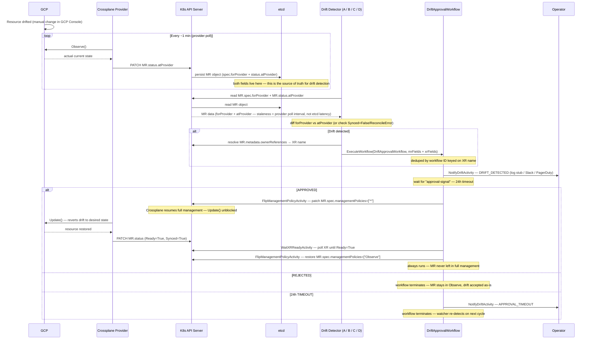

# Drift Detection + Human Approval — POC Overview

## Goal

Prevent Crossplane from silently auto-healing infrastructure drift. When external state
diverges from desired state, block reconciliation, notify operators, and wait for human
approval before proceeding.

**Scope:** All Crossplane-managed resource types (CloudSQL, GCE Compute, GKE, GCS, future
load balancers, VPCs, etc.) — not just databases. The POC is validated on CloudSQL first,
but the design is generic from day one.

---

## End-to-End Flow

This is the target behaviour for all four approaches. The detection mechanism differs; everything from the trigger condition onward is identical.

### Trigger Condition

A resource is considered drifted when its MR has **all** of:

```
MR has label platform.io/drift-protection=true
AND
MR.status.atProvider is non-empty (Observe() has run at least once)
AND
at least one field in MR.spec.forProvider differs from MR.status.atProvider
```

Detection happens at the **MR (Managed Resource) level** — `spec.forProvider` (desired state)
and `status.atProvider` (actual observed state) are fields on the MR, not the XR. The watcher
diffs these two maps and resolves the MR's `ownerReferences` to identify the owning XR.

### Why not watch XR conditions (Synced=False)?

Under `managementPolicies: ["Observe"]`, Crossplane still calls `Observe()` on every poll
but skips `Update()`. When drift is detected, the reconciler logs it and sets
`Synced=True/ReconcileSuccess` — **not** `Synced=False`. Watching for `Synced=False` on the
XR would only fire for hard errors (auth failures, API unavailable), not config drift.
The correct signal is a field-level diff between `forProvider` and `atProvider`.

**Source:** `crossplane-runtime v1.17.0/v2.2.0`
`pkg/reconciler/managed/reconciler.go` — when `!policy.ShouldUpdate()` and resource is not
up to date: `status.MarkConditions(xpv1.ReconcileSuccess())`.

### Full Flow

```
GCP resource drifted (e.g. tier changed in GCP Console)
        │
        │  ~10 min — Crossplane provider default poll interval
        ▼
[Provider reconciler — managementPolicies: Observe]
  Calls GCP API → reads actual state
  Writes actual state to MR.status.atProvider via K8s API server → persisted in etcd
  Skips Update() — Observe mode blocks auto-heal
  Sets MR: Synced=True/ReconcileSuccess (drift is silent at condition level)
        │
        │  [etcd — source of truth for drift detection]
        │   MR.spec.forProvider  = desired state (written by composition at creation)
        │   MR.status.atProvider = actual state  (updated by provider on every Observe())
        │
        │  seconds (B/C) / up to 30s (A) / up to 1 min (D)
        │  — depends on approach detection mechanism
        │  — staleness = provider poll interval, not etcd read latency
        ▼
[Drift watcher / WatchOperation / Temporal schedule]
  Reads MR data from etcd via K8s API server
  Diffs MR.spec.forProvider vs MR.status.atProvider
  → e.g. "settings.tier: db-n1-standard-2 → db-n1-standard-4"
  Resolves MR.metadata.ownerReferences → XR name
  Starts DriftApprovalWorkflow (deduped by workflow ID keyed on XR)
        │
        ▼
NotifyDriftActivity(event=DRIFT_DETECTED)
  → structured log entry (POC stub)
  → swap point for Slack + email + PagerDuty in production
        │
        ▼
Wait for "approval-signal" — 24h timeout
        │
        ├─ APPROVED ──────────────────────────────────────────┐
        │                                                      ▼
        │                              FlipManagementPolicyActivity(MR, Enable=false)
        │                                → patches MR.spec.managementPolicies=["*"]
        │                                → Crossplane resumes reconciliation, fixes drift
        │                              WaitXRReadyActivity (resource-type timeout)
        │                              FlipManagementPolicyActivity(MR, Enable=true)
        │                                → restores managementPolicies=["Observe"]
        │                              (R3 always runs — never leave MR in full management)
        │
        ├─ REJECTED
        │                              workflow terminates
        │                              MR stays in Observe mode (drift is accepted)
        │
        └─ 24h TIMEOUT
                              NotifyDriftActivity(event=APPROVAL_TIMEOUT)
                              workflow terminates
                              MR stays in Observe mode (watcher re-detects next cycle)
```

### Sequence Diagram



### Why `managementPolicies: ["Observe"]` on the MR

When `driftProtection: true` is set on the XR, the composition renders
`managementPolicies: ["Observe"]` on each composed MR. This tells Crossplane:

- **Keep calling `Observe()`** — `status.atProvider` stays up to date → drift is detectable
- **Skip `Update/Create/Delete`** — auto-healing is permanently blocked

`FlipManagementPolicyActivity` patches the MR's `spec.managementPolicies` directly.
Setting it to `["*"]` re-enables full management so Crossplane can reconcile. After
`WaitXRReady`, it flips back to `["Observe"]`.

---

## Four Approaches Under Evaluation

| | Approach | Branch | Trigger mechanism |
|-|----------|--------|-------------------|
| A | Go Polling Watcher | `feature/drift-poc-approach-a-watcher` | Periodic poll of MR `forProvider`/`atProvider` diff |
| B | WatchOperations + function-python | `feature/drift-poc-approach-b-watchoperations` | Crossplane-native event on MR change |
| C | Informer-based Watcher | `feature/drift-poc-approach-c-informer` | K8s watch stream on MR (event-driven) |
| D | Temporal Schedule | `feature/drift-poc-approach-d-temporal-schedule` | Temporal cron scan of MR `forProvider`/`atProvider` |

All branches base off: `feature/crossplane-v2-temporal-worker-migration`

---

## Shared Design Decisions (apply to all approaches)

See [Shared Design](https://confluence.rakuten-it.com/confluence/pages/viewpage.action?pageId=6591418173) — all four approaches build on it.

Key decisions:

1. **Watch at MR level**, resolve to XR via `ownerReferences` — `forProvider`/`atProvider` live on MRs; the XR only has aggregated conditions
2. **`forProvider` vs `atProvider` diff** — the correct drift signal; XR `Synced=False` is not reliable under `managementPolicies: ["Observe"]`
3. **Label-based opt-in** — `platform.io/drift-protection: "true"` propagated from XR to MR by the composition
4. **XRD `driftProtection` param** — controls whether the composition renders `managementPolicies: ["Observe"]` on composed MRs
5. **Generic `DriftApprovalWorkflow`** — carries both MR and XR identification fields; keyed on XR name for deduplication
6. **Generic `WaitXRReadyActivity`** — waits at XR level (valid after full management is restored)
7. **Notification stub** — `NotifyDriftActivity` logs a structured entry; three events: `DRIFT_DETECTED`, `APPROVAL_TIMEOUT`, `RECONCILIATION_FAILED`

---

## Child Pages

| Page | Contents |
|------|----------|
| [Shared Design](https://confluence.rakuten-it.com/confluence/pages/viewpage.action?pageId=6591418173) | Common types, workflow, activities, Crossplane changes |
| [Approach A — Polling Watcher](https://confluence.rakuten-it.com/confluence/pages/viewpage.action?pageId=6587351085) | Go binary polling XR conditions |
| [Approach B — WatchOperations](https://confluence.rakuten-it.com/confluence/pages/viewpage.action?pageId=6591353112) | Crossplane WatchOperations + function-python |
| [Approach C — Informer Watcher](https://confluence.rakuten-it.com/confluence/pages/viewpage.action?pageId=6587351087) | K8s informer-based event-driven watcher |
| [Approach D — Temporal Schedule](https://confluence.rakuten-it.com/confluence/pages/viewpage.action?pageId=6591418235) | Temporal cron schedule scan |
