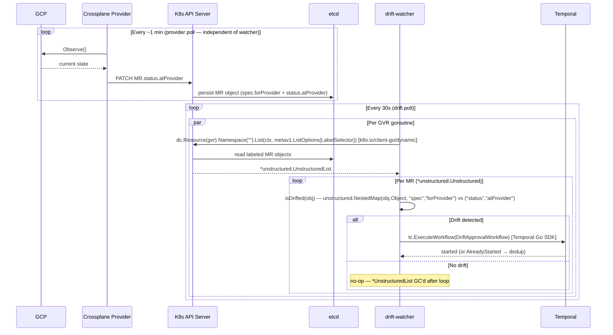

# Approach A — Go Polling Watcher

**Branch:** `feature/drift-poc-approach-a-watcher`
**Trigger mechanism:** Periodic K8s API list-poll on all monitored MRs

---

## How It Works

A new Go binary (`drift-watcher`) runs as a Kubernetes Deployment. On each poll cycle
(default every 30s), it lists all MRs with `platform.io/drift-protection: "true"` across
all configured MR types, checks each MR against two complementary signals, and fires
`DriftApprovalWorkflow` for any that are drifted. The workflow is keyed on the XR name,
resolved from the MR's `ownerReferences`.

Two signals are checked per MR (both are required):
- **Field drift:** `forProvider vs atProvider` diff — catches field-level changes in GCP
- **Resource deletion:** `.status.conditions[type=Synced, status=False, reason=ReconcileError]` — catches GCP-side deletion;
  `atProvider` is cleared or stale when the resource no longer exists, so diff alone misses this

```
Every 30s:
  for each configured MR GVR:
    list MRs with label platform.io/drift-protection=true
    for each MR:
      if forProvider != atProvider (field drift):
        resolve ownerReferences → XR name
        ExecuteWorkflow(DriftApprovalWorkflow, mrFields + xrFields)
        → Temporal deduplicates via workflow ID (keyed on XR)
      else if .status.conditions[type=Synced, status=False, reason=ReconcileError] (resource deleted):
        resolve ownerReferences → XR name
        ExecuteWorkflow(DriftApprovalWorkflow, mrFields + xrFields)
```

---

## Where `forProvider` and `atProvider` Come From

The drift-watcher **never calls GCP or Omnia directly**. All state data is read from the
**Kubernetes API server** using the `k8s.io/client-go/dynamic` client.

```
GCP Console (manual change to CloudSQL tier)
        │
        │  GCP REST API
        ▼
provider-gcp pod (running in crossplane-system)
  managementPolicies=["Observe"] → Observe() called on every poll (~1 min)
  → calls GCP REST API, reads actual current state
  → PATCH MR.status.atProvider via K8s API server
        │
        │  K8s API server writes to etcd
        ▼
etcd (via K8s API server)
  MR.spec.forProvider   = desired state (what Crossplane declared)
  MR.status.atProvider  = actual state  (what GCP currently has)
        │
        │  dynamic client: LIST /apis/sql.gcp.upbound.io/v1beta2/databaseinstances
        │  (drift-watcher polls this endpoint every 30s)
        ▼
drift-watcher reads both fields from the K8s API response
  diff forProvider vs atProvider → fire workflow if mismatch
```

Both `spec.forProvider` and `status.atProvider` are stored in **etcd** as fields of the
MR Kubernetes object. The K8s API server is the access layer — the drift-watcher never
communicates with etcd directly. Each `List()` call goes to the K8s API server, which
reads from etcd and returns the current MR state.

`spec.forProvider` is written once when the MR is created by the composition.
`status.atProvider` is updated by the provider pod on every `Observe()` call.
The watcher sees the most recent observed state from the last provider poll — not
real-time GCP state. **Staleness comes entirely from the provider poll interval** (~1 min,
configured via `DeploymentRuntimeConfig`; default is 10 min — see crossplane-reconcile-behavior.md),
not from etcd or K8s API server read latency. Once the provider writes `status.atProvider`,
the data is immediately available in etcd on the next read.

---

## Architecture

```
GCP / Omnia                provider-gcp / provider-roc pod
(actual state)  ────────►  Observe() every ~1 min (configured)
                           writes status.atProvider
                                   │
                                   │  PATCH /status (K8s API)
                                   ▼
                           K8s API server (etcd)
                           ┌──────────────────────────────────┐
                           │ DatabaseInstance                 │
                           │  spec.forProvider:               │
                           │    settings.tier: db-n1-std-2    │
                           │  status.atProvider:              │
                           │    settings.tier: db-n1-std-4 ←drift│
                           └──────────────────────────────────┘
                                   │
                                   │  LIST /apis/sql.gcp.upbound.io/...
                                   │  (dynamic client, every 30s)
                                   ▼
                           drift-watcher
                           diff forProvider vs atProvider
                           ownerRef → XDatabase/my-postgres
                                   │  Temporal Go SDK
                                   ▼
                           DriftApprovalWorkflow
                           (see Shared Design)
```

---

## Sequence Diagram



> After `DriftApprovalWorkflow` starts, the approval and recovery flow is shared across all
> approaches — see [Shared Design](shared-design.md).

---

## Multi-Resource Support

The watcher reads its target GVRs from a ConfigMap. GVRs are **MR types**, not XR types —
the drift signal (`forProvider` vs `atProvider`) lives on the MR.

```yaml
# ConfigMap: drift-watcher-config
MR_GVRS: |
  sql.gcp.upbound.io/v1beta2/databaseinstances
  compute.gcp.upbound.io/v1beta2/instances
  container.gcp.upbound.io/v1beta2/clusters
  container.gcp.upbound.io/v1beta2/nodepools
  storage.gcp.upbound.io/v1beta2/buckets
```

For multi-MR XRs (e.g. GKE: `clusters` + `nodepools`), both MRs resolve to the same XR
via `ownerReferences`. Temporal deduplicates via workflow ID — only one approval workflow
runs per XR.

Adding a new resource type = add one line to the ConfigMap. No code change, no redeployment.

---

## New Files

```
backend/temporal-worker/cmd/drift-watcher/main.go   NEW
backend/temporal-worker/internal/workflows/drift_approval.go   NEW (shared)
backend/temporal-worker/internal/activities/drift.go           NEW (shared)
backend/temporal-worker/cmd/worker/main.go                     MODIFY
k8s/drift-watcher/deployment.yaml                              NEW
k8s/drift-watcher/configmap.yaml                               NEW
k8s/temporal-worker/serviceaccount.yaml                        MODIFY (RBAC)
crossplane/xrd/* (4 files)                                     MODIFY
crossplane/composition/* (4 files)                             MODIFY
```

---

## Key Code: drift-watcher/main.go

```go
func main() {
    tc, _ := client.Dial(client.Options{HostPort: getenv("TEMPORAL_ADDRESS", "localhost:7233")})
    dc, _ := k8s.NewDynamicClient()
    gvrs  := parseGVRs(getenv("MR_GVRS", ""))

    for {
        pollCycle(context.Background(), dc, tc, gvrs)
        time.Sleep(parseDuration(getenv("DRIFT_POLL_INTERVAL", "30s")))
    }
}

func pollCycle(ctx context.Context, dc dynamic.Interface, tc client.Client, gvrs []schema.GroupVersionResource) {
    for _, gvr := range gvrs {
        list, _ := dc.Resource(gvr).Namespace("").List(ctx, metav1.ListOptions{
            LabelSelector: "platform.io/drift-protection=true",
        })
        for _, item := range list.Items {
            drifted, detail := isDrifted(&item)
            if drifted {
                fireWorkflow(ctx, tc, buildDriftInput(&item, gvr, detail))
            }
        }
    }
}

// isDrifted detects drift using two complementary signals.
// Signal 1: forProvider vs atProvider field diff (field changes in GCP).
// Signal 2: Synced=False/ReconcileError (resource deleted from GCP — atProvider
//           is unreliable when the resource no longer exists).
func isDrifted(obj *unstructured.Unstructured) (bool, string) {
    // Signal 1: field diff
    forProvider, _, _ := unstructured.NestedMap(obj.Object, "spec", "forProvider")
    atProvider, _, _  := unstructured.NestedMap(obj.Object, "status", "atProvider")
    if len(atProvider) > 0 {
        diffs := diffMaps("", forProvider, atProvider)
        if len(diffs) > 0 {
            return true, strings.Join(diffs, "; ")
        }
    }
    // Signal 2: Synced=False (resource deleted or unobservable)
    if isSyncedFalse(obj) {
        return true, "resource deleted or unobservable (.status.conditions[Synced].status=False, reason=ReconcileError)"
    }
    return false, ""
}

// isSyncedFalse returns true when .status.conditions[type=Synced].status=False and
// .status.conditions[type=Synced].reason=ReconcileError — the signal that a GCP resource
// has been deleted or can no longer be observed. atProvider is unreliable in this state.
func isSyncedFalse(obj *unstructured.Unstructured) bool {
    conditions, _, _ := unstructured.NestedSlice(obj.Object, "status", "conditions")
    for _, c := range conditions {
        cond, ok := c.(map[string]interface{})
        if !ok {
            continue
        }
        if cond["type"] == "Synced" && cond["status"] == "False" {
            reason, _ := cond["reason"].(string)
            return reason == "ReconcileError"
        }
    }
    return false
}

// diffMaps recursively compares keys in desired against observed.
// skippedPaths lists field paths excluded from drift comparison.
// These are fields where GCP normalizes the value in a way that cannot be matched
// without additional API calls.
var skippedPaths = map[string]struct{}{
    // GCE: image family reference (e.g. "debian-cloud/debian-12") is resolved by GCP
    // to a specific versioned image URL. Cannot compare without a GCP API call.
    "bootDisk[0].initializeParams.sourceImage": {},
}

func diffMaps(prefix string, desired, observed map[string]interface{}) []string {
    var out []string
    for k, dv := range desired {
        path := k
        if prefix != "" {
            path = prefix + "." + k
        }
        if _, skip := skippedPaths[path]; skip {
            continue
        }
        ov := observed[k]
        if dMap, ok := dv.(map[string]interface{}); ok {
            if oMap, ok := ov.(map[string]interface{}); ok {
                out = append(out, diffMaps(path, dMap, oMap)...)
            } else {
                out = append(out, fmt.Sprintf("%s: differs", path))
            }
        } else if fmt.Sprintf("%v", dv) != fmt.Sprintf("%v", ov) {
            out = append(out, fmt.Sprintf("%s: %v → %v", path, dv, ov))
        }
    }
    return out
}

// buildDriftInput populates both MR and XR fields.
// XR fields are resolved from the MR's ownerReferences (controller owner).
func buildDriftInput(mr *unstructured.Unstructured, mrGVR schema.GroupVersionResource, detail string) DriftApprovalInput {
    xrName, xrKind, xrAPIVersion := resolveControllerOwner(mr)
    xrGroup, xrVersion := splitAPIVersion(xrAPIVersion)
    return DriftApprovalInput{
        MRGroup:     mrGVR.Group,
        MRVersion:   mrGVR.Version,
        MRResource:  mrGVR.Resource,
        MRName:      mr.GetName(),
        MRNamespace: mr.GetNamespace(),
        XRGroup:     xrGroup,
        XRVersion:   xrVersion,
        XRResource:  pluralFromKind(xrKind),
        XRKind:      xrKind,
        XRName:      xrName,
        XRNamespace: mr.GetNamespace(),
        DetectedAt:  time.Now().UTC().Format(time.RFC3339),
        DriftDetail: detail,
    }
}

func resolveControllerOwner(obj *unstructured.Unstructured) (name, kind, apiVersion string) {
    for _, ref := range obj.GetOwnerReferences() {
        if ref.Controller != nil && *ref.Controller {
            return ref.Name, ref.Kind, ref.APIVersion
        }
    }
    return "", "", ""
}

func fireWorkflow(ctx context.Context, tc client.Client, in DriftApprovalInput) error {
    workflowID := fmt.Sprintf("drift-approval-%s-%s-%s",
        in.XRNamespace, strings.ToLower(in.XRKind), in.XRName)
    _, err := tc.ExecuteWorkflow(ctx, client.StartWorkflowOptions{
        ID: workflowID, TaskQueue: "db-provisioning",
    }, workflows.DriftApprovalWorkflow, in)
    var alreadyStarted *serviceerror.WorkflowExecutionAlreadyStartedError
    if errors.As(err, &alreadyStarted) {
        return nil // dedup — workflow already running for this XR
    }
    return err
}
```

---

## Environment Variables

| Variable | Default | Description |
|---|---|---|
| `TEMPORAL_ADDRESS` | `localhost:7233` | Temporal frontend |
| `TEMPORAL_TASK_QUEUE` | `db-provisioning` | Task queue |
| `DRIFT_POLL_INTERVAL` | `30s` | Poll interval |
| `MR_GVRS` | (required) | Newline-separated `group/version/resource` list of MR types |

---

## Failure Modes

| Failure | Effect | Recovery |
|---|---|---|
| drift-watcher pod crashes | No new workflows fired during downtime | K8s restarts pod; next poll detects any persisting drift |
| Temporal unavailable on poll | `ExecuteWorkflow` fails, logged | Next poll cycle retries |
| `FlipManagementPolicyActivity` R3 fails | MR left in full management | CRITICAL log; Crossplane reconciles; next drift cycle restarts |
| Multiple replicas (if scaled) | Both try to fire same workflow | Temporal dedup via workflow ID — one succeeds |

---

## Pros and Cons

### Pros
- **Simplest implementation** — a single polling loop; easy to read, understand, and debug
- **No alpha dependencies** — works with any Crossplane version, no special flags or CRD types
- **Easy crash recovery** — pod restart picks up any still-drifted resources on the next poll cycle
- **Go-only** — no new languages or runtimes in the codebase

### Cons
- **Up to 30s detection lag** on top of Crossplane's own ~10 min poll interval (configurable via `--poll-interval`)
- **New K8s Deployment** — one more component to operate, monitor, and keep healthy
- **K8s API load grows linearly** with resource count × GVR count (low now, worth watching at scale)
- **Pod restart required for new GVRs** — `MR_GVRS` is read from env var at startup; adding a resource type needs a pod restart
- **Narrow loss window** — if the pod crashes between detecting drift and calling `ExecuteWorkflow`, that specific event is missed until the next poll cycle

---

## Limitations

- **Polling latency:** up to `DRIFT_POLL_INTERVAL` (30s) added on top of Crossplane's atProvider refresh cycle.
- **Stateless:** a crash window exists between detecting drift and calling `ExecuteWorkflow`.
- **K8s API load:** grows linearly with resource count. At 50 resources × 5 MR GVRs ≈ 10 list calls/min. Low.

---

## Scaling Considerations

**Memory model — periodic spike, not flat:**

Approach A does not maintain a persistent cache, but it is not free of memory pressure. On
every poll cycle, each goroutine fetches a full LIST response from the API server. All fetched
objects live in memory while the goroutine runs, then get GC'd after the poll completes.

```
20 GVRs × 1000 MRs × ~50KB = ~1GB spike per poll cycle
                               ↓ GC after poll completes
                               ~near-zero until next poll
```

The peak during a poll is similar in magnitude to Approach C's steady-state. The difference:
- **Approach A:** burst headroom required; average memory over time is low
- **Approach C:** constant steady-state; easier to size but never reclaimed

**Scale-out mechanism — manual sharding:**

A single watcher pod processes all configured GVRs sequentially per goroutine. To scale out:
- Split GVRs across multiple watcher pods via separate ConfigMaps
- Or shard by namespace (run one watcher per team/namespace)
- No built-in distribution — you manage the split manually

At 20 GVRs × 1000 MRs, the poll goroutines each hold ~50MB for a few seconds. This is
manageable from a single pod. At 100,000+ resources the spike per pod becomes a hard limit
and sharding is required.

**API call load at scale:**

```
20 GVRs × 1000 MRs = 20 LIST calls per poll
With pagination (500 objects/page): 20 GVRs × 2 pages = 40 HTTP calls per poll
At poll=1m: 40 calls/min to the API server
```

Predictable and schedulable — the API server sees a uniform burst every minute, then silence.
