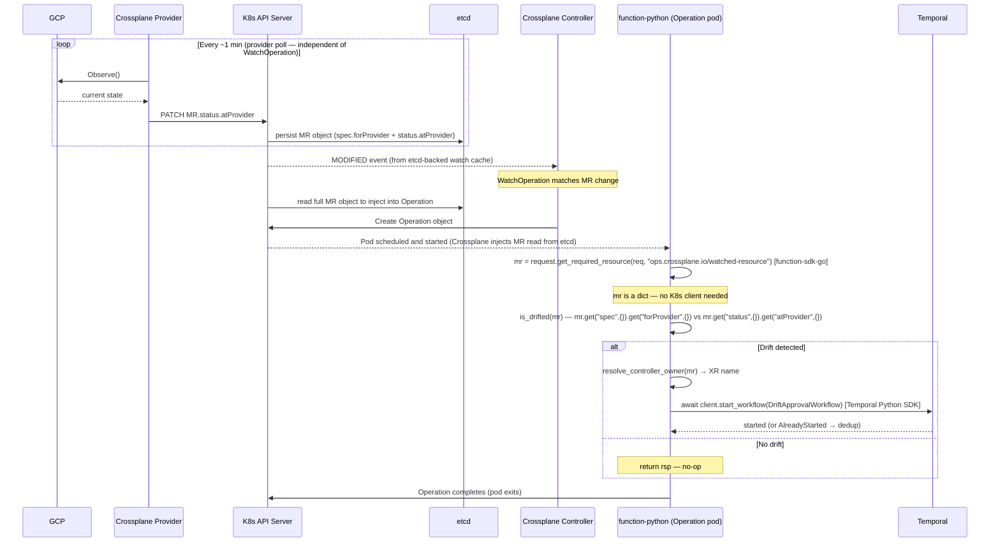

# Approach B — WatchOperations + function-python

**Branch:** `feature/drift-poc-approach-b-watchoperations`
**Trigger mechanism:** Crossplane-native event-driven via WatchOperation → Operation → function-python

---

## How It Works

A `WatchOperation` resource watches all MRs with `platform.io/drift-protection: "true"`.
When any watched MR changes, Crossplane creates an `Operation` that runs `function-python`.
The function checks two complementary signals for drift, resolves the MR's `ownerReferences`
to identify the XR, then calls the Temporal Python SDK to start `DriftApprovalWorkflow`.
No external binary needed.

Two signals are checked per MR (both are required):
- **Field drift:** `forProvider vs atProvider` diff — catches field-level changes in GCP
- **Resource deletion:** `.status.conditions[type=Synced, status=False, reason=ReconcileError]` — catches GCP-side deletion;
  `atProvider` is cleared or stale when the resource no longer exists, so diff alone misses this

```
MR changes (event-driven, Crossplane watch stream)
    └── WatchOperation triggers Operation creation
            └── function-python executes:
                  1. if forProvider != atProvider (field drift) → drifted=True
                  2. elif .status.conditions[type=Synced, status=False, reason=ReconcileError] → drifted=True
                  3. if drifted → resolve ownerRef → XR name
                     → temporalio.client.start_workflow(DriftApprovalWorkflow)
                  4. if not drifted → no-op, complete
```

---

## Architecture

```
┌─────────────────────────────────────────────────────────┐
│ Kubernetes / Crossplane                                  │
│                                                          │
│  WatchOperation (one per MR type)                        │
│  └── watch.kind: DatabaseInstance / Instance / etc.     │
│       watch.matchLabels: drift-protection=true          │
│         │                                               │
│         │ MR changes (event-driven)                     │
│         ▼                                               │
│     Operation created → function-python pod runs        │
│       └── diffs forProvider vs atProvider               │
│       └── resolves ownerRef → XR name                   │
│       └── calls Temporal gRPC :7233                     │
└──────────────────────────┬──────────────────────────────┘
                           │  Temporal Python SDK (gRPC)
                           ▼
              DriftApprovalWorkflow
              (see Shared Design)
```

Both `spec.forProvider` and `status.atProvider` are stored in **etcd** as fields of the MR
Kubernetes object. Crossplane reads the full MR object from etcd (via the K8s API server)
when creating an Operation and injects it into the function — the function itself never
communicates with K8s or etcd. **Staleness comes entirely from the provider poll interval**,
not from etcd or API server read latency.

---

## Sequence Diagram



> After `DriftApprovalWorkflow` starts, the approval and recovery flow is shared across all
> approaches — see [Shared Design](shared-design.md).

---

## Crossplane Features Required

| Feature | Status | Notes |
|---|---|---|
| ManagementPolicies | GA (beta) | Already available |
| WatchOperations | **Alpha** | Requires `--enable-operations` flag |
| Operations | **Alpha** | Same flag |
| function-python | Alpha | Must be installed separately |

**Alpha flag required:** Add `--set "args={--enable-operations}"` to the Crossplane Helm install.

---

## Multi-Resource Support

One `WatchOperation` per MR type, all pointing to the same `function-drift-notifier`:

```
crossplane/watchoperations/
├── drift-watch-databaseinstance.yaml
├── drift-watch-instance.yaml
├── drift-watch-cluster.yaml
├── drift-watch-nodepool.yaml
└── drift-watch-bucket.yaml
```

Adding a new resource type = copy one WatchOperation YAML and update `watch.apiVersion`
and `watch.kind`.

---

## WatchOperation Manifest

```yaml
apiVersion: ops.crossplane.io/v1alpha1
kind: WatchOperation
metadata:
  name: drift-watch-databaseinstance
spec:
  watch:
    apiVersion: sql.gcp.upbound.io/v1beta2
    kind: DatabaseInstance
    matchLabels:
      platform.io/drift-protection: "true"
  concurrencyPolicy: Allow
  successfulHistoryLimit: 5
  failedHistoryLimit: 5
  operationTemplate:
    spec:
      pipeline:
      - step: detect-and-notify
        functionRef:
          name: function-drift-notifier
        input:
          apiVersion: drift.platform.io/v1alpha1
          kind: DriftNotifierConfig
          spec:
            temporalAddress: "temporal-frontend.temporal-system:7233"
            temporalTaskQueue: "db-provisioning"
            temporalNamespace: "default"
            mrGroup: "sql.gcp.upbound.io"
            mrVersion: "v1beta2"
            mrResource: "databaseinstances"
```

---

## Python Function (main.py)

```python
async def run(req, _) -> fnv1.RunFunctionResponse:
    rsp = response.to(req)
    watched = request.get_required_resource(req, "ops.crossplane.io/watched-resource")
    config  = req.input["spec"]

    drifted, detail = is_drifted(watched)
    if not drifted:
        return rsp  # no-op on every non-drifted change

    # Resolve ownerReferences to find the XR
    xr_name, xr_kind, xr_api_version = resolve_controller_owner(watched)
    xr_group, xr_version = split_api_version(xr_api_version)
    namespace = watched["metadata"].get("namespace", "default")
    workflow_id = f"drift-approval-{namespace}-{xr_kind.lower()}-{xr_name}"

    await start_drift_workflow(
        address=config["temporalAddress"],
        namespace=config["temporalNamespace"],
        task_queue=config["temporalTaskQueue"],
        workflow_id=workflow_id,
        input_payload={
            "mrGroup":     config["mrGroup"],
            "mrVersion":   config["mrVersion"],
            "mrResource":  config["mrResource"],
            "mrName":      watched["metadata"]["name"],
            "mrNamespace": namespace,
            "xrGroup":     xr_group,
            "xrVersion":   xr_version,
            "xrResource":  plural_from_kind(xr_kind),
            "xrKind":      xr_kind,
            "xrName":      xr_name,
            "xrNamespace": namespace,
            "detectedAt":  datetime.now(timezone.utc).isoformat(),
            "driftDetail": detail,
        },
    )
    return rsp

def is_drifted(obj: dict) -> tuple[bool, str]:
    """Detect drift using two complementary signals.

    Signal 1: forProvider vs atProvider field diff (field changes in GCP).
    Signal 2: Synced=False/ReconcileError (resource deleted from GCP — atProvider
              is unreliable when the resource no longer exists).
    """
    # Signal 1: field diff
    for_provider = obj.get("spec", {}).get("forProvider", {})
    at_provider  = obj.get("status", {}).get("atProvider", {})
    if at_provider:
        diffs = diff_maps("", for_provider, at_provider)
        if diffs:
            return True, "; ".join(diffs)
    # Signal 2: Synced=False (resource deleted or unobservable)
    if is_synced_false(obj):
        return True, "resource deleted or unobservable (.status.conditions[Synced].status=False, reason=ReconcileError)"
    return False, ""


def is_synced_false(obj: dict) -> bool:
    """Return True when status.conditions[Synced].status=False and reason=ReconcileError.

    This is the signal that a GCP resource has been deleted or can no longer be observed.
    atProvider is unreliable in this state — diff alone will not detect deletion.
    """
    for cond in obj.get("status", {}).get("conditions", []):
        if cond.get("type") == "Synced" and cond.get("status") == "False":
            return cond.get("reason") == "ReconcileError"
    return False

# SKIPPED_PATHS lists field paths excluded from drift comparison.
# These are fields where GCP normalizes the value in a way that cannot be matched
# without additional API calls.
SKIPPED_PATHS = {
    # GCE: image family reference (e.g. "debian-cloud/debian-12") is resolved by GCP
    # to a specific versioned image URL. Cannot compare without a GCP API call.
    "bootDisk[0].initializeParams.sourceImage",
}


def diff_maps(prefix: str, desired: dict, observed: dict) -> list[str]:
    out = []
    for k, dv in desired.items():
        path = f"{prefix}.{k}" if prefix else k
        if path in SKIPPED_PATHS:
            continue
        ov = observed.get(k)
        if isinstance(dv, dict) and isinstance(ov, dict):
            out.extend(diff_maps(path, dv, ov))
        elif str(dv) != str(ov):
            out.append(f"{path}: {dv} → {ov}")
    return out

def resolve_controller_owner(obj: dict) -> tuple[str, str, str]:
    for ref in obj.get("metadata", {}).get("ownerReferences", []):
        if ref.get("controller", False):
            return ref["name"], ref["kind"], ref["apiVersion"]
    return "", "", ""
```

---

## Deduplication

Two layers:
1. **`is_drifted()` gate** — exits if MR is not actually drifted. Prevents Temporal calls on every reconcile tick.
2. **Temporal workflow ID** — deterministic `drift-approval-<ns>-<xrKind>-<xrName>`. `AlreadyStarted` swallowed silently.

---

## New Files

```
k8s/deploy-crossplane.sh                                       MODIFY (--enable-operations)
crossplane/providers/function-python.yaml                      NEW
crossplane/watchoperations/*.yaml (5 files)                    NEW
crossplane/functions/drift-notifier/main.py                    NEW
crossplane/functions/drift-notifier/requirements.txt           NEW
crossplane/functions/drift-notifier/Dockerfile                 NEW
crossplane/functions/drift-notifier/package/crossplane.yaml    NEW
backend/temporal-worker/internal/workflows/drift_approval.go   NEW (shared)
backend/temporal-worker/internal/activities/drift.go           NEW (shared)
backend/temporal-worker/cmd/worker/main.go                     MODIFY
k8s/temporal-worker/serviceaccount.yaml                        MODIFY (RBAC)
```

---

## Additional Setup Required

```bash
# 1. Re-install Crossplane with Operations enabled
helm upgrade crossplane crossplane-stable/crossplane \
  --set "args={--enable-operations}" -n crossplane-system

# 2. Build and push function package (requires Crossplane CLI)
# A Crossplane function is an .xpkg package, not a plain Docker image.
cd crossplane/functions/drift-notifier

# Step 1: build the runtime image
docker build . --platform=linux/amd64 --tag drift-notifier-runtime:v0.1.0

# Step 2: build the Crossplane package embedding the runtime
crossplane xpkg build \
  --package-root=package \
  --embed-runtime-image=drift-notifier-runtime:v0.1.0 \
  --package-file=drift-notifier.xpkg

# Step 3: push the Crossplane package
crossplane xpkg push \
  --package-files=drift-notifier.xpkg \
  <registry>/drift-notifier:v0.1.0

# 3. Verify Temporal gRPC reachable from crossplane-system
kubectl run test --rm -it --image=alpine -n crossplane-system \
  -- sh -c "nc -zv temporal-frontend.temporal-system 7233"
```

---

## Failure Modes

| Failure | Effect | Recovery |
|---|---|---|
| function-python crashes | Operation marked Failed | Crossplane retries per `failedHistoryLimit` |
| Temporal gRPC unreachable | `start_workflow` raises, Operation fails | Next MR change creates new Operation |
| `--enable-operations` flag missing | WatchOperation CRD not registered | Re-install Crossplane with flag |
| Function image unavailable | ImagePullBackOff | Push image, Operation auto-retries |

---

## Pros and Cons

### Pros
- **No new K8s Deployment** — function runs as a short-lived Crossplane Operation pod (ephemeral, managed by Crossplane)
- **Event-driven** — sub-second reaction after Crossplane updates `atProvider` on the MR; no poll delay
- **Declarative** — WatchOperation YAML is self-describing; visible to anyone inspecting the cluster
- **No persistent process** — Crossplane manages the Operation lifecycle; no pod to keep alive

### Cons
- **Alpha dependency** — `--enable-operations` flag and WatchOperations CRD are alpha; may change or break before graduating; not production-ready
- **Crossplane reinstall required** — enabling the alpha flag means re-running `helm upgrade` on Crossplane; disruptive in shared clusters
- **Python in a Go codebase** — new runtime, new language, new dependency supply chain for the team to maintain
- **Image build required** — function image must be built and pushed before anything works; adds a CI/CD step absent from all other approaches
- **Higher per-type extension cost** — adding a new resource type requires a full new WatchOperation YAML file; A/C only need one ConfigMap line, D only needs a schedule update command

---

## Limitations

- **Alpha dependency** — WatchOperations and Operations are alpha. Not production-ready until graduation.
- **Python in a Go codebase** — adds a new language and runtime to maintain.
- **Higher per-type extension cost** — all approaches require something when adding a new resource type; B requires a full new WatchOperation YAML file per type, whereas A/C only need one ConfigMap line and D only needs a `temporal schedule update` command.
- **Package build pipeline required** — the function is a Crossplane `.xpkg` package, not a plain Docker image. Building it requires `docker build` + `crossplane xpkg build` + `crossplane xpkg push`, plus a `package/crossplane.yaml` metadata file. This CI/CD step is absent from all other approaches.
- **Detection floor is still ~10 min** — gated by Crossplane's own `atProvider` refresh cycle (poll interval), same as all other approaches.
