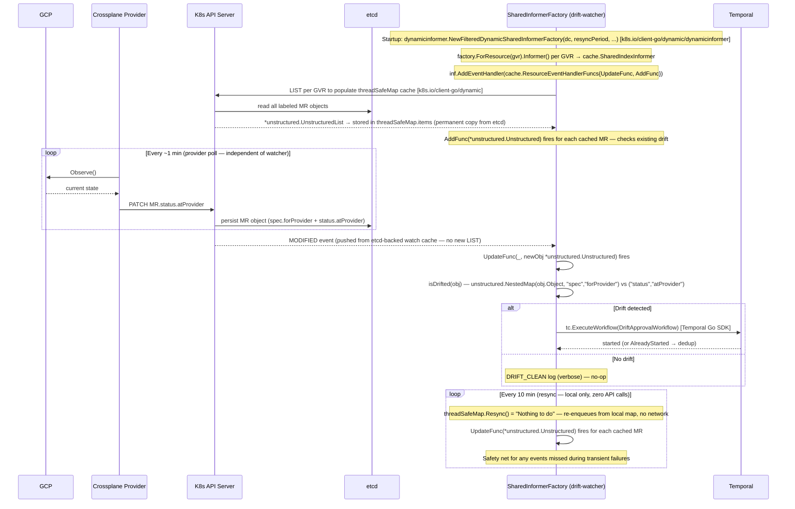

# Approach C — Informer-based Watcher

**Branch:** `feature/drift-poc-approach-c-informer`
**Trigger mechanism:** K8s shared informer watch stream (event-driven, not polling)

---

## How It Works

A Go binary (`drift-watcher`) — same concept as Approach A — but instead of periodic
list-polls, it uses `client-go` **shared informers** that maintain a persistent K8s watch
stream per MR type. When any watched MR changes, the informer pushes the event immediately
to an event handler, which checks two complementary signals for drift. If drift is detected,
it resolves the MR's `ownerReferences` to identify the XR and fires `DriftApprovalWorkflow`.
No polling delay.

Two signals are checked per MR (both are required):
- **Field drift:** `forProvider vs atProvider` diff — catches field-level changes in GCP
- **Resource deletion:** `.status.conditions[type=Synced, status=False, reason=ReconcileError]` — catches GCP-side deletion;
  `atProvider` is cleared or stale when the resource no longer exists, so diff alone misses this

```
K8s API server (persistent watch stream, one per MR GVR)
    └── informer pushes event when MR object changes
            └── event handler runs:
                  drifted, detail := isDrifted(mr)  // checks both signals
                  if drifted:
                    resolve ownerRef → XR name
                    fireWorkflow(mrFields + xrFields)
                  else: no-op
```

This is the production-grade evolution of Approach A. Same binary structure, same Temporal
integration — event-driven instead of poll-driven.

---

## Where `forProvider` and `atProvider` Come From

The drift-watcher **never calls GCP or Omnia directly**. All state data comes from the
**Kubernetes API server** via the `k8s.io/client-go/dynamic` informer.

```
GCP Console (manual change to CloudSQL tier)
        │
        │  GCP REST API
        ▼
provider-gcp pod (running in crossplane-system)
  managementPolicies=["Observe"] → Observe() called on every poll (~1 min)
  → calls GCP REST API, reads actual current state
  → PATCH MR.status.atProvider via K8s API server
        │
        │  K8s API server writes to etcd AND pushes MODIFIED event to watch stream
        ▼
K8s API server
  └── watch stream (WATCH /apis/sql.gcp.upbound.io/...?watch=true)
        │  pushes MODIFIED event immediately to informer
        ▼
SharedInformerFactory (local in-process cache)
  receives MODIFIED event → updates cached MR object
  → fires UpdateFunc with new MR (atProvider now reflects actual GCP state)
        │
        ▼
event handler: diff forProvider vs atProvider → fire workflow if mismatch
```

Both `spec.forProvider` and `status.atProvider` are stored in **etcd** as fields of the MR
Kubernetes object. The K8s API server is the access layer — the informer never communicates
with etcd directly. On startup, the initial `LIST` reads from etcd via the API server to
populate the local `threadSafeMap` cache. Subsequent `WATCH` events are pushed from the API
server's etcd-backed watch cache. **Staleness comes entirely from the provider poll interval**,
not from etcd or API server latency. Once the provider writes `status.atProvider`, the data is
immediately visible in etcd and triggers a MODIFIED event to the informer.

The critical point: the watch event fires the moment the provider pod writes `status.atProvider`
to the K8s API server — **not** when GCP state changes. The provider pod is the bridge between
GCP and K8s. Reaction time for the watcher = time between provider pod writing `atProvider`
and the watch event arriving (milliseconds to seconds), not the provider poll interval.

---

## Architecture

```
GCP / Omnia                provider-gcp / provider-roc pod
(actual state)  ────────►  Observe() every ~1 min (configured)
                           writes status.atProvider
                                   │
                                   │  PATCH /status (K8s API)
                                   ▼
                           K8s API server (etcd)
                           also pushes MODIFIED event to watch streams
                           ┌──────────────────────────────────┐
                           │ DatabaseInstance                 │
                           │  spec.forProvider:               │
                           │    settings.tier: db-n1-std-2    │
                           │  status.atProvider:              │
                           │    settings.tier: db-n1-std-4 ←drift│
                           └──────────────────────────────────┘
                                   │
                                   │  WATCH /apis/sql.gcp.upbound.io/...
                                   │  (persistent HTTP/2, one stream per GVR)
                                   ▼
                           SharedInformerFactory (in drift-watcher process)
                           ├── informer: databaseinstances
                           ├── informer: instances
                           ├── informer: clusters / nodepools
                           └── informer: buckets
                                UpdateFunc / AddFunc fires immediately
                                diff forProvider vs atProvider
                                ownerRef → XDatabase/my-postgres
                                   │  Temporal Go SDK
                                   ▼
                           DriftApprovalWorkflow
                           (see Shared Design)
```

---

## Sequence Diagram



> After `DriftApprovalWorkflow` starts, the approval and recovery flow is shared across all
> approaches — see [Shared Design](shared-design.md).

---

## Multi-Resource Support

Informers are set up per MR GVR, all sharing the same event handler. Same ConfigMap-driven
GVR list as Approach A — GVRs are **MR types**, not XR types:

```go
for _, gvr := range configuredGVRs {
    inf := factory.ForResource(gvr).Informer()
    inf.AddEventHandler(cache.ResourceEventHandlerFuncs{
        UpdateFunc: func(_, new interface{}) { onMREvent(new, gvr, tc) },
        AddFunc:    func(obj interface{})    { onMREvent(obj, gvr, tc) },
    })
}
```

Adding a new resource type = add one line to the ConfigMap. No code change, no redeployment.

---

## Key Code: drift-watcher/main.go

```go
func main() {
    tc, _ := client.Dial(client.Options{HostPort: getenv("TEMPORAL_ADDRESS", "localhost:7233")})
    dc, _ := k8s.NewDynamicClient()
    gvrs  := parseGVRs(getenv("MR_GVRS", ""))
    stopCh := make(chan struct{})

    factory := dynamicinformer.NewFilteredDynamicSharedInformerFactory(
        dc,
        10*time.Minute,   // resync period — safety net for missed events
        metav1.NamespaceAll,
        func(opts *metav1.ListOptions) {
            opts.LabelSelector = "platform.io/drift-protection=true"
        },
    )

    for _, gvr := range gvrs {
        gvr := gvr
        inf := factory.ForResource(gvr).Informer()
        inf.AddEventHandler(cache.ResourceEventHandlerFuncs{
            UpdateFunc: func(_, newObj interface{}) {
                mr := newObj.(*unstructured.Unstructured)
                drifted, detail := isDrifted(mr)
                if drifted {
                    fireWorkflow(context.Background(), tc, buildDriftInput(mr, gvr, detail))
                }
            },
            // AddFunc catches resources already drifted at watcher startup
            AddFunc: func(obj interface{}) {
                mr := obj.(*unstructured.Unstructured)
                drifted, detail := isDrifted(mr)
                if drifted {
                    fireWorkflow(context.Background(), tc, buildDriftInput(mr, gvr, detail))
                }
            },
        })
    }

    factory.Start(stopCh)
    factory.WaitForCacheSync(stopCh)
    log.Printf("informers synced, watching %d MR GVRs", len(gvrs))
    <-stopCh
}

// isDrifted detects drift using two complementary signals.
// Signal 1: forProvider vs atProvider field diff (field changes in GCP).
// Signal 2: Synced=False/ReconcileError (resource deleted from GCP — atProvider
//           is unreliable when the resource no longer exists).
func isDrifted(obj *unstructured.Unstructured) (bool, string) {
    // Signal 1: field diff
    forProvider, _, _ := unstructured.NestedMap(obj.Object, "spec", "forProvider")
    atProvider, _, _  := unstructured.NestedMap(obj.Object, "status", "atProvider")
    if len(atProvider) > 0 {
        diffs := diffMaps("", forProvider, atProvider)
        if len(diffs) > 0 {
            return true, strings.Join(diffs, "; ")
        }
    }
    // Signal 2: Synced=False (resource deleted or unobservable)
    if isSyncedFalse(obj) {
        return true, "resource deleted or unobservable (.status.conditions[Synced].status=False, reason=ReconcileError)"
    }
    return false, ""
}

// isSyncedFalse returns true when .status.conditions[type=Synced].status=False and
// .status.conditions[type=Synced].reason=ReconcileError — the signal that a GCP resource
// has been deleted or can no longer be observed. atProvider is unreliable in this state.
func isSyncedFalse(obj *unstructured.Unstructured) bool {
    conditions, _, _ := unstructured.NestedSlice(obj.Object, "status", "conditions")
    for _, c := range conditions {
        cond, ok := c.(map[string]interface{})
        if !ok {
            continue
        }
        if cond["type"] == "Synced" && cond["status"] == "False" {
            reason, _ := cond["reason"].(string)
            return reason == "ReconcileError"
        }
    }
    return false
}

// skippedPaths lists field paths excluded from drift comparison.
// These are fields where GCP normalizes the value in a way that cannot be matched
// without additional API calls.
var skippedPaths = map[string]struct{}{
    // GCE: image family reference (e.g. "debian-cloud/debian-12") is resolved by GCP
    // to a specific versioned image URL. Cannot compare without a GCP API call.
    "bootDisk[0].initializeParams.sourceImage": {},
}

func diffMaps(prefix string, desired, observed map[string]interface{}) []string {
    var out []string
    for k, dv := range desired {
        path := k
        if prefix != "" {
            path = prefix + "." + k
        }
        if _, skip := skippedPaths[path]; skip {
            continue
        }
        ov := observed[k]
        if dMap, ok := dv.(map[string]interface{}); ok {
            if oMap, ok := ov.(map[string]interface{}); ok {
                out = append(out, diffMaps(path, dMap, oMap)...)
            } else {
                out = append(out, fmt.Sprintf("%s: differs", path))
            }
        } else if fmt.Sprintf("%v", dv) != fmt.Sprintf("%v", ov) {
            out = append(out, fmt.Sprintf("%s: %v → %v", path, dv, ov))
        }
    }
    return out
}

// buildDriftInput populates both MR and XR fields.
// XR fields are resolved from the MR's ownerReferences (controller owner).
func buildDriftInput(mr *unstructured.Unstructured, mrGVR schema.GroupVersionResource, detail string) DriftApprovalInput {
    xrName, xrKind, xrAPIVersion := resolveControllerOwner(mr)
    xrGroup, xrVersion := splitAPIVersion(xrAPIVersion)
    return DriftApprovalInput{
        MRGroup:     mrGVR.Group,
        MRVersion:   mrGVR.Version,
        MRResource:  mrGVR.Resource,
        MRName:      mr.GetName(),
        MRNamespace: mr.GetNamespace(),
        XRGroup:     xrGroup,
        XRVersion:   xrVersion,
        XRResource:  pluralFromKind(xrKind),
        XRKind:      xrKind,
        XRName:      xrName,
        XRNamespace: mr.GetNamespace(),
        DetectedAt:  time.Now().UTC().Format(time.RFC3339),
        DriftDetail: detail,
    }
}

func resolveControllerOwner(obj *unstructured.Unstructured) (name, kind, apiVersion string) {
    for _, ref := range obj.GetOwnerReferences() {
        if ref.Controller != nil && *ref.Controller {
            return ref.Name, ref.Kind, ref.APIVersion
        }
    }
    return "", "", ""
}

func fireWorkflow(ctx context.Context, tc client.Client, in DriftApprovalInput) error {
    workflowID := fmt.Sprintf("drift-approval-%s-%s-%s",
        in.XRNamespace, strings.ToLower(in.XRKind), in.XRName)
    _, err := tc.ExecuteWorkflow(ctx, client.StartWorkflowOptions{
        ID: workflowID, TaskQueue: "db-provisioning",
    }, workflows.DriftApprovalWorkflow, in)
    var alreadyStarted *serviceerror.WorkflowExecutionAlreadyStartedError
    if errors.As(err, &alreadyStarted) {
        return nil // dedup — workflow already running for this XR
    }
    return err
}
```

---

## ConfigMap

```yaml
# ConfigMap: drift-watcher-config
MR_GVRS: |
  sql.gcp.upbound.io/v1beta2/databaseinstances
  compute.gcp.upbound.io/v1beta2/instances
  container.gcp.upbound.io/v1beta2/clusters
  container.gcp.upbound.io/v1beta2/nodepools
  storage.gcp.upbound.io/v1beta2/buckets
```

---

## Resync Period

The informer factory uses a **10-minute resync period**:
- Every 10 minutes, all watched MRs are re-listed and `UpdateFunc` fires for each.
- Serves as a safety net: any event missed during a transient network blip is picked up.
- `isDrifted()` is idempotent; `fireWorkflow()` is deduplicated via Temporal workflow ID.

This gives Approach C both event-driven speed and polling safety.

---

## Comparison with Approach A

| Dimension | Approach A (polling) | Approach C (informer) |
|---|---|---|
| Trigger latency after atProvider updates | 0–30s | <1s |
| K8s API calls (idle, 50 resources) | ~10 list calls/min | 5 persistent watch streams |
| Safety on missed events | every poll cycle | 10-min resync |
| Recovery after crash | next poll detects persisting drift | AddFunc re-fires for drifted resources on restart |
| Code delta vs A | baseline | ~+30 lines (informer setup) |

---

## New Files

Identical set to Approach A. Only the internal implementation of `cmd/drift-watcher/main.go` differs.

```
backend/temporal-worker/cmd/drift-watcher/main.go    NEW (informer-based)
backend/temporal-worker/internal/workflows/drift_approval.go  NEW (shared)
backend/temporal-worker/internal/activities/drift.go          NEW (shared)
backend/temporal-worker/cmd/worker/main.go                    MODIFY
k8s/drift-watcher/deployment.yaml                             NEW
k8s/drift-watcher/configmap.yaml                              NEW
k8s/temporal-worker/serviceaccount.yaml                       MODIFY
crossplane/xrd/* (4 files)                                    MODIFY
crossplane/composition/* (4 files)                            MODIFY
```

---

## Failure Modes

| Failure | Effect | Recovery |
|---|---|---|
| Watcher pod crashes | Watch streams torn down | On restart, AddFunc fires for any still-drifted MRs — no events permanently lost |
| K8s API server briefly unavailable | Watch stream disconnects | client-go auto-reconnects with exponential backoff |
| Watch stream falls behind ("too old resource version") | K8s closes stream | Informer detects and does a full re-list automatically |
| Temporal unavailable | `ExecuteWorkflow` fails, logged | Next MR update or resync fires a retry |

---

## Why This is the Production-Grade Version of Approach A

1. **No blind window on startup** — AddFunc fires for already-drifted MRs on cache sync.
2. **Lower K8s API load** — one persistent TCP connection per GVR vs repeated list calls.
3. **Sub-second reaction time** — informer push vs up to 30s poll lag.
4. **Guaranteed delivery via resync** — 10-min resync catches anything missed during failures.

For the POC, Approach A is faster to implement. For production, migrate to Approach C.

---

## Pros and Cons

### Pros
- **Event-driven with safety net** — sub-second reaction from the watch stream, plus 10-min resync catches any missed events
- **No blind window on startup** — `AddFunc` fires for already-drifted MRs when the informer cache first syncs; pod restart never loses events
- **Lower K8s API load than A** — persistent watch streams (idle) vs repeated list calls every 30s
- **Go-only, no alpha dependencies** — same codebase as A, production-ready
- **Most resilient of the external binary approaches** — missed events recovered by resync; disconnected streams reconnected by client-go automatically

### Cons
- **More complex than A** — informer factory setup adds ~30 lines vs a simple loop; slightly harder to debug
- **New K8s Deployment** — same operational cost as A
- **Pod restart required for new GVRs** — informers are created at startup; adding a new resource type needs a pod restart
- **API server-side fan-out pressure** — watch streams use HTTP/2 (all GVR streams multiplexed over a single TCP connection), so client-side cost is low. But the API server must maintain watcher state and fan out every matching event to all registered watchers. At scale with many watcher replicas, this server-side cost compounds. Polling approaches (A, D) have no equivalent server-side overhead.
- **Reconnect triggers LIST burst** — if the watcher pod restarts (crash loop, rolling deploy) or the watch stream is closed (`"too old resource version"`), client-go automatically does a full LIST per GVR before re-establishing the watch. In a stable deployment this is negligible, but in an unstable one it can generate more API load than approach A would at the same interval.
- **Watch ring buffer overflow** — under extremely high change rates the API server's event ring buffer can fill, causing the stream to close and forcing a re-list. The re-list burst is unscheduled and unpredictable.
- **In-memory cache grows linearly with labeled resource count** ⚠️ — the SharedInformer caches every watched object in the watcher pod's heap permanently. This is fundamental to how informers work and cannot be opted out of. At large scale this becomes a hard memory ceiling. See [Scaling Considerations](#scaling-considerations) below. Confirmed from client-go v0.30.0 source: every object is stored in `threadSafeMap.items map[string]interface{}` (`tools/cache/thread_safe_store.go:379`).

---

## Scaling Considerations

**This is the most critical architectural constraint of Approach C.**

The SharedInformer always maintains a full in-memory copy of every watched object — every
labeled MR, with its full `spec.forProvider` and `status.atProvider`. The cache lives in the
watcher pod's heap for the entire lifetime of the process.

This is confirmed from **client-go v0.30.0 source code** — not an assumption:

```
shared_informer.go:272
  sharedIndexInformer.indexer = NewIndexer(...)
      ↓
store.go:290
  NewIndexer → NewThreadSafeStore()
      ↓
thread_safe_store.go:378-384
  return &threadSafeMap{
      items: map[string]interface{}{},  // ← every object stored here, forever
  }
```

And the periodic resync timer (`reflector.go:386`) calls `r.store.Resync()`, which is:

```go
// thread_safe_store.go:371
func (c *threadSafeMap) Resync() error {
    // Nothing to do
    return nil
}
```

Resync makes zero API calls — confirmed. It re-enqueues items from the local map through the
event queue so your `UpdateFunc` fires, but no network round trip is involved.

Approaches A and D do not have this permanent cache — they LIST, process results, and discard.
However, they are not flat either: during each poll cycle, all fetched objects live in memory
until the goroutines finish and the GC collects them. The pattern differs:

| | A / D | C |
|---|---|---|
| Memory pattern | Periodic spike during poll → GC → near zero | Constant steady-state |
| Peak per cycle | Similar order of magnitude (same objects fetched) | Same order of magnitude (same objects cached) |
| Average over time | Lower (near-zero between polls) | Higher (cache never GC'd) |
| Sizing | Needs burst headroom | Predictable constant |

**Memory projection at scale:**

| Labeled MR count | Avg object size | Estimated heap |
|-----------------|----------------|---------------|
| 1,000 | 50 KB | ~50 MB |
| 10,000 | 50 KB | ~500 MB |
| 50,000 | 50 KB | ~2.5 GB |
| 10,000 | 150 KB (GKE-scale atProvider) | ~1.5 GB |

These numbers matter for a platform serving a large organisation — if drift protection is
enabled broadly across all services and providers, the watcher pod's memory requirement
scales directly with adoption.

**Mitigations:**

| Option | Trade-off |
|--------|-----------|
| Make drift protection opt-in (label discipline) | Keeps labeled count low; relies on teams not over-labeling |
| Shard watchers by namespace / provider / GVR group | Distributes cache across pods; adds operational complexity |
| Switch to raw `Watch()` without SharedInformer | Near-zero memory; loses resync safety net and startup `AddFunc` |
| Use Approach A or D at scale | No cache at all; trade event-driven latency for flat memory profile |

**Recommendation:** If the platform is expected to manage tens of thousands of labeled
resources, Approach A or D is a better fit at that scale. Approach C is optimal when the
labeled resource count is bounded (e.g. drift protection is a premium opt-in for critical
resources only).
