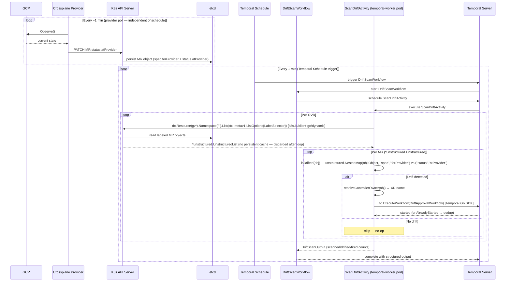

# Approach D — Temporal Schedule

**Branch:** `feature/drift-poc-approach-d-temporal-schedule`
**Trigger mechanism:** Temporal cron schedule runs a drift scan workflow every minute

---

## How It Works

A Temporal `Schedule` triggers `DriftScanWorkflow` every minute. The workflow runs
`ScanDriftActivity`, which lists all MRs with the drift-protection label across all
configured MR GVRs, checks each MR against two complementary signals, and fires
`DriftApprovalWorkflow` for any that are drifted. The ownerReferences on each drifted
MR are resolved to identify the XR for the workflow key.

No external binary. No new Kubernetes Deployment. All logic lives inside Temporal.

Two signals are checked per MR (both are required):
- **Field drift:** `forProvider vs atProvider` diff — catches field-level changes in GCP
- **Resource deletion:** `.status.conditions[type=Synced, status=False, reason=ReconcileError]` — catches GCP-side deletion;
  `atProvider` is cleared or stale when the resource no longer exists, so diff alone misses this

```
Temporal Schedule (every 1 min)
    └── DriftScanWorkflow
            └── ScanDriftActivity
                  for each configured MR GVR:
                    list MRs with platform.io/drift-protection=true
                    for each MR:
                      drifted, detail := isDrifted(mr)  // checks both signals
                      if drifted:
                        resolve ownerRef → XR name
                        ExecuteWorkflow(DriftApprovalWorkflow, mrFields + xrFields)
```

---

## Where `forProvider` and `atProvider` Come From

`ScanDriftActivity` runs inside the **temporal-worker pod** (already deployed in the cluster).
It **never calls GCP or Omnia directly** — it reads all state from the **Kubernetes API server**
using `k8s.io/client-go/dynamic`, the same client library used by Approaches A and C.

```
GCP Console (manual change to CloudSQL tier)
        │
        │  GCP REST API
        ▼
provider-gcp pod (running in crossplane-system)
  managementPolicies=["Observe"] → Observe() called on every poll (~1 min)
  → calls GCP REST API, reads actual current state
  → PATCH MR.status.atProvider via K8s API server
        │
        │  K8s API server writes to etcd
        ▼
etcd (via K8s API server)
  MR.spec.forProvider   = desired state (what Crossplane declared)
  MR.status.atProvider  = actual state  (what GCP currently has)
        │
        │  Temporal Schedule fires every 1 min
        ▼
ScanDriftActivity (running inside temporal-worker pod)
  dynamic client: LIST /apis/sql.gcp.upbound.io/v1beta2/databaseinstances
  reads forProvider + atProvider from K8s API response
  diff → if mismatch → resolve ownerRef → ExecuteWorkflow
```

Both `spec.forProvider` and `status.atProvider` are stored in **etcd** as fields of the MR
Kubernetes object. The K8s API server is the access layer — `ScanDriftActivity` never
communicates with etcd directly. Each `List()` call goes to the K8s API server, which reads
from etcd and returns the current MR state. **Staleness comes entirely from the provider poll
interval**, not from etcd or API server read latency.

The temporal-worker pod already has a `ServiceAccount` with K8s API access (for existing
`ApplyYAMLActivity`, `WaitDatabaseClaimReadyActivity`, etc.). `ScanDriftActivity` reuses
the same in-cluster kubeconfig — no additional auth setup required.

---

## Architecture

```
GCP / Omnia                provider-gcp / provider-roc pod
(actual state)  ────────►  Observe() every ~1 min (configured)
                           writes status.atProvider
                                   │
                                   │  PATCH /status (K8s API)
                                   ▼
                           K8s API server (etcd)
                           ┌──────────────────────────────────┐
                           │ DatabaseInstance                 │
                           │  spec.forProvider:               │
                           │    settings.tier: db-n1-std-2    │
                           │  status.atProvider:              │
                           │    settings.tier: db-n1-std-4 ←drift│
                           └──────────────────────────────────┘
                                   │
                                   │  LIST /apis/sql.gcp.upbound.io/...
                                   │  (dynamic client inside temporal-worker pod)
                                   ▼
                  Temporal Schedule (every 1 min)
                  └── DriftScanWorkflow
                        └── ScanDriftActivity
                              diff forProvider vs atProvider
                              ownerRef → XDatabase/my-postgres
                                   │
                                   │  Temporal Go SDK (gRPC to Temporal server)
                                   ▼
                           DriftApprovalWorkflow
                           (see Shared Design)
```

---

## Sequence Diagram



> After `DriftApprovalWorkflow` starts, the approval and recovery flow is shared across all
> approaches — see [Shared Design](shared-design.md).

---

## Multi-Resource Support

The MR GVR list is passed into `DriftScanWorkflow` as part of the Schedule input. Adding a
new resource type = update the Schedule — no code change, no redeployment:

```bash
temporal schedule update \
  --schedule-id "drift-scan" \
  --input '{"gvrs": ["...", "networking.gcp.upbound.io/v1beta1/globaladdresses"]}'
```

---

## New Files

No new binaries. No new Deployments.

```
backend/temporal-worker/internal/workflows/drift_approval.go  NEW (shared)
backend/temporal-worker/internal/workflows/drift_scan.go      NEW
backend/temporal-worker/internal/activities/drift.go          NEW (shared)
backend/temporal-worker/internal/activities/drift_scan.go     NEW
backend/temporal-worker/cmd/worker/main.go                    MODIFY
k8s/temporal-worker/serviceaccount.yaml                       MODIFY (RBAC)
scripts/setup-drift-scan-schedule.sh                          NEW
crossplane/xrd/* (4 files)                                    MODIFY
crossplane/composition/* (4 files)                            MODIFY
```

---

## DriftScanWorkflow

```go
type DriftScanInput struct {
    GVRs []string `json:"gvrs"` // MR GVRs: "group/version/resource" per entry
}

type DriftScanOutput struct {
    ScannedResources int `json:"scannedResources"`
    DriftedResources int `json:"driftedResources"`
    WorkflowsFired   int `json:"workflowsFired"`
}

func DriftScanWorkflow(ctx workflow.Context, in DriftScanInput) (DriftScanOutput, error) {
    actCtx := workflow.WithActivityOptions(ctx, workflow.ActivityOptions{
        StartToCloseTimeout: 2 * time.Minute,
        RetryPolicy: &temporal.RetryPolicy{MaximumAttempts: 2},
    })
    var out DriftScanOutput
    err := workflow.ExecuteActivity(actCtx, activities.ScanDriftActivity, in).Get(ctx, &out)
    return out, err
}
```

---

## ScanDriftActivity

```go
func ScanDriftActivity(ctx context.Context, in workflows.DriftScanInput) (workflows.DriftScanOutput, error) {
    dc, _ := k8s.NewDynamicClient()
    tc    := getTemporalClient()
    var out workflows.DriftScanOutput

    for _, gvrStr := range in.GVRs {
        gvr, _ := parseGVRString(gvrStr)
        list, _ := dc.Resource(gvr).Namespace("").List(ctx, metav1.ListOptions{
            LabelSelector: "platform.io/drift-protection=true",
        })
        for _, item := range list.Items {
            out.ScannedResources++
            drifted, detail := isDrifted(&item)
            if !drifted { continue }
            out.DriftedResources++

            driftIn := buildDriftInput(&item, gvr, detail)
            wfID    := fmt.Sprintf("drift-approval-%s-%s-%s",
                driftIn.XRNamespace, strings.ToLower(driftIn.XRKind), driftIn.XRName)

            _, err := tc.ExecuteWorkflow(ctx, client.StartWorkflowOptions{
                ID: wfID, TaskQueue: "db-provisioning",
            }, "DriftApprovalWorkflow", driftIn)

            if isAlreadyStarted(err) { continue } // dedup
            if err != nil { log.Printf("fire workflow error: %v", err); continue }
            out.WorkflowsFired++
        }
    }
    return out, nil
}

// isDrifted detects drift using two complementary signals.
// Signal 1: forProvider vs atProvider field diff (field changes in GCP).
// Signal 2: Synced=False/ReconcileError (resource deleted from GCP — atProvider
//           is unreliable when the resource no longer exists).
func isDrifted(obj *unstructured.Unstructured) (bool, string) {
    // Signal 1: field diff
    forProvider, _, _ := unstructured.NestedMap(obj.Object, "spec", "forProvider")
    atProvider, _, _  := unstructured.NestedMap(obj.Object, "status", "atProvider")
    if len(atProvider) > 0 {
        diffs := diffMaps("", forProvider, atProvider)
        if len(diffs) > 0 {
            return true, strings.Join(diffs, "; ")
        }
    }
    // Signal 2: Synced=False (resource deleted or unobservable)
    if isSyncedFalse(obj) {
        return true, "resource deleted or unobservable (.status.conditions[Synced].status=False, reason=ReconcileError)"
    }
    return false, ""
}

// isSyncedFalse returns true when .status.conditions[type=Synced].status=False and
// .status.conditions[type=Synced].reason=ReconcileError — the signal that a GCP resource
// has been deleted or can no longer be observed. atProvider is unreliable in this state.
func isSyncedFalse(obj *unstructured.Unstructured) bool {
    conditions, _, _ := unstructured.NestedSlice(obj.Object, "status", "conditions")
    for _, c := range conditions {
        cond, ok := c.(map[string]interface{})
        if !ok {
            continue
        }
        if cond["type"] == "Synced" && cond["status"] == "False" {
            reason, _ := cond["reason"].(string)
            return reason == "ReconcileError"
        }
    }
    return false
}

// skippedPaths lists field paths excluded from drift comparison.
// These are fields where GCP normalizes the value in a way that cannot be matched
// without additional API calls.
var skippedPaths = map[string]struct{}{
    // GCE: image family reference (e.g. "debian-cloud/debian-12") is resolved by GCP
    // to a specific versioned image URL. Cannot compare without a GCP API call.
    "bootDisk[0].initializeParams.sourceImage": {},
}

func diffMaps(prefix string, desired, observed map[string]interface{}) []string {
    var out []string
    for k, dv := range desired {
        path := k
        if prefix != "" {
            path = prefix + "." + k
        }
        if _, skip := skippedPaths[path]; skip {
            continue
        }
        ov := observed[k]
        if dMap, ok := dv.(map[string]interface{}); ok {
            if oMap, ok := ov.(map[string]interface{}); ok {
                out = append(out, diffMaps(path, dMap, oMap)...)
            } else {
                out = append(out, fmt.Sprintf("%s: differs", path))
            }
        } else if fmt.Sprintf("%v", dv) != fmt.Sprintf("%v", ov) {
            out = append(out, fmt.Sprintf("%s: %v → %v", path, dv, ov))
        }
    }
    return out
}

// buildDriftInput populates both MR and XR fields.
// XR fields are resolved from the MR's ownerReferences (controller owner).
func buildDriftInput(mr *unstructured.Unstructured, mrGVR schema.GroupVersionResource, detail string) DriftApprovalInput {
    xrName, xrKind, xrAPIVersion := resolveControllerOwner(mr)
    xrGroup, xrVersion := splitAPIVersion(xrAPIVersion)
    return DriftApprovalInput{
        MRGroup:     mrGVR.Group,
        MRVersion:   mrGVR.Version,
        MRResource:  mrGVR.Resource,
        MRName:      mr.GetName(),
        MRNamespace: mr.GetNamespace(),
        XRGroup:     xrGroup,
        XRVersion:   xrVersion,
        XRResource:  pluralFromKind(xrKind),
        XRKind:      xrKind,
        XRName:      xrName,
        XRNamespace: mr.GetNamespace(),
        DetectedAt:  time.Now().UTC().Format(time.RFC3339),
        DriftDetail: detail,
    }
}

func resolveControllerOwner(obj *unstructured.Unstructured) (name, kind, apiVersion string) {
    for _, ref := range obj.GetOwnerReferences() {
        if ref.Controller != nil && *ref.Controller {
            return ref.Name, ref.Kind, ref.APIVersion
        }
    }
    return "", "", ""
}
```

---

## Schedule Registration

```bash
# scripts/setup-drift-scan-schedule.sh
temporal schedule create \
  --address "${TEMPORAL_ADDRESS:-localhost:7233}" \
  --schedule-id "drift-scan" \
  --workflow-type "DriftScanWorkflow" \
  --task-queue "db-provisioning" \
  --overlap-policy Skip \
  --input '{
    "gvrs": [
      "sql.gcp.upbound.io/v1beta2/databaseinstances",
      "compute.gcp.upbound.io/v1beta2/instances",
      "container.gcp.upbound.io/v1beta2/clusters",
      "container.gcp.upbound.io/v1beta2/nodepools",
      "storage.gcp.upbound.io/v1beta2/buckets"
    ]
  }' \
  --cron "* * * * *"
```

**Overlap policy `Skip`:** if a scan takes longer than 1 minute (unlikely), the next
trigger is skipped rather than stacking concurrent scans.

---

## Advantages Over A/C

| Dimension | A/C (external binary) | D (Temporal Schedule) |
|---|---|---|
| New K8s Deployments | 1 (drift-watcher) | 0 |
| Scan observability | Pod logs | Temporal UI — full history per scan run with structured output |
| Alerting on scan failure | Log-based alerting | Temporal workflow failure alerting (already in place) |
| Update resource list | ConfigMap update + pod restart (A/C) | `temporal schedule update` — no deploy |
| Audit trail | Logs only | Full Temporal workflow history |

---

## Failure Modes

| Failure | Effect | Recovery |
|---|---|---|
| Temporal worker crashes | Schedule fires; next run picks up all drifted resources | Auto-recover on restart |
| Temporal server down | Schedule pauses | Scans resume when server recovers; all drift detected on next run |
| K8s API unavailable during scan | `ScanDriftActivity` fails; workflow retries | Schedule fires again next minute |
| Scan takes >1 min | Next trigger skipped (`Skip` policy) | No issue for normal resource counts |

---

## Key Disadvantage vs A/C

If Temporal is down, drift scanning stops entirely. In A/C, the watcher runs independently
of Temporal (only the workflow start call fails, and the watcher retries on the next poll).

This is the main trade-off: Approach D has fewer components but higher coupling to Temporal
availability for drift *detection* (not just handling).

---

## Pros and Cons

### Pros
- **No new K8s Deployment** — fewest components to operate; all drift logic lives inside Temporal
- **Richest observability** — every scan run is a Temporal workflow with structured output (`scanned` / `drifted` / `fired`) visible in the Temporal UI
- **Full audit trail** — complete scan history retained in Temporal, not just pod logs
- **Easiest resource type extension** — adding a new MR GVR only requires `temporal schedule update`; no deployment or restart
- **Reuses existing alerting** — scan failures surface as Temporal workflow failures, picked up by any existing Temporal alerting

### Cons
- **Fully coupled to Temporal availability** — if Temporal is down, drift scanning stops entirely; in A/C the watcher runs independently while only the workflow start call fails
- **Up to 1 min scan latency** — same as A's poll interval, worse than B/C event-driven approaches
- **Unusual pattern** — `ScanDriftActivity` calls back into Temporal to start `DriftApprovalWorkflow`; requires injecting a Temporal client into the activity
- **Scan history accumulates** — 1 `DriftScanWorkflow` entry per minute; requires a Temporal workflow retention policy to avoid unbounded storage growth
- **Potential rate limiting at scale** — if many resources drift simultaneously, all `DriftApprovalWorkflow` starts happen within one activity execution; may hit Temporal API rate limits with very large resource counts

---

## Scaling Considerations

### Current PoC design

The PoC dispatches one `ScanDriftActivity` per GVR. A single worker pod picks up each
activity and processes all tenants' MRs for that GVR sequentially (with internal
goroutines). This is sufficient for small-scale testing but does not distribute load
across tenants.

### Production scale design

At production scale, the scan uses a two-phase workflow to distribute load at the tenant
level across worker pods.

#### Two-phase workflow

```
DriftScanWorkflow
  │
  │ Phase 1 — Discover (parallel per GVR)
  ├── DiscoverMRsActivity(gvr=cloudsql)    ──► K8s LIST ──► [(tenant-A, mr1), (tenant-B, mr2)]
  ├── DiscoverMRsActivity(gvr=gce)         ──► K8s LIST ──► [(tenant-A, mr3)]
  ├── DiscoverMRsActivity(gvr=gke-cluster) ──► K8s LIST ──► [(tenant-B, mr4)]
  └── DiscoverMRsActivity(gvr=gcs)         ──► K8s LIST ──► [(tenant-A, mr5)]
  │
  │ (workflow aggregates results → (GVR, tenant) pairs)
  │
  │ Phase 2 — Scan (parallel per GVR × tenant)
  ├── ScanTenantActivity(cloudsql, tenant-A, [mr1])    ──► Worker Pod 1
  ├── ScanTenantActivity(cloudsql, tenant-B, [mr2])    ──► Worker Pod 2
  ├── ScanTenantActivity(gce, tenant-A, [mr3])         ──► Worker Pod 3
  ├── ScanTenantActivity(gke-cluster, tenant-B, [mr4]) ──► Worker Pod 1
  └── ScanTenantActivity(gcs, tenant-A, [mr5])         ──► Worker Pod 2
  │
  │ Phase 3 — Approve (fire and forget)
  └── DriftApprovalWorkflow per drifted MR
```

**Activity granularity: `(GVR, tenant)` — not per MR.** One `ScanTenantActivity` handles
all MRs for one tenant in one GVR (expected ≤100 MRs per tenant per resource type).
MR-level concurrency is handled internally by bounded goroutines (semaphore). This keeps
Temporal activity count at `GVRs × tenants` — reasonable for Matching service load and
workflow history size.

#### Worker model

One binary registers all activity and workflow types and polls one task queue (`drift-detection`).
All pods are identical — Temporal distributes tasks to whichever pod is free.

```
Drift Worker Pod (N replicas, identical)
  registers:
    - DriftScanWorkflow
    - DiscoverMRsActivity
    - ScanTenantActivity
  polls: drift-detection task queue
```

No manual pod-to-GVR mapping, no sharding config — adding pods increases capacity automatically.

#### Scan overlap prevention

Temporal schedule overlap policy set to `SKIP`. `DriftScanWorkflow` only completes
when all Phase 1 and Phase 2 activities finish (Phase 3 is fire-and-forget). SKIP sees
the workflow as in-flight for the full scan duration — the next trigger is skipped if
the current scan is still running. This prevents concurrent scans and bounds total
goroutine count at `worker_pods × max_concurrent_activities_per_pod`.

#### Dynamic autoscaling

Worker pods scale based on task queue backlog depth using a queue-depth-based autoscaler
(e.g. KEDA). When Phase 2 dispatches `GVRs × tenants` activities simultaneously, backlog
spikes → autoscaler scales up worker pods. Between scans, queue is empty → autoscaler
scales down to 0 or minimum.

```
Scan starts  → activities flood queue → scale up pods
Scan ends    → queue drains           → scale down to 0
```

Cold-start latency (seconds) is acceptable given scan intervals are in minutes.

#### Trade-off

Scale-out requires Temporal to be healthy. If Temporal is unavailable, all scanning stops.
Approaches A and C continue scanning independently of Temporal.
