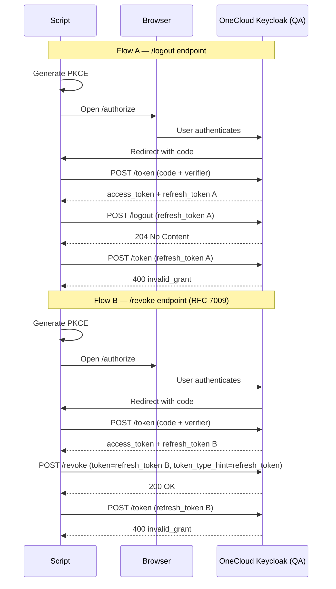

# Design: Keycloak Session Revoke PoC

## Research Question

Does Keycloak provide a working token revocation endpoint, and can UCP reliably use it so that a logout actually invalidates the session server-side?

**Jira:** [MCUCP-238 B01](https://jira.rakuten-it.com/jira/browse/MCUCP-238)

---

## Hypothesis

Keycloak exposes two token invalidation endpoints — `/logout` (end-session) and `/revoke` (RFC 7009) — both of which accept a refresh token and invalidate it server-side. After a successful call to either endpoint, the refresh token can no longer be used to obtain new access tokens.

---

## Scope

**In scope:**
- Login via PKCE flow against OneCloud Keycloak (QA realm)
- Calling `/logout` with a refresh token and verifying revocation
- Calling `/revoke` (RFC 7009) with a refresh token and verifying revocation
- Comparing behavior of both endpoints
- Verifying that the access token expires naturally (no active revocation)

**Out of scope:**
- Access token active revocation (known Keycloak limitation — not supported)
- Cross-device / Single Logout (SLO)
- Production environment testing
- UCP API Gateway integration

---

## Approach

A minimal standalone Go script in the kitchen-sink repo exercises the full login → logout → verify cycle against OneCloud Keycloak QA.

### Flow

The script runs two independent flows — one per revocation endpoint — each starting from a fresh login.

### Keycloak endpoints used

| Step | Endpoint |
|---|---|
| Authorize | `GET /auth/realms/roc/protocol/openid-connect/auth` |
| Token exchange | `POST /auth/realms/roc/protocol/openid-connect/token` |
| End-session logout | `POST /auth/realms/roc/protocol/openid-connect/logout` |
| RFC 7009 revoke | `POST /auth/realms/roc/protocol/openid-connect/revoke` |

**QA base:** `https://qa2-accounts-onecloud.rakuten-it.com`

---

## Success Criteria

| Criterion | Pass condition |
|---|---|
| Login completes (both flows) | Script receives `access_token` and `refresh_token` |
| `/logout` call succeeds | Keycloak returns `2xx` |
| `/revoke` call succeeds | Keycloak returns `200 OK` |
| Refresh token revoked after `/logout` | Subsequent refresh returns `400 invalid_grant` |
| Refresh token revoked after `/revoke` | Subsequent refresh returns `400 invalid_grant` |
| Access token TTL recorded | `iat` and `exp` from the access token are printed; TTL = `exp - iat` |
| Access token behavior documented | Behavior after revocation observed and recorded |

---

## Implementation Plan

1. Branch off `kitchen-sink` main
2. Write a self-contained Go script: `keycloak-session-revoke/main.go`
3. Script runs two flows: login → `/logout` → verify, then login → `/revoke` → verify
4. Record all HTTP responses in `implementation.md`

---

## Risks and Open Questions

| Item | Note |
|---|---|
| UCP Keycloak client config | Client must allow `public` client type (no secret) for PKCE. Needs confirmation that the QA client is configured this way. |
| `offline_access` scope | Login uses `offline_access` scope in current PoC codebase. Behavior of offline tokens on logout is separate from regular refresh tokens — may need separate test. |
| `/revoke` response semantics | RFC 7009 requires servers to return `200 OK` even for unknown tokens. Confirm Keycloak follows this — the verify step (attempt refresh) is the actual proof of revocation. |
