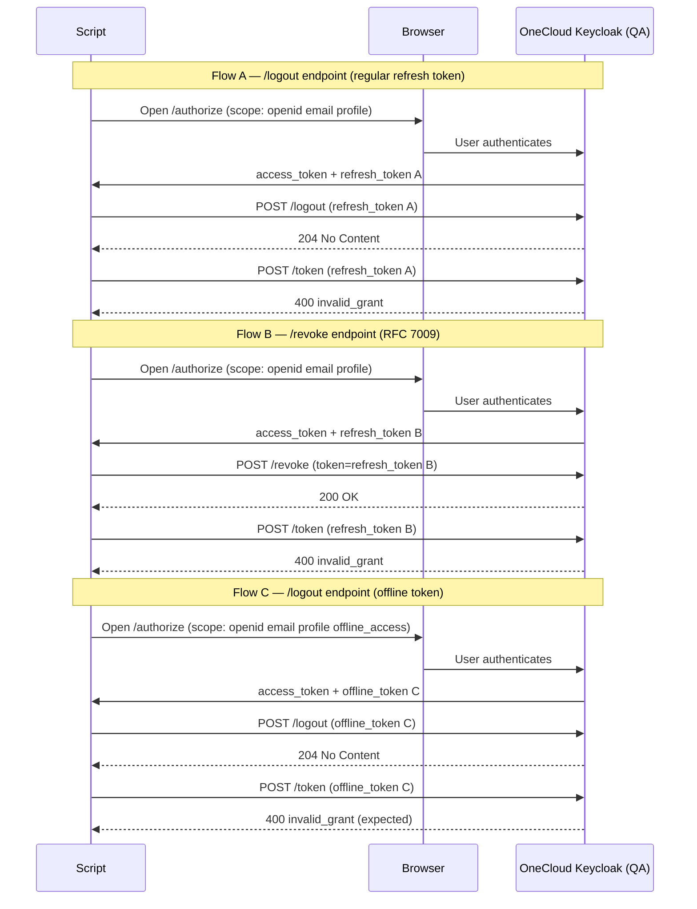

# Design: Keycloak Session Revoke PoC

## Research Question

Does Keycloak provide a working token revocation endpoint, and can UCP reliably use it so that a logout actually invalidates the session server-side?

**Jira:** [MCUCP-238 B01](https://jira.rakuten-it.com/jira/browse/MCUCP-238)

---

## Hypothesis

Keycloak exposes two token invalidation endpoints — `/logout` (end-session) and `/revoke` (RFC 7009) — both of which accept a refresh token and invalidate it server-side. After a successful call to either endpoint, the refresh token can no longer be used to obtain new access tokens.

For offline tokens (issued with `offline_access` scope), `/logout` also invalidates the token — offline tokens are not exempt from explicit revocation.

---

## Scope

**In scope:**
- Login via PKCE flow against OneCloud Keycloak (QA realm)
- Calling `/logout` with a regular refresh token and verifying revocation
- Calling `/revoke` (RFC 7009) with a regular refresh token and verifying revocation
- Calling `/logout` with an offline token (`offline_access` scope) and verifying revocation
- Comparing behavior of all three scenarios
- Verifying that the access token expires naturally (no active revocation)

**Out of scope:**
- Access token active revocation (known Keycloak limitation — not supported)
- Cross-device / Single Logout (SLO)
- Production environment testing
- UCP API Gateway integration

---

## Approach

A minimal standalone Go script in the kitchen-sink repo exercises the full login → logout → verify cycle against OneCloud Keycloak QA.

### Flow

The script runs three independent flows — each starting from a fresh login.

### Keycloak endpoints used

| Step | Endpoint |
|---|---|
| Authorize | `GET /auth/realms/roc/protocol/openid-connect/auth` |
| Token exchange | `POST /auth/realms/roc/protocol/openid-connect/token` |
| End-session logout | `POST /auth/realms/roc/protocol/openid-connect/logout` |
| RFC 7009 revoke | `POST /auth/realms/roc/protocol/openid-connect/revoke` |

**QA base:** `https://qa2-accounts-onecloud.rakuten-it.com`

---

## Success Criteria

| Criterion | Pass condition |
|---|---|
| Login completes (both flows) | Script receives `access_token` and `refresh_token` |
| `/logout` call succeeds | Keycloak returns `2xx` |
| `/revoke` call succeeds | Keycloak returns `200 OK` |
| Refresh token revoked after `/logout` | Subsequent refresh returns `400 invalid_grant` |
| Refresh token revoked after `/revoke` | Subsequent refresh returns `400 invalid_grant` |
| Offline token revoked after `/logout` | Subsequent refresh returns `400 invalid_grant` |
| Access token TTL recorded | `iat` and `exp` from the access token are printed; TTL = `exp - iat` |
| Access token behavior documented | Behavior after revocation observed and recorded |

---

## Implementation Plan

1. Branch off `kitchen-sink` main
2. Write a self-contained Go script: `keycloak-session-revoke/main.go`
3. Script runs three flows: A (`/logout`), B (`/revoke`), C (`/logout` with offline token)
4. Record all HTTP responses in `implementation.md`

---

## Risks and Open Questions

All open questions were resolved during PoC execution. See `poc-report.md` for findings.
