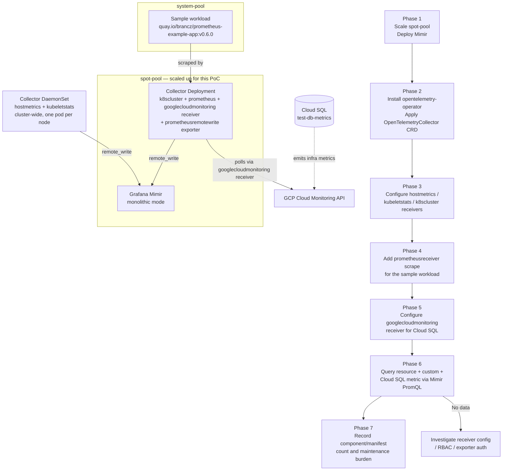

# MonaaS OTel Collector Variant — Design

Human review document. Read this before the PoC starts executing.

| | |
|---|---|
| **Ticket** | MCUCP-259 |
| **Parent research** | [System Resource Monitoring — Cloud Monitoring (GCP) vs MonaaS](../../research/system-resource-monitoring.md) |
| **Related PoC** | [Cloud Monitoring (GMP) — GKE Sandbox PoC](../cloud-monitoring.md) — the Option A counterpart; its numbers are combined with this PoC's numbers in the parent research, not within either PoC |

---

## Research Question

> What is the actual operational overhead of Option B's OTel Collector variant — measured as
> component count, manifest count, and which components require ongoing maintenance on the
> sandbox GKE cluster — for GKE resource metrics, a custom application metric, and Cloud SQL
> infra metrics?

The parent research's Analysis and Recommendation treat Option B's operational-overhead
figure as an estimate, not a measurement (see [Analysis — Push vs pull for application
metrics](../../research/system-resource-monitoring.md#analysis) and the related Open
Question). This PoC produces that measurement for Option B. Combined with the [Cloud
Monitoring (GMP) — GKE Sandbox PoC](../cloud-monitoring.md)'s Option A measurement, the parent
research document is where the two are compared and the Recommendation is finalized —
comparison is explicitly out of scope for this PoC's own report.

---

## Hypothesis

The OTel Collector variant narrows Option B's operational-overhead disadvantage compared to a
plain self-managed Prometheus stack, by consolidating `node-exporter`,
`kube-state-metrics`, and the Prometheus Operator's role into one collector binary type — but
still requires materially more manifests and more distinct components, at least one of which
needs recurring, hands-on maintenance as new metric targets are added, than Option A's
zero-deployment resource metrics and single `PodMonitoring` CRD for the custom app metric. One-time
setup duration is not part of this comparison — it is upfront effort spent once, not recurring
overhead.

---

## Scope

| Item | In scope | Out of scope |
|------|----------|--------------|
| Sandbox GKE cluster (same cluster as the Cloud Monitoring PoC) | ✅ | |
| OTel Collector deployment (`opentelemetry-operator` + `OpenTelemetryCollector` CRD) | ✅ | |
| `hostmetricsreceiver` (node-level OS metrics) | ✅ | |
| `kubeletstatsreceiver` (container/pod resource metrics) | ✅ | |
| `k8sclusterreceiver` (K8s object-state metrics — pod/deployment/node status, the OTel Collector's equivalent of `kube-state-metrics`) | ✅ | |
| `prometheusreceiver` scraping the same sample workload used in the Cloud Monitoring PoC (`quay.io/brancz/prometheus-example-app:v0.6.0` — the multi-arch build, required on GKE's amd64 node pools; the OTel Collector's built-in pull-based scraper, equivalent to what `ServiceMonitor`/`PodMonitor` drives in a Prometheus Operator setup) | ✅ | |
| Grafana Mimir, deployed in-cluster (monolithic mode) as the Cortex-compatible backend | ✅ | |
| `prometheusremotewriteexporter` from the Collector to in-cluster Mimir | ✅ | |
| PromQL query against Mimir confirming both resource and custom metrics are present | ✅ | |
| Component/manifest count, and which components require ongoing maintenance, recorded for Option B, comparable in shape to the Cloud Monitoring PoC's Option A numbers | ✅ | |
| `googlecloudmonitoringreceiver` on the Deployment Collector, pulling Cloud SQL's own infra metrics (CPU, memory, disk, connections) from the Cloud Monitoring API for the `test-db-metrics` instance | ✅ | |
| `roles/monitoring.viewer` granted to the node pools' default Compute Engine service account, for `googlecloudmonitoringreceiver` auth via ADC (Workload Identity is not enabled on this cluster — see Sandbox cluster) | ✅ | |
| Producing the Option A vs Option B comparison itself | | ✅ — written into the parent research document once both PoCs have run, not into this PoC's own report |
| Self-managed Prometheus variant (non-OTel) | | ✅ — already evidenced by RAIL's self-hosted-Prometheus migration doc cited in the parent research |
| OTel SDK push variant | | ✅ — parent research already concludes against this path (see Analysis) |
| Cloud SQL query/engine-level metrics (connections pool internals, query stats) via a DB-native exporter | | ✅ — out of scope; only Cloud SQL's own Cloud-Monitoring-emitted infra metrics are covered |
| Crossplane/Temporal-specific metrics | | ✅ — separate concern |
| Real MonaaS onboarding, ACL, or Bearer-token process | | ✅ — Mimir stand-in has no auth/ACL step to replicate; onboarding overhead is already documented as a known, separate manual burden, not something this PoC needs to reproduce |
| Cost measurement at production scale | | ✅ — sandbox traffic is not representative |

---

## Approach

### Phase 1 — Scale `spot-pool` and deploy Mimir

1. Scale `spot-pool` up from 0 nodes (see Sandbox cluster) to host this PoC's
   non-node-bound components, separate from `system-pool`'s existing workloads.
2. Deploy Grafana Mimir in monolithic mode (single binary, single replica) as a Deployment +
   Service in a dedicated namespace (e.g. `monitoring`), scheduled onto `spot-pool` via
   nodeSelector/toleration.
3. Confirm the `remote_write` push endpoint (`/api/v1/push`) and query endpoint
   (`/prometheus/api/v1/query`) are reachable in-cluster.

### Phase 2 — Install the OTel Collector operator

1. Install `cert-manager` if not already present on the sandbox cluster (a stated prerequisite
   of `opentelemetry-operator`) and record this as a setup step, not a failure.
2. Install `opentelemetry-operator` and apply two `OpenTelemetryCollector` CRDs:
   - a **DaemonSet**-mode Collector (host/kubelet metrics), scheduled cluster-wide (no
     `nodeSelector`, tolerations for every node pool's taints) — these receivers are
     inherently node-local, so one pod per node is required regardless of which pool a node
     belongs to.
   - a **Deployment**-mode Collector (cluster-level + app-metric scraping + remote-write),
     scheduled on `spot-pool` since it only needs pod-network reachability to the API server
     and the sample workload, not node locality.

### Phase 3 — Configure resource-metric receivers (DaemonSet Collector, cluster-wide)

1. Configure `hostmetricsreceiver` for node-level OS metrics (CPU, memory, disk, network).
2. Configure `kubeletstatsreceiver` for container/pod resource metrics.
3. Confirm the Collector's own status/logs show no scrape/permission errors (RBAC for
   `nodes/proxy`, `nodes/metrics`).

### Phase 4 — Configure cluster and app-metric receivers (Deployment Collector, `spot-pool`)

1. Configure `k8sclusterreceiver` for K8s object-state metrics (requires K8s API read RBAC).
2. Deploy the same sample workload used in the Cloud Monitoring PoC
   (`quay.io/brancz/prometheus-example-app:v0.6.0` — the multi-arch build; earlier tags
   including `v0.5.0` are arm64-only and fail with `exec format error` on GKE's amd64 node
   pools; exposes `/metrics` on port 8080) on `system-pool` via `nodeSelector`.
3. Add a `prometheusreceiver` scrape target for it, and a `prometheusremotewriteexporter`
   pointed at the in-cluster Mimir Service.

### Phase 5 — Configure the Cloud SQL metrics receiver (Deployment Collector)

1. Grant `roles/monitoring.viewer` on `sub-gcp-ucp-clsd-sandbox` to the node pools' default
   Compute Engine service account, since Workload Identity is not enabled on this cluster —
   the Collector authenticates via Application Default Credentials using this node-level
   identity, not a per-workload GSA binding.
2. Configure `googlecloudmonitoringreceiver` on the Deployment Collector, filtered to the
   `test-db-metrics` Cloud SQL instance's metric types (e.g.
   `cloudsql.googleapis.com/database/cpu/utilization`,
   `cloudsql.googleapis.com/database/memory/utilization`,
   `cloudsql.googleapis.com/database/disk/utilization`).
3. Confirm the Collector's logs show no permission or API errors polling the Cloud Monitoring
   API.

### Phase 6 — Query the metrics

1. Query Mimir via PromQL (or a temporary Grafana instance pointed at Mimir) for a node/pod
   resource metric, the sample workload's `http_requests_total` counter, and a Cloud SQL infra
   metric, confirming all three are present.

### Phase 7 — Record

1. Record: number of distinct manifests applied, number of distinct software components
   deployed (matching the parent research's Components table categories), and which of those
   components require recurring, hands-on maintenance as new metric targets are added — this
   matters more than one-time setup duration, since more components mean more things to
   maintain and more things that can go wrong. One-time setup duration is not recorded as a
   comparison metric.
2. Hand these numbers to the parent research document, where they are compared against the
   Cloud Monitoring PoC's Option A numbers for the same metric categories.

---

## Success Criteria

| Criterion | Pass condition |
|-----------|---------------|
| OTel Collector operational | Both Collector deployments (DaemonSet and Deployment) running with no scrape/permission errors |
| Resource metrics queryable | Node/pod resource metric visible via Mimir PromQL, sourced only from the OTel Collector (no GMP involved) |
| Custom app metric queryable | Sample workload's counter metric visible via Mimir PromQL, sourced only from the OTel Collector |
| Cloud SQL metric queryable | A `test-db-metrics` infra metric (e.g. CPU utilization) visible via Mimir PromQL, sourced via `googlecloudmonitoringreceiver` |
| Overhead measured, not estimated | Component count, manifest count, and which components require ongoing maintenance recorded for Option B, in a form directly comparable to the existing Cloud Monitoring PoC's Option A numbers |

---

## Risks

| Risk | Mitigation / fallback |
|------|---------------------|
| `opentelemetry-operator` requires `cert-manager`, adding a component not present in Option A | Record `cert-manager` as part of Option B's measured component and manifest count — this is itself a data point, not something to work around |
| `hostmetricsreceiver`/`kubeletstatsreceiver` need `hostNetwork`/`hostPath` or elevated RBAC not needed by GMP's managed collector | Budget time for RBAC troubleshooting; record any additional permission manifests in the component count |
| DaemonSet Collector runs cluster-wide, adding real resource pressure to every node pool — `system-pool` is already at 37–72% CPU / 47–70% memory allocatable | This is intentional and expected — Option B's real-world DaemonSet would face the same pressure in production on every pool; if it doesn't fit, that is itself a finding for the comparison, not a PoC failure to route around |
| Mimir's monolithic mode behaves differently under load than MonaaS's actual distributed Cortex | Acceptable for this PoC — the measurement target is tenant-side setup overhead, not backend query performance at scale |
| Receiver/exporter version mismatches between `opentelemetry-operator`'s bundled Collector image and the specific receivers named in this design | Use the OTel Collector Contrib distribution, which bundles all receivers named here; note the specific image tag used in `implementation.md` |
| `googlecloudmonitoringreceiver` requires GCP IAM setup (`roles/monitoring.viewer`) not needed by the other receivers | Record the IAM binding as a real setup step in Option B's measured manifest count, not something to work around |
| Cloud SQL metrics only become visible in Cloud Monitoring after a short ingestion delay (separate from the Collector's own scrape interval) | Acceptable for this PoC; record the actual observed delay in `implementation.md` rather than treating an initial empty query as a failure |
| `googlecloudmonitoringreceiver` emits no resource label identifying which Cloud SQL instance a metric came from — with 2+ instances (e.g. platform DB and Temporal DB, each active/standby), same-named metrics from different instances collide into one series | Not resolved in this PoC (only one instance exists in the sandbox project); requires further exploration — see Open Questions |

---

## Sandbox cluster

| | |
|---|---|
| **Project** | `sub-gcp-ucp-clsd-sandbox` |
| **Cluster** | `ucp-agent-cluster` (region `asia-northeast1`, GKE `1.35.7-gke.1027000`) |
| **Node pools** | `system-pool` (e2-small, 3 nodes running) and `spot-pool` (n2-standard-2, 0 nodes running) |
| **GMP** | Already enabled (`managedPrometheusConfig.enabled: true`); `collector` DaemonSet and `gmp-operator` already running in `gmp-system` |
| **cert-manager** | Not installed — required by `opentelemetry-operator`; counts as a real setup step for Option B |
| **Cloud SQL instance** | `test-db-metrics` — PostgreSQL, `asia-northeast1`, provisioned in `sub-gcp-ucp-clsd-sandbox` to produce Cloud SQL infra metrics via Cloud Monitoring |
| **Workload Identity** | Not enabled on this cluster. Both node pools run under the default Compute Engine service account with the `cloud-platform` OAuth scope; `googlecloudmonitoringreceiver` authenticates via Application Default Credentials using that node-level identity |

`system-pool` already runs other workloads (an `arc-runners`/`arc-systems` GitHub Actions
runner setup, unrelated to this PoC) at 37–72% CPU and 47–70% memory allocatable per node, on
top of GMP's own collector. The sample workload stays on `system-pool`. The DaemonSet-mode
Collector (host/kubelet receivers) runs cluster-wide — one pod per node across every pool —
since `hostmetricsreceiver` and `kubeletstatsreceiver` are node-local by nature and a real
deployment has no node pool without workloads worth observing. The Deployment-mode Collector
(cluster/app-metric receivers) and Mimir go to `spot-pool` instead, since neither needs node
locality and this keeps them off `system-pool`'s already-tight capacity — `spot-pool` requires
scaling up from its current 0 nodes as part of Phase 1.

## Open Questions

- How should `googlecloudmonitoringreceiver` output be disambiguated per Cloud SQL instance for
  production topologies with 2+ instances (platform DB and Temporal DB, each active/standby)?
  Candidate directions include a separate Collector pipeline per instance with a static
  resource-label injected via a processor, or querying Cloud Monitoring directly for Cloud SQL
  metrics instead of routing them through the Collector. Neither was tested in this PoC —
  requires further exploration.
