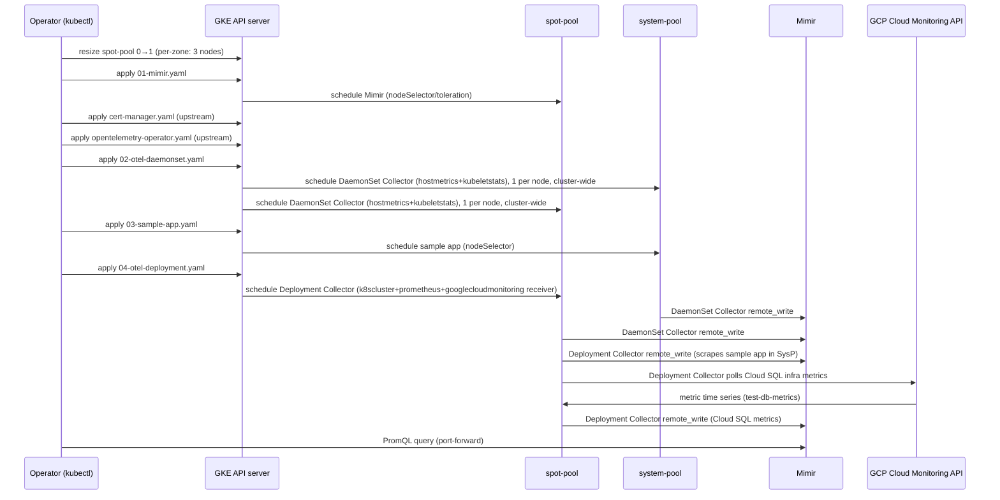
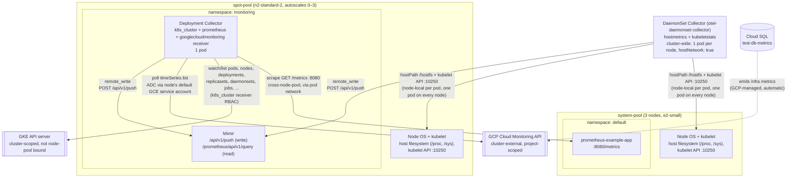
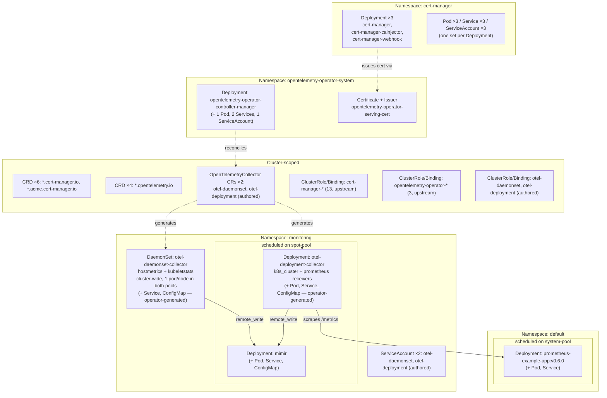

# MonaaS OTel Collector Variant — Implementation

Supporting proof document. See [design.md](design.md) for scope and [poc-report.md](poc-report.md)
for the verdict.

## Source Code

- Repository: `kitchen-sink` (`aripermana-putra/kitchen-sink`, local path
  `monaas-otel-collector-poc/`)
- Authored manifests: `monaas-otel-collector-poc/deploy/k8s/`
- Vendored upstream manifests: `monaas-otel-collector-poc/deploy/upstream/`
  (downloaded from the URLs below and applied as-is; vendored for reproducibility rather than
  depending on the release URLs staying available)
  - `cert-manager-v1.21.1.yaml` ← <https://github.com/cert-manager/cert-manager/releases/download/v1.21.1/cert-manager.yaml>
  - `opentelemetry-operator-v0.158.0.yaml` ← <https://github.com/open-telemetry/opentelemetry-operator/releases/download/v0.158.0/opentelemetry-operator.yaml>
- Commit: `9fae449843a38ab2ba6e3f14f97000e28729f67b`

## Sandbox cluster

| | |
|---|---|
| Project | `sub-gcp-ucp-clsd-sandbox` |
| Cluster | `ucp-agent-cluster` (region `asia-northeast1`, GKE `1.35.7-gke.1027000`) |
| `system-pool` | e2-small, 3 nodes (pre-existing), amd64 |
| `spot-pool` | n2-standard-2, scaled from 0 to 3 via `gcloud container clusters resize --node-pool=spot-pool --num-nodes=1` — regional cluster resize is per-zone (1 × 3 zones), not per-cluster; autoscales 0–3 and later settled at 1 node under low load |
| Cloud SQL instance | `test-db-metrics` (PostgreSQL 18, `asia-northeast1`, single zone, no automated backup/PITR) |
| Workload Identity | Not enabled on this cluster. `googlecloudmonitoringreceiver` authenticates via the node pools' default Compute Engine service account (`serviceAccount: default`, `cloud-platform` OAuth scope), granted `roles/monitoring.viewer` at the project level — every pod on every node pool inherits this read-only Cloud Monitoring access via ADC, not just the Collector |

## Sequence



## Metrics collection architecture

Runtime data-plane view: only the components that participate in collecting or receiving
metrics, grouped by node pool then namespace. `cert-manager` and `opentelemetry-operator`
are omitted here — they are one-time setup components (see
[Object inventory](#object-inventory-live-cluster-state) below for the full object list
including those).



`DSCOL` is drawn once above both pools because it is a single Kubernetes object (one
`OpenTelemetryCollector` CR, one generated `DaemonSet`) whose Pods land on every node in the
cluster regardless of pool — there is no per-pool copy of it.

Three things stand out in this shape:

- **The DaemonSet Collector never leaves its own node for scraping** — `hostmetrics` and
  `kubeletstats` both read from the node the Collector pod itself runs on (`hostPath` mount,
  kubelet API on the node's own address), so the only outbound network call any of its pods
  makes is the `remote_write` to Mimir on `spot-pool`.
- **Per-node identity is not automatic** — `hostmetricsreceiver` sets no resource attributes
  of its own, so without a `resourcedetection` processor added to the pipeline, every pod's
  metrics carry an identical label set and collide into a single Prometheus series in Mimir
  regardless of which node sent them (see [Verification](#verification)). The `resourcedetection`
  processor (`gcp`, `env` detectors) and `resource_to_telemetry_conversion: enabled: true` on
  the exporter are both required to make per-node data distinguishable.
- **The Deployment Collector is the only component that crosses node-pool boundaries at
  scrape time** — it runs on `spot-pool` but scrapes `prometheus-example-app` on
  `system-pool` over the in-cluster pod network (via the app's `Service`), and separately
  calls the GKE API server (cluster-scoped, not tied to either pool) for `k8s_cluster`
  receiver data.
- **Cloud SQL metrics never touch the database directly** — `googlecloudmonitoringreceiver`
  polls the GCP Cloud Monitoring API for metrics Cloud SQL already emits automatically, using
  the identity available to the pod via ADC (here, the node pools' default Compute Engine
  service account, since Workload Identity is not enabled on this cluster). No credentials or
  network path to `test-db-metrics` itself are required.

## What was built

| Step | Manifest / command | Notes |
|------|--------------------|-------|
| Scale `spot-pool` | `gcloud container clusters resize --node-pool=spot-pool --num-nodes=1` | Landed as 3 nodes (regional cluster, 1 per zone) |
| Mimir (monolithic mode) | `deploy/k8s/01-mimir.yaml` | `Namespace`, `ConfigMap`, `Deployment`, `Service` in `monitoring`; scheduled on `spot-pool` via `nodeSelector`/`toleration` on the `workload=spot` taint |
| `cert-manager` v1.21.1 | upstream `cert-manager-v1.21.1.yaml` (47 objects) | Prerequisite for `opentelemetry-operator`'s webhook certs; not present on the sandbox cluster beforehand |
| `opentelemetry-operator` v0.158.0 | upstream `opentelemetry-operator-v0.158.0.yaml` (20 objects) | Installs the `OpenTelemetryCollector` CRD and its controller |
| DaemonSet-mode Collector | `deploy/k8s/02-otel-daemonset.yaml` | `ServiceAccount` + `ClusterRole`/`ClusterRoleBinding` (RBAC for `nodes`, `nodes/proxy`, `nodes/metrics`, `nodes/stats`) + `OpenTelemetryCollector` CR (`mode: daemonset`), cluster-wide (no `nodeSelector`; `toleration` for `workload=spot:NoSchedule` so it also lands on `spot-pool`), `hostNetwork: true`, `hostPath` mount for `hostmetrics`, `resourcedetection` processor (`gcp`, `env` detectors) + `resource_to_telemetry_conversion: enabled: true` on the exporter — both required for per-node metric identity |
| Sample workload | `deploy/k8s/03-sample-app.yaml` | `quay.io/brancz/prometheus-example-app:v0.6.0`, `Deployment` + `Service`, `nodeSelector: cloud.google.com/gke-nodepool=system-pool` |
| Deployment-mode Collector | `deploy/k8s/04-otel-deployment.yaml` | `ServiceAccount` + `ClusterRole`/`ClusterRoleBinding` (RBAC for `k8s_cluster` receiver: pods, nodes, namespaces, replicasets, deployments, daemonsets, statefulsets, jobs, cronjobs, HPAs) + `OpenTelemetryCollector` CR (`mode: deployment`), scheduled on `spot-pool`; also carries the `googlecloudmonitoring` receiver (`project_id: sub-gcp-ucp-clsd-sandbox`, `collection_interval: 60s`, `metrics_list` naming three `cloudsql.googleapis.com/database/*` metric types) |
| Cloud SQL metrics IAM binding | `gcloud projects add-iam-policy-binding sub-gcp-ucp-clsd-sandbox --member="serviceAccount:1085518235493-compute@developer.gserviceaccount.com" --role="roles/monitoring.viewer"` | GCP-level, not a Kubernetes object — grants the node pools' default Compute Engine service account read access to Cloud Monitoring; no Workload Identity binding, since Workload Identity is not enabled on this cluster |

Image: both Collectors use `otel/opentelemetry-collector-contrib:0.159.0` (core distribution
does not bundle `hostmetrics`, `kubeletstats`, `k8s_cluster`, or `prometheus_remote_write`).

## Object inventory (live cluster state)

The 6 applied manifests (2 upstream, 4 authored) contain 81 Kubernetes objects directly
(47 from `cert-manager-v1.21.1.yaml`, 20 from `opentelemetry-operator-v0.158.0.yaml`, 14
authored — counted via `kubectl apply --dry-run=client -o name | wc -l` per manifest). This
expands further once the `cert-manager` and `opentelemetry-operator` controllers and the
`OpenTelemetryCollector` CR reconciler run — the Deployment/DaemonSet/ConfigMap/Service backing
each Collector CR are generated by `opentelemetry-operator`, not hand-authored (see the full
object list by namespace below for those generated objects). The Cloud SQL metrics IAM binding
is a GCP project-level IAM policy change, not a Kubernetes object — it does not add to this
count.



### Full object list by namespace

**`cert-manager`** (upstream, prerequisite)

| Kind | Name |
|---|---|
| Deployment | `cert-manager`, `cert-manager-cainjector`, `cert-manager-webhook` |
| Pod | one per Deployment above (3) |
| Service | `cert-manager`, `cert-manager-cainjector`, `cert-manager-webhook` |
| ServiceAccount | `cert-manager`, `cert-manager-cainjector`, `cert-manager-webhook` |

**`opentelemetry-operator-system`** (upstream, the operator)

| Kind | Name |
|---|---|
| Deployment | `opentelemetry-operator-controller-manager` |
| Pod | `opentelemetry-operator-controller-manager-<hash>` |
| Service | `opentelemetry-operator-controller-manager-metrics-service`, `opentelemetry-operator-webhook-service` |
| ServiceAccount | `opentelemetry-operator-controller-manager` |
| Certificate (`cert-manager.io`) | `opentelemetry-operator-serving-cert` |
| Issuer (`cert-manager.io`) | `opentelemetry-operator-selfsigned-issuer` |

**`monitoring`** (authored — this PoC's own namespace)

| Kind | Name | Origin |
|---|---|---|
| Deployment | `mimir` | authored |
| ConfigMap | `mimir-config` | authored |
| Deployment | `otel-deployment-collector` | generated by operator from the `otel-deployment` CR |
| DaemonSet | `otel-daemonset-collector` | generated by operator from the `otel-daemonset` CR |
| ConfigMap | `otel-daemonset-collector-<hash>`, `otel-deployment-collector-<hash>` | generated by operator (holds the rendered Collector YAML config) |
| Pod | `mimir-<hash>` (1), `otel-daemonset-collector-<hash>` (1/node, cluster-wide across `system-pool` + `spot-pool` — 4 at time of writing, `spot-pool` autoscales 0–3), `otel-deployment-collector-<hash>` (1) | generated |
| Service | `mimir`, `otel-daemonset-collector-monitoring`, `otel-deployment-collector-monitoring` | authored (`mimir`) / generated (Collectors) |
| ServiceAccount | `otel-daemonset`, `otel-deployment` | authored |

**`default`** (the observed workload — not part of the monitoring stack itself)

| Kind | Name |
|---|---|
| Deployment | `prometheus-example-app` |
| Pod | `prometheus-example-app-<hash>` |
| Service | `prometheus-example-app` |

**Cluster-scoped**

| Kind | Name | Origin |
|---|---|---|
| CustomResourceDefinition | `certificaterequests`, `certificates`, `challenges`, `clusterissuers`, `issuers`, `orders` (all `.cert-manager.io`/`.acme.cert-manager.io`) | upstream `cert-manager` install |
| CustomResourceDefinition | `instrumentations`, `opampbridges`, `opentelemetrycollectors`, `targetallocators` (all `.opentelemetry.io`) | upstream `opentelemetry-operator` install |
| OpenTelemetryCollector (custom resource) | `otel-daemonset`, `otel-deployment` | authored |
| ClusterRole / ClusterRoleBinding | 13 `cert-manager-*` pairs | upstream |
| ClusterRole / ClusterRoleBinding | 3 `opentelemetry-operator-*` pairs | upstream |
| ClusterRole / ClusterRoleBinding | `otel-daemonset`, `otel-deployment` | authored (RBAC for `nodes*` and `k8s_cluster` receiver resource types respectively) |

## Gotcha: sample workload image architecture

`quay.io/brancz/prometheus-example-app:v0.5.0` — the tag referenced generically in early design
drafts — is arm64-only. It fails with `exec format error` on GKE's amd64 node pools, including
`bin/prometheus-example-app` itself (not just shell tools inside the container). `v0.6.0` is a
multi-arch build (amd64, arm64, arm/v7) and is the tag pinned in
[design.md](design.md) and the sibling [Cloud Monitoring PoC's design.md](../cloud-monitoring/design.md).

## Verification

**DaemonSet Collector** — cluster-wide, one pod per node in both `system-pool` and `spot-pool`
(4/4 `Running` at time of writing), no RBAC/scrape errors in logs (only harmless
component-alias deprecation warnings from `contrib:0.159.0` — e.g. `"hostmetrics" alias is
deprecated; use "host_metrics" instead`). Log ends with `Everything is ready. Begin running
and processing data.`

Confirmed distinguishable per node in Mimir, not just running: `system_cpu_logical_count`
(a `hostmetricsreceiver` metric) resolves to one distinct series per node, each carrying a
`host_name` label matching a real node name in either pool. `k8s_node_name` (a
`kubeletstatsreceiver` label) independently confirms the same 4 nodes. This distinctness
depends on the `resourcedetection` processor and `resource_to_telemetry_conversion: enabled:
true` — `hostmetricsreceiver` sets no resource attributes of its own, so without both, every
pod's data collides into one identical, unlabeled series regardless of node or pool.

**Deployment Collector** — 1/1 `Running` on `spot-pool`, no errors in logs.
`googlecloudmonitoringreceiver` logs `Monitoring client successfully created` and `Successfully
retrieved all metric descriptors` on startup — no permission-denied errors, confirming the
node's default Compute Engine service account has sufficient access via ADC.

**Cloud SQL metrics** — all three configured metric types resolve to a single series each in
Mimir (`test-db-metrics` is the only Cloud SQL instance in the project, so there is no
per-instance collision risk here): `cloudsql_googleapis_com_database_cpu_utilization` (~0.098),
`cloudsql_googleapis_com_database_memory_utilization` (~0.255),
`cloudsql_googleapis_com_database_disk_utilization` (~0.010). None of the three carry a
resource label identifying which Cloud SQL instance produced them — `resource_to_telemetry_conversion`
is not set on this exporter — so with more than one Cloud SQL instance in the project, their
metrics would collide into the same unlabeled series, the same failure mode already documented
for the DaemonSet Collector's `hostmetricsreceiver` above.

**Sample workload** — confirmed serving `/metrics` after a request to `/`:
```
# HELP http_requests_total Count of all HTTP requests
# TYPE http_requests_total counter
http_requests_total{code="200",method="get"} 1
```

**Mimir** — `/ready` returns `ready` (after the documented ~15s ingester startup grace period);
`/api/v1/push` returns `400` (route exists, expects a valid remote_write protobuf body) rather
than `404`, confirming the push endpoint is reachable in-cluster.

**PromQL query results** — see [poc-report.md](poc-report.md) for the full query outputs
confirming all five receivers' metrics are queryable in Mimir.

## Wall-clock time

Derived from Kubernetes object `creationTimestamp`s, not a manual stopwatch:

| Event | Timestamp (UTC) |
|-------|-----------------|
| `spot-pool` resize issued | 07:12:18 |
| Mimir `Deployment` created | 07:15:43 |
| `cert-manager` namespace created | 07:26:34 |
| `opentelemetry-operator` namespace created | 07:27:13 |
| DaemonSet Collector CR created | 07:29:22 |
| Sample app `Deployment` created | 07:30:32 |
| Deployment Collector CR created | 07:30:33 |

From "cluster with nothing added" to "both metric categories queryable": **~19 minutes**
(07:12–07:31, plus the PromQL verification queries that followed immediately after).

This measurement covers `hostmetricsreceiver`, `kubeletstatsreceiver`, `k8sclusterreceiver`,
and `prometheusreceiver` only. Cloud SQL metrics via `googlecloudmonitoringreceiver` are not
included in this figure — see [Sandbox cluster](#sandbox-cluster) for the IAM setup step they
require, and [Object inventory](#object-inventory-live-cluster-state) for why that step does
not add to the Kubernetes object count.
