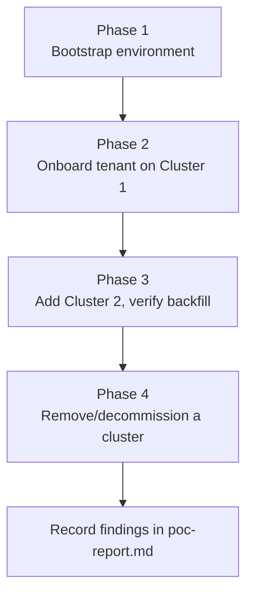

# Multi-Cluster ProviderConfig Sync — Design

Human review document. Read this before the PoC starts executing.

| | |
|---|---|
| **Ticket** | [MCUCP-306](https://jira.rakuten-it.com/jira/browse/MCUCP-306) |
| **Parent research** | [Multi-Cluster ProviderConfig Sync via GCP Secret Manager](../../research/multi-cluster-provider-config-sync.md) |

---

## Research Question

> Does a GitOps pull model (ArgoCD `ApplicationSet` matrix generator) correctly and automatically extend `ExternalSecret` + `ProviderConfig` pairs to a newly added Crossplane cluster, without a new commit or a new UCP backend code path?

---

## Hypothesis

A single Helm chart rendering `ExternalSecret` + `ProviderConfig`, fanned out by an ArgoCD `ApplicationSet` matrix generator (cluster generator × tenant registry generator), backfills an existing tenant's manifests onto a newly registered cluster automatically. The only actions required when a cluster is added are registering it with ArgoCD and running the platform bootstrap `ApplicationSet` (ESO + `ClusterSecretStore` install) — no changes to the tenant registry, no new commits, no UCP backend involvement.

Credential-format decisions (WIF for GCP, OAuth2 for ROC) are already validated in the [WIF PoC](../wif-gcp.md) and are inputs here, not re-derived.

---

## Scope

| Item | In scope | Out of scope |
|---|---|---|
| Local multi-cluster environment via Colima | ✅ | |
| ArgoCD running in its own dedicated cluster | ✅ | |
| 2 Crossplane clusters, starting with 1 and adding a 2nd mid-PoC | ✅ | |
| GCP Secret Manager in UCP's GCP sandbox project | ✅ | |
| ESO installed per Crossplane cluster via ArgoCD, using WIF for its own GCP Secret Manager access | ✅ | |
| Provider-config Helm chart (`ExternalSecret` + `ProviderConfig`) | ✅ | |
| Matrix `ApplicationSet` (cluster generator × tenant registry generator) | ✅ | |
| Private GitHub repo (personal account) as manifest source + tenant registry | ✅ | |
| GCP provider-config registration path | ✅ | |
| ROC provider-config registration path | | ✅ — GCP path is sufficient to validate the sync mechanism |
| UCP backend integration (real tenant registration flow) | | ✅ — registry writes are simulated manually or via script |
| Production ArgoCD topology (HA, sharding, dedicated hub cluster in real infra) | | ✅ — PoC uses a single-instance ArgoCD in a local cluster, not a production recommendation |
| Eager vs. lazy creation trade-off | | ✅ — separate open question in the research doc, not this PoC's concern |
| GKE / non-local clusters | | ✅ — Colima-hosted local clusters only |

---

## Approach

### Environment

- **Colima** hosts three local Kubernetes clusters (via k3d or kind): one ArgoCD hub, two Crossplane Ops clusters (Cluster 2 created partway through the PoC, not at the start).
- **ArgoCD** runs in its own dedicated cluster — not colocated with either Crossplane cluster — to mirror a hub-and-spoke topology rather than a PoC-only simplification.
- **GCP Secret Manager** — UCP's GCP sandbox project, one secret per provider-config registration.
- **Git repo** — a private repository under the operator's personal GitHub account, holding the provider-config Helm chart and the tenant registry (parameter files only, no credential material).

### Phase 1 — Bootstrap

1. Create the ArgoCD hub cluster and Cluster 1 in Colima.
2. Install ArgoCD in the hub cluster.
3. Register Cluster 1 with ArgoCD as a target cluster.
4. Create the private Git repo: provider-config Helm chart, empty tenant registry, platform bootstrap `ApplicationSet` (ESO + `ClusterSecretStore`, cluster-generator-only), and the matrix `ApplicationSet` (cluster generator × tenant registry generator).
5. Confirm the platform bootstrap `ApplicationSet` installs ESO + `ClusterSecretStore` on Cluster 1, and the matrix `ApplicationSet` renders zero `Application` objects with an empty registry.
6. Grant ESO's K8s ServiceAccount on Cluster 1 a WIF-bound identity with `secretmanager.versions.access` on the sandbox project's relevant secrets.

### Phase 2 — Onboard a tenant on Cluster 1

1. Create a GCP Secret Manager secret holding a simulated registration (SA email + GCP project ID).
2. Commit a parameter file for that registration to the tenant registry.
3. Confirm ArgoCD's matrix `ApplicationSet` detects the new registry entry and creates an `Application` for (registration, Cluster 1).
4. Confirm the rendered `ExternalSecret` pulls the secret via ESO and materializes a K8s `Secret`, and the rendered `ProviderConfig` references it correctly.

### Phase 3 — Add Cluster 2, verify automatic backfill

1. Create Cluster 2 in Colima and register it with ArgoCD.
2. Confirm the platform bootstrap `ApplicationSet` installs ESO + `ClusterSecretStore` on Cluster 2, and its WIF-bound identity is granted access.
3. **Without any new commit or registry change**, confirm the matrix `ApplicationSet` re-evaluates its cluster generator output and creates an `Application` for the existing registration on Cluster 2.
4. Confirm the same `ExternalSecret` + `ProviderConfig` pair materializes correctly on Cluster 2.
5. Register a second provider-config (e.g. a second GCP project for the same simulated tenant) and confirm it fans out to both clusters without per-cluster handling.

### Phase 4 — Decommission a cluster

1. Deregister Cluster 2 from ArgoCD (or delete it).
2. Observe what the matrix `ApplicationSet` does with the now-orphaned `Application` objects for Cluster 2 — this behavior feeds the "cleanup semantics" open question in the research doc rather than being solved by this PoC.

---

## Success Criteria

| Criterion | Pass condition |
|---|---|
| Zero-registry bootstrap renders no `Application` objects | Confirmed on hub cluster after Phase 1 |
| Tenant onboarding creates working `ExternalSecret` + `ProviderConfig` on Cluster 1 | K8s `Secret` materializes with the correct value; `ProviderConfig` is `Ready` |
| Cluster 2 backfill requires no new commit | Existing registry entries render onto Cluster 2 automatically after registration, with no Git write |
| Multiple registrations per tenant fan out independently | Two provider-config registrations for the same tenant each produce their own `ExternalSecret` + `ProviderConfig` per cluster |
| ESO uses WIF, not stored credentials, for its own Secret Manager access | Confirmed via ESO pod's ServiceAccount / no static key present |
| Cluster decommission behavior is observed and documented | Matrix `ApplicationSet`'s handling of orphaned `Application` objects recorded, even if the answer is "manual cleanup required" |

---

## Risks

| Risk | Mitigation / fallback |
|---|---|
| Local cluster's OIDC issuer unreachable by GCP STS for WIF (same issue as the [WIF PoC](../wif-gcp.md)) | Reuse the WIF PoC's GCS-hosted JWKS workaround |
| ArgoCD matrix generator behavior with an empty generator input is unclear before testing | Verify empty-registry behavior explicitly in Phase 1 before adding any registration |
| Colima resource limits with 3 clusters running concurrently | Scale down non-essential workloads per cluster; k3d/kind clusters are lightweight relative to full K8s |
| Private GitHub repo access from ArgoCD requires a scoped credential (PAT or deploy key) | Use a fine-grained PAT scoped to the single repo, stored as an ArgoCD repo credential |
| GCP sandbox project IAM permissions insufficient for creating WIF pools/providers or Secret Manager secrets | Confirm required IAM roles before Phase 1 starts |

---

## Open Questions

Carried from the parent research document, not resolved by this PoC's scope — see [Open Questions](../../research/multi-cluster-provider-config-sync.md#open-questions) for the full list:

- Cleanup semantics on cluster decommission (Phase 4 produces an observation, not a resolution)
- `ClusterSecretStore` vs. per-namespace `SecretStore` fit for UCP's tenant-isolation model
- GCP Secret Manager IAM scoping strategy (project-wide vs. per-secret conditional IAM)
- Whether UCP backend should write registry entries via a Git provider API directly vs. commit-and-poll
