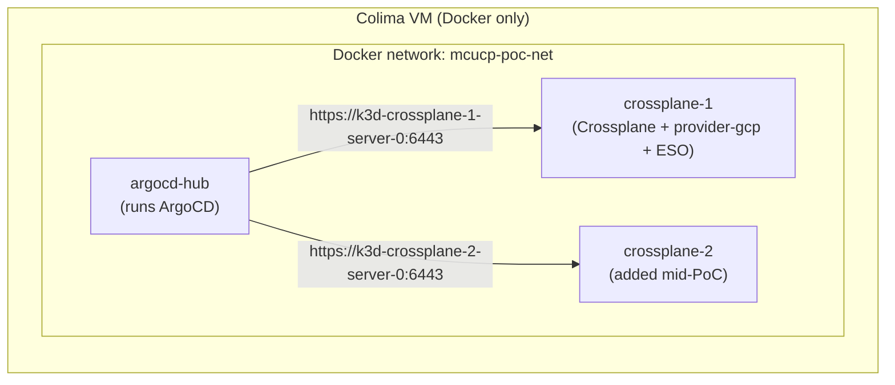
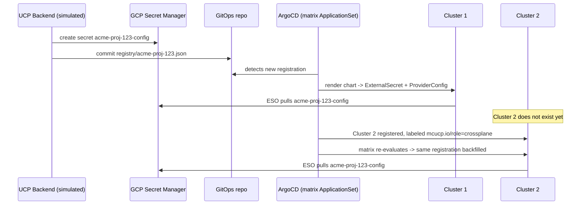

# Multi-Cluster ProviderConfig Sync PoC — Implementation

What was built, run, and observed. For background, see [design.md](./design.md).

---

## Environment

| Component | Value |
|---|---|
| Cluster runtime | k3d (k3s in Docker), 3 clusters on one shared Docker network, inside one Colima VM |
| ArgoCD version | stable (installed from the upstream `install.yaml`) |
| ESO (External Secrets Operator) version | 0.10.4 (Helm chart) |
| Crossplane version | 2.4.2 |
| provider-family-gcp version | v2.6.0 |
| GCP sandbox project | `sub-gcp-ucp-clsd-sandbox` |
| GitOps repo | `github.com/clsd-ucp/mcucp-306-provider-config-gitops` |
| Reproduction scripts | `multi-cluster-provider-config-sync-poc/scripts/` in the `kitchen-sink` repo |

Three k3d clusters share one Docker network so their API servers are reachable
from each other by container name (`k3d-<cluster>-server-0`), without any VM
networking involved:



---

## Cluster registration

ArgoCD's own `cluster add` CLI flow determines the target server address from the
kubeconfig, which for a k3d cluster is a host-only address unreachable from
ArgoCD's own pod. Cluster registration instead creates an `argocd-manager`
ServiceAccount and a long-lived bearer token directly on the target cluster, then
creates the ArgoCD cluster `Secret` on the hub with the Docker-network-resolvable
server address and `tlsClientConfig.insecure: true` (the target cluster's TLS
certificate has no SAN for that hostname). Each registered cluster carries the
label `mcucp.io/role: crossplane`, which scopes every `ApplicationSet`'s cluster
generator to real Crossplane clusters and excludes ArgoCD's own built-in
`in-cluster` entry.

---

## GitOps structure

The GitOps repo holds three things:

- `chart/` — one Helm chart rendering `ExternalSecret` + `ProviderConfig`
  (`external-secrets.io/v1beta1`, `gcp.upbound.io/v1beta1`) for one provider-config
  registration.
- `gitops/platform/` — an `ApplicationSet` installing ESO on every labeled cluster,
  and another installing the shared `ClusterSecretStore` manifest.
- `gitops/tenant-matrix-appset.yaml` — the matrix `ApplicationSet`: cluster
  generator (labeled clusters) × git generator (`registry/*.json`), rendering the
  chart once per (registration, cluster) combination.
- `registry/` — one JSON parameter file per provider-config registration
  (tenant, registration ID, GCP project ID, Secret Manager secret name). No
  credential material — GCP project ID is the one field here that also happens
  to be a literal, non-secret `ProviderConfig.spec` field (Crossplane has no way
  to source `projectID` from a Secret), not a copy of anything inside the
  secret payload.



---

## ESO's own GCP Secret Manager credential

ESO's `ClusterSecretStore` needs its own GCP credential to call Secret Manager,
independent of whatever credential a tenant's `ProviderConfig` authenticates
with. `workloadIdentity` auth mode (GKE Workload Identity, metadata-server-based)
requires a real GKE node — k3d clusters have no such metadata server. The
`ClusterSecretStore` in this PoC uses `secretRef` auth mode instead: a GCP
service account key (`mcucp-306-eso-poc`, granted `roles/secretmanager.secretAccessor`
on the sandbox project) stored as a K8s `Secret` on each cluster. This mirrors the
non-GKE finding already recorded for Crossplane's own provider pod in the
[wif-gcp PoC](../wif-gcp/poc-report.md) — production runs on GKE, where
`workloadIdentity` auth applies normally to both ESO and the provider pod.

---

## What the Secret Manager secret actually holds

The Secret Manager value is not a flat set of fields — it is the real
`external_account` credential config JSON that WIF's `Secret` + `external_account`
credential source consumes, the same shape validated end-to-end in the
[wif-gcp PoC](../wif-gcp/implementation.md) (Step 4, "Test Approach A: `Secret` with `external_account` JSON"):

```json
{
  "type": "external_account",
  "audience": "//iam.googleapis.com/projects/<PROJECT_NUMBER>/locations/global/workloadIdentityPools/<POOL_ID>/providers/<PROVIDER_ID>",
  "subject_token_type": "urn:ietf:params:oauth:token-type:jwt",
  "token_url": "https://sts.googleapis.com/v1/token",
  "service_account_impersonation_url": "https://iamcredentials.googleapis.com/v1/projects/-/serviceAccounts/<SA_EMAIL>:generateAccessToken",
  "credential_source": {
    "file": "/var/run/secrets/tokens/gcp-token",
    "format": { "type": "text" }
  }
}
```

ESO's `ExternalSecret` pulls this whole payload as a single key
(`credentials.json`) rather than splitting it into properties — `Secret Manager`
holds the actual credential artifact, not fields the chart reconstructs from
pieces. `ProviderConfig.spec.credentials.secretRef.key` references that same
key, matching the wif-gcp PoC's validated `ProviderConfig` shape exactly. The
target GCP service account (via `service_account_impersonation_url`) lives only
inside this JSON — it does not appear anywhere in the Git-tracked registry.

---

## Verification steps and results

| Step | Result |
|---|---|
| Bootstrap hub + Cluster 1, empty tenant registry | Platform `ApplicationSet`s render zero tenant `Application`s |
| Register a provider-config (`acme`, `acme-proj-123`) | `pc-acme-proj-123-crossplane-1` renders, syncs, `Healthy` |
| `ExternalSecret acme-proj-123-config` on Cluster 1 | `SecretSynced: True`; K8s `Secret` contains a single `credentials.json` key holding the real `external_account` payload pulled verbatim from GCP Secret Manager |
| `ProviderConfig acme-proj-123` on Cluster 1 | `Healthy` |
| Register Cluster 2, no registry or Git change | `pc-acme-proj-123-crossplane-2` renders on its own within one matrix `ApplicationSet` reconcile pass |
| `ExternalSecret` / `ProviderConfig` on Cluster 2 | Same result as Cluster 1 — `SecretSynced: True`, `ProviderConfig Healthy` |
| `argocd app list` after cluster labeling | Only real Crossplane-cluster `Application`s appear; no `*-in-cluster` entries |
| Delete Cluster 2's ArgoCD cluster `Secret` (deregister, cluster kept running) | All three `Application`s generated for Cluster 2 (`pc-acme-proj-123-crossplane-2`, `eso-crossplane-2`, `clustersecretstore-crossplane-2`) auto-deleted by the `ApplicationSet` controller within ~20 seconds. `ExternalSecret`, `ProviderConfig`, `ClusterSecretStore`, and the ESO deployment remain running on Cluster 2 itself, untouched — ArgoCD has no credentials left to reach it |

---

## Reproducing this environment

The exact sequence of commands, as executable scripts, lives in
`multi-cluster-provider-config-sync-poc/scripts/` in the `kitchen-sink` repo
(`00-check-prereqs.sh` through `07-onboard-tenant.sh`, plus `99-teardown.sh`).
That repo's README documents every failure mode hit while building this
environment and how each was resolved (Colima VM-to-VM network isolation,
`inotify` limits inside the Colima VM, ArgoCD's CRD size limit, ESO's API version,
stale ArgoCD API-resource caching) — useful for anyone re-running or extending
this PoC, but that level of build detail is intentionally kept out of this
document.

---

## Limitations

- ESO's own GCP Secret Manager credential uses a stored service account key, not
  Workload Identity — a PoC-only deviation from the WIF-first design, applicable
  only because these are local, non-GKE clusters (see above).
- Only the GCP provider-config path is exercised. ROC is out of scope per the
  [design doc](./design.md#scope).
- A cluster deregistered from ArgoCD but kept running elsewhere leaves its
  already-applied resources unmanaged (see the decommission test above) — no
  automated cleanup exists for that specific case, only for ArgoCD's own
  bookkeeping.
