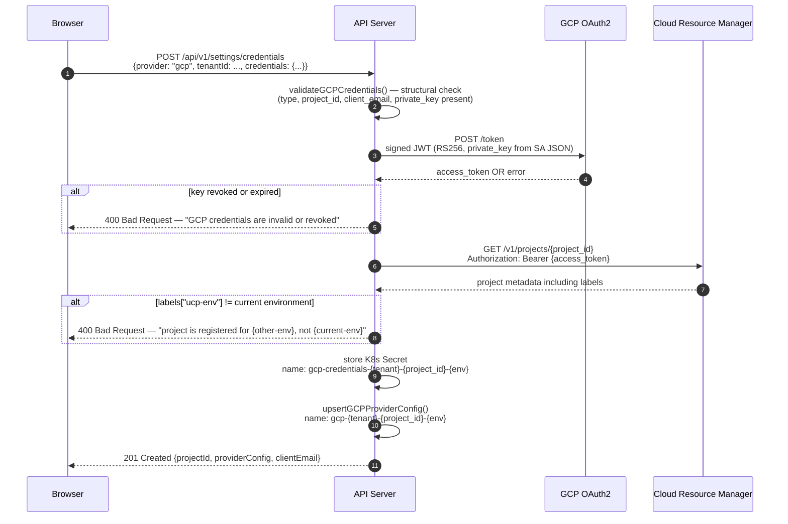
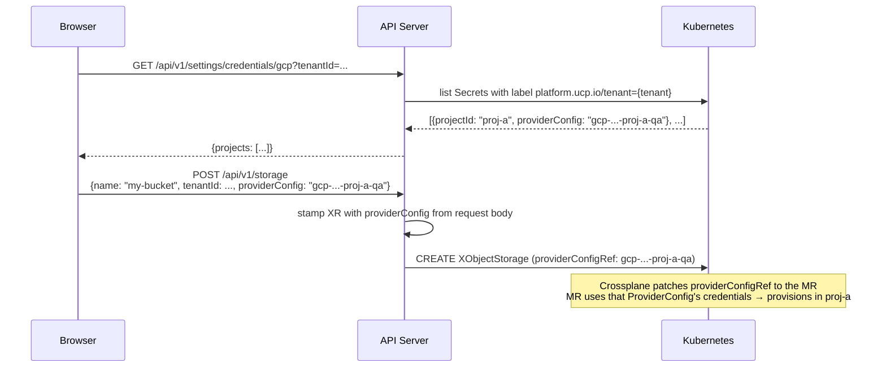

# Multi-Project GCP — Implementation

---

## Implementation

| Component | File | Status |
|---|---|---|
| Live GCP credential validation (OAuth2 + Cloud Resource Manager) | `settings_handler.go` | Not deployed |
| GCP project label check (`ucp-env` label enforcement) | `settings_handler.go` | Not deployed |
| Multi-project secret naming — include `project_id` in secret name | `settings_handler.go` | Not deployed |
| Multi-project ProviderConfig naming — include `project_id` | `settings_handler.go` | Not deployed |
| `GET /api/v1/settings/credentials/gcp` — list registered GCP projects | `settings_handler.go` | Not deployed |
| Create form project selector — fetches and renders available ProviderConfigs | frontend create forms | Not deployed |
| `providerConfig` field in create requests — no longer auto-derived | all create handlers + forms | Not deployed |

---

## Scope

### In Scope

- **Live key validation** — exchange private key for OAuth2 token, verify against Cloud Resource Manager; confirms key is active and SA has minimum required permissions
- **Environment label enforcement** — GCP project must carry `ucp-env: {qa|production}` label matching the UCP instance environment; enforced at credential upload time using the Cloud Resource Manager response
- **Multi-project secret + ProviderConfig naming** — `(tenant, project_id, env)` triple replaces the current `(tenant, env)` pair; prevents collision when a tenant registers multiple projects
- **Project list endpoint** — `GET /api/v1/settings/credentials/gcp` returns all registered GCP projects for a tenant with their ProviderConfig names
- **Project selector in create forms** — frontend fetches the project list and renders a dropdown; single-project tenants see it auto-selected (backwards compatible)
- **`providerConfig` no longer auto-derived** — create handlers accept explicit `providerConfig` from the request instead of calling `gcpProviderConfigName(tenantID, env)`

### Out of Scope

- **GCP project label auto-setting** — UCP does not set GCP project labels; the label must be set by the GCP project owner
- **Multi-cloud providers (AWS, Azure)** — this PoC focuses on GCP; the pattern generalises but is not implemented for other providers
- **Credential rotation** — detecting expired keys and triggering rotation remains out of scope

---

## API Sequence — Credential Upload with Live Validation

`POST /api/v1/settings/credentials`



---

## API Sequence — Resource Creation with Project Selection

`POST /api/v1/storage` with explicit providerConfig



---

## Verification

### Prerequisite: set the GCP project label

```bash
gcloud projects update <project-id> \
  --update-labels ucp-env=qa
```

### Test 1 — Valid key + correct label → accepted

```bash
curl -s -X POST -H "$COOKIE" -H "X-Environment: QA" \
  -d "{\"provider\":\"gcp\",\"tenantId\":\"$TENANT\",\"credentials\":$(cat sa-key.json | jq -c .)}" \
  http://localhost:8080/api/v1/settings/credentials
# → 201 Created with projectId and providerConfig name
```

### Test 2 — Valid key + wrong label → rejected

```bash
# Project has label ucp-env=production, UCP environment is QA
curl -s -X POST -H "$COOKIE" -H "X-Environment: QA" ...
# → 400 Bad Request: "project is registered for production, not qa"
```

### Test 3 — Revoked/invalid key → rejected

```bash
# Use a key with private_key modified to be invalid
curl -s -X POST -H "$COOKIE" -H "X-Environment: QA" ...
# → 400 Bad Request: "GCP credentials are invalid or revoked"
```

### Test 4 — List registered projects

```bash
curl -s -H "$COOKIE" -H "X-Environment: QA" \
  "http://localhost:8080/api/v1/settings/credentials/gcp?tenantId=$TENANT" | jq .
# → { "projects": [{ "projectId": "...", "providerConfig": "..." }] }
```

### Test 5 — Create resource with explicit project selection

```bash
curl -s -X POST -H "$COOKIE" -H "X-Environment: QA" -H "X-Tenant-ID: $TENANT" \
  -d '{"name":"test-bucket","provider":"gcs","projectId":"...","providerConfig":"gcp-...-proj-a-qa"}' \
  http://localhost:8080/api/v1/storage
# → 202 Accepted; verify XR has correct providerConfigRef
kubectl get xobjectstorage test-bucket -o jsonpath='{.spec.parameters.providerConfig}'
```

---

## Verification Results

*To be filled in after tests are run.*

| Test | Expected | Actual | Status |
|---|---|---|---|
| Test 1 — valid key + correct label | 201 Created | | Pending |
| Test 2 — valid key + wrong label | 400 env mismatch | | Pending |
| Test 3 — invalid/revoked key | 400 invalid credentials | | Pending |
| Test 4 — list registered projects | project list with ProviderConfig names | | Pending |
| Test 5 — create resource with project selection | XR carries correct providerConfigRef | | Pending |
