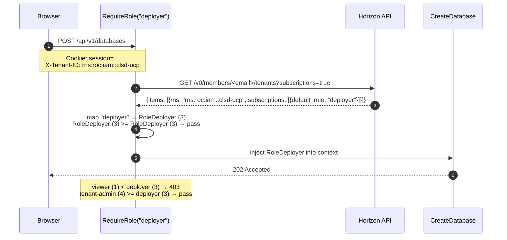
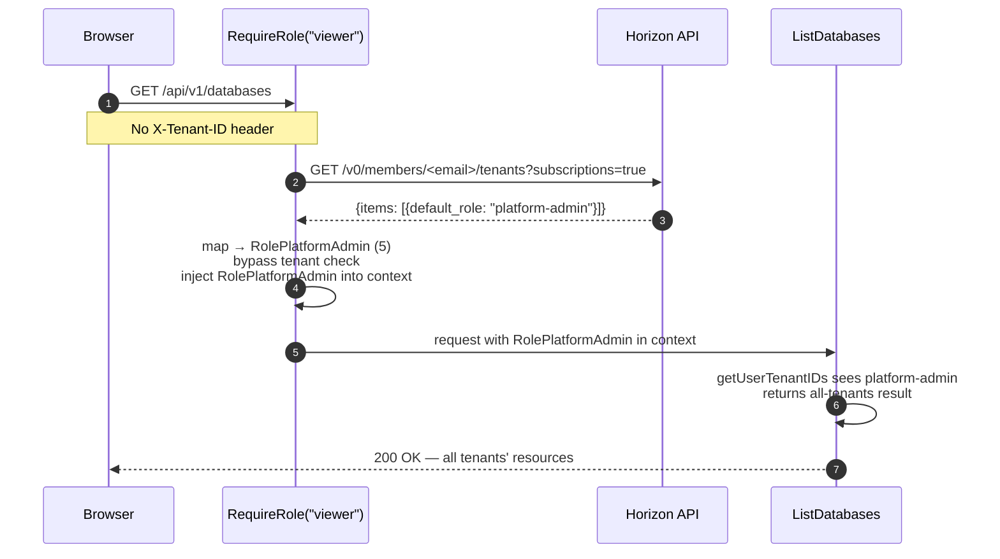

# RBAC — Implementation

---

## Implementation

| Component | File | Status |
|---|---|---|
| `Role` type + context helpers | `auth/context.go` | Not deployed |
| `resolveUserRole()` | `rbac_handler.go` | Not deployed |
| `RequireRole(minRole)` middleware | `rbac_handler.go` | Not deployed |
| Route grouping by role level | `main.go` | Not deployed |
| Remove `isUserTenantAdmin()` from create/list handlers | all resource handlers | Not deployed |

---

## Scope

### In Scope

- **Role type** — ordered `Role` integer type in `auth/context.go` enabling `>=` comparison
- **Role resolution** — `resolveUserRole()` calls Horizon `GET /v0/members/<email>/tenants?subscriptions=true` and maps `default_role` to the internal `Role` type
- **RequireRole middleware** — per-route middleware that resolves role, enforces minimum, and injects resolved role into request context
- **Route refactoring** — routes grouped by minimum role; `isUserTenantAdmin()` removed from create/list handlers and replaced by middleware
- **platform-admin bypass** — cross-tenant role resolved independently of `X-Tenant-ID`

### Out of Scope

- **Delete ownership check** — `isUserTenantAdmin()` in delete handlers reads the XR annotation tenant, not `X-Tenant-ID`. This targeted check remains unchanged.
- **`GET` by name ownership check** — returning 404 vs 403 on cross-tenant name lookup is deferred.
- **Role storage in UCP database** — roles are sourced from Horizon, not a local DB.
- **Terraform endpoints** — no cloud credentials or tenant isolation applicable.

---

## Endpoint-to-Role Mapping

| Endpoint | Method | Minimum role |
|---|---|---|
| `/api/v1/databases` | GET | `viewer` |
| `/api/v1/databases` | POST | `deployer` |
| `/api/v1/databases/{name}` | GET | `viewer` |
| `/api/v1/databases/{name}` | DELETE | `deployer` |
| `/api/v1/compute` | GET | `viewer` |
| `/api/v1/compute` | POST | `deployer` |
| `/api/v1/compute/{name}` | GET | `viewer` |
| `/api/v1/compute/{name}` | DELETE | `deployer` |
| `/api/v1/storage` | GET | `viewer` |
| `/api/v1/storage` | POST | `deployer` |
| `/api/v1/storage/{name}` | GET | `viewer` |
| `/api/v1/storage/{name}` | DELETE | `deployer` |
| `/api/v1/kubernetes-clusters` | GET | `viewer` |
| `/api/v1/kubernetes-clusters` | POST | `deployer` |
| `/api/v1/kubernetes-clusters/{name}` | GET | `viewer` |
| `/api/v1/kubernetes-clusters/{name}` | DELETE | `deployer` |
| `/api/v1/load-balancers` | GET | `viewer` |
| `/api/v1/load-balancers` | POST | `deployer` |
| `/api/v1/load-balancers/{name}` | GET | `viewer` |
| `/api/v1/load-balancers/{name}` | DELETE | `deployer` |
| `/api/v1/workflows/{id}/approve` | POST | `approver` |
| `/api/v1/workflows/{id}/reject` | POST | `approver` |
| `/api/v1/settings/credentials` | GET, POST | `tenant-admin` |
| `/api/v1/settings/credentials/{provider}` | DELETE | `tenant-admin` |
| `/api/v1/settings/credentials/roc` | GET, POST | `tenant-admin` |
| `/api/v1/settings/credentials/all` | GET | `platform-admin` |

---

## API Sequence — RequireRole Check

`POST /api/v1/databases` (deployer minimum)



---

## API Sequence — platform-admin Cross-Tenant Access

`GET /api/v1/databases` (viewer minimum, no X-Tenant-ID)



---

## Verification

### viewer blocked from POST

```bash
COOKIE="Cookie: session=<viewer-session>"

# List — allowed
curl -s -H "$COOKIE" -H "X-Tenant-ID: $TENANT" \
  http://localhost:8080/api/v1/databases | jq '.count'
# → 200

# Create — blocked
curl -s -X POST -H "$COOKIE" -H "X-Tenant-ID: $TENANT" \
  -d '{"name":"test","provider":"gcp","engineVersion":"15","projectId":"..."}' \
  http://localhost:8080/api/v1/databases
# {"error":"insufficient role: deployer required"}
```

### deployer blocked from credentials

```bash
COOKIE="Cookie: session=<deployer-session>"

curl -s -X POST -H "$COOKIE" -H "X-Tenant-ID: $TENANT" \
  http://localhost:8080/api/v1/settings/credentials
# {"error":"insufficient role: tenant-admin required"}
```

### approver can approve, not provision

```bash
COOKIE="Cookie: session=<approver-session>"

# Approve — allowed
curl -s -X POST -H "$COOKIE" -H "X-Tenant-ID: $TENANT" \
  http://localhost:8080/api/v1/workflows/<id>/approve
# → 200

# Create resource — blocked
curl -s -X POST -H "$COOKIE" -H "X-Tenant-ID: $TENANT" \
  -d '{"name":"test","provider":"gcp",...}' \
  http://localhost:8080/api/v1/storage
# {"error":"insufficient role: deployer required"}
```
