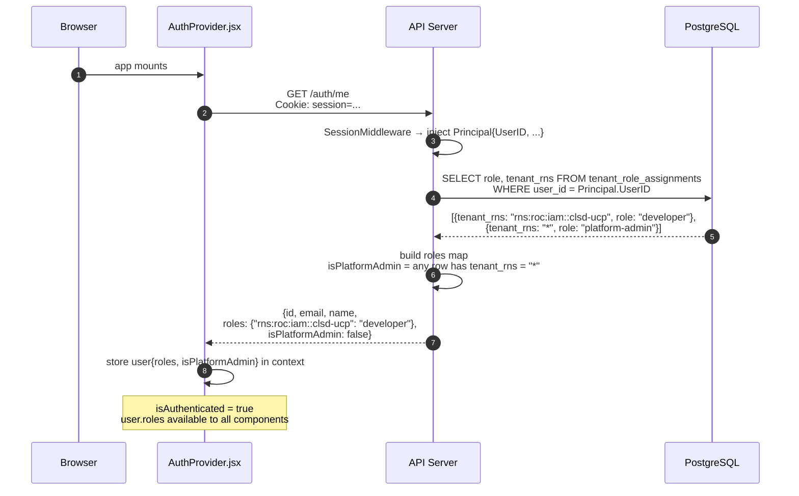
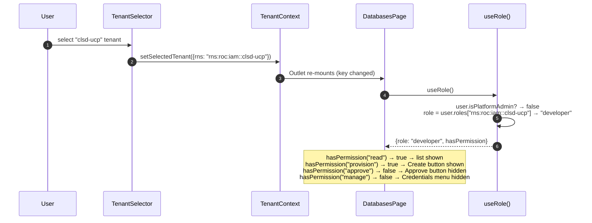
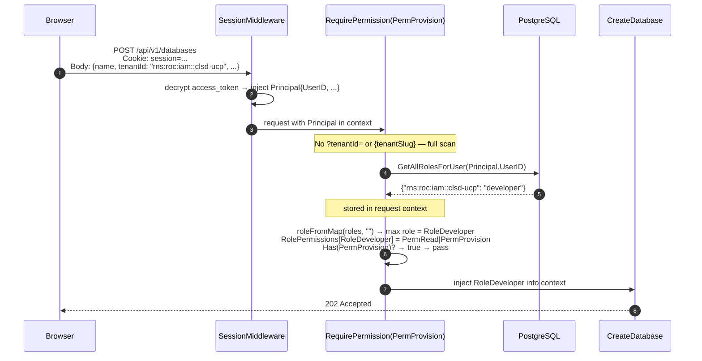
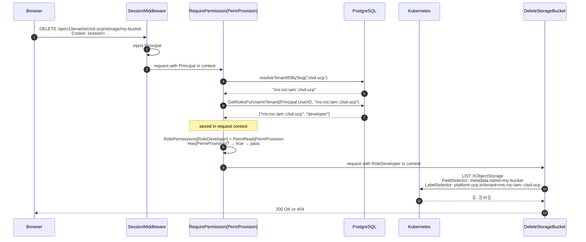
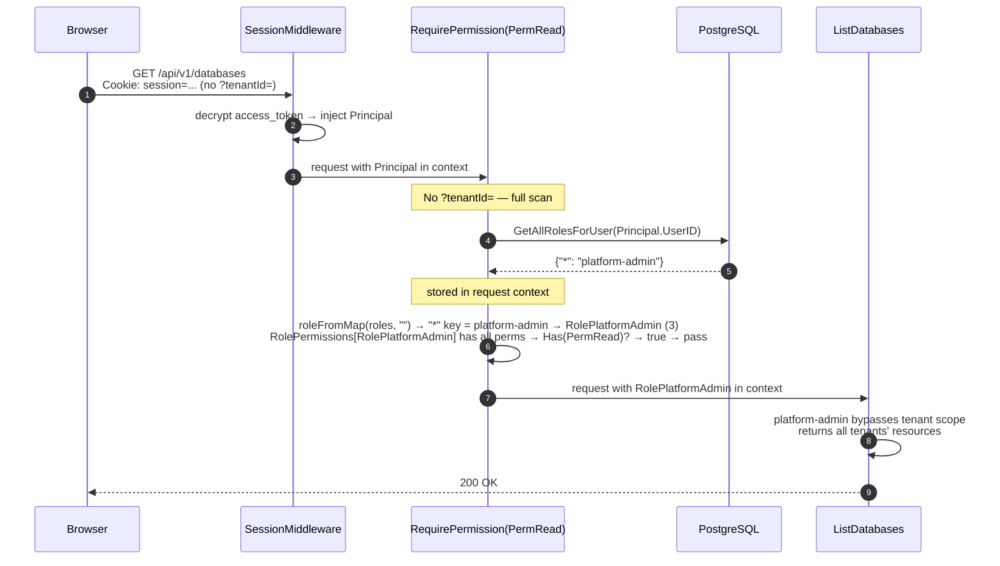

# RBAC — Implementation

---

## Implementation

### Phase 1 + 2 — Core RBAC + Permission model (deployed)

| Component | File | Status |
|---|---|---|
| 3-role model: `RoleDeveloper`, `RoleTenantAdmin`, `RolePlatformAdmin` | `auth/context.go` | Deployed |
| `Permission` bitmask type + `RolePermissions` map | `auth/context.go` | Deployed |
| `tenant_role_assignments` DB schema + migration (3-role CHECK constraint) | `db/` | Deployed |
| DB methods — `GetTenantRole`, `GetAllRolesForUser`, `GetRoleAssignmentsForTenant`, `GetRolesForUserInTenant`, `AssignTenantRole`, `RevokeTenantRole` | `db/roles.go` | Deployed |
| `db.FindUserByEmail()` | `db/roles.go` | Deployed |
| `loadRoles(r, tenantID)` — targeted `GetRolesForUserInTenant` (≤2 rows) when tenant known, full scan when absent | `rbac_handler.go` | Deployed |
| `resolveUserRole()` with per-request in-memory store | `rbac_handler.go` | Deployed |
| `RequirePermission(perm)` middleware — resolves tenant from `?tenantId=` or `{tenantSlug}`, bitmask check | `rbac_handler.go` | Deployed |
| `requirePermHandler` per-route permission wrapper | `rbac_handler.go` | Deployed |
| Admin API — `ListRoleAssignments`, `AssignRole`, `RevokeRole` (slug-based paths) | `rbac_handler.go` | Deployed |
| All routes updated to `requirePermHandler(PermXxx, handler)` | `main.go` | Deployed |
| Remove `isUserTenantAdmin()` from all handlers | all resource + settings handlers | Deployed |
| `/auth/me` role extension | `bff_auth.go` | Deployed |
| `useRole()` hook with `hasPermission(perm)` | `hooks/useRole.ts` | Deployed |
| Sidebar permission-aware rendering | `Sidebar.jsx` | Deployed |
| In-page action buttons permission-aware rendering | all list components | Deployed |
| `ForbiddenPage` + `RequireRole` (perm-based) route wrapper | `App.jsx`, frontend | Deployed |
| Role management inline in tenant page (no separate RoleManagementPage) | `TenantInfo.jsx`, frontend | Deployed |

### Phase 3 — Tenant onboarding + login sync

| Component | File | Status |
|---|---|---|
| `ucp_registered_tenants` DB table | `db/` | Deployed |
| DB methods — `RegisterTenant`, `IsTenantRegistered`, `GetRegisteredTenants` | `db/registered_tenants.go` | Deployed |
| Tenant registration endpoint `POST /api/v1/tenants/register` | `tenant_handler.go` | Deployed |
| `oc_roles` DB table — stores OC tenant role + service roles (JSONB) per user per tenant | `db/` | Deployed |
| DB methods — `UpsertOCRoles`, `DeleteOCRoles`, `GetOCRolesForUser` | `db/roles.go` | Deployed |
| Login-triggered OC sync in `CallbackHandler` — parses JWT `groups` for logged-in user's own data (zero Horizon calls); calls `GET /v0/tenants/{rns}/members` for other members; UPSERTs `oc_roles`, auto-assigns `tenant-admin` for OC Admins, revokes for removed members | `bff_auth.go` | Deployed |
| `parseOCGroupsFromJWT` — derives tenant list + service roles from JWT `groups` claim | `bff_auth.go` | Deployed |
| `GET /api/v1/me/tenants` — OC tenants with UCP registration status, UCP role, and admin contact info | `tenant_handler.go` | Deployed |
| Tenant page — 4-state rendering (registered+role / registered+no-role / unregistered+admin / unregistered+member) + inline role management | `TenantInfo.jsx`, frontend | Deployed |
| Member picker — GET /admin/tenants/{slug}/members returns OC-synced member list; role management shows all members with assign/revoke inline | `TenantInfo.jsx`, `rbac_handler.go`, `db/roles.go` | Deployed |
| ~~Background sync job~~ | — | Deferred — notes only (login sync is sufficient for PoC) |

---

## Scope

### In Scope

**Phase 1 + 2 — Core RBAC + Permission model (deployed)**
- 3-role model (`developer`, `tenant-admin`, `platform-admin`) with `Permission` bitmask
- `RequirePermission` middleware: resolves tenant from `?tenantId=` or `{tenantSlug}`, targeted role fetch (≤2 rows), bitmask check
- `developer` has `PermProvision` but not `PermApprove` — cannot approve own requests
- Admin API for role assignments, slug-based paths
- `/auth/me` extended with roles map and `isPlatformAdmin`
- Permission-aware frontend — sidebar, page buttons, route guards, inline role management in tenant page

**Phase 3 — Tenant onboarding + login-triggered sync**
- **Tenant registration** — `ucp_registered_tenants` table; a tenant must be explicitly registered by an OC Tenant Admin before UCP operations are allowed
- **`oc_roles` table** — populated on every login with each user's OC tenant role and service roles (JSONB). Not used for access control today; wired up for [Option 2](https://confluence.rakuten-it.com/confluence/spaces/UCP/pages/6645566515/UCP+Identity+Tenancy+Roles) (runtime OC service-role check) when needed
- **Login-triggered OC sync** — on every OIDC callback, UCP parses the JWT `groups` claim for the logged-in user's own tenant membership and service roles (zero Horizon calls for own data), then calls `GET /v0/tenants/{rns}/members` to sync all other members of each tenant. UPSERTs `oc_roles`, auto-assigns `tenant-admin` for OC Admins, preserves manually-granted UCP roles for OC Members, revokes for removed members
- **`GET /api/v1/me/tenants`** — returns the user's OC tenants enriched with UCP registration status, UCP role, and tenant-admin contact info (name + email) for tenants where the user has no role or the tenant is unregistered
- **Tenant page** — 4-state rendering per tenant: registered+role / registered+no-role (contact admin) / unregistered+OC-admin (register action) / unregistered+OC-member (contact admin). Inline role management for tenant-admins. OC member picker deployed — sources from locally-synced oc_roles table (no live Horizon call at assignment time).

- **Periodic sync** — deferred, notes only; login sync is sufficient for PoC

### Out of Scope

- **Keycloak configuration** — no changes to Keycloak; roles are owned entirely by UCP.
- **OC role validation at request time** — UCP does not call Core Data on every API request to verify OC standing; consistency is maintained through the login-triggered sync instead.

---

## Open Questions

### 1. Can a tenant-admin grant UCP roles to users who are not OC members?

**How role management works in the PoC:**

On every login, the sync fetches all members of every tenant the logged-in
user belongs to (`GET /v0/tenants/{rns}/members`) and updates UCP's local
data. The role management UI shows this locally-synced member list. A
tenant-admin assigns roles by picking from that list — only OC Tenant Members
of the tenant appear, so non-members cannot be assigned a role through the
normal UI flow.

`AssignRole` itself does not make a live Horizon call; it relies on the
member already having a UCP user record (created on first OIDC login).

**The open question:**

Should a tenant-admin be able to **add a user to the tenant from UCP** — i.e.
invite someone who is not yet an OC Tenant Member? Currently the answer is no:
membership must be managed in OC Portal first, and UCP picks it up on the next
login sync. The question is whether to keep this constraint or allow UCP to
manage OC tenant membership directly via the Core Data API.

The PoC keeps the OC Portal as the source of truth for tenant membership.
Adding a user to a tenant from UCP is out of scope.

---

### 2. Service-level roles for public cloud resources

OneCloud defines per-service roles (DBaaS `admin`/`operator`/`viewer`, CaaS
`admin`/`edit`/`view`, etc.). The PM's Confluence page (UCP Identity, Tenancy
& Roles) only defines OC service roles, not an equivalent UCP service-role layer.

For **OC resources**, two options exist (PM's open question):
- **Option 1 — UCP tenant role only:** `developer` in UCP is sufficient to
  provision any OC service the tenant is subscribed to, regardless of the
  user's OC service-level roles.
- **[Option 2](https://confluence.rakuten-it.com/confluence/spaces/UCP/pages/6645566515/UCP+Identity+Tenancy+Roles) — UCP role + OC service-role check:** UCP additionally verifies
  the user's OC service role per resource type at provisioning time.

For **public cloud resources (GCP and future providers)**, there is no OC
service-role concept. Access is controlled solely by the UCP tenant role
(`developer` or `tenant-admin`). A developer can provision any resource type
the tenant's credentials cover, with no per-service restriction.

A UCP-native service-role layer (independent of OC) is not defined. Whether
UCP should introduce per-service roles (e.g. `database-operator`) for both OC
and public cloud is an open question to be resolved with the PM before any
such system is designed.

---

### 3. Environment boundary in OneCloud — same tenant or separate tenants?

In OneCloud, does a single tenant span multiple deployment environments
(e.g. staging and production), or is each environment represented as a
distinct tenant with its own membership and service subscriptions?

This matters for UCP because:
- If staging and production are **separate OC tenants**, the existing
  per-tenant isolation is sufficient — a user's access to each environment
  is naturally gated by their OC membership in each tenant.
- If staging and production exist **within the same OC tenant**, UCP must
  introduce its own per-environment scoping layer. This would affect the
  `tenant_role_assignments` schema (adding an `environment` column), the
  ProviderConfig naming convention, and how credentials are registered.

The current PoC assumes one UCP context per OC tenant and does not model
environments as a separate dimension.

---

### 4. Impact of OneCloud access revocation on UCP

**Partially addressed in Phase 3.** The login-triggered sync revokes UCP role
assignments for users removed from OC. However there is a window — from when
the OC change happens until the user next logs in — during which the revoked
member retains their UCP access.

Remaining open question: whether this login-gap is acceptable or whether
near-realtime revocation requires the periodic sync (see deferred notes) or
OC webhook integration if it becomes available.

---

### 5. OC role validation at request time vs sync-based consistency

A user could hold UCP `tenant-admin` but have been downgraded to `Tenant Member`
in OC. The login-triggered sync catches this on next login, but during
that window the user retains elevated UCP access.

The Keycloak JWT `groups` claim (see Design doc — Keycloak JWT Structure) makes
[Option 2](https://confluence.rakuten-it.com/confluence/spaces/UCP/pages/6645566515/UCP+Identity+Tenancy+Roles)
feasible without a live Horizon call: the access token already contains the
user's current OC standing. Middleware could parse `groups` from the token on
each request to verify the user's OC role has not been downgraded. This would
be near-instant revocation at negligible cost (JWT parsing, no external call).

The PoC chooses sync-on-login as the simpler approach. JWT-based request-time
validation is a future improvement.

---

### 6. JWT `groups` format for OC Tenant Members

**Partially resolved.** `parseOCGroupsFromJWT` is deployed and replaces the
`fetchOCMemberTenants` Horizon call for the logged-in user's own data. The
assumption — that Tenant Members have `rns:roc:iam::{tenant}:roles:member` —
is implemented but not yet verified with a non-admin test account.

`GET /v0/tenants/{rns}/members` (Horizon) remains in use for syncing other
members of a tenant. The JWT only encodes the currently authenticated user.

---

## Endpoint-to-Role Mapping

| Endpoint | Method | Minimum role | Description |
|---|---|---|---|
| `/api/v1/databases` | GET | `developer` | List databases scoped to caller's tenants |
| `/api/v1/databases` | POST | `developer` | Provision a new database |
| `/api/v1/databases/{name}` | GET | `developer` | Get database details by name |
| `/api/v1/databases/{name}` | DELETE | `developer` | Delete a database |
| `/api/v1/compute` | GET | `developer` | List compute instances scoped to caller's tenants |
| `/api/v1/compute` | POST | `developer` | Provision a new compute instance |
| `/api/v1/compute/{name}` | GET | `developer` | Get compute instance details by name |
| `/api/v1/compute/{name}` | DELETE | `developer` | Delete a compute instance |
| `/api/v1/storage` | GET | `developer` | List storage buckets scoped to caller's tenants |
| `/api/v1/storage` | POST | `developer` | Provision a new storage bucket |
| `/api/v1/storage/{name}` | GET | `developer` | Get storage bucket details by name |
| `/api/v1/storage/{name}` | DELETE | `developer` | Delete a storage bucket |
| `/api/v1/kubernetes-clusters` | GET | `developer` | List Kubernetes clusters scoped to caller's tenants |
| `/api/v1/kubernetes-clusters` | POST | `developer` | Provision a new Kubernetes cluster |
| `/api/v1/kubernetes-clusters/{name}` | GET | `developer` | Get Kubernetes cluster details by name |
| `/api/v1/kubernetes-clusters/{name}` | DELETE | `developer` | Delete a Kubernetes cluster |
| `/api/v1/load-balancers` | GET | `developer` | List load balancer attachments scoped to caller's tenants |
| `/api/v1/load-balancers` | POST | `developer` | Create a new load balancer attachment |
| `/api/v1/load-balancers/{name}` | GET | `developer` | Get load balancer attachment details by name |
| `/api/v1/load-balancers/{name}` | DELETE | `developer` | Delete a load balancer attachment |
| `/api/v1/tenants/{tenantSlug}/workflows/{workflowId}/approve` | POST | `tenant-admin` | Approve a pending Temporal workflow |
| `/api/v1/tenants/{tenantSlug}/workflows/{workflowId}/reject` | POST | `tenant-admin` | Reject a pending Temporal workflow |
| `/api/v1/drift` | GET | `tenant-admin` | List drift detections for the tenant |
| `/api/v1/quota` | GET | `tenant-admin` | View GCP quota usage for the tenant |
| `/api/v1/gcp/discover` | GET | `tenant-admin` | Discover unmanaged GCP resources for the tenant |
| `/api/v1/settings/api-exposure` | GET, PUT | `tenant-admin` | Read or configure API exposure settings |
| `/api/v1/settings/credentials` | GET, POST | `tenant-admin` | Read or upload GCP credentials for the tenant |
| `/api/v1/settings/credentials/{provider}` | DELETE | `tenant-admin` | Remove a provider's credentials for the tenant |
| `/api/v1/settings/credentials/roc` | GET, POST | `tenant-admin` | Read or configure ROC (Omnia) credentials for the tenant |
| `/api/v1/settings/credentials/all` | GET | `platform-admin` | List all credentials across all tenants |
| `/api/v1/admin/tenants/{tenantSlug}/roles` | GET | `tenant-admin` | List role assignments for a tenant |
| `/api/v1/admin/tenants/{tenantSlug}/roles` | POST | `tenant-admin` | Assign a role to a user within a tenant |
| `/api/v1/admin/tenants/{tenantSlug}/roles/{userID}` | DELETE | `tenant-admin` | Revoke a user's role within a tenant |

---

## UI-to-Role Mapping

### Sidebar navigation

Navigation items are hidden when the caller lacks the minimum role. Direct URL
access (bookmark, address bar) is also blocked — a `RequireRole` route wrapper
in the frontend renders a 403 page instead of the content if the permission
check fails.

| Item | Route | Minimum role | If insufficient role |
|---|---|---|---|
| Database → List | `/` | `developer` | Hidden + 403 |
| Database → Create | `/create` | `developer` | Hidden in sidebar + 403 on direct access |
| Compute → List | `/compute` | `developer` | Hidden + 403 |
| Compute → Create | `/compute/create` | `developer` | Hidden + 403 |
| Storage → List | `/storage` | `developer` | Hidden + 403 |
| Storage → Create | `/storage/create` | `developer` | Hidden + 403 |
| Kubernetes → List | `/kubernetes` | `developer` | Hidden + 403 |
| Kubernetes → Create | `/kubernetes/create` | `developer` | Hidden + 403 |
| Drift → List | `/drift` | `tenant-admin` | Hidden + 403 |
| Quotas → Usage | `/quota` | `tenant-admin` | Hidden + 403 |
| Terraform | `/terraform/*` | — | Out of RBAC scope (experimental) |
| Admin → Workflows | `/admin/workflows` | `platform-admin` | Hidden + 403 |
| Admin → Kube Resources | `/admin/kube-resources` | `platform-admin` | Hidden + 403 |
| Settings → Credentials | `/settings/credentials` | `tenant-admin` | Hidden + 403 |
| Tenants | `/admin/tenants` | — | Accessible to all authenticated users |

### In-page actions

| Action | Page | Minimum role |
|---|---|---|
| Create button | All resource list pages | `developer` |
| Delete button | All resource list/detail pages | `developer` |
| Approve button | Workflows page | `tenant-admin` |
| Reject button | Workflows page | `tenant-admin` |
| Upload credentials | Settings → Credentials | `tenant-admin` |
| Assign / revoke role | Tenant page (inline) | `tenant-admin` |

---

## API Sequence — /auth/me on Mount

The frontend `AuthProvider` calls `/auth/me` on mount. With the role extension,
the response now includes the caller's role assignments so the UI has everything
it needs before the first page renders.



---

## UI Sequence — Role-Aware Rendering

When the user selects a tenant, `useRole()` derives the effective role from the
already-stored `user.roles` — no additional API call.



---

## API Sequence — RequirePermission Check (create)

`POST /api/v1/databases` (PermProvision required)

`POST` create requests carry `tenantId` in the request body, not the URL.
The middleware cannot read it, so `loadRoles` falls back to a full scan.
This is acceptable — creates are infrequent compared to reads.



---

## API Sequence — RequirePermission Check (delete)

`DELETE /api/v1/tenants/clsd-ucp/storage/my-bucket` (PermProvision required)

Slug is resolved to RNS (1 DB call) enabling a targeted role fetch (≤2 rows).
Tenant ownership is enforced by the K8s label filter in the handler — no
separate role check needed inside the handler.



---

## API Sequence — platform-admin Cross-Tenant Access

`GET /api/v1/databases` (PermRead required, no ?tenantId=)



---

## Verification

### developer blocked from approve and credentials

```bash
COOKIE="Cookie: session=<developer-session>"

# List — allowed
curl -s -H "$COOKIE" "http://localhost:8080/api/v1/databases?tenantId=$TENANT" | jq '.count'
# → 200

# Create — allowed
curl -s -X POST -H "$COOKIE" \
  -d '{"name":"test","provider":"gcp","engineVersion":"15","projectId":"...","tenantId":"'$TENANT'"}' \
  http://localhost:8080/api/v1/databases
# → 202

# Approve — blocked
curl -s -X POST -H "$COOKIE" \
  http://localhost:8080/api/v1/tenants/clsd-ucp/workflows/<id>/approve
# {"error":"insufficient permission: approve required"}

# Credentials — blocked
curl -s -X POST -H "$COOKIE" \
  http://localhost:8080/api/v1/settings/credentials
# {"error":"insufficient permission: manage required"}
```

### tenant-admin can approve and provision

```bash
COOKIE="Cookie: session=<tenant-admin-session>"

# Approve — allowed
curl -s -X POST -H "$COOKIE" \
  http://localhost:8080/api/v1/tenants/clsd-ucp/workflows/<id>/approve
# → 200

# Create resource — allowed
curl -s -X POST -H "$COOKIE" \
  -d '{"name":"test","provider":"gcp",...}' \
  http://localhost:8080/api/v1/storage
# → 202
```

### cross-tenant access blocked

```bash
# User is tenant-admin of clsd-ucp but not other-tenant
curl -s -H "$COOKIE" \
  "http://localhost:8080/api/v1/databases?tenantId=rns:roc:iam::other-tenant"
# {"error":"insufficient permission: read required"}  (or 403)
```
