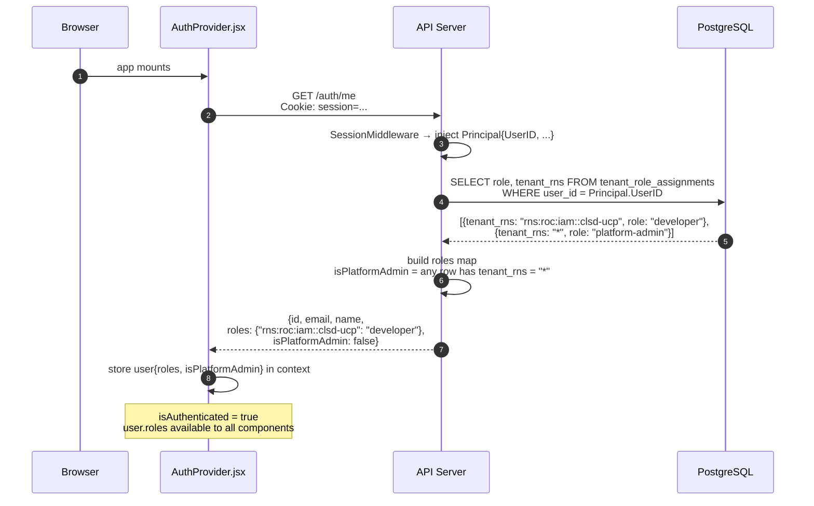
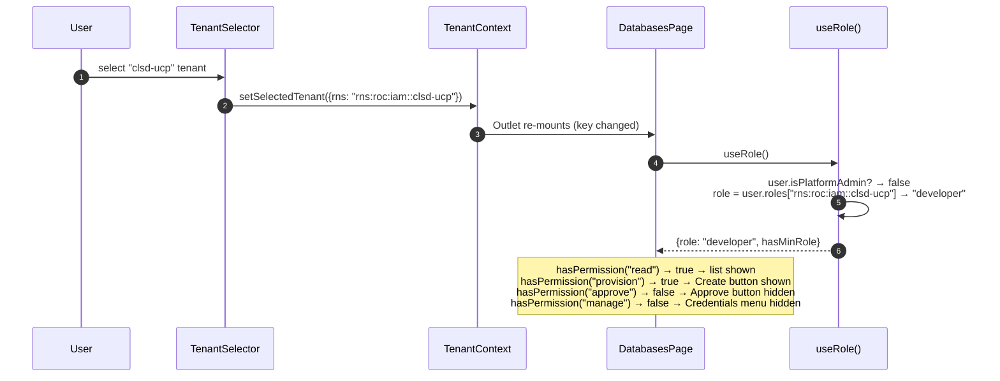
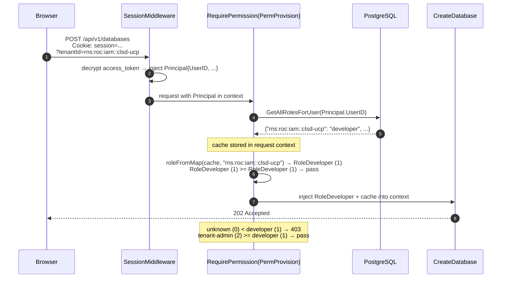
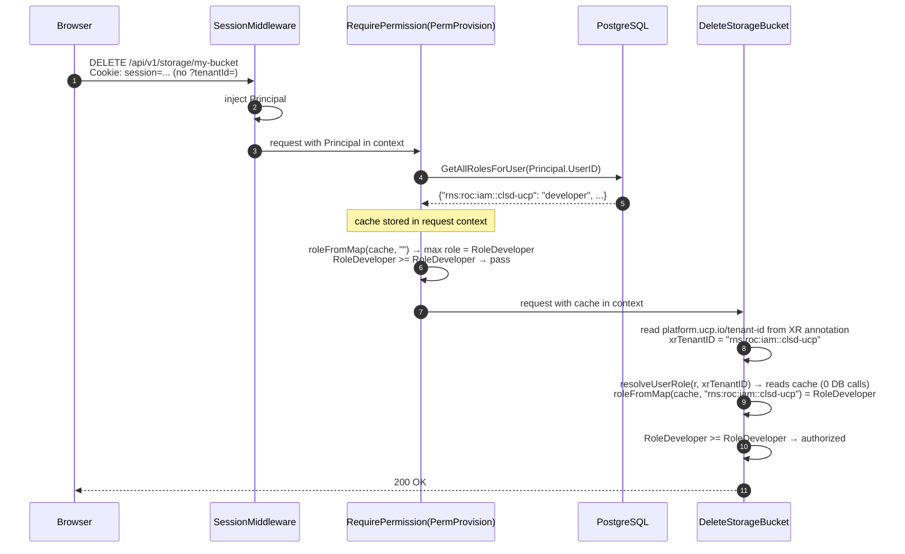
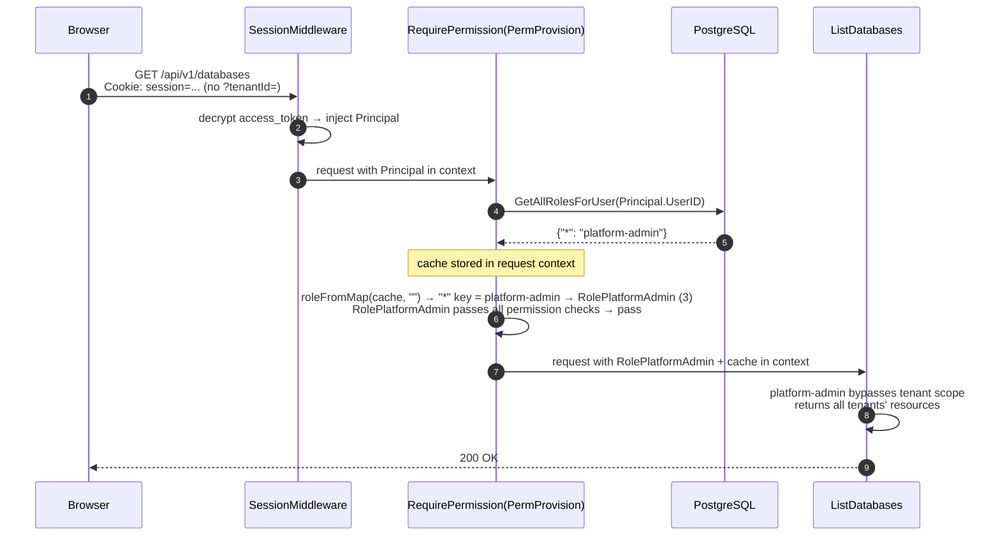

# RBAC — Implementation

---

## Implementation

### Phase 1 — Core RBAC (deployed)

| Component | File | Status |
|---|---|---|
| `Role` type + context helpers | `auth/context.go` | Deployed |
| `tenant_role_assignments` DB schema + migration | `db/` | Deployed |
| DB methods — `GetTenantRole`, `GetAllRolesForUser`, `GetRoleAssignmentsForTenant`, `AssignTenantRole`, `RevokeTenantRole` | `db/roles.go` | Deployed |
| `db.FindUserByEmail()` | `db/roles.go` | Deployed |
| `resolveUserRole()` with per-request cache | `rbac_handler.go` | Deployed |
| `RequireRole(minRole)` middleware | `rbac_handler.go` | Deployed |
| Admin API — `ListRoleAssignments`, `AssignRole`, `RevokeRole` | `rbac_handler.go` | Deployed |
| Route grouping by role level + admin API route registration | `main.go` | Deployed |
| Remove `isUserTenantAdmin()` from all handlers | all resource + settings handlers | Deployed |
| `/auth/me` role extension | `bff_auth.go` | Deployed |
| `useRole()` hook | `hooks/useRole.ts` | Deployed |
| Sidebar role-aware rendering | `Sidebar.jsx` | Deployed |
| In-page action buttons role-aware rendering | all list components | Deployed |
| `ForbiddenPage` + `RequireRole` route wrapper | `App.jsx`, frontend | Deployed |
| Role management UI | `pages/RoleManagementPage.jsx` | Deployed |

### Phase 2 — Permission model refactor (not deployed)

Replaces the linear `Role int` hierarchy with an orthogonal permission bitmask.
UCP uses three roles: `developer`, `tenant-admin`, `platform-admin`.
`developer` has `PermProvision` but not `PermApprove` — a developer cannot
approve their own provisioning request. The bitmask is kept for future-proofing:
new roles (e.g. `drift-operator`) can be added with one line in `RolePermissions`.

| Component | File | Status |
|---|---|---|
| 3-role model: `RoleDeveloper`, `RoleTenantAdmin`, `RolePlatformAdmin` (remove `RoleViewer`, `RoleApprover`, `RoleDeployer`) | `auth/context.go` | Not deployed |
| `Permission` bitmask type + `RolePermissions` map | `auth/context.go` | Not deployed |
| `RequirePermission(perm)` middleware replacing `RequireRole` | `rbac_handler.go` | Not deployed |
| Route registrations updated to use permissions | `main.go` | Not deployed |
| `hasPermission(perm)` replacing `hasMinRole(min)` in `useRole()` | `hooks/useRole.ts` | Not deployed |
| All frontend components updated to use `hasPermission` | all components | Not deployed |
| DB migration: update `tenant_role_assignments.role` CHECK constraint to `('developer','tenant-admin','platform-admin')` | `db/` | Not deployed |

### Phase 3 — Tenant onboarding + login sync (not deployed)

| Component | File | Status |
|---|---|---|
| `ucp_registered_tenants` DB table | `db/` | Not deployed |
| DB methods — `RegisterTenant`, `IsRegistered`, `GetRegisteredTenants` | `db/tenants.go` | Not deployed |
| Tenant registration endpoint `POST /api/v1/tenants/register` | `tenant_handler.go` | Not deployed |
| `oc_roles` DB table — stores OC tenant role + service roles (JSONB) per user per tenant | `db/` | Not deployed |
| DB methods — `UpsertOCRoles`, `DeleteOCRoles`, `GetOCRoles` | `db/roles.go` | Not deployed |
| Login-triggered OC sync in `CallbackHandler` — UPSERT `oc_roles`, auto-assign `tenant-admin` for OC Admins, revoke for removed members, preserve manually-granted UCP roles | `bff_auth.go` | Not deployed |
| `GET /api/v1/me/tenants` — OC tenants with UCP registration status, UCP role, and admin contact info | `tenant_handler.go` | Not deployed |
| Tenant page — register flow + member picker from Horizon for role assignment | frontend | Not deployed |
| Onboarding landing page — 4-state tenant rendering (registered+role / registered+no-role / unregistered+admin / unregistered+member) | frontend | Not deployed |
| ~~Background sync job~~ | — | Deferred — notes only (login sync is sufficient for PoC) |

---

## Scope

### In Scope

**Phase 1 — Core RBAC (deployed)**
- Role type, DB schema, role resolution with per-request cache
- `RequireRole` middleware replacing all `isUserTenantAdmin()` per-handler checks
- Admin API to manage role assignments manually
- `/auth/me` extended with roles map and `isPlatformAdmin` flag
- Role-aware frontend — sidebar, page buttons, route guards, role management UI

**Phase 2 — Permission model refactor**
- 3-role model: `developer`, `tenant-admin`, `platform-admin` (scrap `viewer`, `approver`, `deployer`)
- Replace linear `Role int` hierarchy with orthogonal `Permission` bitmask for future-proofing
- `developer` has `PermProvision` but not `PermApprove` — a developer cannot approve their own request
- `RolePermissions` map defines each role as a set of permissions
- All route registrations use `RequirePermission(perm)` instead of `RequireRole(minRole)`
- Frontend `hasPermission(perm)` replaces `hasMinRole(min)` throughout
- DB migration: update `CHECK` constraint to the 3 new role names

**Phase 3 — Tenant onboarding + login-triggered sync**
- **Tenant registration** — `ucp_registered_tenants` table; a tenant must be explicitly registered by an OC Tenant Admin before UCP operations are allowed
- **`oc_roles` table** — populated on every login with each user's OC tenant role and service roles (JSONB). Not used for access control today; wired up for [Option 2](https://confluence.rakuten-it.com/confluence/spaces/UCP/pages/6645566515/UCP+Identity+Tenancy+Roles) (runtime OC service-role check) when needed
- **Login-triggered OC sync** — on every OIDC callback, UCP calls Horizon `GET /v0/members/{email}/tenants`, UPSERTs `oc_roles` with current OC data, and for `tenant_role_assignments`: auto-assigns `tenant-admin` if OC Admin (upgrade only), preserves manually-granted roles for OC Members, revokes for removed members
- **`GET /api/v1/me/tenants`** — returns the user's OC tenants enriched with UCP registration status, UCP role, and tenant-admin contact info (name + email) for tenants where the user has no role or the tenant is unregistered
- **Tenant page** — register flow + OC member picker from Horizon for role assignment (no manual email input)
- **Onboarding landing page** — 4-state rendering per tenant: registered+role / registered+no-role (contact admin) / unregistered+OC-admin (register action) / unregistered+OC-member (contact admin)
- **Periodic sync** — deferred, notes only; login sync is sufficient for PoC

### Out of Scope

- **Keycloak configuration** — no changes to Keycloak; roles are owned entirely by UCP.
- **OC role validation at request time** — UCP does not call Core Data on every API request to verify OC standing; consistency is maintained through seeding and periodic sync instead.

---

## Open Questions

### 1. Service-level roles for public cloud resources

OneCloud defines per-service roles (DBaaS `admin`/`operator`/`viewer`, CaaS
`admin`/`edit`/`view`, etc.). The PM's Confluence page (UCP Identity, Tenancy
& Roles) only defines OC service roles, not an equivalent UCP service-role layer.

For **OC resources**, two options exist (PM's open question):
- **Option 1 — UCP tenant role only:** `developer` in UCP is sufficient to
  provision any OC service the tenant is subscribed to, regardless of the
  user's OC service-level roles.
- **[Option 2](https://confluence.rakuten-it.com/confluence/spaces/UCP/pages/6645566515/UCP+Identity+Tenancy+Roles) — UCP role + OC service-role check:** UCP additionally verifies
  the user's OC service role per resource type at provisioning time.

For **public cloud resources (GCP and future providers)**, there is no OC
service-role concept. Access is controlled solely by the UCP tenant role
(`developer` or `tenant-admin`). A developer can provision any resource type
the tenant's credentials cover, with no per-service restriction.

A UCP-native service-role layer (independent of OC) is not defined. Whether
UCP should introduce per-service roles (e.g. `database-operator`) for both OC
and public cloud is an open question to be resolved with the PM before any
such system is designed.

---

### 2. Environment boundary in OneCloud — same tenant or separate tenants?

In OneCloud, does a single tenant span multiple deployment environments
(e.g. staging and production), or is each environment represented as a
distinct tenant with its own membership and service subscriptions?

This matters for UCP because:
- If staging and production are **separate OC tenants**, the existing
  per-tenant isolation is sufficient — a user's access to each environment
  is naturally gated by their OC membership in each tenant.
- If staging and production exist **within the same OC tenant**, UCP must
  introduce its own per-environment scoping layer. This would affect the
  `tenant_role_assignments` schema (adding an `environment` column), the
  ProviderConfig naming convention, and how credentials are registered.

The current PoC assumes one UCP context per OC tenant and does not model
environments as a separate dimension.

---

### 2. Multiple cloud provider projects per tenant

The PoC operates on the assumption that one OC tenant maps to exactly
one GCP project (or one project per public cloud provider). It is unclear
whether a team may have multiple GCP projects under the same OC tenant —
for example, one project per service or one project per environment.

If multiple projects per tenant are required:
- The current `ProviderConfig` naming convention
  (`gcp-{sanitized-tenant-id}-{env}`) assumes a single project and would
  need to be extended.
- The "UCP Project" entity proposed by the PM would need to model a
  one-to-many relationship between an OC tenant and its cloud projects.

---

### 3. Impact of OneCloud access revocation on UCP

**Partially addressed in Phase 3.** The periodic sync job detects OC membership
removals and removes the corresponding UCP role assignments. However there is a
window of up to the sync interval (default 15 min) during which a revoked OC
member retains their UCP access.

Remaining open question: whether the sync interval is acceptable or whether
near-realtime revocation requires a different approach (e.g. OC webhook
integration if it becomes available, or a shorter polling interval for
high-sensitivity tenants).

---

### 4. Service account credential lifecycle and key rotation

UCP stores GCP (and OC) service account credentials in Kubernetes Secrets
(PoC) or GCP Secret Manager (production target). No key rotation mechanism
is implemented.

Questions to resolve:
- When a service account key expires or is rotated externally, Crossplane
  will start failing reconciliation for that tenant's resources with
  authentication errors. Does UCP surface this clearly to the tenant-admin,
  or does it silently leave resources in an error state?
- Should UCP implement automatic key rotation (e.g. via ESO + GCP Secret
  Manager rotation policies), or is manual update via the credentials
  endpoint (`POST /api/v1/settings/credentials`) sufficient?
- What is the expected SLA for a tenant-admin to respond to a broken
  credential — can provisioning/reconciliation be paused rather than
  failing?

The PoC treats credentials as static — no rotation logic is implemented.
Stale credentials will cause Crossplane reconciliation errors that require
manual credential re-upload to resolve.

---

### 5. OC role validation at request time vs sync-based consistency

A user could hold UCP `tenant-admin` but have been downgraded to `Tenant Member`
in OC. The Phase 3 sync catches this within the polling interval, but during
that window the user retains elevated UCP access.

Should UCP validate the user's current OC standing on every protected request
([PM's Option 2](https://confluence.rakuten-it.com/confluence/spaces/UCP/pages/6645566515/UCP+Identity+Tenancy+Roles))? This would make access revocation near-instant but adds a
Core Data API call to every hot path.

The PoC chooses sync-based consistency (polling) as the simpler approach.
Request-time OC validation is deferred and would require the OC → UCP role
mapping to be applied at the middleware layer rather than only at seed/sync time.

---

## Endpoint-to-Role Mapping

| Endpoint | Method | Minimum role | Description |
|---|---|---|---|
| `/api/v1/databases` | GET | `developer` | List databases scoped to caller's tenants |
| `/api/v1/databases` | POST | `developer` | Provision a new database |
| `/api/v1/databases/{name}` | GET | `developer` | Get database details by name |
| `/api/v1/databases/{name}` | DELETE | `developer` | Delete a database |
| `/api/v1/compute` | GET | `developer` | List compute instances scoped to caller's tenants |
| `/api/v1/compute` | POST | `developer` | Provision a new compute instance |
| `/api/v1/compute/{name}` | GET | `developer` | Get compute instance details by name |
| `/api/v1/compute/{name}` | DELETE | `developer` | Delete a compute instance |
| `/api/v1/storage` | GET | `developer` | List storage buckets scoped to caller's tenants |
| `/api/v1/storage` | POST | `developer` | Provision a new storage bucket |
| `/api/v1/storage/{name}` | GET | `developer` | Get storage bucket details by name |
| `/api/v1/storage/{name}` | DELETE | `developer` | Delete a storage bucket |
| `/api/v1/kubernetes-clusters` | GET | `developer` | List Kubernetes clusters scoped to caller's tenants |
| `/api/v1/kubernetes-clusters` | POST | `developer` | Provision a new Kubernetes cluster |
| `/api/v1/kubernetes-clusters/{name}` | GET | `developer` | Get Kubernetes cluster details by name |
| `/api/v1/kubernetes-clusters/{name}` | DELETE | `developer` | Delete a Kubernetes cluster |
| `/api/v1/load-balancers` | GET | `developer` | List load balancer attachments scoped to caller's tenants |
| `/api/v1/load-balancers` | POST | `developer` | Create a new load balancer attachment |
| `/api/v1/load-balancers/{name}` | GET | `developer` | Get load balancer attachment details by name |
| `/api/v1/load-balancers/{name}` | DELETE | `developer` | Delete a load balancer attachment |
| `/api/v1/workflows/{id}/approve` | POST | `tenant-admin` | Approve a pending Temporal workflow |
| `/api/v1/workflows/{id}/reject` | POST | `tenant-admin` | Reject a pending Temporal workflow |
| `/api/v1/drift` | GET | `tenant-admin` | List drift detections for the tenant |
| `/api/v1/quota` | GET | `tenant-admin` | View GCP quota usage for the tenant |
| `/api/v1/gcp/discover` | GET | `tenant-admin` | Discover unmanaged GCP resources for the tenant |
| `/api/v1/settings/api-exposure` | GET, PUT | `tenant-admin` | Read or configure API exposure settings |
| `/api/v1/settings/credentials` | GET, POST | `tenant-admin` | Read or upload GCP credentials for the tenant |
| `/api/v1/settings/credentials/{provider}` | DELETE | `tenant-admin` | Remove a provider's credentials for the tenant |
| `/api/v1/settings/credentials/roc` | GET, POST | `tenant-admin` | Read or configure ROC (Omnia) credentials for the tenant |
| `/api/v1/settings/credentials/all` | GET | `platform-admin` | List all credentials across all tenants |
| `/api/v1/admin/tenants/{tenantSlug}/roles` | GET | `tenant-admin` | List role assignments for a tenant |
| `/api/v1/admin/tenants/{tenantSlug}/roles` | POST | `tenant-admin` | Assign a role to a user within a tenant |
| `/api/v1/admin/tenants/{tenantSlug}/roles/{userID}` | DELETE | `tenant-admin` | Revoke a user's role within a tenant |

---

## UI-to-Role Mapping

### Sidebar navigation

Navigation items are hidden when the caller lacks the minimum role. Direct URL
access (bookmark, address bar) is also blocked — a `RequireRole` route wrapper
in the frontend renders a 403 page instead of the content if the permission
check fails.

| Item | Route | Minimum role | If insufficient role |
|---|---|---|---|
| Database → List | `/` | `developer` | — (all tenant-authenticated users) |
| Database → Create | `/create` | `developer` | Hidden in sidebar + 403 on direct access |
| Compute → List | `/compute` | `developer` | — |
| Compute → Create | `/compute/create` | `developer` | Hidden + 403 |
| Storage → List | `/storage` | `developer` | — |
| Storage → Create | `/storage/create` | `developer` | Hidden + 403 |
| Kubernetes → List | `/kubernetes` | `developer` | — |
| Kubernetes → Create | `/kubernetes/create` | `developer` | Hidden + 403 |
| Drift → List | `/drift` | `tenant-admin` | Hidden + 403 |
| Quotas → Usage | `/quota` | `tenant-admin` | Hidden + 403 |
| Terraform | `/terraform/*` | — | Out of RBAC scope (experimental) |
| Admin → Workflows | `/admin/workflows` | `platform-admin` | Hidden + 403 |
| Admin → Kube Resources | `/admin/kube-resources` | `platform-admin` | Hidden + 403 |
| Settings → Credentials | `/settings/credentials` | `tenant-admin` | Hidden + 403 |
| Settings → Tenants | `/admin/tenants` | `platform-admin` | Hidden + 403 |
| Settings → Role Management | `/settings/roles` | `tenant-admin` | Hidden + 403 |

### In-page actions

| Action | Page | Minimum role |
|---|---|---|
| Create button | All resource list pages | `developer` |
| Delete button | All resource list/detail pages | `developer` |
| Approve button | Workflows page | `tenant-admin` |
| Reject button | Workflows page | `tenant-admin` |
| Upload credentials | Settings → Credentials | `tenant-admin` |
| Assign / revoke role | Settings → Role Management | `tenant-admin` |

---

## API Sequence — /auth/me on Mount

The frontend `AuthProvider` calls `/auth/me` on mount. With the role extension,
the response now includes the caller's role assignments so the UI has everything
it needs before the first page renders.



---

## UI Sequence — Role-Aware Rendering

When the user selects a tenant, `useRole()` derives the effective role from the
already-stored `user.roles` — no additional API call.



---

## API Sequence — RequireRole Check (create)

`POST /api/v1/databases` (developer minimum, ?tenantId= present)

`RequirePermission` calls `loadRoles` first — **1 DB call** fetches all role
assignments and caches them in the request context.



---

## API Sequence — RequireRole Check (delete with ownership)

`DELETE /api/v1/storage/my-bucket` (developer minimum, no ?tenantId=)

Cache populated in middleware; ownership check in handler reads from cache —
**1 DB call total** for the entire request.



---

## API Sequence — platform-admin Cross-Tenant Access

`GET /api/v1/databases` (developer minimum, no ?tenantId=)



---

## Verification

### developer blocked from approve and credentials

```bash
COOKIE="Cookie: session=<developer-session>"

# List — allowed
curl -s -H "$COOKIE" "http://localhost:8080/api/v1/databases?tenantId=$TENANT" | jq '.count'
# → 200

# Create — allowed
curl -s -X POST -H "$COOKIE" \
  -d '{"name":"test","provider":"gcp","engineVersion":"15","projectId":"...","tenantId":"'$TENANT'"}' \
  http://localhost:8080/api/v1/databases
# → 202

# Approve — blocked
curl -s -X POST -H "$COOKIE" \
  http://localhost:8080/api/v1/tenants/clsd-ucp/workflows/<id>/approve
# {"error":"insufficient permission: approve required"}

# Credentials — blocked
curl -s -X POST -H "$COOKIE" \
  http://localhost:8080/api/v1/settings/credentials
# {"error":"insufficient permission: manage required"}
```

### tenant-admin can approve and provision

```bash
COOKIE="Cookie: session=<tenant-admin-session>"

# Approve — allowed
curl -s -X POST -H "$COOKIE" \
  http://localhost:8080/api/v1/tenants/clsd-ucp/workflows/<id>/approve
# → 200

# Create resource — allowed
curl -s -X POST -H "$COOKIE" \
  -d '{"name":"test","provider":"gcp",...}' \
  http://localhost:8080/api/v1/storage
# → 202
```

### cross-tenant access blocked

```bash
# User is tenant-admin of clsd-ucp but not other-tenant
curl -s -H "$COOKIE" \
  "http://localhost:8080/api/v1/databases?tenantId=rns:roc:iam::other-tenant"
# {"error":"insufficient permission: read required"}  (or 403)
```
