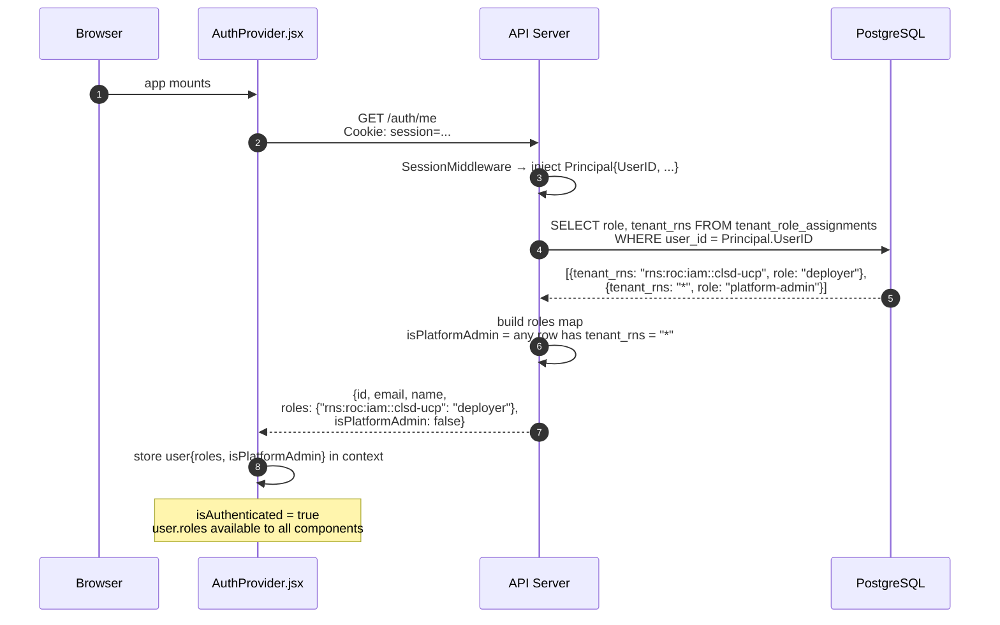
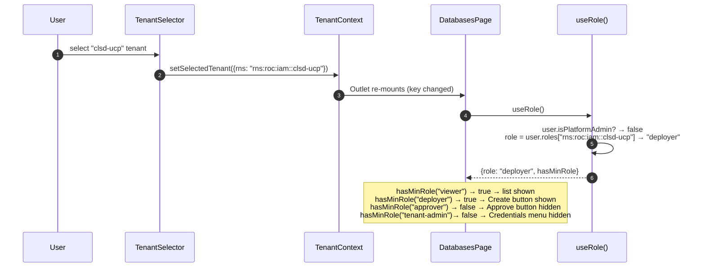
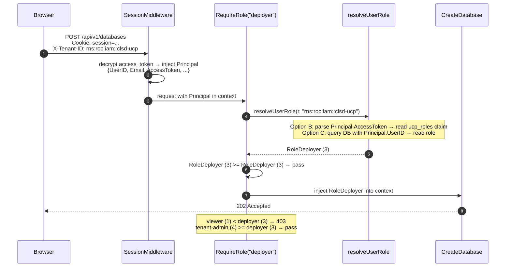
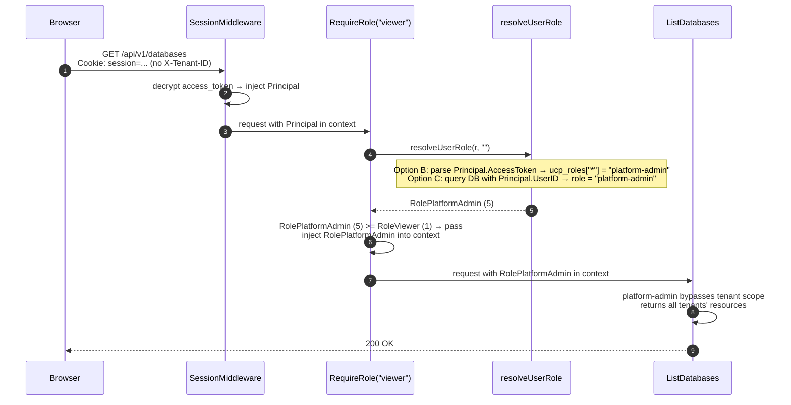

# RBAC — Implementation

---

## Implementation

| Component | File | Status |
|---|---|---|
| `Role` type + context helpers | `auth/context.go` | Not deployed |
| `tenant_role_assignments` DB schema + migration | `db/` | Not deployed |
| DB methods — `GetTenantRole`, `GetAllRolesForUser`, `GetRoleAssignmentsForTenant`, `AssignTenantRole`, `RevokeTenantRole` | `db/` | Not deployed |
| `db.FindUserByEmail()` (for AssignRole email → user_id lookup) | `db/` | Not deployed |
| `resolveUserRole()` | `rbac_handler.go` | Not deployed |
| `RequireRole(minRole)` middleware | `rbac_handler.go` | Not deployed |
| Admin API handlers — `ListRoleAssignments`, `AssignRole`, `RevokeRole` | `rbac_handler.go` | Not deployed |
| Route grouping by role level + admin API route registration | `main.go` | Not deployed |
| Remove `isUserTenantAdmin()` from create/list resource handlers | all resource handlers | Not deployed |
| Remove `isUserTenantAdmin()` from settings handlers (credentials) | `settings_handler.go` | Not deployed |
| `/auth/me` role extension | `bff_auth.go` (`MeHandler`) | Not deployed |
| `useRole()` hook | frontend | Not deployed |
| Sidebar role-aware rendering (hide nav items) | `Sidebar.jsx` | Not deployed |
| In-page action buttons role-aware rendering | all list/detail components | Not deployed |
| `ForbiddenPage` component | `pages/ForbiddenPage.jsx`, frontend | Not deployed |
| `RequireRole` route wrapper — wrap restricted routes in `App.jsx` | `App.jsx`, frontend | Not deployed |
| Role management UI | frontend | Not deployed |

---

## Scope

### In Scope

- **Role type** — ordered `Role` integer type in `auth/context.go` enabling `>=` comparison
- **DB schema** — `tenant_role_assignments(user_id, tenant_rns, role)` table; `platform-admin` stored as `tenant_rns = '*'`
- **Role resolution** — `resolveUserRole()` queries `tenant_role_assignments` using `Principal.UserID` from the request context (injected by `SessionMiddleware`)
- **Admin API** — list, assign, and revoke role assignments per tenant; gated behind `tenant-admin`
- **`/auth/me` role extension** — `MeHandler` queries `tenant_role_assignments` and adds a `roles` map and `isPlatformAdmin` flag to the response; frontend reads this on mount
- **`useRole()` hook** — derives the caller's role for the currently selected tenant from `user.roles`; exposes `hasMinRole(min)` for conditional rendering
- **DB query methods** — `GetTenantRole`, `GetAllRolesForUser`, `AssignTenantRole`, `RevokeTenantRole`, `GetRoleAssignmentsForTenant`, `FindUserByEmail`
- **Admin API** — `ListRoleAssignments`, `AssignRole`, `RevokeRole` handlers + route registration; gated behind `tenant-admin`
- **RequireRole middleware** — per-route middleware that resolves role, enforces minimum, and injects resolved role into request context
- **Route refactoring** — routes grouped by minimum role; `isUserTenantAdmin()` removed from all resource and settings handlers and replaced by middleware
- **platform-admin bypass** — cross-tenant role resolved independently of `X-Tenant-ID`
- **Sidebar role-aware rendering** — nav items hidden when caller lacks minimum role
- **In-page action buttons** — create/delete hidden for viewer and approver; approve/reject hidden below approver
- **`RequireRole` route wrapper + `ForbiddenPage`** — direct URL access blocked with 403 page for insufficient role
- **Role management UI** — frontend page for admins to manage role assignments within a tenant

### Out of Scope

- **Keycloak configuration** — no changes to Keycloak; roles are owned entirely by UCP.

---

## Endpoint-to-Role Mapping

| Endpoint | Method | Minimum role |
|---|---|---|
| `/api/v1/databases` | GET | `viewer` |
| `/api/v1/databases` | POST | `deployer` |
| `/api/v1/databases/{name}` | GET | `viewer` |
| `/api/v1/databases/{name}` | DELETE | `deployer` |
| `/api/v1/compute` | GET | `viewer` |
| `/api/v1/compute` | POST | `deployer` |
| `/api/v1/compute/{name}` | GET | `viewer` |
| `/api/v1/compute/{name}` | DELETE | `deployer` |
| `/api/v1/storage` | GET | `viewer` |
| `/api/v1/storage` | POST | `deployer` |
| `/api/v1/storage/{name}` | GET | `viewer` |
| `/api/v1/storage/{name}` | DELETE | `deployer` |
| `/api/v1/kubernetes-clusters` | GET | `viewer` |
| `/api/v1/kubernetes-clusters` | POST | `deployer` |
| `/api/v1/kubernetes-clusters/{name}` | GET | `viewer` |
| `/api/v1/kubernetes-clusters/{name}` | DELETE | `deployer` |
| `/api/v1/load-balancers` | GET | `viewer` |
| `/api/v1/load-balancers` | POST | `deployer` |
| `/api/v1/load-balancers/{name}` | GET | `viewer` |
| `/api/v1/load-balancers/{name}` | DELETE | `deployer` |
| `/api/v1/workflows/{id}/approve` | POST | `approver` |
| `/api/v1/workflows/{id}/reject` | POST | `approver` |
| `/api/v1/settings/credentials` | GET, POST | `tenant-admin` |
| `/api/v1/settings/credentials/{provider}` | DELETE | `tenant-admin` |
| `/api/v1/settings/credentials/roc` | GET, POST | `tenant-admin` |
| `/api/v1/settings/credentials/all` | GET | `platform-admin` |

---

## UI-to-Role Mapping

### Sidebar navigation

Navigation items are hidden when the caller lacks the minimum role. Direct URL
access (bookmark, address bar) is also blocked — a `RequireRole` route wrapper
renders a 403 page instead of the content if the check fails.

| Item | Route | Minimum role | If insufficient role |
|---|---|---|---|
| Database → List | `/` | `viewer` | — (all tenant-authenticated users) |
| Database → Create | `/create` | `deployer` | Hidden in sidebar + 403 on direct access |
| Compute → List | `/compute` | `viewer` | — |
| Compute → Create | `/compute/create` | `deployer` | Hidden + 403 |
| Storage → List | `/storage` | `viewer` | — |
| Storage → Create | `/storage/create` | `deployer` | Hidden + 403 |
| Kubernetes → List | `/kubernetes` | `viewer` | — |
| Kubernetes → Create | `/kubernetes/create` | `deployer` | Hidden + 403 |
| Drift → List | `/drift` | `viewer` | — |
| Quotas → Usage | `/quota` | `viewer` | — |
| Terraform | `/terraform/*` | — | Out of RBAC scope (experimental) |
| Admin → Workflows | `/admin/workflows` | `viewer` | — (approve/reject actions gated separately) |
| Admin → Kube Resources | `/admin/kube-resources` | `platform-admin` | Hidden + 403 |
| Settings → Credentials | `/settings/credentials` | `tenant-admin` | Hidden + 403 |
| Settings → Tenants | `/admin/tenants` | `platform-admin` | Hidden + 403 |
| Settings → Role Management | `/settings/roles` | `tenant-admin` | Hidden + 403 |

### In-page actions

| Action | Page | Minimum role |
|---|---|---|
| Create button | All resource list pages | `deployer` |
| Delete button | All resource list/detail pages | `deployer` |
| Approve button | Workflows page | `approver` |
| Reject button | Workflows page | `approver` |
| Upload credentials | Settings → Credentials | `tenant-admin` |
| Assign / revoke role | Settings → Role Management | `tenant-admin` |

---

## API Sequence — /auth/me on Mount

The frontend `AuthProvider` calls `/auth/me` on mount. With the role extension,
the response now includes the caller's role assignments so the UI has everything
it needs before the first page renders.



---

## UI Sequence — Role-Aware Rendering

When the user selects a tenant, `useRole()` derives the effective role from the
already-stored `user.roles` — no additional API call.



---

## API Sequence — RequireRole Check

`POST /api/v1/databases` (deployer minimum)

By the time `RequireRole` runs, `SessionMiddleware` has already injected the
`Principal` into context. `resolveUserRole` reads from the `Principal` — no
additional network call to Horizon. The exact source (JWT claim or DB) depends
on the chosen approach.



---

## API Sequence — platform-admin Cross-Tenant Access

`GET /api/v1/databases` (viewer minimum, no X-Tenant-ID)



---

## Verification

### viewer blocked from POST

```bash
COOKIE="Cookie: session=<viewer-session>"

# List — allowed
curl -s -H "$COOKIE" -H "X-Tenant-ID: $TENANT" \
  http://localhost:8080/api/v1/databases | jq '.count'
# → 200

# Create — blocked
curl -s -X POST -H "$COOKIE" -H "X-Tenant-ID: $TENANT" \
  -d '{"name":"test","provider":"gcp","engineVersion":"15","projectId":"..."}' \
  http://localhost:8080/api/v1/databases
# {"error":"insufficient role: deployer required"}
```

### deployer blocked from credentials

```bash
COOKIE="Cookie: session=<deployer-session>"

curl -s -X POST -H "$COOKIE" -H "X-Tenant-ID: $TENANT" \
  http://localhost:8080/api/v1/settings/credentials
# {"error":"insufficient role: tenant-admin required"}
```

### approver can approve, not provision

```bash
COOKIE="Cookie: session=<approver-session>"

# Approve — allowed
curl -s -X POST -H "$COOKIE" -H "X-Tenant-ID: $TENANT" \
  http://localhost:8080/api/v1/workflows/<id>/approve
# → 200

# Create resource — blocked
curl -s -X POST -H "$COOKIE" -H "X-Tenant-ID: $TENANT" \
  -d '{"name":"test","provider":"gcp",...}' \
  http://localhost:8080/api/v1/storage
# {"error":"insufficient role: deployer required"}
```
