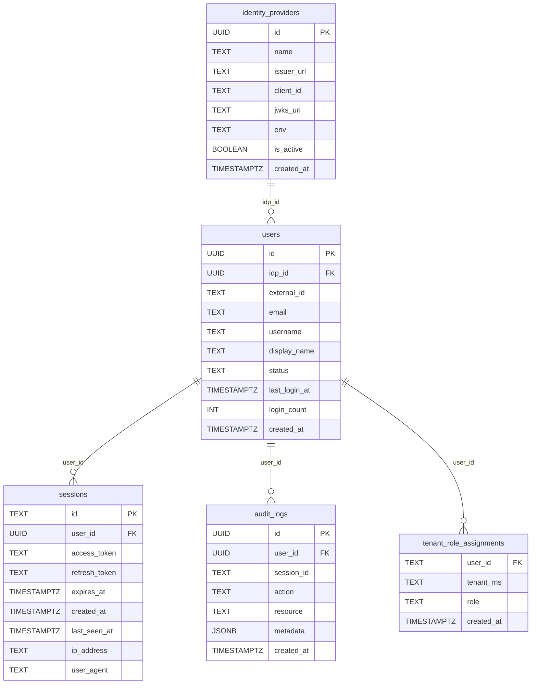

# RBAC — UCP Design

---

## Role Type

`Role` is added to `auth/context.go` alongside the existing `Principal` type.
Using an ordered integer enables minimum-role checks as a single `>=` comparison
rather than a lookup table.

```go
// auth/context.go
type Role int

const (
    RoleUnknown     Role = iota // 0 — unresolved / not a tenant member
    RoleViewer                  // 1
    RoleApprover                // 2
    RoleDeployer                // 3
    RoleTenantAdmin             // 4
    RolePlatformAdmin           // 5
)

func (r Role) String() string {
    switch r {
    case RoleViewer:      return "viewer"
    case RoleApprover:    return "approver"
    case RoleDeployer:    return "deployer"
    case RoleTenantAdmin: return "tenant-admin"
    case RolePlatformAdmin: return "platform-admin"
    default:              return "unknown"
    }
}

type roleContextKey struct{}

func WithRole(ctx context.Context, role Role) context.Context {
    return context.WithValue(ctx, roleContextKey{}, role)
}

func RoleFromContext(ctx context.Context) (Role, bool) {
    r, ok := ctx.Value(roleContextKey{}).(Role)
    return r, ok
}
```

---

## Database ERD



| Table | Origin | Modified by MCUCP-191 |
|---|---|---|
| `identity_providers` | Pre-existing | No |
| `users` | Pre-existing | No |
| `sessions` | Pre-existing | No |
| `audit_logs` | Pre-existing | No |
| `tenant_role_assignments` | **Added by MCUCP-191** | — |

No pre-existing tables were altered. MCUCP-191 only adds the new
`tenant_role_assignments` table and the query methods in `db/roles.go`
that operate on it.

`tenant_rns = '*'` in `tenant_role_assignments` denotes a platform-admin — a
cross-tenant role not bound to any specific tenant RNS.

---

## Database Schema

```sql
CREATE TABLE tenant_role_assignments (
    user_id    TEXT NOT NULL REFERENCES users(id),
    tenant_rns TEXT NOT NULL,
    role       TEXT NOT NULL CHECK (role IN (
                   'platform-admin', 'tenant-admin',
                   'deployer', 'approver', 'viewer')),
    created_at TIMESTAMPTZ NOT NULL DEFAULT now(),
    PRIMARY KEY (user_id, tenant_rns)
);
```

`platform-admin` is stored as a row with `tenant_rns = '*'` — not tied to any
specific tenant, matches regardless of the `X-Tenant-ID` in the request.

---

## Role Resolution — Design

Role resolution uses a **per-request cache** to avoid repeated DB queries.
A single `GetAllRolesForUser` call is made at most once per request; all
subsequent checks within the same request read from the Go context.

### loadRoles

`loadRoles` fetches role assignments and stores them in the request context.
Returns immediately on cache hit. Branches on whether `X-Tenant-ID` is set
to minimise the query:

```go
func (s *APIServer) loadRoles(r *http.Request) (*http.Request, map[string]string, error) {
    if cached, ok := r.Context().Value(cachedRolesKey{}).(map[string]string); ok {
        return r, cached, nil  // cache hit — 0 DB calls
    }
    tenantID := strings.TrimSpace(r.Header.Get("X-Tenant-ID"))

    var roles map[string]string
    if tenantID != "" {
        // Fetch only the specific tenant + '*' sentinel — at most 2 primary-key lookups
        roles, err = s.db.GetTenantRoles(principal.UserID, tenantID)
    } else {
        // Need all roles to derive the maximum across tenants
        roles, err = s.db.GetAllRolesForUser(principal.UserID)
    }
    r = r.WithContext(context.WithValue(r.Context(), cachedRolesKey{}, roles))
    return r, roles, nil
}
```

`GetTenantRoles` uses `WHERE user_id = $1 AND tenant_rns IN ($2, '*')` —
a primary-key index lookup returning at most 2 rows.

### roleFromMap

Derives a `Role` from the cached map for a given `tenantID`:

```go
func roleFromMap(allRoles map[string]string, tenantID string) Role {
    if allRoles["*"] == "platform-admin" {
        return RolePlatformAdmin            // platform-admin sentinel
    }
    if tenantID != "" {
        return stringToRole(allRoles[tenantID])  // specific tenant
    }
    // X-Tenant-ID absent — return highest role across all tenants
    max := RoleUnknown
    for _, roleStr := range allRoles {
        if r := stringToRole(roleStr); r > max { max = r }
    }
    return max
}
```

When `X-Tenant-ID` is absent, the caller's maximum role across all their
tenants is used. This allows `RequireRole` checks to pass without requiring
the header — for example, a user with `deployer` in tenant-A can delete
their resource without specifying the header. The per-handler ownership
check then verifies their role against the resource's annotated tenant.

### resolveUserRole

Reads from context cache — zero additional DB calls after `loadRoles` has run:

```go
func (s *APIServer) resolveUserRole(r *http.Request, tenantID string) (Role, error) {
    allRoles, ok := r.Context().Value(cachedRolesKey{}).(map[string]string)
    if !ok {
        _, allRoles, _ = s.loadRoles(r)  // fallback if cache not populated
    }
    return roleFromMap(allRoles, tenantID), nil
}
```

### DB call count per request

| Scenario | DB calls |
|---|---|
| `X-Tenant-ID` present | 1 (`GetTenantRoles` — 2 rows max) |
| `X-Tenant-ID` absent | 1 (`GetAllRolesForUser` — all rows) |
| Delete handler ownership check | 0 (reads context cache) |
| Any subsequent check in same request | 0 (cache hit) |
| `/auth/me` | 1 (`GetAllRolesForUser` directly, independent of cache) |

---

## Admin API

Role assignments are managed via three endpoints, all gated behind
`RequireRole(RoleTenantAdmin)`. `platform-admin` passes all role checks
automatically.

```go
// rbac_handler.go
func (s *APIServer) ListRoleAssignments(w http.ResponseWriter, r *http.Request)
func (s *APIServer) AssignRole(w http.ResponseWriter, r *http.Request)
func (s *APIServer) RevokeRole(w http.ResponseWriter, r *http.Request)
```

`AssignRole` request body:

```json
{ "userEmail": "user@example.com", "role": "deployer" }
```

The handler resolves `userEmail` to a `user_id` via the `users` table (user
must have logged in at least once for JIT provisioning to have created their
record) before inserting into `tenant_role_assignments`.

---

## /auth/me Extension

`MeHandler` in `bff_auth.go` is extended to query `tenant_role_assignments`
for the caller and include the results in the response. The frontend calls
this on mount via `AuthProvider`, so role information is available immediately
after login.

Extended response:

```json
{
  "id": "abc123",
  "email": "user@example.com",
  "name": "User Name",
  "roles": {
    "rns:roc:iam::clsd-ucp": "deployer",
    "rns:roc:iam::other-tenant": "viewer"
  },
  "isPlatformAdmin": false
}
```

`isPlatformAdmin` is `true` when a `tenant_rns = '*'` row exists for the user.
The `roles` map contains only tenant-scoped assignments — `platform-admin` is
not included as a tenant entry, it is expressed via `isPlatformAdmin`.

---

## useRole Hook

`useRole()` derives the caller's effective role for the currently selected
tenant from the data already in `AuthProvider`. No extra API call needed.

```ts
type Role = 'platform-admin' | 'tenant-admin' | 'deployer' | 'approver' | 'viewer'

const ROLE_LEVEL: Record<Role, number> = {
  'viewer': 1,
  'approver': 2,
  'deployer': 3,
  'tenant-admin': 4,
  'platform-admin': 5,
}

function useRole() {
  const { user } = useAuth()
  const { selectedTenant } = useTenantContext()

  if (user?.isPlatformAdmin) {
    return { role: 'platform-admin', hasMinRole: () => true }
  }

  const role: Role | null = selectedTenant
    ? (user?.roles?.[selectedTenant.rns] ?? null)
    : null

  const hasMinRole = (min: Role) =>
    role !== null && ROLE_LEVEL[role] >= ROLE_LEVEL[min]

  return { role, hasMinRole }
}
```

Usage in components:

```tsx
const { hasMinRole } = useRole()

{hasMinRole('deployer') && <CreateButton />}
{hasMinRole('deployer') && <DeleteButton />}
{hasMinRole('approver') && <ApproveButton />}
{hasMinRole('tenant-admin') && <CredentialsMenuItem />}
```

When no tenant is selected, `role` is `null` and `hasMinRole` returns `false`
for all checks — all action buttons are hidden until the user selects a tenant.

---

## Frontend Route Guard

Hiding a menu item is not sufficient — a user can still navigate directly to a
restricted URL via the address bar or a bookmark. A `RequireRole` wrapper
component renders a 403 page instead of the route content when the check fails:

```tsx
// components/RequireRole.tsx
function RequireRole({ min, children }: { min: Role; children: ReactNode }) {
  const { hasMinRole } = useRole()

  if (!hasMinRole(min)) {
    return <ForbiddenPage />
  }
  return <>{children}</>
}
```

Applied per route in `App.jsx`:

```tsx
<Route
  path="/settings/credentials"
  element={
    <RequireRole min="tenant-admin">
      <SettingsCredentialsPage />
    </RequireRole>
  }
/>
<Route
  path="/admin/kube-resources"
  element={
    <RequireRole min="platform-admin">
      <KubeResourcesPage />
    </RequireRole>
  }
/>
```

`ForbiddenPage` displays a 403 message and a link back to the home page. It
does not redirect — a redirect would hide the fact that the access was denied,
making it harder to diagnose misconfigured role assignments.

---

## RequireRole Middleware

`RequireRole` calls `loadRoles` first to populate the per-request cache,
then resolves the effective role and enforces the minimum. The handler and
any subsequent `resolveUserRole` calls in the same request hit the cache.

```go
// rbac_handler.go
func (s *APIServer) RequireRole(minRole authpkg.Role) mux.MiddlewareFunc {
    return func(next http.Handler) http.Handler {
        return http.HandlerFunc(func(w http.ResponseWriter, r *http.Request) {
            tenantID := strings.TrimSpace(r.Header.Get("X-Tenant-ID"))

            // Populate cache — at most 1 DB call per request.
            var err error
            r, _, err = s.loadRoles(r)
            if err != nil {
                respondError(w, http.StatusInternalServerError,
                    "Failed to load roles: "+err.Error())
                return
            }

            role, err := s.resolveUserRole(r, tenantID)  // reads cache
            if err != nil {
                respondError(w, http.StatusInternalServerError,
                    "Failed to resolve user role: "+err.Error())
                return
            }
            if role < minRole {
                respondError(w, http.StatusForbidden,
                    fmt.Sprintf("insufficient role: %s required", minRole))
                return
            }

            // Pass updated request (with cache + resolved role in context).
            next.ServeHTTP(w, r.WithContext(authpkg.WithRole(r.Context(), role)))
        })
    }
}
```

---

## Route Grouping

Routes are grouped by minimum required role. Each group gets a dedicated
subrouter with the appropriate middleware applied once — replacing the ad-hoc
`isUserTenantAdmin()` calls in individual handlers.

```go
// main.go — route registration
viewerRoutes := api.PathPrefix("").Subrouter()
viewerRoutes.Use(server.RequireRole(authpkg.RoleViewer))

deployerRoutes := api.PathPrefix("").Subrouter()
deployerRoutes.Use(server.RequireRole(authpkg.RoleDeployer))

approverRoutes := api.PathPrefix("").Subrouter()
approverRoutes.Use(server.RequireRole(authpkg.RoleApprover))

tenantAdminRoutes := api.PathPrefix("").Subrouter()
tenantAdminRoutes.Use(server.RequireRole(authpkg.RoleTenantAdmin))

platformAdminRoutes := api.PathPrefix("").Subrouter()
platformAdminRoutes.Use(server.RequireRole(authpkg.RolePlatformAdmin))

// Resource reads
viewerRoutes.HandleFunc("/databases", server.ListDatabases).Methods("GET")
viewerRoutes.HandleFunc("/databases/{name}", server.GetDatabase).Methods("GET")
// ... other GET endpoints

// Resource mutations
deployerRoutes.HandleFunc("/databases", server.CreateDatabase).Methods("POST")
deployerRoutes.HandleFunc("/databases/{name}", server.DeleteDatabase).Methods("DELETE")
// ... other POST/DELETE endpoints

// Workflow approval
approverRoutes.HandleFunc("/workflows/{workflowId}/approve", server.ApproveWorkflow).Methods("POST")
approverRoutes.HandleFunc("/workflows/{workflowId}/reject", server.RejectWorkflow).Methods("POST")

// Credential management
tenantAdminRoutes.HandleFunc("/settings/credentials", server.GetCredentials).Methods("GET")
tenantAdminRoutes.HandleFunc("/settings/credentials", server.UpsertCredentials).Methods("POST")
tenantAdminRoutes.HandleFunc("/settings/credentials/{provider}", server.DeleteCredentials).Methods("DELETE")

// Platform-wide operations
platformAdminRoutes.HandleFunc("/settings/credentials/all", server.ListAllCredentials).Methods("GET")
```

---

## Handler Cleanup

Once `RequireRole` enforces access at the route level, individual handlers
remove their `isUserTenantAdmin()` calls for create operations. The role check
at the middleware layer is the single enforcement point.

Delete handlers retain `isUserTenantAdmin()` for the **ownership check** — this
reads the tenant from the XR annotation (not from `X-Tenant-ID`) and is a
distinct check that verifies the resource belongs to the caller's tenant. It is
not replaced by `RequireRole`.

---

## Role Management UI

A role management page in the frontend lets `tenant-admin` and `platform-admin`
users assign and revoke roles within a tenant. The page is accessible from the
Settings or Admin section and scoped to the tenant selected in the global
`TenantSelector`.

The UI calls the admin API endpoints defined above. It needs to:
- List current role assignments for the selected tenant
- Show a user search/input to assign a role (user must have logged in once)
- Allow changing or removing an existing assignment
