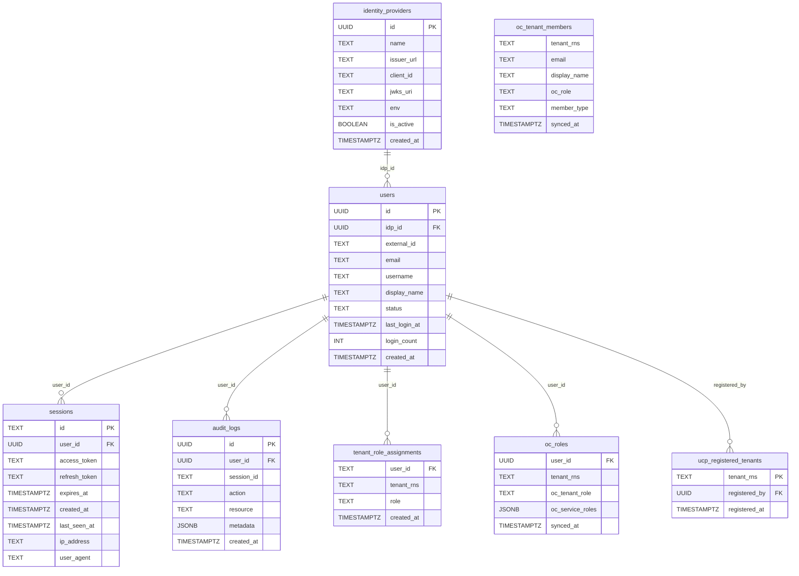

# RBAC — UCP Design

---

## Permission-Based Role Model (Phase 2)

UCP uses three roles: `developer`, `tenant-admin`, and `platform-admin`.
Rather than a linear integer hierarchy, each role is defined as a set of
**permissions** using a bitmask. The enforcement check changes from
`role >= minRole` to `role.Has(permission)`.

This ensures future roles can be added (e.g. a `drift-operator` that can
approve drift alerts but not provision resources) without restructuring the
hierarchy or renumbering constants.

```go
// auth/context.go
type Permission uint

const (
    PermRead      Permission = 1 << 0  // list, get resources
    PermProvision Permission = 1 << 1  // create, delete resources
    PermApprove   Permission = 1 << 2  // approve, reject workflows
    PermManage    Permission = 1 << 3  // credentials, settings, role management
    PermPlatform  Permission = 1 << 4  // cross-tenant operations
)

var RolePermissions = map[string]Permission{
    "developer":      PermRead | PermProvision,
    "tenant-admin":   PermRead | PermProvision | PermApprove | PermManage,
    "platform-admin": PermRead | PermProvision | PermApprove | PermManage | PermPlatform,
}

func (p Permission) Has(required Permission) bool {
    return p&required == required
}
```

`developer` has `PermProvision` but not `PermApprove` — a developer cannot
approve their own provisioning request. Approval is `tenant-admin` only.

Adding a new role in the future (e.g. `drift-operator: PermRead | PermApprove | PermDrift`)
is one line in `RolePermissions` — no schema change, no hierarchy restructuring.

See `RequirePermission Middleware` section for the full implementation.
Route registrations become self-documenting:

```go
api.Handle("/databases",              server.requirePermHandler(authpkg.PermRead,      ...)).Methods("GET")
api.Handle("/databases",              server.requirePermHandler(authpkg.PermProvision,  ...)).Methods("POST")
api.Handle("/workflows/{id}/approve", server.requirePermHandler(authpkg.PermApprove,   ...)).Methods("POST")
api.Handle("/settings/credentials",   server.requirePermHandler(authpkg.PermManage,    ...)).Methods("GET")
api.Handle("/settings/credentials/all", server.requirePermHandler(authpkg.PermPlatform,...)).Methods("GET")
```

### Frontend `hasPermission`

```ts
const ROLE_PERMISSIONS: Record<Role, Set<string>> = {
  'developer':      new Set(['read', 'provision']),
  'tenant-admin':   new Set(['read', 'provision', 'approve', 'manage']),
  'platform-admin': new Set(['read', 'provision', 'approve', 'manage', 'platform']),
}

// useRole() exposes hasPermission instead of hasMinRole
{hasPermission('provision') && <CreateButton />}
{hasPermission('approve')   && <ApproveButton />}
{hasPermission('manage')    && <CredentialsMenu />}
```

---

## Role Type (Phase 1 — deployed)

```go
// auth/context.go
type Role int

const (
    RoleUnknown     Role = iota // 0 — unresolved / not a tenant member
    RoleDeveloper               // 1
    RoleTenantAdmin             // 2
    RolePlatformAdmin           // 3
)

func (r Role) String() string {
    switch r {
    case RoleDeveloper:     return "developer"
    case RoleTenantAdmin:   return "tenant-admin"
    case RolePlatformAdmin: return "platform-admin"
    default:                return "unknown"
    }
}

type roleContextKey struct{}

func WithRole(ctx context.Context, role Role) context.Context {
    return context.WithValue(ctx, roleContextKey{}, role)
}

func RoleFromContext(ctx context.Context) (Role, bool) {
    r, ok := ctx.Value(roleContextKey{}).(Role)
    return r, ok
}
```

---

## Database ERD



| Table | Origin | Modified by MCUCP-191 |
|---|---|---|
| `identity_providers` | Pre-existing | No |
| `users` | Pre-existing | No |
| `sessions` | Pre-existing | No |
| `audit_logs` | Pre-existing | No |
| `tenant_role_assignments` | **Added by MCUCP-191** | — |
| `oc_roles` | **Added by MCUCP-191** | — |
| `ucp_registered_tenants` | **Added by MCUCP-191** | — |
| `oc_tenant_members` | **Added by MCUCP-191** | — |

No pre-existing tables were altered. MCUCP-191 adds four new tables:
- `tenant_role_assignments` — UCP's own access control
- `oc_roles` — OC role mirror per user (requires users FK; only for logged-in members)
- `ucp_registered_tenants` — registry of OC tenants onboarded into UCP
- `oc_tenant_members` — ALL Horizon members by email, **no FK to users**; source for the member picker, works for members who haven't logged in yet

`tenant_rns = '*'` in `tenant_role_assignments` denotes a platform-admin — a
cross-tenant role not bound to any specific tenant RNS.

---

## Database Schema

```sql
CREATE TABLE tenant_role_assignments (
    user_id    TEXT NOT NULL REFERENCES users(id),
    tenant_rns TEXT NOT NULL,
    role       TEXT NOT NULL CHECK (role IN (
                   'platform-admin', 'tenant-admin', 'developer')),
    created_at TIMESTAMPTZ NOT NULL DEFAULT now(),
    PRIMARY KEY (user_id, tenant_rns)
);

CREATE TABLE oc_roles (
    user_id         UUID NOT NULL REFERENCES users(id),
    tenant_rns      TEXT NOT NULL,
    -- OC Level 1 tenant role: 'Tenant Admin' or 'Tenant Member'
    oc_tenant_role  TEXT NOT NULL,
    -- OC Level 2 service roles: {"DBaaS": "operator", "CaaS": "admin", ...}
    -- Null when service roles have not been fetched for this tenant yet.
    oc_service_roles JSONB,
    synced_at       TIMESTAMPTZ NOT NULL DEFAULT now(),
    PRIMARY KEY (user_id, tenant_rns)
);
```

`tenant_role_assignments` is UCP's own access-control table — rows here
drive all `RequirePermission` checks. `platform-admin` is stored with
`tenant_rns = '*'`, not tied to any specific tenant.

`oc_roles` is a persistent mirror of OC data populated during the
login-triggered sync. It is not used for access control today. Populating it
in the PoC proves the Horizon → UCP data pipeline works end-to-end. If
[Option 2](https://confluence.rakuten-it.com/confluence/spaces/UCP/pages/6645566515/UCP+Identity+Tenancy+Roles)
(runtime OC service-role check at provisioning time) is ever chosen, the
collection method is already tested and trusted — enabling it is a middleware
change only, with the permission middleware reading from `oc_roles` instead of
calling the Horizon API at request time.

---

## Role Resolution — Design

Role resolution uses a **per-request in-memory store** to avoid repeated DB
queries. At most one DB call per request fetches the relevant role rows and
stores them in the request context; all subsequent checks read from there.

### loadRoles

`loadRoles` takes the resolved `tenantID` and branches based on whether it is
known. A user can belong to many tenants, so fetching all their rows when only
one is needed is wasteful.

```go
func (s *APIServer) loadRoles(r *http.Request, tenantID string) (*http.Request, map[string]string, error) {
    if cached, ok := r.Context().Value(cachedRolesKey{}).(map[string]string); ok {
        return r, cached, nil  // already loaded this request
    }

    var roles map[string]string
    var err error

    if tenantID != "" {
        // Tenant is known — fetch only this tenant's row + the platform-admin
        // sentinel ('*'). Two rows max regardless of total tenant membership.
        roles, err = s.db.GetRolesForUserInTenant(principal.UserID, tenantID)
    } else {
        // No tenant context — need the full set to derive the max role.
        roles, err = s.db.GetAllRolesForUser(principal.UserID)
    }

    if err != nil {
        return r, nil, fmt.Errorf("failed to load roles: %w", err)
    }
    r = r.WithContext(context.WithValue(r.Context(), cachedRolesKey{}, roles))
    return r, roles, nil
}
```

`GetRolesForUserInTenant` issues a targeted query:

```sql
SELECT tenant_rns, role
FROM tenant_role_assignments
WHERE user_id = $1
  AND tenant_rns IN ($2, '*')
```

At most 2 rows — the specific tenant and the platform-admin sentinel.

### roleFromMap

Derives a `Role` from the loaded map for a given `tenantID`:

```go
func roleFromMap(allRoles map[string]string, tenantID string) Role {
    if allRoles["*"] == "platform-admin" {
        return RolePlatformAdmin            // platform-admin sentinel
    }
    if tenantID != "" {
        return stringToRole(allRoles[tenantID])  // specific tenant
    }
    // No tenant context — return highest role across all tenants.
    max := RoleUnknown
    for _, roleStr := range allRoles {
        if r := stringToRole(roleStr); r > max { max = r }
    }
    return max
}
```

### resolveUserRole

Reads from the in-memory store — zero additional DB calls after `loadRoles`
has run:

```go
func (s *APIServer) resolveUserRole(r *http.Request, tenantID string) (Role, error) {
    allRoles, ok := r.Context().Value(cachedRolesKey{}).(map[string]string)
    if !ok {
        _, allRoles, _ = s.loadRoles(r, tenantID)  // fallback
    }
    return roleFromMap(allRoles, tenantID), nil
}
```

### DB call count per request

| Scenario | Slug resolve | Role fetch | Total |
|---|---|---|---|
| `GET /databases?tenantId=rns:...` | 0 | `GetRolesForUserInTenant` (≤2 rows) | 1 |
| `DELETE /tenants/clsd-ucp/databases/foo` | 1 (`resolveTenantIDBySlug`) | `GetRolesForUserInTenant` (≤2 rows) | 2 |
| `GET /databases` (no tenantId) | 0 | `GetAllRolesForUser` (full scan) | 1 |
| `/auth/me` | 0 | `GetAllRolesForUser` (independent of middleware) | 1 |
| Any subsequent check in same request | 0 | 0 (in-memory store hit) | 0 |

---

## Admin API

The role management API has two access tiers:

**Open to all authenticated users:**
```go
func (s *APIServer) ListTenantMembers(w http.ResponseWriter, r *http.Request)
// GET /admin/tenants/{tenantSlug}/members
// Returns all OC-synced members with their OC role and current UCP role.
// Any logged-in user can view — no UCP role required.
// Sourced from oc_roles table (no live Horizon call).
```

**Requires PermManage (tenant-admin or platform-admin):**
```go
func (s *APIServer) ListRoleAssignments(w http.ResponseWriter, r *http.Request)
func (s *APIServer) AssignRole(w http.ResponseWriter, r *http.Request)
func (s *APIServer) RevokeRole(w http.ResponseWriter, r *http.Request)
// Returns 403 if the caller attempts to revoke their own role (self-revoke blocked).
```

`AssignRole` request body:

```json
{ "userEmail": "user@example.com", "role": "developer" }
```

The handler resolves `userEmail` to a `user_id` via the `users` table (user
must have logged in at least once for JIT provisioning to have created their
record) before inserting into `tenant_role_assignments`.

---

## /auth/me Extension

`MeHandler` in `bff_auth.go` is extended to query `tenant_role_assignments`
for the caller and include the results in the response. The frontend calls
this on mount via `AuthProvider`, so role information is available immediately
after login.

Extended response:

```json
{
  "id": "abc123",
  "email": "user@example.com",
  "name": "User Name",
  "roles": {
    "rns:roc:iam::clsd-ucp": "developer",
    "rns:roc:iam::other-tenant": "developer"
  },
  "isPlatformAdmin": false
}
```

`isPlatformAdmin` is `true` when a `tenant_rns = '*'` row exists for the user.
The `roles` map contains only tenant-scoped assignments — `platform-admin` is
not included as a tenant entry, it is expressed via `isPlatformAdmin`.

---

## useRole Hook

`useRole()` derives the caller's effective role for the currently selected
tenant from the data already in `AuthProvider`. No extra API call needed.

```ts
type Role = 'platform-admin' | 'tenant-admin' | 'developer'

const ROLE_PERMISSIONS: Record<Role, Set<string>> = {
  'developer':      new Set(['read', 'provision']),
  'tenant-admin':   new Set(['read', 'provision', 'approve', 'manage']),
  'platform-admin': new Set(['read', 'provision', 'approve', 'manage', 'platform']),
}

function useRole() {
  const { user } = useAuth()
  const { selectedTenant } = useTenantContext()

  if (user?.isPlatformAdmin) {
    return { role: 'platform-admin', hasPermission: () => true }
  }

  const role: Role | null = selectedTenant
    ? (user?.roles?.[selectedTenant.rns] ?? null)
    : null

  const hasPermission = (perm: string): boolean =>
    role !== null && (ROLE_PERMISSIONS[role]?.has(perm) ?? false)

  return { role, hasPermission }
}
```

Usage in components:

```tsx
const { hasPermission } = useRole()

{hasPermission('provision') && <CreateButton />}
{hasPermission('provision') && <DeleteButton />}
{hasPermission('approve')   && <ApproveButton />}
{hasPermission('manage')    && <CredentialsMenuItem />}
```

When no tenant is selected, `role` is `null` and `hasPermission` returns `false`
for all checks — all action buttons are hidden until the user selects a tenant.

---

## Frontend Route Guard

Hiding a menu item is not sufficient — a user can still navigate directly to a
restricted URL via the address bar or a bookmark. A `RequireRole` wrapper
component renders a 403 page instead of the route content when the check fails:

```tsx
// components/RequireRole.tsx
function RequireRole({ perm, children }: { perm: string; children: ReactNode }) {
  const { hasPermission } = useRole()

  if (!hasPermission(perm)) {
    return <ForbiddenPage />
  }
  return <>{children}</>
}
```

Applied per route in `App.jsx`:

```tsx
<Route
  path="/settings/credentials"
  element={
    <RequireRole min="tenant-admin">
      <SettingsCredentialsPage />
    </RequireRole>
  }
/>
<Route
  path="/admin/kube-resources"
  element={
    <RequireRole min="platform-admin">
      <KubeResourcesPage />
    </RequireRole>
  }
/>
```

`ForbiddenPage` displays a 403 message and a link back to the home page. It
does not redirect — a redirect would hide the fact that the access was denied,
making it harder to diagnose misconfigured role assignments.

---

## RequirePermission Middleware

`RequirePermission` resolves the tenant from whichever source is present
(`?tenantId=` query param for GETs, `{tenantSlug}` path var for mutations),
calls `loadRoles` with the resolved tenant for a targeted DB fetch, then
checks the permission bitmask.

```go
// rbac_handler.go
func (s *APIServer) RequirePermission(required authpkg.Permission) mux.MiddlewareFunc {
    return func(next http.Handler) http.Handler {
        return http.HandlerFunc(func(w http.ResponseWriter, r *http.Request) {

            // Derive tenant context from whichever source is present.
            tenantID := strings.TrimSpace(r.URL.Query().Get("tenantId"))
            if tenantID == "" {
                if slug := mux.Vars(r)["tenantSlug"]; slug != "" {
                    // Mutations carry tenant as path slug — resolve to RNS.
                    // 1 extra DB call, but avoids a full role scan for users
                    // with many tenant memberships.
                    tenantID, _ = s.resolveTenantIDBySlug(r.Context(), slug)
                }
            }

            var err error
            r, _, err = s.loadRoles(r, tenantID)  // targeted fetch when tenantID is known
            if err != nil {
                respondError(w, http.StatusInternalServerError,
                    "Failed to load roles: "+err.Error())
                return
            }

            role, err := s.resolveUserRole(r, tenantID)  // reads in-memory store
            if err != nil {
                respondError(w, http.StatusInternalServerError,
                    "Failed to resolve user role: "+err.Error())
                return
            }

            perms := authpkg.RolePermissions[role]
            if !perms.Has(required) {
                respondError(w, http.StatusForbidden,
                    fmt.Sprintf("insufficient permission: %s required", required))
                return
            }

            next.ServeHTTP(w, r.WithContext(authpkg.WithRole(r.Context(), role)))
        })
    }
}
```

---

## Route Registration

Routes are registered with `requirePermHandler(perm, handler)` — a per-route
wrapper that enforces the required permission without subrouters. The
`isUserTenantAdmin()` calls previously in individual handlers are removed.

```go
// main.go — route registration
// Resource reads — PermRead
api.Handle("/databases",              server.requirePermHandler(authpkg.PermRead,      server.ListDatabases)).Methods("GET")
api.Handle("/databases/{name}",       server.requirePermHandler(authpkg.PermRead,      server.GetDatabase)).Methods("GET")
// ... other GET endpoints

// Resource mutations — PermProvision (slug-based delete paths from MCUCP-192)
api.Handle("/databases",              server.requirePermHandler(authpkg.PermProvision,  server.CreateDatabase)).Methods("POST")
api.Handle("/tenants/{tenantSlug}/databases/{name}", server.requirePermHandler(authpkg.PermProvision, server.DeleteDatabase)).Methods("DELETE")
// ... other POST/DELETE endpoints

// Workflow approval — PermApprove
api.Handle("/tenants/{tenantSlug}/workflows/{workflowId}/approve", server.requirePermHandler(authpkg.PermApprove, server.ApproveWorkflow)).Methods("POST")
api.Handle("/tenants/{tenantSlug}/workflows/{workflowId}/reject",  server.requirePermHandler(authpkg.PermApprove, server.RejectWorkflow)).Methods("POST")

// Credential management — PermManage
api.Handle("/settings/credentials", server.requirePermHandler(authpkg.PermManage, server.GetCredentials)).Methods("GET")
api.Handle("/settings/credentials", server.requirePermHandler(authpkg.PermManage, server.UpsertCredentials)).Methods("POST")

// Platform-wide operations — PermPlatform
api.Handle("/settings/credentials/all", server.requirePermHandler(authpkg.PermPlatform, server.ListAllCredentials)).Methods("GET")

// Member list — open to all authenticated users (no permission gate)
api.HandleFunc("/admin/tenants/{tenantSlug}/members", server.ListTenantMembers).Methods("GET")

// Role management — PermManage (slug resolved to RNS inside handler)
api.Handle("/admin/tenants/{tenantSlug}/roles",          server.requirePermHandler(authpkg.PermManage, server.ListRoleAssignments)).Methods("GET")
api.Handle("/admin/tenants/{tenantSlug}/roles",          server.requirePermHandler(authpkg.PermManage, server.AssignRole)).Methods("POST")
api.Handle("/admin/tenants/{tenantSlug}/roles/{userID}", server.requirePermHandler(authpkg.PermManage, server.RevokeRole)).Methods("DELETE")
```

---

## Handler Cleanup

`RequirePermission` enforces access at the route level. Individual handlers
no longer call `isUserTenantAdmin()` for create operations.

Delete handlers use the label-based K8s ownership check from MCUCP-192 — the
single `List(FieldSelector=name, LabelSelector=tenant)` call both fetches the
resource and verifies tenant ownership in one round-trip. No Horizon call or
per-handler role check is needed for delete operations.

---

## Role Management UI

A role management page in the frontend lets `tenant-admin` and `platform-admin`
users assign and revoke roles within a tenant. The page is accessible from the
Settings or Admin section and scoped to the tenant selected in the global
`TenantSelector`.

The UI calls the admin API endpoints defined above. It needs to:
- List current role assignments for the selected tenant
- Show a user search/input to assign a role (user must have logged in once)
- Allow changing or removing an existing assignment

---

## Tenant Registration (Phase 3)

A tenant must be explicitly registered in UCP before any resources can be
provisioned for it. Registration is performed by an OC Tenant Admin.

### DB schema

```sql
CREATE TABLE ucp_registered_tenants (
    tenant_rns    TEXT NOT NULL PRIMARY KEY,
    registered_by UUID REFERENCES users(id),
    registered_at TIMESTAMPTZ NOT NULL DEFAULT now()
);

-- ALL Horizon members, no FK to users. Source for member picker.
-- OC role derived by cross-referencing GET /v0/tenants/{rns} admins list.
CREATE TABLE oc_tenant_members (
    tenant_rns   TEXT NOT NULL,
    email        TEXT NOT NULL,
    display_name TEXT NOT NULL DEFAULT '',
    oc_role      TEXT NOT NULL,           -- 'Tenant Admin' or 'Tenant Member'
    member_type  TEXT NOT NULL DEFAULT 'user', -- 'user', 'service_account', 'team'
    synced_at    TIMESTAMPTZ NOT NULL DEFAULT now(),
    PRIMARY KEY (tenant_rns, email)
);
```

### Registration flow

```
POST /api/v1/tenants/register
Body: { "tenantRNS": "rns:roc:iam::coupon-team" }
Requires: caller is OC Tenant Admin (verified via oc_tenant_members table — no UCP role required)
```

On successful registration:
1. Insert row into `ucp_registered_tenants`
2. Query `oc_tenant_members` for all users with `oc_role = 'Tenant Admin'` for this tenant
3. For each OC Tenant Admin who has a UCP user record: assign `tenant-admin` in `tenant_role_assignments`
   (Members who haven't logged in yet will be assigned on their next login sync)

---

## OC → UCP Role Mapping

Used during login-triggered sync to derive a UCP role from a user's OC standing:

| OC Level 1 (tenant role) | UCP role assigned |
|---|---|
| Tenant Admin | `tenant-admin` (auto-assigned on login) |
| Tenant Member | none (must be assigned manually by a UCP `tenant-admin`) |

OC Tenant Members do not receive any UCP role automatically. They can log in,
see their tenants, and know whether a tenant is registered in UCP — but they
cannot take any action until a UCP `tenant-admin` grants them the `developer`
or `tenant-admin` role explicitly.

This keeps provisioning permission explicitly controlled by the tenant-admin,
not derived from OC membership level.

---

## Login-Triggered OC Sync

On every successful OIDC login (in `CallbackHandler`), UCP synchronises the
caller's role assignments and all tenant member data. The sync runs
**synchronously** — all data is written before the login redirect returns.

```
seedOwnRolesFromJWT (fast, synchronous — runs first):
  1. Parse JWT groups → own tenants + roles (no Horizon call)
  2. UPSERT oc_roles for the logged-in user
  3. If OC Admin AND tenant registered → assign tenant-admin

syncOCRolesOnLogin (full sync, synchronous):
  1. Parse JWT groups → own tenant list

  2. For each tenant:
     a. Call GET /v0/tenants/{rns} → get admins[] list
     b. Call GET /v0/tenants/{rns}/members → get all members
     c. Derive OC role: email in admins[] → "Tenant Admin", else "Tenant Member"
     d. For each member:
        - UPSERT oc_tenant_members (email, display_name, oc_role, member_type)
          — always, regardless of whether they have a UCP account
        - If member has a UCP user record:
          · UPSERT oc_roles (for logged-in user: include service roles from JWT)
          · If OC Admin AND tenant registered → assign tenant-admin (upgrade only)
          · OC Member → preserve any manually-granted UCP role
     e. Revoke UCP roles for members no longer in OC member list

  3. For each tenant where logged-in user has a UCP role but is no longer
     in JWT groups → revoke their UCP role; delete from oc_roles and oc_tenant_members
  4. platform-admin rows (tenant_rns = '*') are never touched
```

**Sync rules:**
- OC Admin (tenant registered) → auto-assign `tenant-admin` (upgrade only, never downgrade)
- OC Member → preserve any manually-granted UCP role
- Removed from OC tenant → revoke UCP role; remove from oc_roles + oc_tenant_members
- `platform-admin` → managed manually, never touched by sync
- All members written to `oc_tenant_members` even if they have no UCP account

**PoC gap:** if a user's OC role changes between logins, their UCP role
reflects the stale state until their next login. A future periodic sync
(see notes below) closes this window.

---

## `GET /api/v1/me/tenants`

Returns the user's OC tenants enriched with their UCP status per tenant.
Used by the onboarding landing page.

```json
{
  "items": [
    {
      "rns": "rns:roc:iam::coupon-team",
      "name": "coupon-team",
      "ocRole": "Tenant Admin",
      "ucpRegistered": true,
      "ucpRole": "tenant-admin",
      "admins": null
    },
    {
      "rns": "rns:roc:iam::other-team",
      "name": "other-team",
      "ocRole": "Tenant Member",
      "ucpRegistered": true,
      "ucpRole": null,
      "admins": [
        { "name": "Alice Smith", "email": "alice@example.com" }
      ]
    },
    {
      "rns": "rns:roc:iam::new-team",
      "name": "new-team",
      "ocRole": "Tenant Admin",
      "ucpRegistered": false,
      "ucpRole": null,
      "admins": null
    },
    {
      "rns": "rns:roc:iam::locked-team",
      "name": "locked-team",
      "ocRole": "Tenant Member",
      "ucpRegistered": false,
      "ucpRole": null,
      "admins": [
        { "name": "Bob Jones", "email": "bob@example.com" }
      ]
    }
  ]
}
```

`admins` is populated from the OC tenant's admin list whenever the user
has no UCP role or the tenant is not registered — so they know who to
contact. For tenants where the user already has a UCP role, `admins` is
omitted.

The frontend uses this to render three states per tenant:
- `ucpRegistered: true` + `ucpRole` set → full access at that role level
- `ucpRegistered: true` + `ucpRole: null` → "Contact your tenant-admin to get access" — `admins` list from OC is included so the user can see who to contact (name + email)
- `ucpRegistered: false` + OC role = Tenant Admin → "UCP not set up — register this tenant" (register action available)
- `ucpRegistered: false` + OC role = Tenant Member → "UCP not set up for this tenant" — `admins` list shown so the user can request setup

The `admins` field is populated from OC for unregistered tenants and for
registered tenants where the user has no UCP role.

---

## Keycloak JWT Structure

The Keycloak access token issued by the ROC realm contains a `groups` claim
that encodes the user's tenant membership, tenant-level role, and all
service-level roles across every tenant they belong to.

**Observed format (QA2 realm, Tenant Admin account):**

```json
{
  "iss": "https://qa2-accounts-onecloud.rakuten-it.com/auth/realms/roc",
  "sub": "<keycloak-user-id>",
  "email": "user@rakuten.com",
  "preferred_username": "user.name",
  "groups": [
    "rns:roc:iam::clsd-ucp:roles:admin",
    "rns:roc:dbaas::clsd-ucp:roles:admin",
    "rns:roc:caas::clsd-ucp:roles:admin",
    "rns:roc:lbaas::clsd-ucp:roles:lbaas-operator",
    "rns:roc:staas::clsd-ucp:roles:admin"
  ]
}
```

**Pattern:** `rns:roc:{service}::{tenant-slug}:roles:{role}`

| Entry | Meaning |
|---|---|
| `rns:roc:iam::{tenant}:roles:admin` | OC Tenant Admin for this tenant |
| `rns:roc:iam::{tenant}:roles:member` | OC Tenant Member for this tenant |
| `rns:roc:dbaas::{tenant}:roles:admin` | DBaaS admin service role |
| `rns:roc:caas::{tenant}:roles:edit` | CaaS edit service role |
| `rns:roc:lbaas::{tenant}:roles:lbaas-operator` | LBaaS operator service role |

The `iam` service entry is the canonical **tenant-level** role. All other service
entries are **service-level** roles within that tenant. The assumption (unverified
for Tenant Member accounts — see open questions) is that both admin and member
have a corresponding `rns:roc:iam::{tenant}:roles:{admin|member}` entry.

---

### JWT-Based Sync for logged-in user's own data

The `groups` claim replaces **one** of the two Horizon calls in the login
sync: the call that fetches the logged-in user's own tenant memberships
(`GET /v0/members/{email}/tenants`). This is implemented in `seedOwnRolesFromJWT`
which parses the JWT directly — no Horizon call for the logged-in user's own data.
The second call — fetching all OTHER members of a tenant
(`GET /v0/tenants/{rns}/members`) — still requires Horizon because the JWT only
contains the currently authenticated user's data. No other user's roles are
encoded in someone else's token.

**What JWT replaces:**

| Current | Replacement |
|---|---|
| `GET /v0/members/{email}/tenants` | Parse `rns:roc:iam::{tenant}:roles:{role}` from JWT `groups` |
| `oc_roles` service role data | Parse `rns:roc:{service}::{tenant}:roles:{role}` from JWT `groups` |

**What still requires Horizon:**

| Still needed | Why |
|---|---|
| `GET /v0/tenants/{rns}/members` | JWT only encodes the logged-in user — fetching all other members of a tenant requires an API call |

The redesigned sync for the logged-in user's own data:

```
1. Parse groups from JWT access token
2. For each group matching rns:roc:iam::{tenant}:roles:{role}:
   a. Extract tenant slug and OC tenant role (admin or member)
   b. Apply UCP role sync rules (admin→tenant-admin upgrade, member→preserve)
   c. Collect all service roles for this tenant from other group entries
   d. UPSERT oc_roles with oc_tenant_role and oc_service_roles (JSONB)
3. For each UCP role assignment not covered by JWT groups → revoke
4. platform-admin rows ('*') never touched
5. For each tenant the user is admin of: still call GET /v0/tenants/{rns}/members
   to sync all other members' UCP data (no JWT available for other users)
```

**Helper — parse groups from JWT:**

```go
type OCTenantFromJWT struct {
    TenantSlug   string
    TenantRole   string            // 'admin' or 'member'
    ServiceRoles map[string]string // {"dbaas": "admin", "caas": "edit"}
}

func parseOCGroupsFromJWT(groups []string) map[string]OCTenantFromJWT {
    result := map[string]OCTenantFromJWT{}
    for _, g := range groups {
        // rns:roc:{service}::{tenant-slug}:roles:{role}
        parts := strings.SplitN(g, "::", 2)
        if len(parts) != 2 { continue }
        svcParts  := strings.Split(parts[0], ":")
        roleParts := strings.SplitN(parts[1], ":roles:", 2)
        if len(svcParts) < 3 || len(roleParts) != 2 { continue }

        service, tenantSlug, role := svcParts[2], roleParts[0], roleParts[1]
        entry := result[tenantSlug]
        entry.TenantSlug = tenantSlug
        if service == "iam" {
            entry.TenantRole = role
        } else {
            if entry.ServiceRoles == nil { entry.ServiceRoles = map[string]string{} }
            entry.ServiceRoles[service] = role
        }
        result[tenantSlug] = entry
    }
    return result
}
```

`fetchOCMemberTenants` (`GET /v0/members/{email}/tenants`) is not called; the
logged-in user's own tenant list and OC tenant role come entirely from the JWT
`groups` claim. The open question is whether Tenant Members also have a
`rns:roc:iam::{tenant}:roles:member` entry — if confirmed, the admins[]
cross-reference step in `syncOCRolesOnLogin` can be simplified (see open questions).

---

### Service Roles from JWT and Option 2

Because all OC service roles are in the `groups` claim, enabling
[Option 2](https://confluence.rakuten-it.com/confluence/spaces/UCP/pages/6645566515/UCP+Identity+Tenancy+Roles)
(runtime OC service-role check at provisioning time) requires only:

1. Parse `groups` from the JWT at login → store in `oc_roles` (already done)
2. At provisioning time: read from `oc_roles` and check the required service role

No live Horizon call at request time. The `oc_roles` table already stores
`oc_service_roles` as JSONB populated from the JWT groups on every login.

---

## Periodic Sync (deferred — notes only)

A background polling job to keep `tenant_role_assignments` consistent with OC
membership between user logins is deferred for the PoC.

The login-triggered sync handles the same use cases for active users. The gap
is users whose OC role changes while they already have an active UCP session —
their role reflects stale state until their next login.

When implemented, the sync would:
```
For each tenant in ucp_registered_tenants:
  1. GET /v0/tenants/{tenantRNS}/members  (Core Data)
  2. Apply the same login-triggered sync rules:
     - OC Admin with lower UCP role → upgrade to tenant-admin
     - User removed from OC → revoke UCP role
     - OC Member with manually-granted UCP role → preserve
     - platform-admin rows → never touched
```

No event streaming is available from Core Data, so polling would be the only
option. The sync interval and acceptable staleness window are to be defined
when this is implemented.

---

## Open Design Questions

### Service-Level Roles for Public Cloud Resources

OneCloud has a well-defined service-role system per service (DBaaS
`admin`/`operator`/`viewer`, CaaS `admin`/`edit`/`view`, etc.). The PM's
Confluence page (UCP Identity, Tenancy & Roles) documents OC service roles
but does not define an equivalent UCP service-role model.

For **OC resources**, two options exist (PM's open question):
- **Option 1 — UCP tenant role only:** UCP checks only the caller's UCP
  `developer` or `tenant-admin` role. The OC service account executes
  requests on behalf of the team; OC service roles are not checked.
- **[Option 2](https://confluence.rakuten-it.com/confluence/spaces/UCP/pages/6645566515/UCP+Identity+Tenancy+Roles) — UCP role + OC service-role check:** UCP additionally verifies
  the user holds the required OC service role for the resource type being
  provisioned (e.g. DBaaS `operator` to provision a database). Requires a
  UCP-maintained OC-service-to-resource-type mapping.

The `oc_roles` table stores both the OC tenant role and OC service roles
(JSONB) per user per tenant, populated on every login. This proves the
data collection pipeline end-to-end in the PoC. If
[Option 2](https://confluence.rakuten-it.com/confluence/spaces/UCP/pages/6645566515/UCP+Identity+Tenancy+Roles)
is chosen, the sync method is already tested and trusted — enabling it requires
only wiring the permission middleware to read from `oc_roles` at provisioning
time, with no additional data collection or schema changes.

For **public cloud resources (GCP and future providers)**, there is no
OC service-role concept. Access is controlled solely by the UCP tenant role
(`developer` or `tenant-admin`). A `developer` can provision any resource
type the tenant's credentials cover, with no per-service restriction.

A UCP-native service-role layer (independent of OC) is not defined. Whether
UCP should introduce per-service roles (e.g. `database-operator`) for both
OC and public cloud resources is an open question to be resolved.
