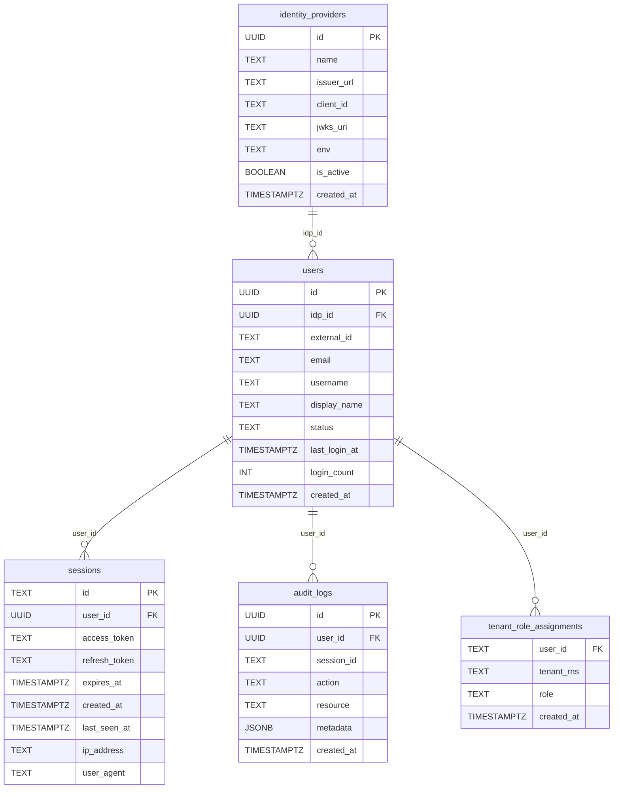

# RBAC — UCP Design

---

## Permission-Based Role Model (Phase 2)

The Phase 1 implementation uses a linear `Role int` hierarchy where
`deployer (3) > approver (2)`, which means a deployer passes `hasMinRole('approver')`
and can approve their own provisioning request — a separation-of-duties violation.

Phase 2 replaces the linear hierarchy with an **orthogonal permission model**.
`deployer` and `approver` are parallel roles, neither inherits the other.
The check changes from `role >= minRole` to `role.Has(permission)`.

```go
// auth/context.go
type Permission uint

const (
    PermRead      Permission = 1 << 0  // list, get resources
    PermProvision Permission = 1 << 1  // create, delete resources
    PermApprove   Permission = 1 << 2  // approve, reject workflows
    PermManage    Permission = 1 << 3  // credentials, settings, role management
    PermPlatform  Permission = 1 << 4  // cross-tenant operations
)

var RolePermissions = map[string]Permission{
    "viewer":         PermRead,
    "deployer":       PermRead | PermProvision,
    "approver":       PermRead | PermApprove,
    "tenant-admin":   PermRead | PermProvision | PermApprove | PermManage,
    "platform-admin": PermRead | PermProvision | PermApprove | PermManage | PermPlatform,
}

func (p Permission) Has(required Permission) bool {
    return p&required == required
}
```

`deployer` has `PermProvision` but not `PermApprove`. `approver` has `PermApprove`
but not `PermProvision`. `tenant-admin` has both.

Adding a new role in the future (e.g. `drift-operator: PermRead | PermApprove | PermDrift`)
is one line in `RolePermissions` — no schema change, no hierarchy restructuring.

### RequirePermission middleware

```go
func (s *APIServer) RequirePermission(perm authpkg.Permission) mux.MiddlewareFunc {
    return func(next http.Handler) http.Handler {
        return http.HandlerFunc(func(w http.ResponseWriter, r *http.Request) {
            r, _, err = s.loadRoles(r)
            userPerms := resolvedPermissions(r, tenantID)  // derives Permission from role string
            if !userPerms.Has(perm) {
                respondError(w, http.StatusForbidden,
                    fmt.Sprintf("insufficient permission: %s required", perm))
                return
            }
            next.ServeHTTP(w, r)
        })
    }
}
```

Route registrations become self-documenting:

```go
api.Handle("/databases",              server.requirePermHandler(authpkg.PermRead,      ...)).Methods("GET")
api.Handle("/databases",              server.requirePermHandler(authpkg.PermProvision,  ...)).Methods("POST")
api.Handle("/workflows/{id}/approve", server.requirePermHandler(authpkg.PermApprove,   ...)).Methods("POST")
api.Handle("/settings/credentials",   server.requirePermHandler(authpkg.PermManage,    ...)).Methods("GET")
api.Handle("/settings/credentials/all", server.requirePermHandler(authpkg.PermPlatform,...)).Methods("GET")
```

### Frontend `hasPermission`

```ts
const ROLE_PERMISSIONS: Record<Role, Set<string>> = {
  'viewer':         new Set(['read']),
  'deployer':       new Set(['read', 'provision']),
  'approver':       new Set(['read', 'approve']),
  'tenant-admin':   new Set(['read', 'provision', 'approve', 'manage']),
  'platform-admin': new Set(['read', 'provision', 'approve', 'manage', 'platform']),
}

// useRole() exposes hasPermission instead of hasMinRole
{hasPermission('provision') && <CreateButton />}
{hasPermission('approve')   && <ApproveButton />}
{hasPermission('manage')    && <CredentialsMenu />}
```

---

## Role Type (Phase 1 — deployed)

```go
// auth/context.go
type Role int

const (
    RoleUnknown     Role = iota // 0 — unresolved / not a tenant member
    RoleViewer                  // 1
    RoleApprover                // 2
    RoleDeployer                // 3
    RoleTenantAdmin             // 4
    RolePlatformAdmin           // 5
)

func (r Role) String() string {
    switch r {
    case RoleViewer:      return "viewer"
    case RoleApprover:    return "approver"
    case RoleDeployer:    return "deployer"
    case RoleTenantAdmin: return "tenant-admin"
    case RolePlatformAdmin: return "platform-admin"
    default:              return "unknown"
    }
}

type roleContextKey struct{}

func WithRole(ctx context.Context, role Role) context.Context {
    return context.WithValue(ctx, roleContextKey{}, role)
}

func RoleFromContext(ctx context.Context) (Role, bool) {
    r, ok := ctx.Value(roleContextKey{}).(Role)
    return r, ok
}
```

---

## Database ERD



| Table | Origin | Modified by MCUCP-191 |
|---|---|---|
| `identity_providers` | Pre-existing | No |
| `users` | Pre-existing | No |
| `sessions` | Pre-existing | No |
| `audit_logs` | Pre-existing | No |
| `tenant_role_assignments` | **Added by MCUCP-191** | — |

No pre-existing tables were altered. MCUCP-191 only adds the new
`tenant_role_assignments` table and the query methods in `db/roles.go`
that operate on it.

`tenant_rns = '*'` in `tenant_role_assignments` denotes a platform-admin — a
cross-tenant role not bound to any specific tenant RNS.

---

## Database Schema

```sql
CREATE TABLE tenant_role_assignments (
    user_id    TEXT NOT NULL REFERENCES users(id),
    tenant_rns TEXT NOT NULL,
    role       TEXT NOT NULL CHECK (role IN (
                   'platform-admin', 'tenant-admin',
                   'deployer', 'approver', 'viewer')),
    created_at TIMESTAMPTZ NOT NULL DEFAULT now(),
    PRIMARY KEY (user_id, tenant_rns)
);
```

`platform-admin` is stored as a row with `tenant_rns = '*'` — not tied to any
specific tenant, matches regardless of the `X-Tenant-ID` in the request.

---

## Role Resolution — Design

Role resolution uses a **per-request cache** to avoid repeated DB queries.
A single `GetAllRolesForUser` call is made at most once per request; all
subsequent checks within the same request read from the Go context.

### loadRoles

`loadRoles` fetches all role assignments for the caller and stores them in
the request context. Returns immediately on cache hit.

```go
func (s *APIServer) loadRoles(r *http.Request) (*http.Request, map[string]string, error) {
    if cached, ok := r.Context().Value(cachedRolesKey{}).(map[string]string); ok {
        return r, cached, nil  // cache hit — 0 DB calls
    }
    roles, err := s.db.GetAllRolesForUser(principal.UserID)  // 1 DB call
    r = r.WithContext(context.WithValue(r.Context(), cachedRolesKey{}, roles))
    return r, roles, nil
}
```

### roleFromMap

Derives a `Role` from the cached map for a given `tenantID`:

```go
func roleFromMap(allRoles map[string]string, tenantID string) Role {
    if allRoles["*"] == "platform-admin" {
        return RolePlatformAdmin            // platform-admin sentinel
    }
    if tenantID != "" {
        return stringToRole(allRoles[tenantID])  // specific tenant
    }
    // X-Tenant-ID absent — return highest role across all tenants
    max := RoleUnknown
    for _, roleStr := range allRoles {
        if r := stringToRole(roleStr); r > max { max = r }
    }
    return max
}
```

When `X-Tenant-ID` is absent, the caller's maximum role across all their
tenants is used. This allows `RequireRole` checks to pass without requiring
the header — for example, a user with `deployer` in tenant-A can delete
their resource without specifying the header. The per-handler ownership
check then verifies their role against the resource's annotated tenant.

### resolveUserRole

Reads from context cache — zero additional DB calls after `loadRoles` has run:

```go
func (s *APIServer) resolveUserRole(r *http.Request, tenantID string) (Role, error) {
    allRoles, ok := r.Context().Value(cachedRolesKey{}).(map[string]string)
    if !ok {
        _, allRoles, _ = s.loadRoles(r)  // fallback if cache not populated
    }
    return roleFromMap(allRoles, tenantID), nil
}
```

### DB call count per request

| Scenario | DB calls |
|---|---|
| Any request through `RequireRole` | 1 (`GetAllRolesForUser` in middleware) |
| Delete handler ownership check | 0 (reads context cache) |
| Any subsequent check in same request | 0 (cache hit) |
| `/auth/me` | 1 (`GetAllRolesForUser` directly, independent of cache) |

---

## Admin API

Role assignments are managed via three endpoints, all gated behind
`RequireRole(RoleTenantAdmin)`. `platform-admin` passes all role checks
automatically.

```go
// rbac_handler.go
func (s *APIServer) ListRoleAssignments(w http.ResponseWriter, r *http.Request)
func (s *APIServer) AssignRole(w http.ResponseWriter, r *http.Request)
func (s *APIServer) RevokeRole(w http.ResponseWriter, r *http.Request)
```

`AssignRole` request body:

```json
{ "userEmail": "user@example.com", "role": "deployer" }
```

The handler resolves `userEmail` to a `user_id` via the `users` table (user
must have logged in at least once for JIT provisioning to have created their
record) before inserting into `tenant_role_assignments`.

---

## /auth/me Extension

`MeHandler` in `bff_auth.go` is extended to query `tenant_role_assignments`
for the caller and include the results in the response. The frontend calls
this on mount via `AuthProvider`, so role information is available immediately
after login.

Extended response:

```json
{
  "id": "abc123",
  "email": "user@example.com",
  "name": "User Name",
  "roles": {
    "rns:roc:iam::clsd-ucp": "deployer",
    "rns:roc:iam::other-tenant": "viewer"
  },
  "isPlatformAdmin": false
}
```

`isPlatformAdmin` is `true` when a `tenant_rns = '*'` row exists for the user.
The `roles` map contains only tenant-scoped assignments — `platform-admin` is
not included as a tenant entry, it is expressed via `isPlatformAdmin`.

---

## useRole Hook

`useRole()` derives the caller's effective role for the currently selected
tenant from the data already in `AuthProvider`. No extra API call needed.

```ts
type Role = 'platform-admin' | 'tenant-admin' | 'deployer' | 'approver' | 'viewer'

const ROLE_LEVEL: Record<Role, number> = {
  'viewer': 1,
  'approver': 2,
  'deployer': 3,
  'tenant-admin': 4,
  'platform-admin': 5,
}

function useRole() {
  const { user } = useAuth()
  const { selectedTenant } = useTenantContext()

  if (user?.isPlatformAdmin) {
    return { role: 'platform-admin', hasMinRole: () => true }
  }

  const role: Role | null = selectedTenant
    ? (user?.roles?.[selectedTenant.rns] ?? null)
    : null

  const hasMinRole = (min: Role) =>
    role !== null && ROLE_LEVEL[role] >= ROLE_LEVEL[min]

  return { role, hasMinRole }
}
```

Usage in components:

```tsx
const { hasMinRole } = useRole()

{hasMinRole('deployer') && <CreateButton />}
{hasMinRole('deployer') && <DeleteButton />}
{hasMinRole('approver') && <ApproveButton />}
{hasMinRole('tenant-admin') && <CredentialsMenuItem />}
```

When no tenant is selected, `role` is `null` and `hasMinRole` returns `false`
for all checks — all action buttons are hidden until the user selects a tenant.

---

## Frontend Route Guard

Hiding a menu item is not sufficient — a user can still navigate directly to a
restricted URL via the address bar or a bookmark. A `RequireRole` wrapper
component renders a 403 page instead of the route content when the check fails:

```tsx
// components/RequireRole.tsx
function RequireRole({ min, children }: { min: Role; children: ReactNode }) {
  const { hasMinRole } = useRole()

  if (!hasMinRole(min)) {
    return <ForbiddenPage />
  }
  return <>{children}</>
}
```

Applied per route in `App.jsx`:

```tsx
<Route
  path="/settings/credentials"
  element={
    <RequireRole min="tenant-admin">
      <SettingsCredentialsPage />
    </RequireRole>
  }
/>
<Route
  path="/admin/kube-resources"
  element={
    <RequireRole min="platform-admin">
      <KubeResourcesPage />
    </RequireRole>
  }
/>
```

`ForbiddenPage` displays a 403 message and a link back to the home page. It
does not redirect — a redirect would hide the fact that the access was denied,
making it harder to diagnose misconfigured role assignments.

---

## RequireRole Middleware

`RequireRole` calls `loadRoles` first to populate the per-request cache,
then resolves the effective role and enforces the minimum. The handler and
any subsequent `resolveUserRole` calls in the same request hit the cache.

```go
// rbac_handler.go
func (s *APIServer) RequireRole(minRole authpkg.Role) mux.MiddlewareFunc {
    return func(next http.Handler) http.Handler {
        return http.HandlerFunc(func(w http.ResponseWriter, r *http.Request) {
            tenantID := strings.TrimSpace(r.Header.Get("X-Tenant-ID"))

            // Populate cache — at most 1 DB call per request.
            var err error
            r, _, err = s.loadRoles(r)
            if err != nil {
                respondError(w, http.StatusInternalServerError,
                    "Failed to load roles: "+err.Error())
                return
            }

            role, err := s.resolveUserRole(r, tenantID)  // reads cache
            if err != nil {
                respondError(w, http.StatusInternalServerError,
                    "Failed to resolve user role: "+err.Error())
                return
            }
            if role < minRole {
                respondError(w, http.StatusForbidden,
                    fmt.Sprintf("insufficient role: %s required", minRole))
                return
            }

            // Pass updated request (with cache + resolved role in context).
            next.ServeHTTP(w, r.WithContext(authpkg.WithRole(r.Context(), role)))
        })
    }
}
```

---

## Route Grouping

Routes are grouped by minimum required role. Each group gets a dedicated
subrouter with the appropriate middleware applied once — replacing the ad-hoc
`isUserTenantAdmin()` calls in individual handlers.

```go
// main.go — route registration
viewerRoutes := api.PathPrefix("").Subrouter()
viewerRoutes.Use(server.RequireRole(authpkg.RoleViewer))

deployerRoutes := api.PathPrefix("").Subrouter()
deployerRoutes.Use(server.RequireRole(authpkg.RoleDeployer))

approverRoutes := api.PathPrefix("").Subrouter()
approverRoutes.Use(server.RequireRole(authpkg.RoleApprover))

tenantAdminRoutes := api.PathPrefix("").Subrouter()
tenantAdminRoutes.Use(server.RequireRole(authpkg.RoleTenantAdmin))

platformAdminRoutes := api.PathPrefix("").Subrouter()
platformAdminRoutes.Use(server.RequireRole(authpkg.RolePlatformAdmin))

// Resource reads
viewerRoutes.HandleFunc("/databases", server.ListDatabases).Methods("GET")
viewerRoutes.HandleFunc("/databases/{name}", server.GetDatabase).Methods("GET")
// ... other GET endpoints

// Resource mutations
deployerRoutes.HandleFunc("/databases", server.CreateDatabase).Methods("POST")
deployerRoutes.HandleFunc("/databases/{name}", server.DeleteDatabase).Methods("DELETE")
// ... other POST/DELETE endpoints

// Workflow approval
approverRoutes.HandleFunc("/workflows/{workflowId}/approve", server.ApproveWorkflow).Methods("POST")
approverRoutes.HandleFunc("/workflows/{workflowId}/reject", server.RejectWorkflow).Methods("POST")

// Credential management
tenantAdminRoutes.HandleFunc("/settings/credentials", server.GetCredentials).Methods("GET")
tenantAdminRoutes.HandleFunc("/settings/credentials", server.UpsertCredentials).Methods("POST")
tenantAdminRoutes.HandleFunc("/settings/credentials/{provider}", server.DeleteCredentials).Methods("DELETE")

// Platform-wide operations
platformAdminRoutes.HandleFunc("/settings/credentials/all", server.ListAllCredentials).Methods("GET")
```

---

## Handler Cleanup

Once `RequireRole` enforces access at the route level, individual handlers
remove their `isUserTenantAdmin()` calls for create operations. The role check
at the middleware layer is the single enforcement point.

Delete handlers retain `isUserTenantAdmin()` for the **ownership check** — this
reads the tenant from the XR annotation (not from `X-Tenant-ID`) and is a
distinct check that verifies the resource belongs to the caller's tenant. It is
not replaced by `RequireRole`.

---

## Role Management UI

A role management page in the frontend lets `tenant-admin` and `platform-admin`
users assign and revoke roles within a tenant. The page is accessible from the
Settings or Admin section and scoped to the tenant selected in the global
`TenantSelector`.

The UI calls the admin API endpoints defined above. It needs to:
- List current role assignments for the selected tenant
- Show a user search/input to assign a role (user must have logged in once)
- Allow changing or removing an existing assignment

---

## Tenant Registration (Phase 3)

A tenant must be explicitly registered in UCP before any resources can be
provisioned for it. Registration is performed by an OC Tenant Admin.

### DB schema

```sql
CREATE TABLE ucp_registered_tenants (
    tenant_rns    TEXT NOT NULL PRIMARY KEY,
    registered_by UUID REFERENCES users(id),
    registered_at TIMESTAMPTZ NOT NULL DEFAULT now()
);
```

### Registration flow

```
POST /api/v1/tenants/register
Body: { "tenantRNS": "rns:roc:iam::coupon-team" }
Requires: caller is OC Tenant Admin (verified via Core Data GET /v0/tenants/{rns})
```

On successful registration:
1. Insert row into `ucp_registered_tenants`
2. Fetch all OC members of the tenant via `GET /v0/tenants/{tenantRNS}/members`
3. Seed `tenant_role_assignments` for each member (see OC → UCP role mapping below)

---

## OC → UCP Role Mapping

Used during user seeding and periodic sync to derive a UCP role from a user's
OC standing:

| OC Level 1 (tenant role) | OC Level 2 (service role) | UCP role assigned |
|---|---|---|
| Tenant Admin | any | `tenant-admin` |
| Tenant Member | any | `viewer` |

The mapping is intentionally conservative — OC Tenant Members get `viewer` by
default and a UCP `tenant-admin` can upgrade them to `deployer` or `approver`
manually. This avoids auto-granting provisioning permissions based on OC service
roles alone.

If Option 2 (OC service role check) is implemented in a future phase, the
mapping would be extended to derive `deployer` from OC service-level roles
(e.g. DBaaS `admin` or `operator`).

---

## User Seeding on First Login

When a user logs in via OIDC (in `CallbackHandler`), after the session is
created, UCP seeds their UCP roles from their OC standing:

```
1. Call GET /v0/members/{email}/tenants?subscriptions=true (Core Data)
2. For each tenant in the response:
   a. Check if tenant is registered in ucp_registered_tenants
   b. If registered and user has no existing UCP role for that tenant:
      → Derive role from OC standing using OC → UCP mapping
      → INSERT into tenant_role_assignments
3. Skip unregistered tenants — they show as "not set up" in the UI
```

Seeding is **additive only** — it never downgrades or removes existing UCP roles.
Downgrades happen only through the periodic sync or manual revocation.

---

## `GET /api/v1/me/tenants`

Returns the user's OC tenants enriched with their UCP status per tenant.
Used by the onboarding landing page.

```json
{
  "items": [
    {
      "rns": "rns:roc:iam::coupon-team",
      "name": "coupon-team",
      "ocRole": "Tenant Admin",
      "ucpRegistered": true,
      "ucpRole": "tenant-admin"
    },
    {
      "rns": "rns:roc:iam::other-team",
      "name": "other-team",
      "ocRole": "Tenant Member",
      "ucpRegistered": true,
      "ucpRole": null          ← no UCP role assigned yet
    },
    {
      "rns": "rns:roc:iam::new-team",
      "name": "new-team",
      "ocRole": "Tenant Admin",
      "ucpRegistered": false   ← tenant not registered in UCP yet
    }
  ]
}
```

The frontend uses this to render three states per tenant:
- `ucpRegistered: true` + `ucpRole` set → full access at that role level
- `ucpRegistered: true` + `ucpRole: null` → "Contact your tenant-admin to get access"
- `ucpRegistered: false` → "UCP not set up for this tenant — register it" (only shown to OC Tenant Admin)

---

## Periodic Sync

A background job polls Core Data at a configurable interval (default: 15 minutes)
to keep `tenant_role_assignments` consistent with OC membership.

```
For each tenant in ucp_registered_tenants:
  1. GET /v0/tenants/{tenantRNS}/members  (Core Data)
  2. Compare response against current tenant_role_assignments
  3. New OC members not in UCP → seed using OC → UCP mapping
  4. Members removed from OC → remove their UCP role assignment
  5. OC role downgraded (Admin → Member) → downgrade UCP role
     (tenant-admin → viewer, unless manually upgraded by another tenant-admin)
```

No event streaming is available from Core Data, so polling is the only option.
The sync does not upgrade roles — a `viewer` manually promoted to `deployer` by
a tenant-admin remains `deployer` even if their OC role stays `Tenant Member`.
Only seeding on first login and the initial tenant registration seeding apply
the OC → UCP mapping upward.
