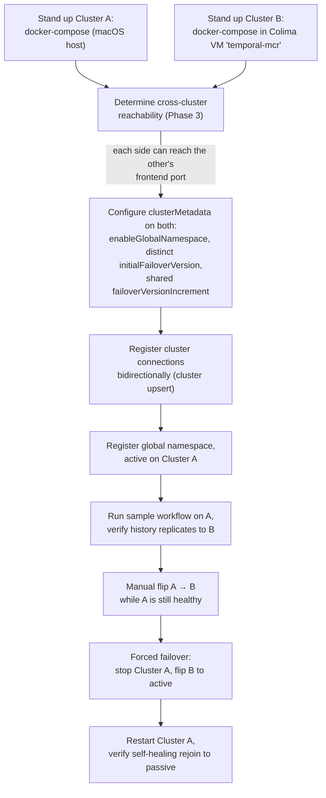

# Temporal Multi-Cluster Replication — Design

Human review document. Read this before the PoC starts executing.

| | |
|---|---|
| **Related ticket** | [MCUCP-307](https://jira.rakuten-it.com/jira/browse/MCUCP-307) — Feasibility study for DR scenario with temporal server |
| **Related research** | [research/temporal-multi-cluster-replication.md](../../research/temporal-multi-cluster-replication.md) |
| **Status** | Complete — see [poc-report.md](poc-report.md) |

## Research Question

> Can two independently-persisted self-hosted Temporal clusters establish the
> cluster-to-cluster gRPC connection that Multi-Cluster Replication (MCR) requires, replicate
> a namespace's workflow history, and support a manual failover, using only local-machine
> resources?

MCR's actual requirement is bidirectional network reachability between each cluster's
frontend service — nothing about MCR cares whether that reachability comes from two bare
processes, two VMs, or a VM and a host. Cluster A and Cluster B each run in their own Colima
VM (`ucp-crossplane` and `temporal-mcr` respectively); see `poc-report.md` for how each got
there. This is a stronger proof of the research question than a host+VM split would have
been: it shows MCR working between two independent VMs with no special-casing, rather than
relying on one side being the host.

## Hypothesis

A Temporal cluster's connectivity requirement for MCR is satisfied as long as each cluster's
frontend port is reachable from the other, regardless of where either cluster physically
runs — two Colima VMs, a VM and the host, or (in a real deployment) two separate machines
entirely. Colima's default networking provides this without any vmnet bridging or relay.

## Scope

| In scope | Out of scope |
|---|---|
| ✅ Cluster A: Temporal + Postgres via docker-compose, running in the `ucp-crossplane` Colima VM | ❌ vmnet-bridged two-VM topology (design Option B) |
| ✅ Cluster B: Temporal + Postgres via docker-compose inside one dedicated Colima profile (`temporal-mcr`) | ❌ TCP relay / SSH tunnel topology (design Option C) |
| ✅ Determining actual cross-cluster reachability (gateway IP, forwarded ports) empirically | ❌ Automatic failover / `dcRedirectionPolicy` |
| ✅ Bidirectional cluster registration via `temporal operator cluster upsert` | ❌ Replication throughput/lag load testing |
| ✅ One global namespace, active on Cluster A, replicated to Cluster B | ❌ mTLS / auth between clusters — plaintext gRPC only |
| ✅ One sample workflow started on A, history verified as visible from B | ❌ Elasticsearch-backed advanced visibility |
| ✅ Two failover scenarios: manual flip while Cluster A is still healthy, and forced failover with Cluster A actually stopped | ❌ Forcing real replication lag via network-level partitioning (Phase 12 found the metadata-flag approach doesn't work; a real network partition wasn't attempted) |
| ✅ Rejoin: restart Cluster A after the forced-failover scenario, verify it self-corrects to passive without manual intervention | ❌ Backup/restore as an alternative to `force-replication` for seeding a new cluster (noted in the research doc, not tested) |
| ✅ Namespace handover — the internal `HANDOVER`-state drain workflow, not just a plain metadata flip | |
| ✅ Adding a cluster to an already-populated deployment — not a real UCP migration path (both clusters will be created together from the start), tested purely so the team has an answer if this situation ever comes up | |

## Approach



### Phase 1 — Cluster A

Run Temporal's standard self-hosted docker-compose setup: `temporal-server` + a dedicated
Postgres instance. No Elasticsearch, Grafana, or Prometheus — the minimal stack needed for
MCR. `docker compose up -d` attaches to whatever Docker context is currently active, not
necessarily the bare host, so confirm the target context explicitly (`docker context ls` /
`DOCKER_HOST`) before bringing the stack up — in this run, that context was the
`ucp-crossplane` Colima VM.

### Phase 2 — Cluster B in Colima

Create a new, dedicated Colima profile (`temporal-mcr`, separate from the existing
`ucp-crossplane` / `ucp-apiserver` profiles) and run the same minimal docker-compose stack
inside it, with its own independent Postgres — no shared state with Cluster A at the storage
layer, matching how MCR actually works (each cluster persists independently; only the
Temporal server layer replicates).

### Phase 3 — Reachability check (the crux of this PoC)

Before touching any Temporal-specific config, confirm the network path in both directions
with a plain TCP check (`curl`/`nc`/`grpcurl` against the frontend port), from wherever each
cluster actually ends up running:

- **Cluster A → Cluster B:** reach Cluster B's frontend port through Colima's normal
  port-forwarding to `127.0.0.1` (from the host) or the loopback-forwarded address (from
  inside another Colima VM).
- **Cluster B → Cluster A:** Cluster B's container reaches Cluster A's frontend port through
  whatever gateway address Colima's VM driver exposes for reaching outside its own VM
  (mechanism depends on Colima's driver — qemu vs vz — and is confirmed empirically here,
  not assumed; found to be `192.168.5.2`, the VM's default route, under the `vz` driver).

If this reachability does not hold under Colima's defaults, that is a PoC finding in
itself and gets recorded in `poc-report.md` — this PoC does not silently switch to a
different topology (vmnet or a relay) to force a pass.

### Phase 4 — Cluster metadata

Set `enableGlobalNamespace: true` on both clusters' config, a shared `failoverVersionIncrement`,
a distinct `initialFailoverVersion` per cluster (e.g. `1` for A, `2` for B), and the same
`numberOfShards` value on both clusters. Matching shard counts is simple hygiene for this PoC
rather than a fix for a known bug — the specific cross-cluster shard-count-mismatch DLQ bug
found during research (`task_processor.go`'s `convertTaskToDLQTask`) lives entirely in the
older, poll-based **fetcher** path, which is disabled by default (`history.enableReplicationStream`
defaults to `true`, and fetcher/stream are mutually exclusive) — so this PoC, running the
default streaming path, would not exercise that specific code regardless. Matching shard
counts is kept anyway to avoid any cross-shard-count mapping behavior becoming a confounding
variable in the results.

### Phase 5 — Cluster registration

From Cluster A, register Cluster B's frontend address; from Cluster B, register Cluster A's.
The modern `temporal` CLI uses hyphenated flags (`--frontend-address`, not the underscored
`--frontend_address` form some older references use), and each side needs the address it can
*itself* actually reach — these are not the same string on both sides, and not necessarily
the same address a human would use to test reachability from a shell in Phase 3. In
particular, a Temporal server process dialing out from inside its own container needs
`host.docker.internal`, not `127.0.0.1`, to reach a peer exposed on the host's Docker
daemon — `127.0.0.1` from inside a container is that container's own loopback, not the
host's:

```shell
temporal --address <cluster-A-address> operator cluster upsert --frontend-address "<address-B-is-reachable-at-from-A>" --enable-connection --enable-replication
temporal --address <cluster-B-address> operator cluster upsert --frontend-address "<address-A-is-reachable-at-from-B>" --enable-connection --enable-replication
```

### Phase 6 — Global namespace

Register one namespace as global, active on Cluster A. Confirm it is visible via
`temporal operator namespace describe` from Cluster B, with a matching failover version.

### Phase 7 — Workflow replication

Start one sample workflow against Cluster A. Confirm its event history is visible when
queried against Cluster B (replication has occurred), accepting whatever lag exists between
start and visibility.

### Phase 8 — Manual flip while Cluster A is still healthy

With Cluster A still running and active, run
`temporal operator namespace update --active-cluster=<cluster-B-name>` against the namespace.
Confirm Cluster B now accepts new workflow starts for it. Also check Cluster A's behavior in
the moments immediately after the flip — since the active-cluster change itself only reaches
A via the same replication stream as everything else, A may briefly still believe it's active
until that specific update is applied locally. Record whatever is actually observed here
rather than assuming the transition is instantaneous.

### Phase 9 — Forced failover with Cluster A stopped

Reset the namespace to active-on-A, then stop Cluster A's containers entirely (simulating an
actual outage, not just a flip while healthy). Run
`temporal operator namespace update --active-cluster=<cluster-B-name>` against Cluster B —
the only reachable cluster at this point. Confirm Cluster B accepts new workflow starts for
the namespace on its own, with Cluster A fully down.

### Phase 10 — Rejoin after the forced failover

Restart Cluster A's containers. Without any manual intervention beyond starting the process,
confirm Cluster A's replication stream to Cluster B reconnects, it receives the backlog
(including the active-cluster change from Phase 9), and `temporal operator namespace describe`
against Cluster A eventually shows Cluster B as active — validating the self-healing rejoin
behavior described in the research doc, rather than taking it on faith.

### Phase 11 — Namespace handover (the internal drain workflow)

This is a different, more specific mechanism than the plain metadata flip used in Phases 8
and 9 — the internal `namespace-handover` workflow that waits for replication lag to drain
before flipping, and rejects all requests to the namespace on both clusters for a short
window while doing so (see the research doc's Failover Mechanics section).

This workflow is not exposed as a documented CLI verb — it's an ordinary Temporal workflow
registered on the server's own internal `temporal-system` namespace, polling the
`default-worker-tq` task queue, confirmed from source (`service/worker/migration/fx.go`,
`handover_workflow.go`). Its input is a plain, JSON-serializable struct:

```go
NamespaceHandoverParams struct {
    Namespace              string  // the target namespace, e.g. "mcr-poc"
    RemoteCluster          string  // the cluster to hand over to, e.g. "cluster-b"
    AllowedLaggingSeconds  int     // drain threshold before entering HANDOVER state
    AllowedLaggingTasks    int64
    HandoverTimeoutSeconds int
}
```

With both clusters healthy (reset to active-on-A, as at the start of Phase 8), attempt to
start it directly as a normal workflow execution:

```shell
temporal --address 127.0.0.1:7233 workflow start \
  --namespace temporal-system \
  --task-queue default-worker-tq \
  --type namespace-handover \
  --workflow-id mcr-poc-handover-1 \
  --input '{"Namespace":"mcr-poc","RemoteCluster":"cluster-b","AllowedLaggingSeconds":10,"AllowedLaggingTasks":0,"HandoverTimeoutSeconds":30}'
```

Whether a plain external `workflow start` against `temporal-system` is even permitted is
itself unconfirmed — some internal system RPCs elsewhere in the codebase check for a
system/preemptable caller header, and this may be one of them. If the start is rejected, that
rejection — and whatever error it comes back with — is the finding, not a blocker to route
around with some other invocation method. While it runs, poll `temporal operator namespace
describe mcr-poc` repeatedly to observe the `HANDOVER` state window and the subsequent flip,
and confirm requests to the namespace are rejected (not silently dropped) during that window.

Phase 11 as first run had zero pre-existing replication lag, so the `HANDOVER` window lasted
only ~2 seconds — too short for 1-second-granularity polling to reliably catch a test request
landing inside it (see `poc-report.md`). Phase 12 exists specifically to close that gap.

### Phase 12 — Forcing real replication lag, to actually observe rejection during HANDOVER

Rather than relying on raw workflow-start throughput to outpace replication (uncertain to
work on a fast local Docker network), force a deterministic backlog:

1. Disable the replication connection between the clusters (`temporal operator cluster
   upsert --frontend-address ... --enable-connection=false`) — confirm empirically which
   side's registration actually needs to be toggled to stop cluster-b from receiving
   cluster-a's new writes, rather than assuming it's symmetric.
2. With the connection disabled, start a large batch of workflows against cluster-a (e.g.
   hundreds to low thousands, in a tight loop) — these accumulate as un-replicated backlog
   since cluster-b can't pull them.
3. Re-enable the connection and, immediately afterward, start the `namespace-handover`
   workflow targeting `cluster-b` — with the backlog now real and non-trivial,
   `WaitReplication`/`WaitHandover` have actual draining work to do, giving a meaningfully
   longer `HANDOVER` window than Phase 11's ~2 seconds.
4. Poll `operator namespace describe mcr-poc` at a much tighter interval (sub-second, not the
   1-second interval from Phase 11) once the backlog is in place, and as soon as
   `ReplicationConfig.State` shows `Handover`, immediately attempt a `workflow start` against
   `mcr-poc` — confirm it is rejected, and record the exact error text.
5. Record the actual `HANDOVER` window duration this time, and whether it scales with the
   size of the backlog injected in step 2 (a rough sense of this, not a rigorous benchmark).

Phase 12 found that `--enable-connection=false`/`--enable-replication=false` do not stop an
already-established stream (see `poc-report.md`), so this specific approach to forcing lag
does not work. A real test of the live-rejection behavior remains open, and would need actual
network-level partitioning between the clusters, not a metadata flag.

### Phase 13 — Single-cluster with pre-existing history

Not a real UCP migration path (both clusters will be created together from the start), but a
question that came up when discussing this PoC with the team — tested so there's a concrete
answer on hand if the situation ever arises. Uses fresh cluster-a and cluster-b instances
(or a fresh namespace on the existing ones) to keep this cleanly separated from the earlier
phases' state.

Bring up cluster-a alone, with no cluster-b registered yet. Create an ordinary namespace —
local, not global (`enableGlobalNamespace` can stay `false` on cluster-a's config for this
phase, matching a genuine single-cluster deployment). Start a handful of workflows against
it, so there's real pre-existing history to test against.

### Phase 14 — Introducing a second cluster and promoting the namespace

Bring up cluster-b (if not already running) and register the cluster connection bidirectionally,
same as Phase 5. Then promote the existing namespace to global and add both clusters to its
replication config — as two separate calls; the CLI's actual flag is `--promote-global` (not
`--promote-namespace`, despite that being the underlying field name in source,
`UpdateNamespaceRequest.PromoteNamespace`), and it cannot be combined with `--cluster` in one
call — the CLI itself will state the other flag is omitted if you try:

```shell
temporal --address 127.0.0.1:7233 operator namespace update --namespace <namespace> --promote-global
temporal --address 127.0.0.1:7233 operator namespace update --namespace <namespace> --cluster cluster-a --cluster cluster-b
```

Confirm via `operator namespace describe` that the namespace is now global, active on
cluster-a, and visible on cluster-b. Also be aware: if `dcRedirectionPolicy:
all-apis-forwarding` is configured (as in this PoC's reference config), querying cluster-b
will silently just relay cluster-a's answer for everything, including visibility — confirming
anything about cluster-b's own local state needs either a different redirection policy or a
direct query against its persistence store. Then confirm the actual point of this phase: **the
workflows created in Phase 13, before cluster-b ever existed, do not appear on cluster-b** —
query for them explicitly and confirm they're absent, not just slow to arrive. Start one new
workflow after promotion and confirm it *does* replicate normally, to make clear the gap is
specifically about pre-existing data, not a general breakage.

### Phase 15 — Backfilling with `force-replication`

Start the `force-replication` migration workflow (same internal-workflow-type pattern as
`namespace-handover` — not a documented CLI verb, invoked directly against `temporal-system`),
targeting cluster-b, scoped to the namespace from Phase 13:

```shell
temporal --address 127.0.0.1:7233 workflow start \
  --namespace temporal-system \
  --task-queue default-worker-tq \
  --type force-replication \
  --workflow-id mcr-poc-force-replication-1 \
  --input '{"Namespace":"<namespace>","Query":"WorkflowId != \"\"","TargetClusterName":"cluster-b"}'
```

`Query` uses the same SQL-like list-filter syntax as `workflow list --query` — confirmed
against that command first; an empty string does not reliably mean "everything."

(The `Query` field scopes which workflows to backfill via a visibility query — an empty
string may or may not mean "all workflows"; confirm the actual accepted syntax rather than
assuming, and adjust the input if it's rejected or scopes to nothing.)

Once it completes, confirm the Phase 13 workflows — previously absent from cluster-b — are
now visible there. Record how long the backfill took for the (small) number of workflows
involved, and whether `EnableVerification`/`TargetClusterName` behaved as the source-level
comments suggested.

## Success Criteria

| Criterion | Pass condition |
|---|---|
| Cluster A → Cluster B reachability | Cluster A reaches Cluster B's frontend port through Colima's forwarded port |
| Cluster B → Cluster A reachability | Cluster B reaches Cluster A's frontend port through Colima's guest-gateway address |
| Cluster registration | `temporal operator cluster upsert` succeeds bidirectionally with no networking errors |
| Namespace replication | A global namespace created active on A is visible via `temporal operator namespace describe` on B with a matching failover version |
| History replication | A workflow started on A is visible (event history) when queried against B |
| Manual flip (A healthy) | After the flip, new workflow starts succeed against B for that namespace |
| Forced failover (A stopped) | With A fully stopped, B accepts new workflow starts for the namespace on its own |
| Rejoin | After restarting A, it reconnects, consumes the backlog, and `namespace describe` on A shows B as active — without any manual step beyond starting the process |
| Namespace handover | Either: the workflow starts, the namespace visibly enters and exits `HANDOVER` state, and the flip to B completes with requests rejected (not silently dropped) during the window; or: the start attempt is rejected, and the exact rejection reason is recorded as the finding |
| Pre-existing history is absent after promotion | Workflows created before cluster-b was registered are confirmed absent from cluster-b immediately after promotion, not just slow to arrive |
| `force-replication` backfill | After it completes, the previously-absent pre-existing workflows are confirmed visible on cluster-b |

## Risks

| Risk | Mitigation |
|---|---|
| Colima's default network mode has no reachable gateway IP from inside a guest VM to whatever's on the other side | Phase 3 tests this first, isolated from Temporal config, so it fails fast and cheaply if it doesn't hold |
| A container's own loopback (`127.0.0.1`) is mistaken for the host's when configuring cross-cluster addresses | A server process dialing out from inside its own container needs `host.docker.internal`, not `127.0.0.1`, to reach a peer on the host's Docker daemon — see Phase 5 |
| `docker compose up -d` attaches to whichever Docker context is currently active, not necessarily the bare host | Check `docker context ls`/`DOCKER_HOST` explicitly before bringing a stack up |
| Two independent Postgres-backed Temporal clusters strain local machine resources | Minimal docker-compose stacks only (no Elasticsearch/Grafana/Prometheus) for both clusters |
| MCR is experimental and may hit undocumented failure modes unrelated to network feasibility | Recorded as a finding in `poc-report.md`, not treated as silent grounds to abandon the PoC |
| Rejoin (Phase 10) never converges — Cluster A's local belief stays stale indefinitely | Recorded as a finding either way; this is exactly the behavior the research doc's Recommendation depends on, so a failure to converge here is a real result, not just a PoC bug to work around |
| Namespace handover is not invokable via a plain external `workflow start` against `temporal-system` (a caller-header check rejects it) | Recorded as a finding — this is itself useful information about how UCP would need to trigger a graceful planned failover in production, not a PoC blocker to work around |

## Open Questions

- Resolved: under Colima's `vz` driver, a guest VM reaches the outside world via `192.168.5.2`
  (the VM's own default route) — confirmed empirically rather than assumed. This may differ
  under the `qemu` driver, which this PoC did not exercise.
- Resolved: no special interface binding was needed — Cluster A's frontend's default
  `bindOnIP: "0.0.0.0"` was reachable from the other cluster without any config change.
- Whether a plain `temporal workflow start` against `temporal-system` is the right way to
  invoke namespace handover at all, or whether self-hosted operators are meant to trigger it
  through some other, undocumented path — resolved empirically in Phase 11, not assumed here.
