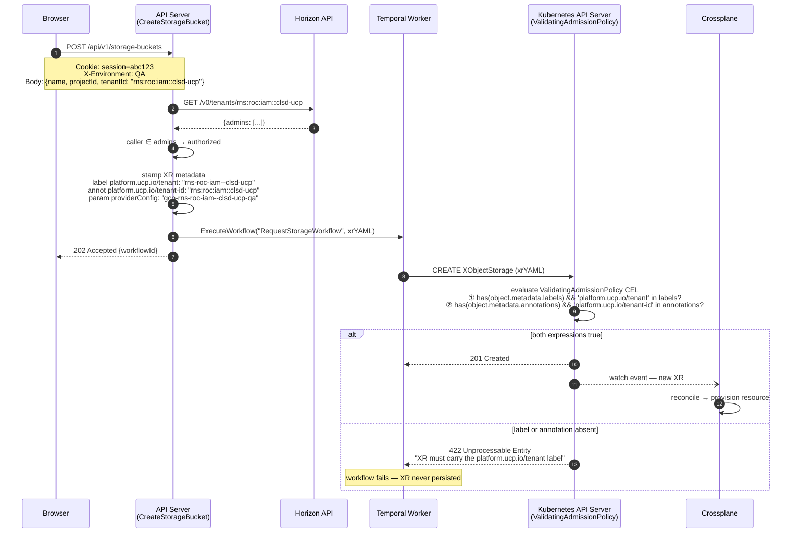
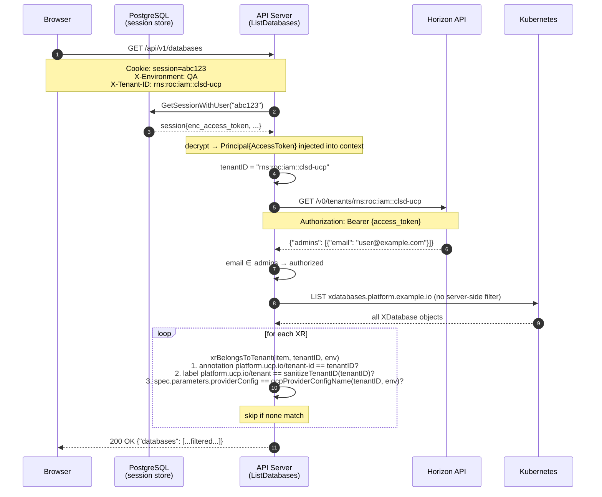
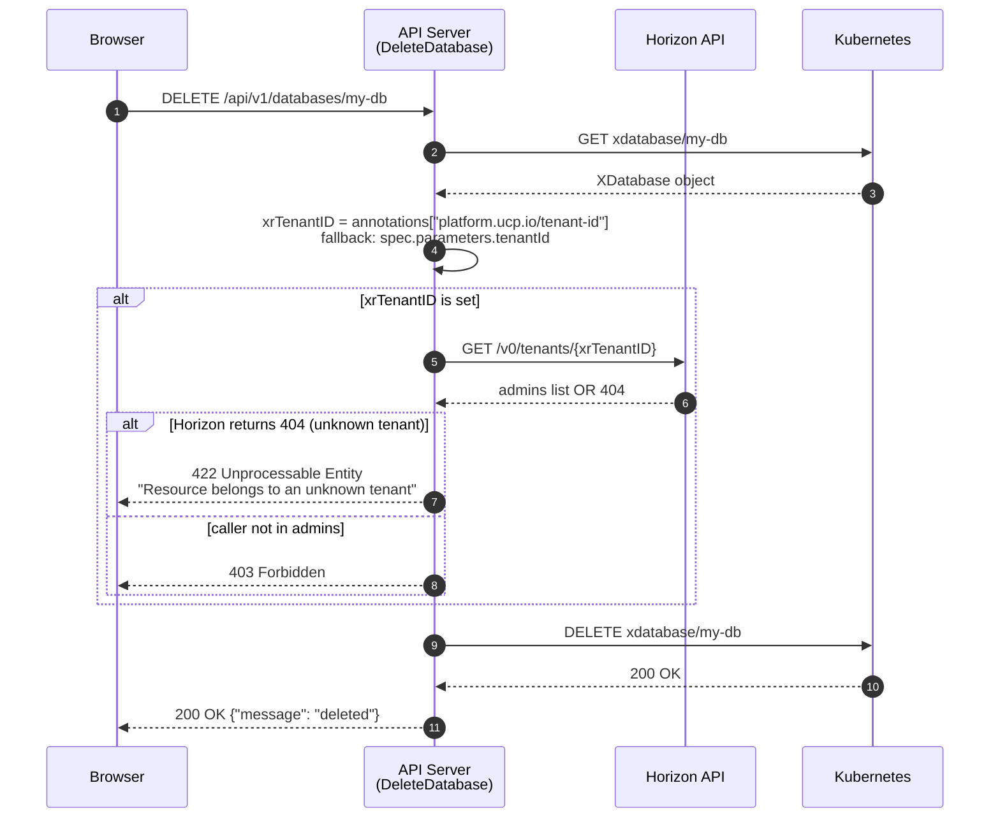

# Tenant Isolation — Implementation

The API server enforces tenant isolation through three mechanisms: ownership label
stamping at XR creation, tenant-filtered list endpoints, and ownership verification
before delete operations.

---

## Implementation

| Component | File | Status |
|---|---|---|
| `sanitizeTenantID()` | `settings_handler.go:290` | Deployed |
| `gcpProviderConfigName()` | `settings_handler.go:236` | Deployed |
| `isUserTenantAdmin()` | `settings_handler.go` | Deployed |
| `xrBelongsToTenant()` | `main.go:1308` | Deployed |
| Label + annotation stamping — XDatabase | `main.go` (`createXDatabaseYAML`) | Deployed |
| Label + annotation stamping — XKubernetesCluster | `kubernetes_handler.go` (`createXKubernetesClusterYAML`) | Deployed |
| Label + annotation stamping — XComputeInstance, XStorageBucket, XLoadBalancer | `compute_handler.go`, `storage_handler.go`, `load_balancer_handler.go` | Deployed |
| Tenant-filtered `ListDatabases` | `main.go` | Deployed |
| Tenant-filtered `ListKubernetesClusters` | `kubernetes_handler.go` | Deployed |
| Tenant-filtered list — compute, storage, load balancer | `compute_handler.go`, `storage_handler.go`, `load_balancer_handler.go` | Deployed |
| Delete ownership check — XDatabase | `main.go` (`DeleteDatabase`) | Deployed |
| Delete ownership check — XKubernetesCluster | `kubernetes_handler.go` (`DeleteKubernetesCluster`) | Deployed |
| Delete ownership check — XObjectStorage | `storage_handler.go` (`DeleteStorageBucket`) | Deployed |
| GCP credential upload + ProviderConfig auto-creation | `settings_handler.go` (`upsertGCPProviderConfig`) | Deployed |
| Per-tenant Ed25519 JWK + on-demand JWT for Omnia | `settings_handler.go` | Deployed |
| Global `TenantContext` + `X-Tenant-ID` header injection | `TenantContext.jsx`, `useAuthFetch.ts`, `MainLayout.jsx`, frontend | Deployed |
| `X-Tenant-ID` header in list handlers | `main.go`, `kubernetes_handler.go`, `compute_handler.go`, `storage_handler.go`, `load_balancer_handler.go` | Deployed |
| `ValidatingAdmissionPolicy` — tenant label + annotation enforcement | `k8s/tenant-admission-policy.yaml` | Deployed |

---

## Scope

### In Scope

- **Label stamping** — every XR creation stamps `platform.ucp.io/tenant` (label) and
  `platform.ucp.io/tenant-id` (annotation) on the Kubernetes object
- **Tenant-filtered list endpoints** — `X-Tenant-ID` request header activates
  tenant filtering; the caller must be admin of the specified tenant
- **Delete ownership enforcement** — delete endpoints read the XR's
  `platform.ucp.io/tenant-id` annotation and reject callers who are not admin of that
  tenant (HTTP 403)
- **ProviderConfig injection** — `providerConfig` is always derived server-side from
  `gcpProviderConfigName(tenantID, env)`; callers cannot supply it
- **ValidatingAdmissionPolicy** — Kubernetes admission webhook that rejects XR creation
  if `platform.ucp.io/tenant` label or `platform.ucp.io/tenant-id` annotation is absent

### Out of Scope

- Terraform endpoints (`/api/v1/terraform/*`) — these use the OpenTofu `random` provider
  with no cloud credentials; per-tenant ProviderConfig is not applicable
- Omnia-specific isolation — handled at the auth layer via per-tenant JWK + on-demand JWT

---

## API Sequence — Create with Admission Validation

`POST /api/v1/storage-buckets` (same flow applies to all resource types)



The same policy covers `UPDATE` operations. A direct `kubectl patch` on an existing XR
that removes the label or annotation is also rejected at the API server layer before
reaching etcd.

---

## API Sequence — Tenant-Filtered List

`GET /api/v1/databases`



---

## API Sequence — Delete with Ownership Check

`DELETE /api/v1/databases/{name}`



---

## Key Functions

### gcpProviderConfigName

```go
// settings_handler.go:236
func gcpProviderConfigName(tenantID, env string) string {
    e := "production"
    if strings.ToLower(env) == "qa" {
        e = "qa"
    }
    return fmt.Sprintf("gcp-%s-%s", sanitizeTenantID(tenantID), e)
}
```

Produces: `gcp-rns-roc-iam--clsd-ucp-qa`

### xrBelongsToTenant

```go
// main.go:1308
func xrBelongsToTenant(obj *unstructured.Unstructured, tenantID, env string) bool {
    if obj.GetAnnotations()["platform.ucp.io/tenant-id"] == tenantID {
        return true
    }
    if obj.GetLabels()["platform.ucp.io/tenant"] == sanitizeTenantID(tenantID) {
        return true
    }
    providerConfig, _, _ := unstructured.NestedString(obj.Object, "spec", "parameters", "providerConfig")
    return providerConfig == gcpProviderConfigName(tenantID, env)
}
```

---

## Verification

### Label stamping

Create a resource via the UI, then inspect the XR:

```bash
kubectl get xdatabase <name> -o jsonpath='{.metadata.labels}' | jq .
# {"platform.ucp.io/tenant": "rns-roc-iam--clsd-ucp"}

kubectl get xdatabase <name> -o jsonpath='{.metadata.annotations}' | jq .
# {"platform.ucp.io/tenant-id": "rns:roc:iam::clsd-ucp", ...}
```

### List filtering

```bash
COOKIE="Cookie: session=<value-from-browser-devtools>"

# Own tenant → 200, filtered results
curl -H "$COOKIE" -H "X-Environment: QA" -H "X-Tenant-ID: rns:roc:iam::clsd-ucp" \
  "http://localhost:8080/api/v1/databases"

# Tenant the caller is not admin of → 403
curl -H "$COOKIE" -H "X-Environment: QA" -H "X-Tenant-ID: rns:roc:iam::other-tenant" \
  "http://localhost:8080/api/v1/databases"
```

### Delete ownership

```bash
# Stamp a foreign tenant on an existing XR
kubectl annotate xdatabase <name> \
  platform.ucp.io/tenant-id=rns:roc:iam::other-tenant --overwrite
kubectl label xdatabase <name> \
  platform.ucp.io/tenant=rns-roc-iam--other-tenant --overwrite
kubectl patch xdatabase <name> --type=merge \
  -p '{"spec":{"parameters":{"providerConfig":"gcp-rns-roc-iam--other-tenant-qa"}}}'

# Delete attempt → 403
curl -X DELETE -H "$COOKIE" -H "X-Environment: QA" \
  "http://localhost:8080/api/v1/databases/<name>"
```

---

## Limitations

### List handlers scope to caller's tenants when X-Tenant-ID is absent

When `X-Tenant-ID` is not set, list handlers call Horizon
`GET /v0/members/<email>/tenants` to fetch all tenants the caller belongs to and
filter results to those tenants. This means a user who is a member of multiple
tenants sees resources across all of them in the default (no header) view.

### providerConfig fallback relies on naming convention

The third fallback in `xrBelongsToTenant` matches by ProviderConfig name. This relies on
the naming convention `gcp-{sanitized-tenant-id}-{env}` being stable. XRs provisioned with
a non-standard ProviderConfig name are not matched by any fallback.

### Delete check is skipped when annotation is absent

If an XR carries neither the `platform.ucp.io/tenant-id` annotation nor
`spec.parameters.tenantId`, the delete ownership check is skipped and the deletion
proceeds. This applies to XRs created before label stamping was deployed.
