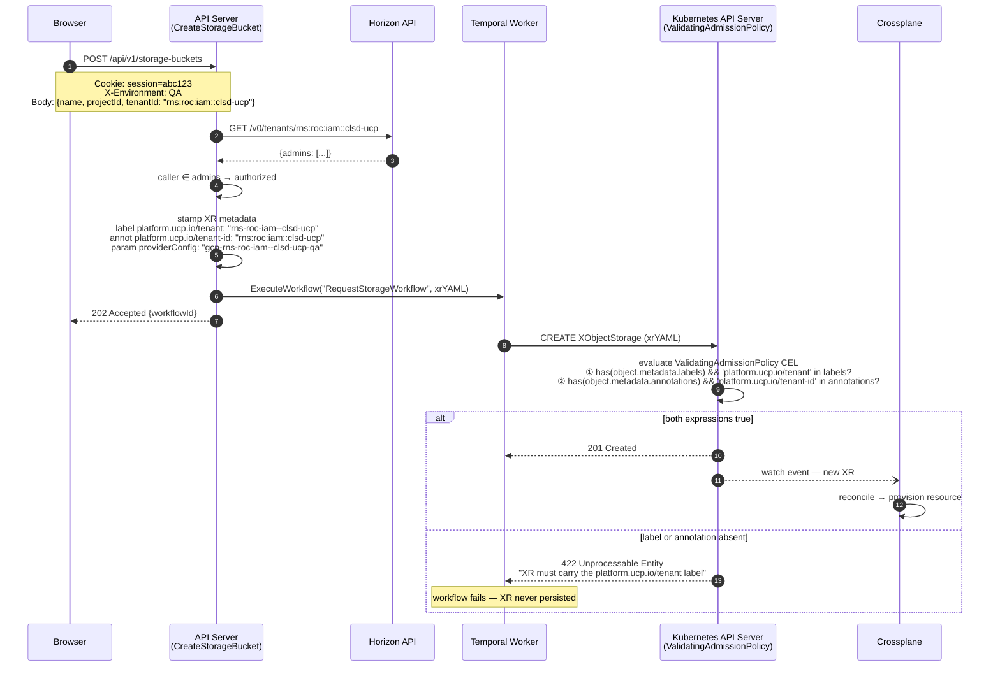
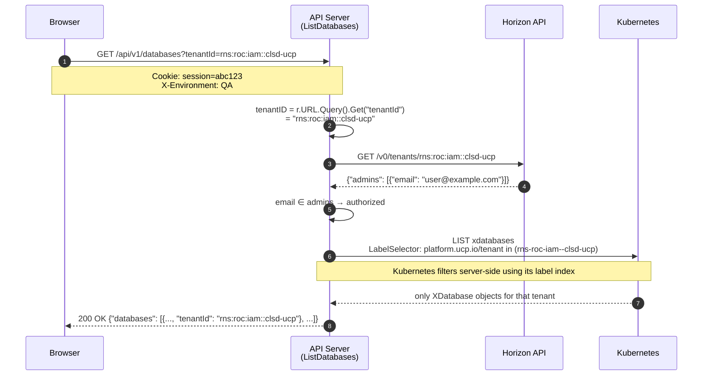
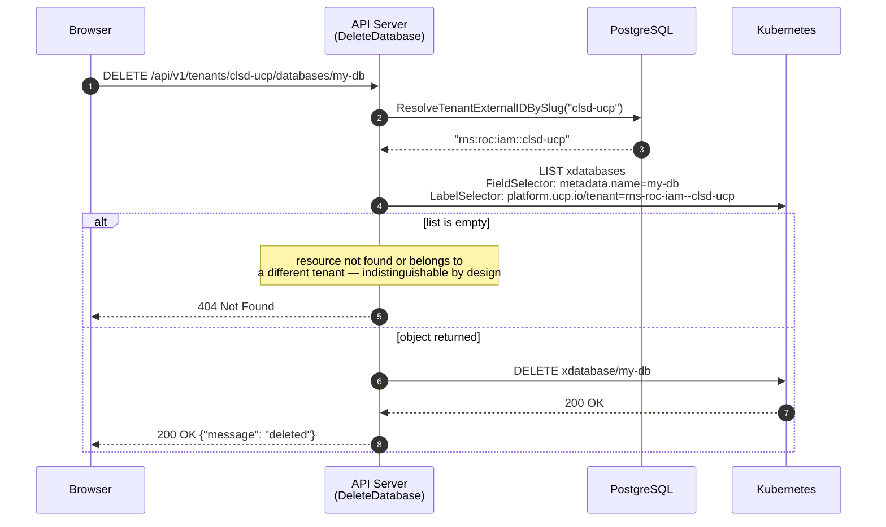

# Tenant Isolation — Implementation

The API server enforces tenant isolation through three mechanisms: ownership label
stamping at XR creation, tenant-filtered list endpoints, and ownership verification
before delete and approve/reject operations.

---

## Implementation

| Component | File | Status |
|---|---|---|
| `getUserTenantIDs()` | `horizon_handler.go` | Deployed |
| `buildTenantLabelSelector()` | `main.go` | Deployed |
| `sanitizeTenantID()` | `settings_handler.go` | Deployed |
| Label + annotation stamping — XDatabase | `main.go` (`createXDatabaseYAML`) | Deployed |
| Label + annotation stamping — XKubernetesCluster | `kubernetes_handler.go` (`createXKubernetesClusterYAML`) | Deployed |
| Label + annotation stamping — XComputeInstance, XStorageBucket, XLoadBalancer | `compute_handler.go`, `storage_handler.go`, `load_balancer_handler.go` | Deployed |
| Tenant-filtered list — K8s server-side label selector | `main.go`, `kubernetes_handler.go`, `compute_handler.go`, `storage_handler.go`, `load_balancer_handler.go` | Deployed |
| Delete ownership check — single K8s List with field + label selector | `main.go`, `kubernetes_handler.go`, `compute_handler.go`, `storage_handler.go`, `load_balancer_handler.go` | Deployed |
| Approve/reject tenant ownership check — `verifyWorkflowTenantOwnership()` | `main.go` | Deployed |
| `tenantId` field in all list response objects incl. in-flight workflow entries | all resource response structs | Deployed |
| In-flight workflow tenant filter in list handlers | `compute_handler.go`, `kubernetes_handler.go`, `storage_handler.go` | Deployed |
| Global `TenantContext` + `?tenantId=` query param injection on GET requests | `TenantContext.jsx`, `useAuthFetch.ts`, `MainLayout.jsx`, frontend | Deployed |
| `ValidatingAdmissionPolicy` — tenant label + annotation enforcement | `k8s/tenant-admission-policy.yaml` | Deployed |
| Tenant slug resolver — `ResolveTenantExternalIDBySlug` | `db/tenants.go` | Deployed |
| Slug-based mutation paths — `DELETE/POST /api/v1/tenants/{tenantSlug}/...` | all resource handlers + `main.go` | Deployed |
| Tenant-slug URL construction for mutations | `useAuthFetch.ts`, frontend list components | Deployed |

---

## Scope

### In Scope

- **Label stamping** — every XR creation stamps `platform.ucp.io/tenant` (label) and
  `platform.ucp.io/tenant-id` (annotation) on the Kubernetes object
- **Tenant-filtered list endpoints** — optional `?tenantId=` query param scopes
  results to a specific tenant (caller must be admin); when absent, results are scoped
  to all tenants the caller belongs to via Horizon membership lookup
- **Slug-based mutation paths** — DELETE, approve, and reject operations include the
  tenant slug as the first path segment (`/api/v1/tenants/{tenantSlug}/...`); the API
  resolves slug → canonical RNS via the `tenants` table before the ownership check
- **Delete ownership enforcement** — delete endpoints read the XR's
  `platform.ucp.io/tenant-id` annotation and reject callers who are not admin of that
  tenant (HTTP 403); 422 if the annotated tenant does not exist in Horizon
- **Tenant ID in list responses** — each resource in a list response includes a
  `tenantId` field so callers can identify which tenant owns each resource
- **ProviderConfig injection** — `providerConfig` is always derived server-side from
  `gcpProviderConfigName(tenantID, env)`; callers cannot supply it
- **ValidatingAdmissionPolicy** — Kubernetes admission webhook that rejects XR creation
  if `platform.ucp.io/tenant` label or `platform.ucp.io/tenant-id` annotation is absent

### Out of Scope

- Terraform endpoints (`/api/v1/terraform/*`) — these use the OpenTofu `random` provider
  with no cloud credentials; per-tenant ProviderConfig is not applicable
- Omnia-specific isolation — handled at the auth layer via per-tenant JWK + on-demand JWT

---

## API Sequence — Create with Admission Validation

`POST /api/v1/storage-buckets` (same flow applies to all resource types)



The same policy covers `UPDATE` operations. A direct `kubectl patch` on an existing XR
that removes the label or annotation is also rejected at the API server layer before
reaching etcd.

---

## API Sequence — Tenant-Filtered List

`GET /api/v1/databases?tenantId=rns:roc:iam::clsd-ucp`



When `?tenantId=` is absent the handler calls `getUserTenantIDs()` via Horizon to
fetch all tenants the caller belongs to, then passes all of them in a single
`platform.ucp.io/tenant in (t1,t2,...)` label selector to Kubernetes.

---

## API Sequence — Delete with Ownership Check

`DELETE /api/v1/tenants/{tenantSlug}/databases/{name}`

The tenant slug is a URL-safe short name (e.g. `clsd-ucp`). The handler resolves
it to the canonical RNS before performing the ownership check.



Returning 404 on any mismatch (rather than 403) avoids leaking resource existence
across tenants — the caller cannot distinguish "resource does not exist" from
"resource belongs to a different tenant".

---

## Key Functions

### gcpProviderConfigName

```go
// settings_handler.go
func gcpProviderConfigName(tenantID, env string) string {
    e := "production"
    if strings.ToLower(env) == "qa" {
        e = "qa"
    }
    return fmt.Sprintf("gcp-%s-%s", sanitizeTenantID(tenantID), e)
}
```

Produces: `gcp-rns-roc-iam--clsd-ucp-qa`

### buildTenantLabelSelector

```go
// main.go
func buildTenantLabelSelector(tenantIDs []string) string {
    if len(tenantIDs) == 0 {
        return ""
    }
    sanitized := make([]string, len(tenantIDs))
    for i, id := range tenantIDs {
        sanitized[i] = sanitizeTenantID(id)
    }
    return "platform.ucp.io/tenant in (" + strings.Join(sanitized, ",") + ")"
}
```

Used by all list handlers to push tenant filtering to the Kubernetes API server.
Returns `""` when the caller belongs to no tenants, causing the handler to
short-circuit with an empty response before making any K8s call.

### verifyWorkflowTenantOwnership

```go
// main.go
func (s *APIServer) verifyWorkflowTenantOwnership(ctx context.Context, workflowID, tenantSlug string) (bool, int, string) {
    tenantRNS, err := s.resolveTenantIDBySlug(ctx, tenantSlug)
    if err != nil || tenantRNS == "" {
        return false, http.StatusNotFound, "tenant not found: " + tenantSlug
    }
    list, listErr := s.k8sClient.Resource(xDatabaseGVR).List(ctx, metav1.ListOptions{
        LabelSelector: "platform.ucp.io/tenant=" + sanitizeTenantID(tenantRNS),
    })
    if listErr != nil {
        return false, http.StatusInternalServerError, "failed to verify workflow ownership: " + listErr.Error()
    }
    for _, item := range list.Items {
        if wfID, ok := item.GetAnnotations()["temporal.io/workflow-id"]; ok && wfID == workflowID {
            return true, 0, ""
        }
    }
    return false, http.StatusNotFound, workflowID + ": not found"
}
```

Used by `ApproveWorkflow` and `RejectWorkflow` to confirm the target workflow
belongs to a database in the requested tenant before signalling Temporal.

---

## Verification

### Label stamping

Create a resource via the UI, then inspect the XR:

```bash
kubectl get xdatabase <name> -o jsonpath='{.metadata.labels}' | jq .
# {"platform.ucp.io/tenant": "rns-roc-iam--clsd-ucp"}

kubectl get xdatabase <name> -o jsonpath='{.metadata.annotations}' | jq .
# {"platform.ucp.io/tenant-id": "rns:roc:iam::clsd-ucp", ...}
```

### List filtering

```bash
COOKIE="Cookie: session=<value-from-browser-devtools>"

# Own tenant → 200, filtered results (tenantId as query param)
curl -H "$COOKIE" -H "X-Environment: QA" \
  "http://localhost:8080/api/v1/databases?tenantId=rns:roc:iam::clsd-ucp"

# Tenant the caller is not admin of → 403
curl -H "$COOKIE" -H "X-Environment: QA" \
  "http://localhost:8080/api/v1/databases?tenantId=rns:roc:iam::other-tenant"

# No tenantId → 200, all caller's tenants' resources
curl -H "$COOKIE" -H "X-Environment: QA" \
  "http://localhost:8080/api/v1/databases"

# Verify K8s label selector is applied — only tenant's XRs returned
kubectl get xdatabases -l "platform.ucp.io/tenant=rns-roc-iam--clsd-ucp"
```

### Delete ownership

```bash
# Delete attempt using correct tenant slug → 200
curl -X DELETE -H "$COOKIE" -H "X-Environment: QA" \
  "http://localhost:8080/api/v1/tenants/clsd-ucp/databases/<name>"

# Delete attempt using wrong tenant slug → 404 (not 403 — avoids leaking existence)
curl -X DELETE -H "$COOKIE" -H "X-Environment: QA" \
  "http://localhost:8080/api/v1/tenants/other-tenant/databases/<name>"
```

---

## Limitations

### List handlers scope to all caller's tenants when ?tenantId= is absent

When `?tenantId=` is not provided, list handlers call Horizon
`GET /v0/members/<email>/tenants` to fetch all tenants the caller belongs to and
pass all of them as a single label selector to Kubernetes. A user who is a member of
multiple tenants sees resources across all of them in the default (no filter) view.

### Label-based filtering does not match legacy XRs

List and delete handlers filter exclusively by the `platform.ucp.io/tenant` label.
XRs created before label stamping was deployed (carrying only the annotation or a
matching `providerConfig` name) are not returned by list endpoints and cannot be
deleted via the slug-based path.

### Approve/reject tenant check covers databases only

`verifyWorkflowTenantOwnership` verifies tenant ownership by looking up the workflow ID
in XDatabase annotations. If approval workflows for other resource types (compute,
storage, etc.) are added in the future, the ownership check must be extended to
cover those XR types.
