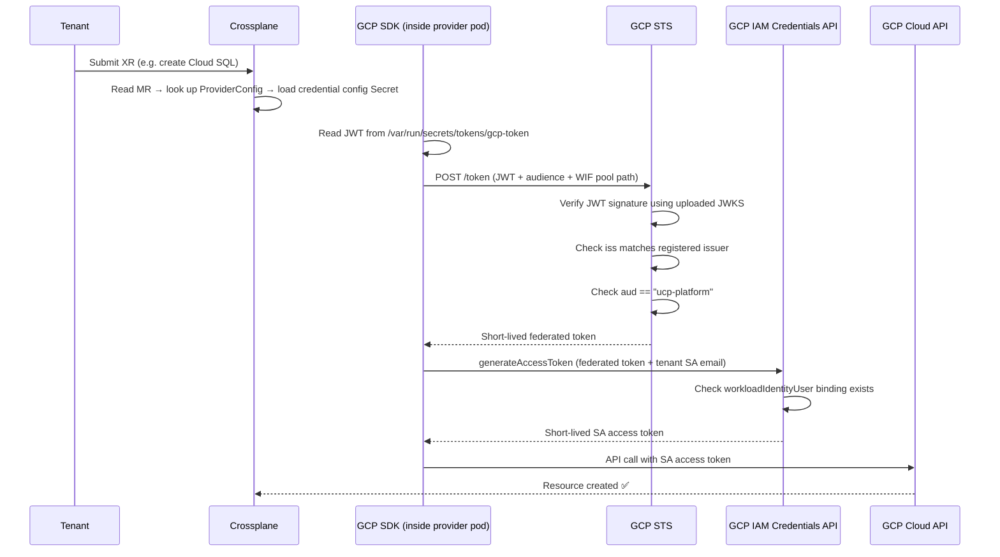

# WIF PoC — Concepts

Background context for the WIF PoC. For the full investigation, see the [parent research doc](../../research/workload-identity-federation-gcp.md).

---

## Components

### 1. Cluster Key Pair

Two mathematically linked keys generated automatically when the cluster starts.

- **Private key** — lives inside the colima VM, never leaves. Used to sign every ServiceAccount token the cluster issues.
- **Public key (JWKS)** — safe to share. Used by GCP STS to verify token signatures.

If the cluster is deleted and recreated, both keys change. The new JWKS must be re-uploaded to the WIF provider. Tenants do not need to change anything else.

---

### 2. JWKS on GCS (PoC workaround)

The cluster's public key hosted as a JSON file on a public GCS bucket.

GCP STS needs to fetch the public key to verify tokens. A local cluster's OIDC issuer is internal by default, so the public key is hosted at a reachable URL as a workaround. In production, if UCP runs on GKE, GKE handles OIDC internally and no GCS bucket is needed.

---

### 3. WIF Pool

A GCP resource the tenant creates in their own project. It is a container that groups trusted external identity providers. One pool per tenant project.

---

### 4. WIF Provider

> **Name conflict — "provider" means two different things here:**
> - **Crossplane Provider** — a Crossplane package (e.g. `provider-gcp-storage`) that runs as a pod and knows how to manage GCP resources. This is a K8s/Crossplane concept.
> - **WIF Provider** — a GCP IAM resource inside a Workload Identity Pool that registers a trusted external identity issuer. This is a GCP concept.
>
> They are completely unrelated. The naming collision is unfortunate. In this doc, "WIF provider" always means the GCP IAM resource.

A GCP resource inside the pool that registers a specific trusted issuer. The tenant creates it during onboarding with:

- **Issuer URI** — UCP's cluster OIDC issuer URL
- **Audience** — `ucp-platform` (fixed value defined by UCP, same for all tenants)
- **JWK file** — the cluster's public key (uploaded manually due to GP 106 in the PoC)
- **Attribute mapping** — `google.subject = assertion.sub`

When GCP STS receives a token claiming to be from UCP's cluster with audience `ucp-platform`, it uses this provider to verify the token.

---

### 5. ServiceAccount Token (JWT file)

A short-lived JWT automatically generated and mounted by Kubernetes inside the provider pod at `/var/run/secrets/tokens/gcp-token`. Auto-rotated every hour. Never touched manually.

> **K8s ServiceAccount vs GCP Service Account** — these are two completely different things that share the same name. A **Kubernetes ServiceAccount** is a K8s resource that represents the identity of a pod inside the cluster. A **GCP Service Account** is a GCP resource with IAM permissions to call GCP APIs. The token here belongs to the K8s one, not the GCP one.

The K8s ServiceAccount the token belongs to is **created automatically by Crossplane** when it installs the provider — not by us. We only control its name via `serviceAccountTemplate` in `DeploymentRuntimeConfig` (component 6).

If the provider has multiple pod replicas, all replicas share the same K8s ServiceAccount name — it is set at the Deployment level. Each replica gets its own token file, but all tokens have the same `sub` claim and are therefore identical from GCP's perspective.

Configured via a projected volume in `DeploymentRuntimeConfig`. Token payload:

```json
{
  "iss": "<UCP cluster OIDC issuer>",
  "sub": "system:serviceaccount:crossplane-system:ucp-provider-gcp-storage",
  "aud": ["ucp-platform"],
  "exp": "<1 hour from now>"
}
```

This token is **the same for all tenants** — one token, one K8s SA, one fixed audience. Per-tenant differentiation happens in the credential config (component 9), not here.

---

### 6. DeploymentRuntimeConfig

When Crossplane installs a provider, it automatically creates and manages the provider pod Deployment. You cannot edit that Deployment directly — Crossplane would overwrite your changes. `DeploymentRuntimeConfig` is the Crossplane-provided way to inject extra configuration into provider Deployments without fighting Crossplane's reconciler.

Created by UCP as part of cluster setup. One config applied to all GCP providers via `runtimeConfigRef` on each Provider resource.

Configures two things:

- **`serviceAccountTemplate.metadata.name: ucp-provider-gcp-storage`** — tells Crossplane to create the provider's K8s SA with this stable name instead of the auto-generated hash. Required so the principal string UCP hands to tenants never changes across provider upgrades.
- **Projected volume** — mounts the JWT file at `/var/run/secrets/tokens/gcp-token` with audience `ucp-platform`.

---

### 7. GCP Service Account (in tenant's GCP project)

A GCP identity the tenant creates in their own project with the permissions needed to manage their cloud resources (e.g. `roles/cloudsql.admin`). Crossplane impersonates this SA to call GCP APIs on the tenant's behalf.

---

### 8. `workloadIdentityUser` IAM Binding (in tenant's GCP project)

An IAM binding on the tenant's GCP SA that allows UCP's provider pod K8s identity to impersonate it.

The tenant grants this during onboarding using a principal string UCP provides:

```
principal://iam.googleapis.com/projects/PROJECT_NUMBER/locations/global/
workloadIdentityPools/POOL_ID/subject/
system:serviceaccount:crossplane-system:ucp-provider-gcp-storage
```

Set via GCP Console → IAM & Admin → Service Accounts → select SA → Principals with access → Grant access → role: `Workload Identity User`.

---

### 9. Credential Config JSON (K8s Secret per tenant)

A non-secret JSON file UCP generates per tenant. Contains no key, no password. Created by UCP in the same onboarding transaction as the ProviderConfig.

```json
{
  "type": "external_account",
  "audience": "//iam.googleapis.com/projects/.../pools/.../providers/...",
  "token_url": "https://sts.googleapis.com/v1/token",
  "credential_source": {
    "file": "/var/run/secrets/tokens/gcp-token"
  },
  "service_account_impersonation_url": "https://iamcredentials.googleapis.com/v1/projects/-/serviceAccounts/TENANT_SA_EMAIL:generateAccessToken"
}
```

This is where per-tenant differentiation happens — each tenant has a different `service_account_impersonation_url` pointing to their own GCP SA. Stored as a K8s Secret in `crossplane-system`.

---

### 10. ProviderConfig (per tenant)

A Crossplane resource that tells the GCP provider which credentials to use when provisioning for this tenant. References the credential config Secret (component 9). Created by UCP in the same transaction as the credential config.

---

## Onboarding Transaction

The credential config and ProviderConfig are always created together, in the same step, the moment the tenant completes onboarding:

```
Tenant submits: SA email + project ID
        │
        ▼
UCP generates credential config JSON
        │
        ▼
UCP stores it as K8s Secret
        │
        ▼
UCP creates ProviderConfig referencing that Secret
        │
        ▼
Tenant can provision resources
```

---

## Runtime Flow



---

## Multi-Tenant Design

One shared provider pod serves all tenants:

```
provider-gcp-storage pod
  token: aud="ucp-platform", sub="ucp-provider-gcp-storage"
  │
  ├── Tenant A ProviderConfig → credential config → impersonate tenant-a-sa@...
  │     STS: token verified ✅  IAM: binding exists ✅  → tenant A's GCP SA
  │
  └── Tenant B ProviderConfig → credential config → impersonate tenant-b-sa@...
        STS: token verified ✅  IAM: binding exists ✅  → tenant B's GCP SA
```

- Same token for all tenants (one K8s SA, one fixed audience)
- Per-tenant differentiation via credential config (different SA to impersonate)
- Each tenant grants `workloadIdentityUser` to the same stable K8s SA in their own project

---

## Component Ownership

| Component | Created by | Lives in | Changes when |
|-----------|-----------|----------|-------------|
| Cluster key pair | k3s (automatic) | colima VM | Cluster recreated |
| JWKS on GCS | UCP (PoC only) | GCS bucket | Cluster recreated |
| WIF pool | Tenant | Tenant GCP project | Never |
| WIF provider | Tenant | Tenant GCP project | Cluster recreated (new JWKS) |
| JWT token file | Kubernetes (automatic) | Provider pod memory | Every hour (auto) |
| DeploymentRuntimeConfig | UCP | K8s cluster | Never (stable) |
| GCP Service Account | Tenant | Tenant GCP project | Never |
| `workloadIdentityUser` binding | Tenant | Tenant GCP project | Never |
| Credential config JSON | UCP | K8s Secret | Never |
| ProviderConfig | UCP | K8s cluster | Never |

---

## Credential Source in `provider-upjet-gcp`

The provider supports multiple credential sources (`Secret`, `InjectedIdentity`, `Upbound`, etc.) but only `Secret` + `external_account` is viable for UCP's multi-tenant model:

- **`InjectedIdentity`** — GKE Workload Identity. Links the provider pod to a GCP SA in **UCP's own GCP project** via GKE's metadata server. Accessing tenant GCP projects still requires cross-project IAM grants or SA impersonation — the tenant onboarding burden is identical to the `Secret` approach. Not simpler.
- **`Upbound` + `Federation`** — Upbound's SaaS platform feature. Requires Upbound's managed control plane to inject the token. Has no token source on self-hosted Crossplane. Not a real option.
- **`Secret` + `external_account`** ✅ — works on any cluster, portable across cloud providers, supports multi-tenant via per-tenant credential config. **This is the correct choice for UCP.**

---

## GP 106 Constraint

CCoE guardrail `constraints/iam.workloadIdentityPoolProviders` is a list constraint enforced at org/folder level on `sub-gcp-ucp-clsd-sandbox`. It restricts which issuer URIs can be registered as WIF providers.

The PoC worked around it by using a dummy issuer URI already on the allowed list (`https://ghe.rakuten-it.com/_services/token`) and uploading the JWKS directly. This is not acceptable for production — CCoE must add UCP's real issuer URL to the allowed list. The allowed list already contains an AKS cluster OIDC issuer, which is a direct precedent.
