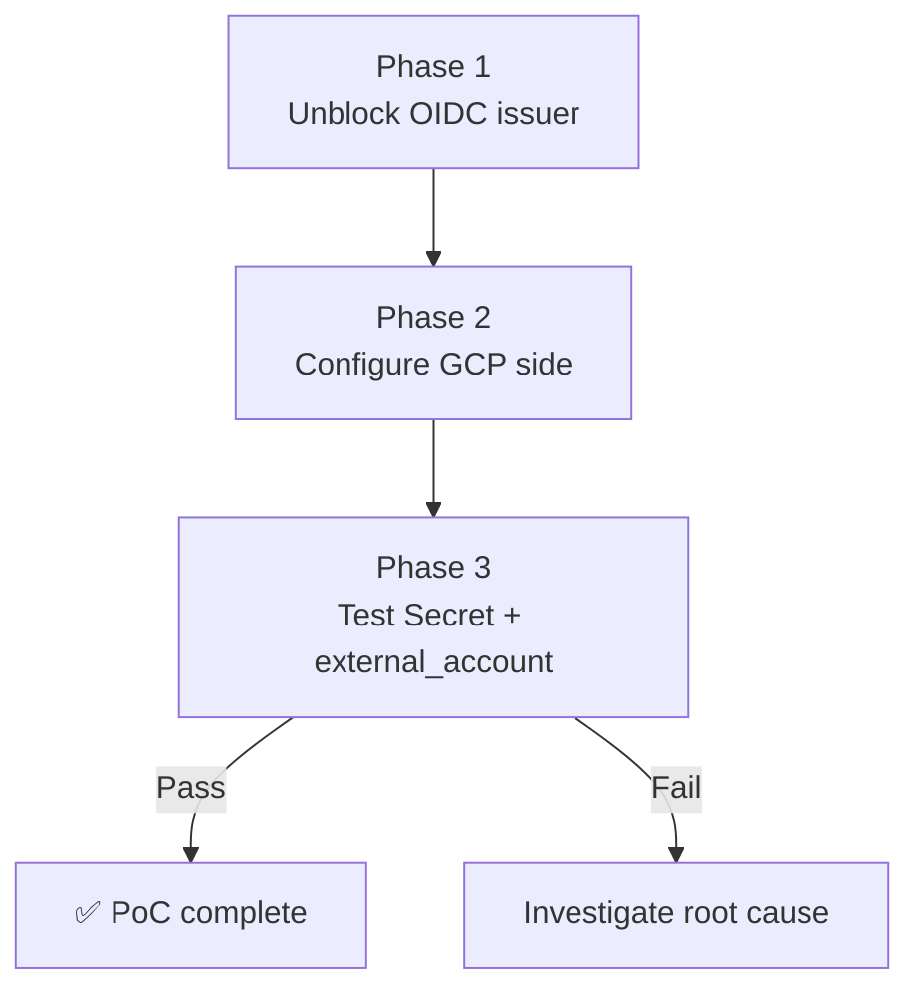

# WIF PoC — Design

Human review document. Read this before the PoC starts executing.

| | |
|---|---|
| **Ticket** | MCUCP-217 |
| **Parent research** | [Workload Identity Federation — Feasibility for UCP](https://confluence.rakuten-it.com/confluence/pages/viewpage.action?pageId=6761359577) |

---

## Research Question

> Can WIF replace long-lived SA keys as UCP's GCP credential model?

---

## Hypothesis

WIF is technically feasible for UCP. The `Secret` + `external_account` credential source is the correct approach — it relies purely on the GCP SDK's Application Default Credentials support, not on provider-specific infrastructure, and supports UCP's multi-tenant model. It works on any cluster where the provider pod can read a file and reach GCP STS over the internet.

The main risks are OIDC issuer reachability on a local cluster and the GP 106 org policy constraint — both expected to be solvable without GKE.

---

## Scope

| Item | In scope | Out of scope |
|------|----------|--------------|
| Local cluster (kind / k3d) | ✅ | |
| GKE cluster | | ✅ — separate path if needed |
| `provider-family-gcp` v2.6.0 | ✅ | |
| Cloud SQL provisioning as verification target | ✅ | |
| Full tenant onboarding automation | | ✅ — post-PoC |
| GP 106 CCoE allowlist approval | | ✅ — worked around via dummy issuer + JWK upload (sandbox is L1) |
| Migration path for existing SA key tenants | | ✅ — post-PoC |

---

## Approach

### Phase 1 — Unblock the OIDC issuer problem

Local clusters use `kubernetes.default.svc.cluster.local` as the OIDC issuer — unreachable by GCP STS. The workaround is to host the cluster's public JWKS on a publicly reachable URL (e.g GCS bucket) and configure the cluster to use that URL as its issuer.

Steps:
1. Extract the cluster's public JWKS (`kubectl get --raw /openid/v1/jwks`)
2. Host the JWKS and OIDC discovery document on a public GCS bucket
3. Recreate the cluster with `--service-account-issuer=<gcs-url>`

### Phase 2 — Configure GCP side (one-time per sandbox project)

1. Create a Workload Identity Pool in the sandbox GCP project
2. Create a WIF provider pointing to the GCS-hosted OIDC issuer
3. Create a GCP Service Account with Cloud SQL admin permissions
4. Grant the Crossplane provider's K8s ServiceAccount `roles/iam.workloadIdentityUser` on the GCP SA

### Phase 3 — Test Approach A (`Secret` + `external_account`)

1. Generate the `external_account` credential config with `gcloud iam workload-identity-pools create-cred-config`
2. Store it as a K8s Secret (no private key material)
3. Create a `ProviderConfig` with `source: Secret` referencing it
4. Add a `DeploymentRuntimeConfig` to mount a projected ServiceAccount token volume on the provider pod
5. Provision a Cloud SQL instance through Crossplane and confirm success

---

## Success Criteria

| Criterion | Pass condition |
|-----------|---------------|
| OIDC issuer workaround works | GCP STS successfully verifies a K8s ServiceAccount JWT signed by the local cluster |
| At least one credential source works end-to-end | Crossplane successfully provisions a Cloud SQL instance without a SA key file |
| `Secret` + `external_account` verdict | Confirmed working or confirmed broken with root cause |
| Tenant setup steps documented | Clear list of what the tenant must configure in their GCP project |

---

## Risks

| Risk | Outcome |
|------|---------|
| GP 106 blocks WIF pool creation in sandbox project | **Occurred** — sandbox is L1. Worked around via dummy issuer URI + manual JWK upload. Not acceptable for production. |
| `Upbound` source requires Upbound managed platform | Confirmed — not applicable to UCP. Removed from scope. |
| Projected token volume not supported on self-hosted provider pod | **Did not occur** — `DeploymentRuntimeConfig` works in v2.6.0. |
| JWKS key rotation breaks WIF after cluster recreation | **Occurred** — re-uploaded JWKS after each cluster recreate. |
| Provider types differ between `provider-upjet-gcp-beta` v1.x and `provider-family-gcp` v2.6.0 | **Did not occur** — credential sources are the same. |

---

## Open Questions

All pre-PoC questions were answered during execution. See [poc-report.md](https://confluence.rakuten-it.com/confluence/pages/viewpage.action?pageId=6761359552) for the full verdict.
