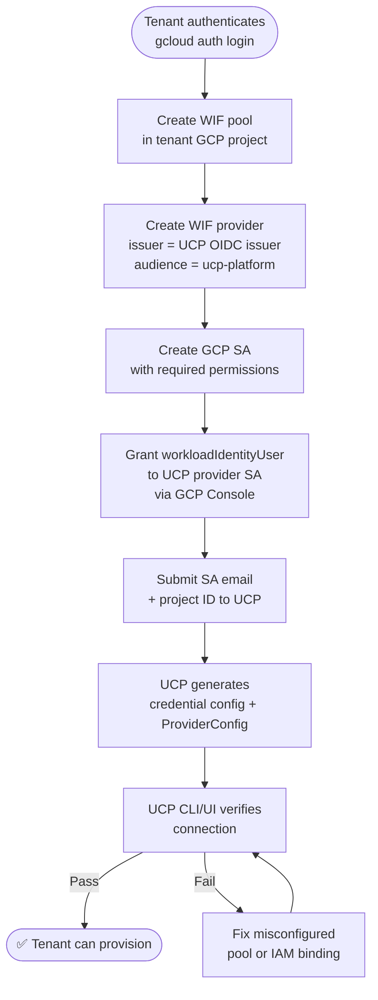

# WIF PoC — Report

| | |
|---|---|
| **Ticket** | MCUCP-217 |
| **Status** | Complete |
| **Research question** | Can WIF replace long-lived SA keys as UCP's GCP credential model? |

---

## Verdict

**WIF works end-to-end with `Secret` + `external_account` credential source.** Crossplane's `provider-upjet-gcp` v2.6.0 successfully provisioned a GCS bucket in `sub-gcp-ucp-clsd-sandbox` using a Kubernetes ServiceAccount token — no SA key file at any point. GP 106 was worked around for the PoC using a dummy issuer URI from the allowed list with a manual JWK upload; this workaround is not acceptable for production and requires a CCoE policy change before UCP can use WIF in real tenant projects.

---

## What This PoC Answers

The [parent research doc](../../research/workload-identity-federation-gcp.md) identified WIF as a potential replacement for long-lived SA keys in UCP's Crossplane-based provisioning model. Before committing to that path, the following must be confirmed by hands-on proof:

- Whether WIF is technically feasible for UCP's Crossplane-based provisioning on a self-hosted cluster
- Whether the OIDC issuer reachability problem is solvable without GKE
- Whether the multi-tenant model (one provider pod, N tenants) works under WIF
- What the outstanding blockers are for production adoption

---

## What Was Proved

- `provider-upjet-gcp` v2.6.0 supports WIF end-to-end using `Secret` + `external_account` credential source — a GCS bucket was successfully provisioned with no SA key file
- A colima k3s cluster can be reconfigured with any OIDC issuer URL via `--k3s-arg "--kube-apiserver-arg=service-account-issuer=<url>"`
- GP 106 validates the **issuer URI field only** — it does not validate the JWK content; uploading the JWKS file directly to the WIF provider bypasses the need for a publicly reachable OIDC endpoint and bypasses the GP 106 issuer URI check for PoC purposes
- The `DeploymentRuntimeConfig` projected volume mechanism works — the K8s ServiceAccount token is correctly mounted inside the provider pod and read by the GCP SDK
- GCP STS successfully verifies K8s ServiceAccount JWTs signed by a local k3s cluster when the JWKS is uploaded directly to the WIF provider
- The projected volume `audience` must match the WIF provider's configured audience — using a **custom fixed audience** (e.g. `ucp-platform`) across all tenants works and is the correct multi-tenant design; the default per-provider canonical audience does not scale
- Provider pods can be given a **stable, predictable K8s SA name** via `serviceAccountTemplate.metadata.name` in `DeploymentRuntimeConfig` — this is required so the principal UCP hands to tenants never changes across provider upgrades
- Multi-tenant works with one shared provider pod: all tenants configure their WIF provider with the same fixed audience (`ucp-platform`), each grants `workloadIdentityUser` to the same stable K8s SA, and per-tenant differentiation happens through the credential config JSON (each tenant has a different GCP SA to impersonate)

---

## What Was Not Proved

- End-to-end with a real (non-dummy) UCP-owned OIDC issuer URI — blocked by GP 106 on the sandbox project

---

## Findings Summary

WIF is technically viable for `provider-upjet-gcp` on a self-hosted non-GKE cluster. The `Secret` + `external_account` approach works without any changes to the provider itself — the GCP SDK handles the full token exchange transparently.

The three issues encountered during execution and their resolutions:

| Issue | Resolution |
|-------|-----------|
| GP 106 blocked issuer URI registration | Used a dummy URI from the allowed list + manual JWK file upload |
| Projected volume `audience` mismatch | Switched from default canonical audience to a fixed custom audience `ucp-platform` — all tenants configure their WIF provider with the same value |
| `workloadIdentityUser` binding only set for SQL provider | Each GCP provider has its own K8s SA — binding must cover each one; solved permanently by using a stable SA name via `serviceAccountTemplate` |
| Provider pod SA name changes on upgrade | Set `serviceAccountTemplate.metadata.name: ucp-provider-gcp-storage` in `DeploymentRuntimeConfig` — principal string is now stable |

The remaining production gap is GP 106: the dummy issuer workaround is not acceptable outside a PoC. Production requires CCoE to add a UCP-owned issuer URL to the allowed list. The GP 106 allowed list already contains an AKS cluster OIDC issuer (`https://aks-cluste-cped-jpeast-rg-88a072-4188q7in.hcp.japaneast.azmk8s.io`), which is a direct precedent for approving UCP's cluster issuer.

---

## Recommendation

**WIF is the right direction.** Proceed with the following:

1. **Raise with CCoE** to add UCP's production OIDC issuer URL to `constraints/iam.workloadIdentityPoolProviders`, citing the AKS cluster entry as precedent. If UCP runs on GKE, use the GKE-managed OIDC issuer — no self-hosted JWKS hosting needed.
2. **Stable SA names** must be set via `serviceAccountTemplate` in `DeploymentRuntimeConfig` for every GCP provider before any tenant onboarding happens — the stable name is part of the principal string UCP hands to tenants.
3. **Fixed audience** `ucp-platform` must be the audience tenants configure in their WIF provider. UCP must document this as a required onboarding instruction.
4. **Tenant onboarding** is a set of manual steps the tenant performs in their GCP project after authenticating with `gcloud auth login`. UCP must provide clear step-by-step instructions.
5. **Connection verification** — UCP's CLI or UI should verify the WIF setup is correct before the tenant submits their SA email and project ID.

### Tenant onboarding flow

---

## Supporting Detail

- [Implementation](./implementation.md) — setup steps, test runs, observed results
- [Evidence](./evidence.md) — provider source code findings, external references
- [Concepts](./concepts.md) — background on WIF and credential sources
