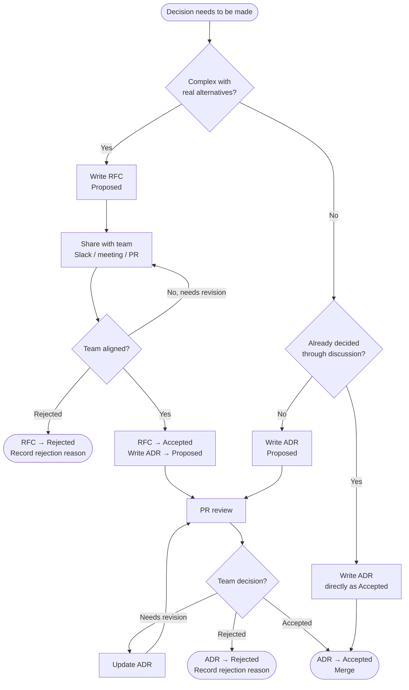

# Architecture Decision Records

This directory captures significant architectural decisions made by the UCP platform team.

---

## What Is an ADR?

An Architecture Decision Record documents a significant decision — what was chosen, why it was chosen, and what the consequences are. It is not a transcript of the discussion, but the distilled outcome after alignment has been reached.

The goal is simple: anyone joining the team later should be able to read this directory and understand why the platform is structured the way it is, without having to ask.

---

## When to Write One

Write an ADR when the decision:

- Is difficult or expensive to reverse
- Would cause a new team member to ask "why is it done this way?"
- Was debated — i.e., real alternatives existed

Do **not** write an ADR for:

- Implementation details with obvious solutions
- Decisions scoped to a single file or function
- Temporary workarounds (those belong in code comments or tickets)

---

## When an ADR Also Needs an RFC

Not every ADR needs a preceding RFC. An RFC is only warranted when the decision is
complex enough that the analysis — options comparison, quantitative tradeoffs, rejected
alternatives — doesn't fit comfortably in the ADR's "Why" section.

**ADR without RFC** — the rationale fits in a few sentences:
- Use `log/slog` for structured logging (stdlib, no meaningful alternative for our scale)
- Use golangci-lint with a curated ruleset (standard Go practice, no real debate)
- Use `golang-migrate` for database migrations (clear choice, obvious alternative is worse)

**ADR with RFC** — the decision has multiple viable alternatives with real tradeoffs
that require detailed analysis before the team can align:
- HTTP framework selection (gorilla/mux vs chi vs echo vs gin — quantitative comparison needed)
- Repository structure (umbrella vs monorepo vs polyrepo — workflow impact analysis needed)
- Architecture pattern (Clean Architecture vs DDD vs flat MVC — rationale needed for the team)

The rule of thumb: if writing the "Why" section makes you want to add a comparison table
or more than a paragraph of alternatives analysis, write an RFC first.

---

## How Decisions Actually Get Made

The ADR is the record, not the conversation. Discussion can and does happen anywhere:

- A Slack thread that reaches consensus
- An impromptu hallway or call conversation
- A weekly technical session
- PR comments on a code change
- A dedicated RFC review

**The ADR does not need to capture all of this.** It captures the outcome and the
reasoning that led to it. The "Where did we discuss this?" detail belongs in the ADR's
Context section or as a reference link, not as a transcript.

### The ADR does not always go through Proposed first

If a decision was already made through discussion before the ADR was written — for
example, the team aligned in a meeting — the ADR can be written and merged directly
as **Accepted**. The Proposed state is for decisions that are still open for team input.

---

## Process Flowchart



---

## Format

We use the **Nygard format** as the baseline:

Filename format: `ADR-NNN-brief-description.md`
Example: `ADR-003-http-framework.md`

```markdown
# ADR-NNN: {Title}

**Status:** {Proposed | Accepted | Rejected | Deprecated | Superseded by ADR-NNN}
**Date:** YYYY-MM-DD
**Rejected Reason:** {only present when Status is Rejected}

## Context

What decision needs to be made, and what constraint or tension makes it matter?

## Decision

What was chosen?

## Why

Why this option over the alternatives. If alternatives were considered,
name them briefly here and explain why they lost.
Reference the RFC for full analysis if one exists: [RFC-NNN](../rfcs/RFC-NNN.md)

## Consequences

Optional. Include only if the downstream effects are important to remember.
Use a list with explicit markers so positives and negatives are visible at a glance:

- `(+)` Positive consequence
- `(-)` Negative consequence
- `(~)` Neutral consequence
```

---

## Lifecycle

| Status | Meaning |
|---|---|
| **Proposed** | Written and open for team review. Content may still change. |
| **Accepted** | Team has aligned. Document is now immutable — do not edit the content. |
| **Rejected** | Team decided against the proposal. Document is kept for reference. |
| **Deprecated** | No longer relevant (e.g. component retired). Kept for historical reference. |
| **Superseded by ADR-NNN** | Replaced by a newer decision. Link to the superseding ADR. |

**ADRs are never deleted.** When a decision changes, write a new ADR that supersedes the old one.

When an ADR is rejected, add a `**Rejected Reason:**` field in the header so future readers understand why without having to dig through PR comments:

```markdown
**Status:** Rejected
**Rejected Reason:** {brief reason — e.g. "superseded by a different approach before implementation" or "team aligned on RFC-002 instead"}
```

The value of keeping rejected ADRs: if a similar proposal is raised in the future, the team can point to the rejected ADR and avoid re-litigating the same decision.

---

## Review Process

**For most decisions:** open a pull request with the Proposed ADR. Team reviews and
comments inline. Author updates based on feedback. Merge = Accepted.

**For decisions already made:** write the ADR directly as Accepted and merge. No PR
review required if the team already aligned elsewhere.

**For significant or contested decisions:** write an RFC first. Circulate before the
weekly technical session. Use the session for alignment. Write the ADR after the RFC
is accepted.

---

## Numbering

ADRs are numbered sequentially: `ADR-000-use-adrs`, `ADR-001-repository-structure`, `ADR-002-go-service-architecture`, ...

Claim the next available number when you start writing. If two ADRs are being drafted
simultaneously, coordinate in Slack to avoid collisions.

---

## Referencing ADRs

When writing code or documentation that implements an architectural decision, reference the ADR:

```go
// Workflow contracts are typed Go structs — see ADR-001
```

```yaml
# Echo selected as HTTP framework — see ADR-003
```

In Jira tickets, link the ADR in the ticket description or a comment when work implements a recorded decision.
