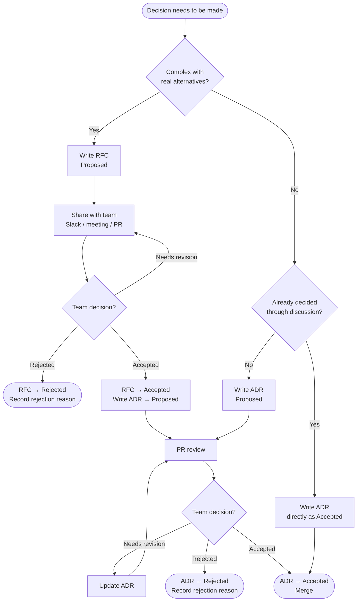

# Request for Comments (RFCs)

RFCs are pre-decision documents. An RFC proposes a significant change, describes the
problem, presents a solution with alternatives, and collects team feedback before a
decision is made.

Once an RFC reaches alignment, the outcome is recorded as a short ADR that references
the RFC. The RFC captures how the team thought about the problem; the ADR captures what
was decided.

---

## When to Write an RFC

Write an RFC when:

- You are proposing a significant change that affects multiple components or the whole team
- The solution is not obvious — real alternatives exist and need evaluation
- The decision warrants more analysis than fits in an ADR's "Why" section

Not every ADR needs a preceding RFC. For straightforward decisions where the rationale
is clear, write the ADR directly. The RFC is only needed when the analysis — options
comparison, quantitative tradeoffs, rejected alternatives — is the primary value.

**RFC needed:**
- HTTP framework selection (gorilla/mux vs chi vs echo vs gin — quantitative comparison needed)
- Repository structure (umbrella vs monorepo vs polyrepo — workflow impact analysis needed)
- Architecture pattern (Clean Architecture vs DDD vs flat MVC — rationale needed for the team)

**RFC not needed:**
- Use `log/slog` for structured logging (stdlib, no meaningful alternative for our scale)
- Use golangci-lint with a curated ruleset (standard Go practice, no real debate)
- A decision that was already reached through team discussion and just needs recording

---

## RFC vs Feature Analysis

An RFC is not the same as a technical breakdown of a user story: **we do not write an RFC for every story**.

A **user story** describes a feature to build. Working through it produces working
software. Along the way, you might do a technical analysis — breaking down tasks,
estimating complexity, understanding which APIs to call, how to structure a form, what
endpoints to add. That analysis lives in the Jira ticket, a comment, a short design
note, or just in your head. It does not become an RFC.

An **RFC** asks a different question: not "how do we build this feature?" but "how
should our system approach this class of problem?" The output is a decision that shapes
how all future work is done — not just this story.

| | User Story / Feature Analysis | RFC |
|---|---|---|
| Question | How do we build this specific thing? | How should our system approach this? |
| Scope | One feature or task | Platform-wide, affects future work |
| Output | Working software | A decision record (ADR) |
| Audience | The engineer implementing it | The whole team |
| Lives in | Jira ticket, PR description | `docs/rfcs/` |

**The overlap — when a story surfaces an architectural decision:**

It can happen. While breaking down a story, you realise you need to choose a new
library that will be used broadly, or pick an approach that will set a precedent for
future features. In that case, the decision that emerges deserves an RFC and ADR —
but the story itself doesn't become an RFC. The story is still a story. The decision
that came out of it gets its own document.

**Example:** a story to "add metrics to the API server" doesn't become an RFC. But if
the team hasn't aligned on an observability stack yet, that decision — OTel vs direct
Prometheus vs something else — is an RFC. The story is the trigger; the RFC is the
decision it requires.

---

## Where Discussion Happens

An RFC is one way to structure a decision discussion, but not the only way. Team
alignment can happen anywhere:

- A Slack thread that reaches consensus
- An impromptu call or meeting
- A weekly technical session
- PR comments on the RFC itself

The RFC captures the analysis and outcome regardless of where the discussion happened.
If a decision was already made through discussion, skip the RFC and write the ADR directly.

---

## Process Flowchart



---

## Format

Filename format: `RFC-NNN-brief-description.md`
Example: `RFC-003-observability-stack.md`

All RFCs share the same header and bookend sections. The middle section varies by
the nature of the proposal — see the two patterns below.

```markdown
# RFC-NNN: {Title}

**Author:** {name}
**Date:** YYYY-MM-DD
**Status:** {Proposed | Accepted | Rejected | Superseded by RFC-NNN}
**Rejected Reason:** {only present when Status is Rejected}
**Related ADR:** {ADR-NNN or "none yet"}

## Summary

One paragraph. What are you proposing?

## Problem

What problem does this solve? Why does it matter now?

## [middle section — see patterns below]

## Risks and Drawbacks

Use explicit markers:
- `(+)` Positive
- `(-)` Negative / risk
- `(~)` Neutral

## Open Questions

What is still unresolved. What needs team input.
```

### Pattern A — Options comparison (use when discrete alternatives exist)

For decisions where multiple approaches competed. See RFC-001 as an example.

```markdown
## Options

### Option A — {name}
Description, pros/cons.

### Option B — {name}
Description, pros/cons.

## Quantitative Comparison Summary

| Dimension | Option A | Option B |
|---|---|---|

## Recommendation

Which option and why.
```

### Pattern B — Proposal (use when one approach is being proposed)

For standards, designs, or migrations where one direction is being defined.
Alternatives are evaluated inline within each section. See RFC-002 as an example.

```markdown
## Proposal

### {Topic 1}
Proposed approach. Alternatives considered and why they lost are embedded here.

### {Topic 2}
...
```

---

## Lifecycle

| Status | Meaning |
|---|---|
| **Proposed** | Open for team feedback via PR or meeting. |
| **Accepted** | Team aligned. A corresponding ADR should be written. |
| **Rejected** | Team decided against the proposal. Document is kept for reference. |
| **Superseded by RFC-NNN** | Replaced by a newer proposal. Link to the superseding RFC. |

When an RFC is rejected, add a `**Rejected Reason:**` field in the header:

```markdown
**Status:** Rejected
**Rejected Reason:** {brief reason — e.g. "approach deemed too risky for current team size" or "superseded by RFC-005 which took a different direction"}
```

The value of keeping rejected RFCs: if a similar proposal is raised in the future, the team can point to the rejected RFC to avoid re-litigating the same analysis.

---

## Review Process

Open the RFC as a pull request in **Proposed** status. Team reviews and comments
inline. The author updates the RFC based on feedback.

For significant proposals, circulate the RFC before the weekly technical session so
everyone reads it first. Use the session for alignment, not first reading.

Once the team aligns, the author:
1. Updates the RFC status to **Accepted**
2. Writes a short ADR that references the RFC for the full analysis
3. Merges both

---

## Numbering

RFCs are numbered sequentially: `RFC-001-repository-structure`, `RFC-002-go-codebase-standard`, ...

Coordinate numbering in Slack when drafting simultaneously.

---

## Relationship to ADRs

```
RFC (pre-decision)
  └── problem + options/proposal + alternatives + risks + open questions
        ↓ once accepted
ADR (post-decision)
  └── what was decided + why + consequences + link to RFC
```

An ADR's "Why" section should reference the RFC for the full analysis:

> Full analysis and alternatives: [RFC-001](../rfcs/RFC-001-repository-structure.md)
