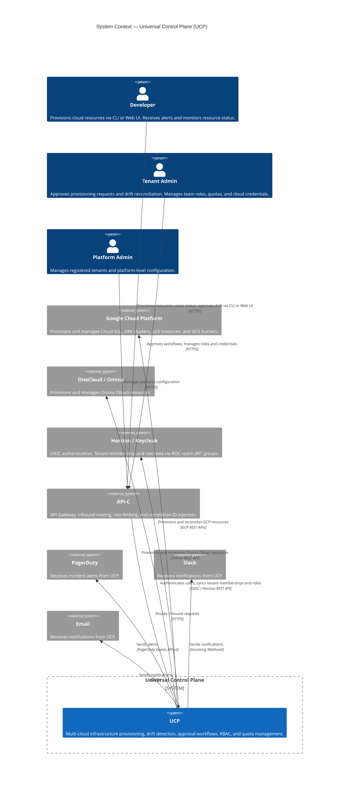

# Architecture Diagrams

C1 (System Context) and C2 (Container) diagrams for the UCP production architecture.

The C1 diagram applies to all topology options. The C2 diagrams follow the scaling
journey — start at Level 1 and grow into the next level only when measured thresholds
are crossed. See [Architecture Foundations § Scaling Strategy](./architecture-foundations.md#scaling-strategy)
for transition thresholds.

---

## C1 — System Context

---

## C2 — Level 1: Single Cluster (0–500 tenants)

All UCP workloads run on a single multi-AZ Kubernetes cluster.
Start here. Transition to Level 2 only when measured resource contention justifies it.

> **Cluster spec:** 3 × (4 vCPU, 16GB RAM) across 3 AZs. Cluster Autoscaler
> adds nodes under load. See [Architecture Foundations § Initial Cluster Spec](./architecture-foundations.md#initial-cluster-spec-estimated).

```mermaid
C4Container
    title C2 — Level 1: Single Cluster (0–500 tenants)

    Person(user, "User", "Developer / Tenant Admin / Platform Admin")

    System_Ext(apic, "API-C", "API Gateway. Inbound routing, rate limiting, correlation ID.")
    System_Ext(gcp, "GCP", "Cloud SQL, GKE, GCE, GCS")
    System_Ext(roc, "ROC / OneCloud", "Omnia DBaaS and other ROC services")
    System_Ext(keycloak, "Keycloak", "OIDC authentication")
    System_Ext(coredata, "Core Data API", "Tenant membership and role data")
    System_Ext(notif, "PagerDuty / Slack / Email", "Notification channels for UCP events")

    Container_Boundary(cluster, "K8s Cluster — multi-AZ") {

        Container(ingress, "Ingress", "K8s Ingress", "TLS termination, rate limiting, load balancing")
        Container(api, "API Server", "Go / Echo", "REST API. Auth, RBAC, quota, workflow submission.")

        ContainerDb(platdb, "Platform DB", "PostgreSQL", "Sessions, RBAC, audit logs, quota, notification config")
        Container(secrets, "Secret Manager", "TBD", "Cloud provider credentials and platform secrets")

        Container(temporal, "Temporal Server", "Temporal OSS", "Workflow orchestration. Frontend, History, Matching — all HA.")
        ContainerDb(tempdb, "Temporal DB", "PostgreSQL", "Workflow state, history, visibility store")

        Container(prov_w, "Provisioning Worker", "Go / Temporal SDK", "Executes provisioning workflows.")
        Container(drift_w, "Drift Worker", "Go / Temporal SDK, KEDA", "Executes drift scan and approval workflows. Scales 1–10 replicas.")

        Container(crossplane, "Crossplane + Providers", "Crossplane, provider-gcp-*, provider-roc", "Reconciles XRs and MRs against cloud provider state.")
        Container(eso, "ESO", "External Secrets Operator", "Syncs credentials from Secret Manager to K8s Secrets for Crossplane.")
        Container(keda, "KEDA", "KEDA", "Scales drift workers on Temporal queue depth.")
    }

    Rel(user, apic, "HTTPS")
    Rel(apic, ingress, "HTTPS")
    Rel(ingress, api, "HTTP")

    Rel(api, platdb, "SQL — sessions, RBAC, audit, quota")
    Rel(api, secrets, "read credentials")
    Rel(api, temporal, "gRPC — submit and query workflows")
    Rel(api, crossplane, "K8s API — create, list, delete XRs")
    Rel(api, keycloak, "OIDC — auth, token validation")
    Rel(api, coredata, "REST — tenant sync at login")

    Rel(temporal, tempdb, "SQL — workflow state")
    Rel(prov_w, temporal, "gRPC — poll provisioning queue")
    Rel(prov_w, crossplane, "K8s API — apply XR, poll XR status")
    Rel(drift_w, temporal, "gRPC — poll drift queue")
    Rel(drift_w, crossplane, "K8s API — LIST MRs, PATCH managementPolicies")
    Rel(drift_w, platdb, "SQL — read notification config")
    Rel(drift_w, notif, "HTTP")
    Rel(keda, temporal, "gRPC — read queue depth")
    Rel(eso, secrets, "read credentials")

    Rel(crossplane, gcp, "REST APIs — provision and observe")
    Rel(crossplane, roc, "REST API — provision and observe")

    UpdateLayoutConfig($c4ShapeInRow="4", $c4BoundaryInRow="1")
```

---

## C2 — Level 2: Platform + Ops Split (500–2,000 tenants)

Platform-facing components (API, auth, data) are separated from operations components
(Crossplane, Temporal, workers). Two clusters per environment.

Triggered when: Crossplane MR write churn shows measurable correlation with API
server read latency, or provider pod memory pressure is consistently high.

> **Cross-cluster connections:** API Server → Temporal (gRPC via Internal LB),
> API Server → Ops K8s API (kubeconfig, scoped ServiceAccount),
> Drift Worker → Platform DB (SQL), ESO → Secret Manager (HTTPS).

```mermaid
C4Container
    title C2 — Level 2: Platform + Ops Split (500–2,000 tenants)

    Person(user, "User", "Developer / Tenant Admin / Platform Admin")

    System_Ext(apic, "API-C", "API Gateway. Inbound routing, rate limiting, correlation ID.")
    System_Ext(gcp, "GCP", "Cloud SQL, GKE, GCE, GCS")
    System_Ext(roc, "ROC / OneCloud", "Omnia DBaaS and other ROC services")
    System_Ext(keycloak, "Keycloak", "OIDC authentication")
    System_Ext(coredata, "Core Data API", "Tenant membership and role data")
    System_Ext(notif, "PagerDuty / Slack / Email", "Notification channels for UCP events")

    Container_Boundary(plat, "Platform Cluster — multi-AZ") {

        Container(ingress, "Ingress", "K8s Ingress", "TLS termination, rate limiting, load balancing")
        Container(api, "API Server", "Go / Echo", "REST API. Auth, RBAC, quota, workflow submission.")
        ContainerDb(platdb, "Platform DB", "PostgreSQL", "Sessions, RBAC, audit logs, quota, notification config")
        Container(secrets, "Secret Manager", "TBD", "Cloud provider credentials and platform secrets")
    }

    Container_Boundary(ops, "Ops Cluster — multi-AZ") {

        Container(temporal, "Temporal Server", "Temporal OSS", "Workflow orchestration. Frontend, History, Matching — all HA.")
        ContainerDb(tempdb, "Temporal DB", "PostgreSQL", "Workflow state, history, visibility store")

        Container(prov_w, "Provisioning Worker", "Go / Temporal SDK", "Executes provisioning workflows.")
        Container(drift_w, "Drift Worker", "Go / Temporal SDK, KEDA", "Executes drift scan and approval workflows.")

        Container(crossplane, "Crossplane + Providers", "Crossplane, provider-gcp-*, provider-roc", "Reconciles XRs and MRs against cloud provider state.")
        Container(eso, "ESO", "External Secrets Operator", "Syncs credentials from Secret Manager to K8s Secrets for Crossplane.")
        Container(keda, "KEDA", "KEDA", "Scales drift workers on Temporal queue depth.")
    }

    Rel(user, apic, "HTTPS")
    Rel(apic, ingress, "HTTPS")
    Rel(ingress, api, "HTTP")

    Rel(api, platdb, "SQL")
    Rel(api, secrets, "read credentials")
    Rel(api, temporal, "gRPC — cross-cluster via Internal LB")
    Rel(api, crossplane, "K8s API — cross-cluster kubeconfig")
    Rel(api, keycloak, "OIDC")
    Rel(api, coredata, "REST")

    Rel(temporal, tempdb, "SQL — in-cluster")
    Rel(prov_w, temporal, "gRPC — in-cluster")
    Rel(prov_w, crossplane, "K8s API — in-cluster")
    Rel(drift_w, temporal, "gRPC — in-cluster")
    Rel(drift_w, crossplane, "K8s API — in-cluster")
    Rel(drift_w, platdb, "SQL — cross-cluster (notification config)")
    Rel(drift_w, notif, "HTTP")
    Rel(keda, temporal, "gRPC — in-cluster")
    Rel(eso, secrets, "HTTPS — cross-cluster")

    Rel(crossplane, gcp, "REST APIs")
    Rel(crossplane, roc, "REST API")

    UpdateLayoutConfig($c4ShapeInRow="3", $c4BoundaryInRow="1")
```

---

## C2 — Level 3: Cluster Sharding (2,000+ tenants)

Ops cluster is sharded by tenant. Each shard runs an independent set of Temporal
task queues and Crossplane providers. The API server contains a shard router that
maps tenant → shard via consistent hashing.

Triggered when: single Ops cluster Crossplane provider memory or Temporal throughput
becomes a measurable bottleneck at 2,000+ tenants.

> **Shard router:** lives inside the API server. Maps tenant ID → shard index via
> consistent hashing. Each shard has its own Temporal task queue namespace and
> Crossplane provider pods. Adding a shard requires re-balancing the tenant→shard
> mapping and migrating in-flight workflows.

```mermaid
C4Container
    title C2 — Level 3: Cluster Sharding (2,000+ tenants)

    Person(user, "User", "Developer / Tenant Admin / Platform Admin")

    System_Ext(apic, "API-C", "API Gateway. Inbound routing, rate limiting, correlation ID.")
    System_Ext(gcp, "GCP", "Cloud SQL, GKE, GCE, GCS")
    System_Ext(roc, "ROC / OneCloud", "Omnia DBaaS and other ROC services")
    System_Ext(keycloak, "Keycloak", "OIDC authentication")
    System_Ext(coredata, "Core Data API", "Tenant membership and role data")
    System_Ext(notif, "PagerDuty / Slack / Email", "Notification channels for UCP events")

    Container_Boundary(plat, "Platform Cluster — multi-AZ") {

        Container(ingress, "Ingress", "K8s Ingress", "TLS termination, rate limiting, load balancing")
        Container(api, "API Server + Shard Router", "Go / Echo", "REST API. Routes tenant requests to the correct Ops shard via consistent hashing.")
        ContainerDb(platdb, "Platform DB", "PostgreSQL", "Sessions, RBAC, audit logs, quota, notification config")
        Container(secrets, "Secret Manager", "TBD", "Cloud provider credentials and platform secrets")
    }

    Container_Boundary(shard_a, "Ops Cluster — Shard A (tenants 1–N)") {

        Container(temporal_a, "Temporal Server", "Temporal OSS", "Shard A task queues.")
        ContainerDb(tempdb_a, "Temporal DB", "PostgreSQL", "Shard A workflow state")
        Container(workers_a, "Provisioning + Drift Workers", "Go / Temporal SDK, KEDA", "Poll Shard A task queues.")
        Container(crossplane_a, "Crossplane + Providers", "Crossplane, provider-gcp-*, provider-roc", "Manages Shard A tenant resources.")
        Container(eso_keda_a, "ESO + KEDA", "ESO, KEDA", "Secret sync and worker autoscaling for Shard A.")
    }

    Container_Boundary(shard_b, "Ops Cluster — Shard B (tenants N+1–M)") {

        Container(temporal_b, "Temporal Server", "Temporal OSS", "Shard B task queues.")
        ContainerDb(tempdb_b, "Temporal DB", "PostgreSQL", "Shard B workflow state")
        Container(workers_b, "Provisioning + Drift Workers", "Go / Temporal SDK, KEDA", "Poll Shard B task queues.")
        Container(crossplane_b, "Crossplane + Providers", "Crossplane, provider-gcp-*, provider-roc", "Manages Shard B tenant resources.")
        Container(eso_keda_b, "ESO + KEDA", "ESO, KEDA", "Secret sync and worker autoscaling for Shard B.")
    }

    Rel(user, apic, "HTTPS")
    Rel(apic, ingress, "HTTPS")
    Rel(ingress, api, "HTTP")

    Rel(api, platdb, "SQL")
    Rel(api, secrets, "read credentials")
    Rel(api, keycloak, "OIDC")
    Rel(api, coredata, "REST")

    Rel(api, temporal_a, "gRPC — Shard A tenants")
    Rel(api, crossplane_a, "K8s API — Shard A tenants")
    Rel(api, temporal_b, "gRPC — Shard B tenants")
    Rel(api, crossplane_b, "K8s API — Shard B tenants")

    Rel(temporal_a, tempdb_a, "SQL")
    Rel(workers_a, temporal_a, "gRPC — in-cluster")
    Rel(workers_a, crossplane_a, "K8s API — in-cluster")
    Rel(workers_a, platdb, "SQL — cross-cluster (notification config)")
    Rel(workers_a, notif, "HTTP")
    Rel(eso_keda_a, secrets, "HTTPS — cross-cluster")
    Rel(crossplane_a, gcp, "REST APIs")
    Rel(crossplane_a, roc, "REST API")

    Rel(temporal_b, tempdb_b, "SQL")
    Rel(workers_b, temporal_b, "gRPC — in-cluster")
    Rel(workers_b, crossplane_b, "K8s API — in-cluster")
    Rel(workers_b, platdb, "SQL — cross-cluster (notification config)")
    Rel(workers_b, notif, "HTTP")
    Rel(eso_keda_b, secrets, "HTTPS — cross-cluster")
    Rel(crossplane_b, gcp, "REST APIs")
    Rel(crossplane_b, roc, "REST API")

    UpdateLayoutConfig($c4ShapeInRow="3", $c4BoundaryInRow="1")
```

---

## Alternative — Three-Cluster Separation (not recommended at UCP scale)

Platform, Crossplane, and Temporal each run on dedicated clusters. Maximum blast
radius isolation and independent scaling per tier. Not recommended for UCP's current
and foreseeable scale — the operational overhead of three clusters outweighs the
benefit. Documented here for reference only.

> Revisit only if Temporal and Crossplane show independent resource contention that
> cannot be resolved by vertical scaling within the Ops cluster.

```mermaid
C4Container
    title Alternative — Three-Cluster Separation

    Person(user, "User", "Developer / Tenant Admin / Platform Admin")

    System_Ext(apic, "API-C", "API Gateway. Inbound routing, rate limiting, correlation ID.")
    System_Ext(gcp, "GCP", "Cloud SQL, GKE, GCE, GCS")
    System_Ext(roc, "ROC / OneCloud", "Omnia DBaaS and other ROC services")
    System_Ext(keycloak, "Keycloak", "OIDC authentication")
    System_Ext(coredata, "Core Data API", "Tenant membership and role data")
    System_Ext(notif, "PagerDuty / Slack / Email", "Notification channels for UCP events")

    Container_Boundary(plat, "Platform Cluster — multi-AZ") {

        Container(ingress, "Ingress", "K8s Ingress", "TLS termination, rate limiting")
        Container(api, "API Server", "Go / Echo", "REST API. Auth, RBAC, quota, workflow submission.")
        ContainerDb(pg_plat, "Platform DB", "PostgreSQL", "Sessions, RBAC, audit logs, quota policies, notification config")
        Container(secrets, "Secret Manager", "TBD", "Cloud provider credentials and platform secrets.")
    }

    Container_Boundary(cp, "Crossplane Cluster — multi-AZ") {

        Container(crossplane, "Crossplane + Providers", "Crossplane, provider-gcp-*, provider-roc", "Reconciles XRs and MRs against cloud provider state.")
        Container(prov_w, "Provisioning Worker", "Go / Temporal SDK", "Executes provisioning workflows. In-cluster K8s API access. Connects to Temporal Server cross-cluster.")
        Container(drift_w, "Drift Worker", "Go / Temporal SDK, KEDA", "Executes drift scan and approval workflows. In-cluster K8s API access. Connects to Temporal Server cross-cluster.")
        Container(eso, "ESO", "External Secrets Operator", "Syncs credentials from Secret Manager to K8s Secrets for Crossplane.")
        Container(keda, "KEDA", "KEDA", "Scales drift workers on Temporal queue depth. Reads Temporal queue metrics cross-cluster.")
    }

    Container_Boundary(tc, "Temporal Cluster — multi-AZ") {

        Container(temporal, "Temporal Server", "Temporal OSS", "Workflow orchestration. Frontend, History, Matching — all HA.")
        ContainerDb(pg_temp, "Temporal DB", "PostgreSQL", "Temporal workflow state, history, and visibility store")
    }

    Rel(user, apic, "HTTPS")
    Rel(apic, ingress, "HTTPS")
    Rel(ingress, api, "HTTP")

    Rel(api, pg_plat, "SQL")
    Rel(api, secrets, "read credentials")
    Rel(api, temporal, "gRPC — cross-cluster via Internal LB")
    Rel(api, crossplane, "K8s API — cross-cluster kubeconfig")
    Rel(api, keycloak, "OIDC")
    Rel(api, coredata, "REST")

    Rel(temporal, pg_temp, "SQL — in-cluster")
    Rel(prov_w, temporal, "gRPC — cross-cluster")
    Rel(prov_w, crossplane, "K8s API — in-cluster")
    Rel(drift_w, temporal, "gRPC — cross-cluster")
    Rel(drift_w, crossplane, "K8s API — in-cluster")
    Rel(drift_w, pg_plat, "SQL — cross-cluster")
    Rel(drift_w, notif, "HTTP")
    Rel(keda, temporal, "gRPC — cross-cluster")
    Rel(eso, secrets, "HTTPS — cross-cluster")

    Rel(crossplane, gcp, "REST APIs")
    Rel(crossplane, roc, "REST API")

    UpdateLayoutConfig($c4ShapeInRow="3", $c4BoundaryInRow="1")
```

