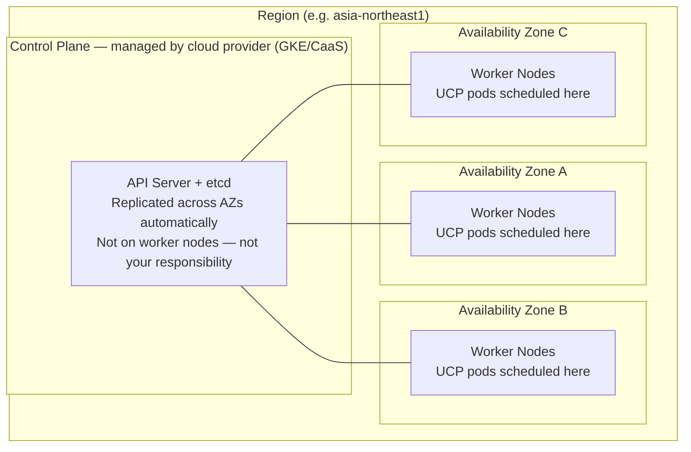
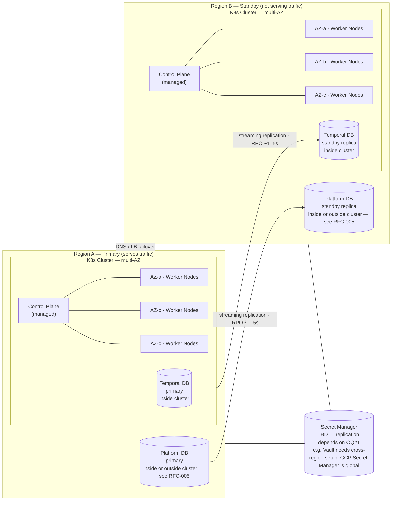
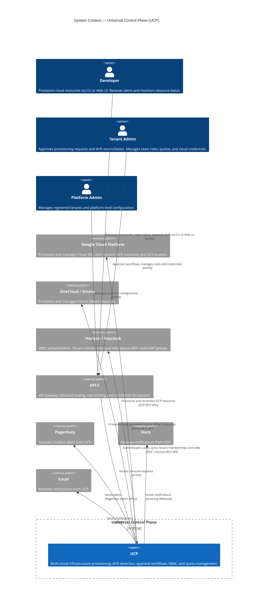
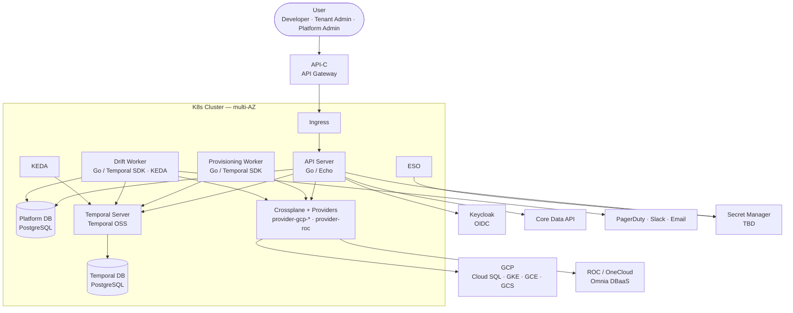
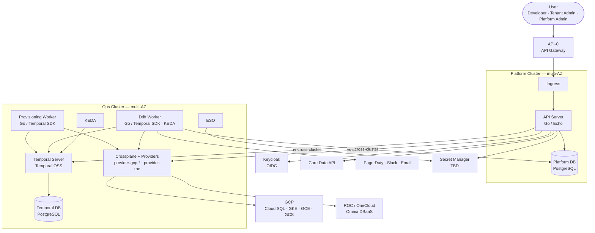
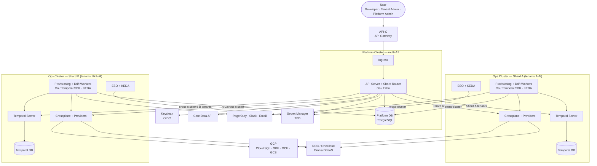
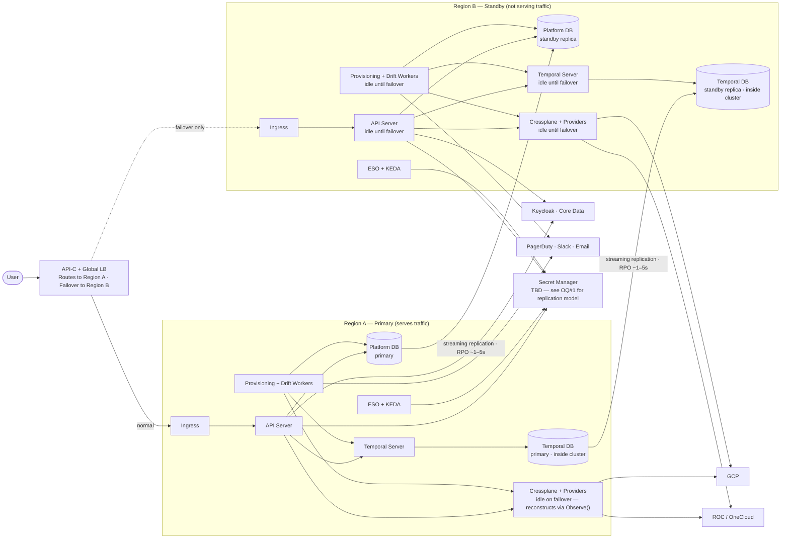
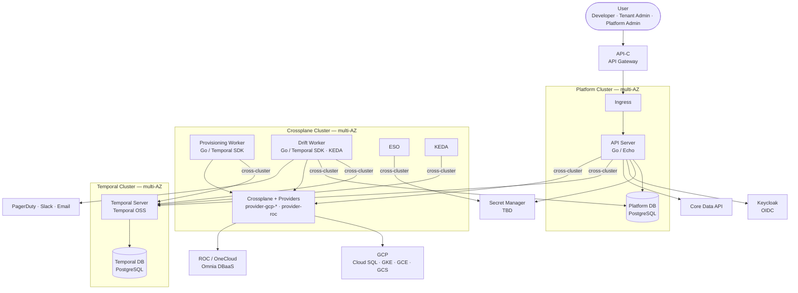

# Architecture Diagrams

C1 (System Context) and C2 (Container) diagrams for the UCP production architecture.

The C1 diagram applies to all topology options. The C2 diagrams follow the scaling
journey — start at Level 1 and grow into the next level only when measured thresholds
are crossed. See [Architecture Foundations § Scaling Strategy](https://confluence.rakuten-it.com/confluence/spaces/UCP/pages/6740191853/Architecture+Foundations#ArchitectureFoundations-Scalingstrategy)
for transition thresholds.

---

## Infrastructure Topology

High-level diagrams showing what single-cluster multi-AZ and multi-region
deployments physically look like. No UCP components shown — infrastructure
context only.

### Single Cluster — Multi-AZ

One K8s cluster with worker nodes spread across 3 availability zones within
a single region. The control plane (API server, etcd, scheduler) is managed
by the cloud provider and automatically replicated across AZs. Pods are
scheduled across worker nodes in different AZs via PodAntiAffinity.

A single zone failure loses some pods — K8s reschedules them to surviving
zones. The cluster itself stays operational.

---

### Multi-Region — Active-Passive

Two separate K8s clusters across two regions. Each cluster is multi-AZ within
its own region. Databases replicate from Region A to Region B. Region B is a
warm standby — cluster running, databases up to date, not serving traffic.

etcd is NOT replicated cross-region. XR desired state is reconstructed on
failover — mechanism TBD [OQ#5](https://confluence.rakuten-it.com/confluence/spaces/UCP/pages/6740191853/Architecture+Foundations#ArchitectureFoundations-OpenQuestions).

---

## C1 — System Context

---

## C2 — Level 1: Single Cluster (0–500 tenants)

All UCP workloads run on a single multi-AZ Kubernetes cluster.
Start here. Transition to Level 2 only when measured resource contention justifies it.

> **Cluster spec:** 3 × (4 vCPU, 16GB RAM) across 3 AZs. Cluster Autoscaler
> adds nodes under load. See [Architecture Foundations § Initial Cluster Spec](./architecture-foundations.md#initial-cluster-spec-estimated).

---

## C2 — Level 2: Platform + Ops Split (500–2,000 tenants)

Platform-facing components (API, auth, data) are separated from operations components
(Crossplane, Temporal, workers). Two clusters per environment.

Triggered when: Crossplane MR write churn shows measurable correlation with API
server read latency, or provider pod memory pressure is consistently high.

> **Cross-cluster connections:** API Server → Temporal (gRPC via Internal LB),
> API Server → Ops K8s API (kubeconfig, scoped ServiceAccount),
> Drift Worker → Platform DB (SQL), ESO → Secret Manager (HTTPS).

---

## C2 — Level 3: Cluster Sharding (2,000+ tenants)

Ops cluster is sharded by tenant. Each shard runs an independent set of Temporal
task queues and Crossplane providers. The API server contains a shard router that
maps tenant → shard via consistent hashing.

Triggered when: single Ops cluster Crossplane provider memory or Temporal throughput
becomes a measurable bottleneck at 2,000+ tenants.

> **Shard router:** lives inside the API server. Maps tenant ID → shard index via
> consistent hashing. Each shard has its own Temporal task queue namespace and
> Crossplane provider pods. Adding a shard requires re-balancing the tenant→shard
> mapping and migrating in-flight workflows.

---

## Multi-Region Active-Passive (BCP Lv4 - If needed)

Two clusters across two regions. Region A is the primary and serves all traffic.
Region B is a warm standby — all components deployed and running, databases
replicated, but not serving requests. On Region A failure, traffic is redirected
to Region B via DNS/load balancer failover and standby databases are promoted.

> **What replicates:**
> - Platform DB — PostgreSQL streaming replication, Region A → Region B. RPO ~1–5s.
> - Temporal DB — PostgreSQL streaming replication, Region A → Region B. RPO ~1–5s.
> - Secret Manager — global service, no replication needed.
>
> **What does NOT replicate:**
> - etcd (K8s state) — XR/MR objects are NOT replicated cross-region. On failover,
>   XR desired state is re-applied to Region B cluster and Crossplane reconstructs
>   MR state via Observe() against actual cloud resources. Mechanism TBD — see
>   [OQ#5](https://confluence.rakuten-it.com/confluence/spaces/UCP/pages/6740191853/Architecture+Foundations#ArchitectureFoundations-OpenQuestions)).
>
> **In-flight Temporal workflows** at time of failure are lost and must be
> re-submitted after failover. Acceptable at UCP's workflow volume (~4–5 active at any moment).
>
> **Failover automation level TBD** — fully automated, semi-automated (human triggers,
> automated execution), or manual runbook. See [OQ#5](https://confluence.rakuten-it.com/confluence/spaces/UCP/pages/6740191853/Architecture+Foundations#ArchitectureFoundations-OpenQuestions).

---

## Alternative — Three-Cluster Separation (not recommended at UCP scale)

Platform, Crossplane, and Temporal each run on dedicated clusters. Maximum blast
radius isolation and independent scaling per tier. Not recommended for UCP's current
and foreseeable scale — the operational overhead of three clusters outweighs the
benefit. Documented here for reference only.

> Revisit only if Temporal and Crossplane show independent resource contention that
> cannot be resolved by vertical scaling within the Ops cluster.

