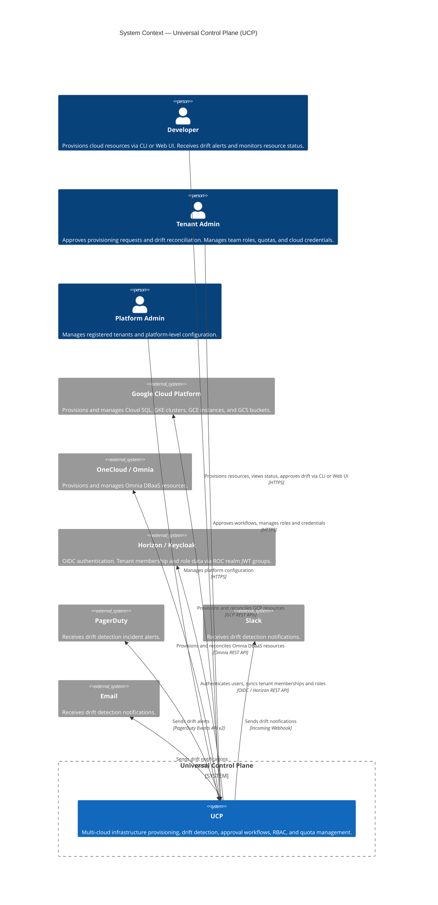

# Architecture Diagrams

C1 (System Context) and C2 (Container) diagrams for the UCP production architecture.

The C1 diagram applies to all topology options — it shows UCP as a system and its
relationships with users and external systems. The C2 diagrams are per topology option,
showing the internal containers and how they are distributed across Kubernetes clusters.

---

## C1 — System Context

---

## C2 — Option A: Single Cluster per Environment

All platform and operations components run on one GKE cluster per environment.

> **Infrastructure:** GKE Standard, multi-AZ (3 availability zones).
> Suitable for MVP. See [System Design](./system-design.md#recommendation-option-b) for
> trade-offs vs Option B.

```mermaid
C4Container
    title C2 — Option A: Single GKE Cluster per Environment

    Person(user, "User", "Developer / Tenant Admin / Platform Admin")

    System_Ext(gcp, "Google Cloud Platform", "Cloud SQL, GKE, GCE, GCS")
    System_Ext(omnia, "OneCloud / Omnia", "Omnia DBaaS")
    System_Ext(horizon, "Horizon / Keycloak", "OIDC, tenant membership")
    System_Ext(notif, "Notification Services", "PagerDuty, Slack, Email")

    Container_Boundary(cluster, "GKE Cluster — multi-AZ (Production)") {

        Container(ingress, "nginx Ingress", "nginx / K8s Ingress", "TLS termination, rate limiting, load balancing")

        Container(api, "API Server", "Go 1.26 / Echo", "REST API. Handles auth, RBAC, quota checks, and workflow submission.")

        ContainerDb(pg_plat, "PostgreSQL — Platform", "PostgreSQL 16, Patroni HA", "Sessions, RBAC, audit logs, quota policies, notification config")

        Container(vault, "Vault", "HashiCorp Vault, Raft HA", "Cloud provider credentials and platform secrets. Accessed via K8s auth method.")

        Container(temporal, "Temporal Server", "Temporal OSS", "Workflow orchestration. Runs Frontend, History, Matching, and Worker services as separate HA deployments.")

        ContainerDb(pg_temp, "PostgreSQL — Temporal", "PostgreSQL 16, Patroni HA", "Temporal workflow state, history, and visibility store")

        Container(prov_w, "Provisioning Worker", "Go / Temporal SDK", "Executes ApplyYAMLActivity, WaitReadyActivity, ReadSecretActivity for provisioning workflows.")

        Container(drift_w, "Drift Worker", "Go / Temporal SDK, KEDA autoscaled", "Executes DriftScanWorkflow, DriftApprovalWorkflow, and notification activities. Scales 2–10 replicas on Temporal queue depth.")

        Container(crossplane, "Crossplane + Providers", "Crossplane, provider-upjet-gcp, provider-roc", "Reconciles XRs and MRs. provider-upjet-gcp manages GCP resources. provider-roc manages Omnia resources.")

        Container(eso, "External Secrets Operator", "ESO", "Syncs cloud credentials from Vault to K8s Secrets used by Crossplane ProviderConfigs.")

        Container(keda, "KEDA", "KEDA", "Scales drift workers based on Temporal task queue depth.")

        Container(monitoring, "Monitoring", "MonaaS (metrics), EaaS (logs)", "Metrics collection and log aggregation. No distributed tracing.")
    }

    Rel(user, ingress, "HTTPS")
    Rel(ingress, api, "HTTP")

    Rel(api, pg_plat, "SQL — sessions, RBAC, audit, quota")
    Rel(api, vault, "K8s auth — read credentials")
    Rel(api, temporal, "gRPC — start and query workflows")
    Rel(api, crossplane, "K8s API — create, list, delete XRs")
    Rel(api, horizon, "OIDC + REST — auth, tenant sync")

    Rel(temporal, pg_temp, "SQL — workflow state")
    Rel(prov_w, temporal, "gRPC — poll provisioning task queue")
    Rel(prov_w, crossplane, "K8s API — apply XR YAML, poll XR status")
    Rel(drift_w, temporal, "gRPC — poll drift-detection queue, start child workflows")
    Rel(drift_w, crossplane, "K8s API — LIST MRs, PATCH managementPolicies")
    Rel(drift_w, pg_plat, "SQL — read notification config")
    Rel(drift_w, notif, "HTTP — PagerDuty Events API, Slack webhook, SMTP")
    Rel(keda, temporal, "gRPC — read queue depth")
    Rel(eso, vault, "K8s auth — sync secrets")

    Rel(crossplane, gcp, "GCP REST APIs — provision and observe")
    Rel(crossplane, omnia, "Omnia REST API — provision and observe")

    UpdateLayoutConfig($c4ShapeInRow="4", $c4BoundaryInRow="1")
```

---

## C2 — Option B: Platform + Operations Cluster (Recommended)

Platform-facing components (API, auth, data) are separated from operations components
(Crossplane, Temporal, workers). Two GKE clusters per environment.

> **Infrastructure:** Two GKE Standard clusters, each multi-AZ.
> Cross-cluster calls: API Server → Temporal Server (gRPC via Internal LB),
> API Server → Ops K8s API (kubeconfig, scoped ServiceAccount),
> Drift Worker → Platform PostgreSQL (TCP), ESO → Vault (HTTPS).
> All add ~2–5ms latency, well within the 1s API budget.

```mermaid
C4Container
    title C2 — Option B: Platform + Operations Cluster (Recommended)

    Person(user, "User", "Developer / Tenant Admin / Platform Admin")

    System_Ext(gcp, "Google Cloud Platform", "Cloud SQL, GKE, GCE, GCS")
    System_Ext(omnia, "OneCloud / Omnia", "Omnia DBaaS")
    System_Ext(horizon, "Horizon / Keycloak", "OIDC, tenant membership")
    System_Ext(notif, "Notification Services", "PagerDuty, Slack, Email")

    Container_Boundary(plat, "Platform Cluster — GKE, multi-AZ") {

        Container(ingress, "nginx Ingress", "nginx / K8s Ingress", "TLS termination, rate limiting, load balancing")

        Container(api, "API Server", "Go 1.26 / Echo", "REST API. Handles auth, RBAC, quota checks, and workflow submission.")

        ContainerDb(pg_plat, "PostgreSQL — Platform", "PostgreSQL 16, Patroni HA", "Sessions, RBAC, audit logs, quota policies, notification config")

        Container(vault, "Vault", "HashiCorp Vault, Raft HA", "Cloud provider credentials and platform secrets.")

        Container(monitoring, "Monitoring", "MonaaS (metrics), EaaS (logs)", "Metrics collection and log aggregation. No distributed tracing.")
    }

    Container_Boundary(ops, "Operations Cluster — GKE, multi-AZ") {

        Container(temporal, "Temporal Server", "Temporal OSS", "Workflow orchestration. Frontend, History, Matching, Worker services — all HA.")

        ContainerDb(pg_temp, "PostgreSQL — Temporal", "PostgreSQL 16, Patroni HA", "Temporal workflow state, history, and visibility store")

        Container(prov_w, "Provisioning Worker", "Go / Temporal SDK", "Executes provisioning workflows. In-cluster K8s API access for XR operations.")

        Container(drift_w, "Drift Worker", "Go / Temporal SDK, KEDA autoscaled", "Executes drift scan and approval workflows. In-cluster K8s API access for MR scanning and managementPolicy flips.")

        Container(crossplane, "Crossplane + Providers", "Crossplane, provider-upjet-gcp, provider-roc", "Reconciles XRs and MRs against cloud provider state.")

        Container(eso, "External Secrets Operator", "ESO", "Syncs cloud credentials from Vault (Platform Cluster) to K8s Secrets for Crossplane.")

        Container(keda, "KEDA", "KEDA", "Scales drift workers on Temporal queue depth.")
    }

    Rel(user, ingress, "HTTPS")
    Rel(ingress, api, "HTTP")

    Rel(api, pg_plat, "SQL")
    Rel(api, vault, "K8s auth")
    Rel(api, temporal, "gRPC — cross-cluster via Internal LB")
    Rel(api, crossplane, "K8s API — cross-cluster kubeconfig")
    Rel(api, horizon, "OIDC + REST")

    Rel(temporal, pg_temp, "SQL — in-cluster")
    Rel(prov_w, temporal, "gRPC — in-cluster")
    Rel(prov_w, crossplane, "K8s API — in-cluster")
    Rel(drift_w, temporal, "gRPC — in-cluster")
    Rel(drift_w, crossplane, "K8s API — in-cluster")
    Rel(drift_w, pg_plat, "SQL — cross-cluster (notification config)")
    Rel(drift_w, notif, "HTTP")
    Rel(keda, temporal, "gRPC — in-cluster")
    Rel(eso, vault, "HTTPS — cross-cluster")

    Rel(crossplane, gcp, "GCP REST APIs")
    Rel(crossplane, omnia, "Omnia REST API")

    UpdateLayoutConfig($c4ShapeInRow="3", $c4BoundaryInRow="1")
```

---

## C2 — Option C: Three Clusters

Platform, Crossplane, and Temporal each run on dedicated clusters. Maximum blast radius
isolation and independent scaling per tier.

> **Infrastructure:** Three GKE Standard clusters, each multi-AZ.
> Temporal Workers must co-locate with Crossplane (in-cluster K8s API access required
> for ScanDriftActivity and FlipManagementPolicyActivity).
> Multiple cross-cluster connections: API → Temporal (gRPC), API → Crossplane K8s API
> (kubeconfig), Workers → Temporal (gRPC cross-cluster), ESO → Vault (HTTPS).
> Recommended only when Option B's Ops cluster shows measurable resource contention
> at scale (500+ tenants).

```mermaid
C4Container
    title C2 — Option C: Three Clusters (Platform + Crossplane + Temporal)

    Person(user, "User", "Developer / Tenant Admin / Platform Admin")

    System_Ext(gcp, "Google Cloud Platform", "Cloud SQL, GKE, GCE, GCS")
    System_Ext(omnia, "OneCloud / Omnia", "Omnia DBaaS")
    System_Ext(horizon, "Horizon / Keycloak", "OIDC, tenant membership")
    System_Ext(notif, "Notification Services", "PagerDuty, Slack, Email")

    Container_Boundary(plat, "Platform Cluster — GKE, multi-AZ") {

        Container(ingress, "nginx Ingress", "nginx / K8s Ingress", "TLS termination, rate limiting")

        Container(api, "API Server", "Go 1.26 / Echo", "REST API. Handles auth, RBAC, quota checks, and workflow submission.")

        ContainerDb(pg_plat, "PostgreSQL — Platform", "PostgreSQL 16, Patroni HA", "Sessions, RBAC, audit logs, quota policies, notification config")

        Container(vault, "Vault", "HashiCorp Vault, Raft HA", "Cloud provider credentials and platform secrets.")

        Container(monitoring, "Monitoring", "MonaaS (metrics), EaaS (logs)", "Metrics collection and log aggregation. No distributed tracing.")
    }

    Container_Boundary(cp, "Crossplane Cluster — GKE, multi-AZ") {

        Container(crossplane, "Crossplane + Providers", "Crossplane, provider-upjet-gcp, provider-roc", "Reconciles XRs and MRs against cloud provider state.")

        Container(prov_w, "Provisioning Worker", "Go / Temporal SDK", "Executes provisioning workflows. In-cluster K8s API access. Connects to Temporal Server cross-cluster.")

        Container(drift_w, "Drift Worker", "Go / Temporal SDK, KEDA autoscaled", "Executes drift scan and approval workflows. In-cluster K8s API access. Connects to Temporal Server cross-cluster.")

        Container(eso, "External Secrets Operator", "ESO", "Syncs cloud credentials from Vault to K8s Secrets for Crossplane.")

        Container(keda, "KEDA", "KEDA", "Scales drift workers on Temporal queue depth. Reads Temporal queue metrics cross-cluster.")
    }

    Container_Boundary(tc, "Temporal Cluster — GKE, multi-AZ") {

        Container(temporal, "Temporal Server", "Temporal OSS", "Workflow orchestration. Frontend, History, Matching, Worker services — all HA.")

        ContainerDb(pg_temp, "PostgreSQL — Temporal", "PostgreSQL 16, Patroni HA", "Temporal workflow state, history, and visibility store")
    }

    Rel(user, ingress, "HTTPS")
    Rel(ingress, api, "HTTP")

    Rel(api, pg_plat, "SQL")
    Rel(api, vault, "K8s auth")
    Rel(api, temporal, "gRPC — cross-cluster via Internal LB")
    Rel(api, crossplane, "K8s API — cross-cluster kubeconfig")
    Rel(api, horizon, "OIDC + REST")

    Rel(temporal, pg_temp, "SQL — in-cluster")
    Rel(prov_w, temporal, "gRPC — cross-cluster")
    Rel(prov_w, crossplane, "K8s API — in-cluster")
    Rel(drift_w, temporal, "gRPC — cross-cluster")
    Rel(drift_w, crossplane, "K8s API — in-cluster")
    Rel(drift_w, pg_plat, "SQL — cross-cluster")
    Rel(drift_w, notif, "HTTP")
    Rel(keda, temporal, "gRPC — cross-cluster")
    Rel(eso, vault, "HTTPS — cross-cluster")

    Rel(crossplane, gcp, "GCP REST APIs")
    Rel(crossplane, omnia, "Omnia REST API")

    UpdateLayoutConfig($c4ShapeInRow="3", $c4BoundaryInRow="1")
```

