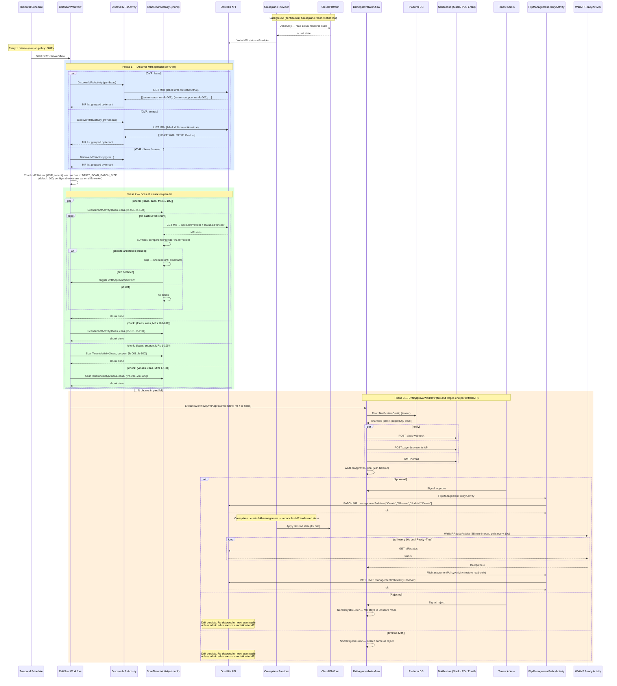

# Drift Scan — Full Sequence Diagram

Full sequence of the drift detection flow including chunked scan design,
parallel activity execution, and approval workflow.

**ScanTenantActivity input (Option A — names only):**
```go
type ScanTenantActivityInput struct {
    GVR          string   // resource type, e.g. "lbaas"
    Tenant       string   // tenant identifier, e.g. "caas"
    MRNames      []string // MR names in this chunk, e.g. ["lb-001", ..., "lb-100"]
    OpsClusterID string   // Ops cluster to query (from Platform DB routing)
}
```
DiscoverMRsActivity returns MR names only. ScanTenantActivity GETs each MR
individually for fresh `spec.forProvider` and `status.atProvider`. Temporal payload
stays small; data freshness is guaranteed.


