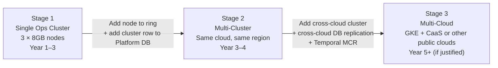
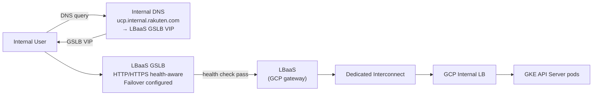
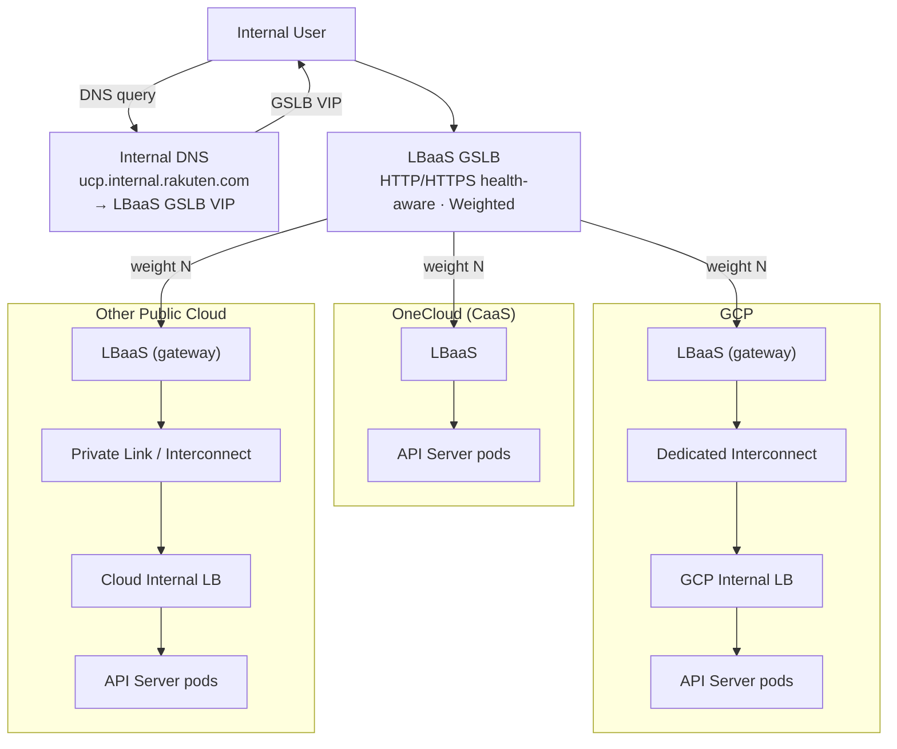
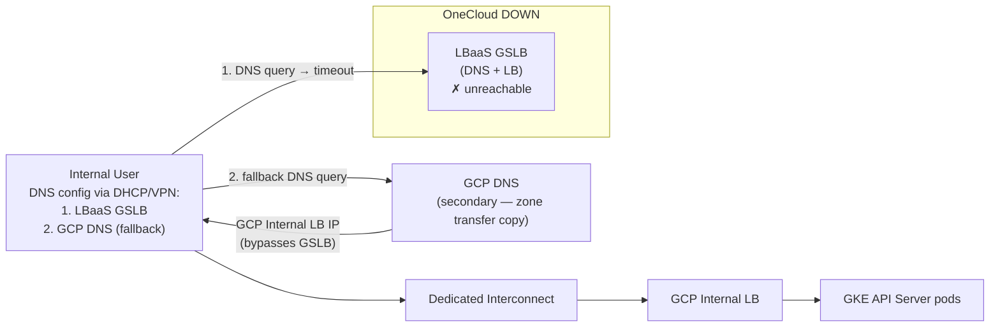

# Scalability and Multi-Cloud Strategy

This document covers how UCP scales from a single cluster to multi-cluster and
optionally to multi-cloud, and the trade-offs involved in each step. It is intended
as the architectural positioning document for stakeholder discussion.

---

## Architecture Is Scale-Ready from Day 1

UCP launches with a single Ops cluster — the right starting point for Year 1 load.
But the architecture is not single-cluster by design. All the infrastructure needed
to scale to multiple clusters is in place from the beginning:

| Component | What is in place from Day 1 |
|---|---|
| Platform DB schema | `resource_cluster_assignments` and `cluster_resource_memory` tables exist — track which resource lives on which cluster |
| Routing function | Consistent hashing ring with size-weighted placement — runs in production, routes all resources to ops-1 (trivially correct with one cluster) |
| Activity interfaces | `ScanTenantActivityInput.OpsClusterID`, provisioning workflow cluster parameter — all code paths carry cluster context |
| Hash ring propagation | API servers load ring state from Platform DB on startup, refresh on change |

With a single cluster, the routing logic runs but always returns the same answer. The
code is exercised in production daily. When a second cluster is added, the algorithm
is already proven — the only change is adding a node to the ring.

This is not over-engineering. The cost of building this upfront is low (days, not
sprints). The cost of retrofitting it into a live system mid-operation — touching
workflow inputs, activity signatures, and DB queries simultaneously — is a multi-sprint
effort under time pressure.

---

## Scaling Path

UCP scales in well-defined stages. Each stage is an operational decision, not an
architectural redesign.

### Stage 1 — Single Ops Cluster (Year 1–3)

A single GKE Ops cluster handles all Crossplane reconciliation. Year 5 Crossplane
memory limits total ~10–12Gi — within the current 3-node spec (3 × 8GB, ~21GB
allocatable) with room to spare. See [Component Sizing](component-sizing.md) for
the full node spec. Vertical scaling (larger nodes) is the first lever before
adding a second cluster.

**Trigger to move to Stage 2:** provider pod memory consistently above 70% after
vertical scaling is exhausted. Expected Year 3–4 at earliest.

### Stage 2 — Multi-Cluster, Same Cloud (Year 3–4)

A second Ops cluster is added to the consistent hashing ring. Resources are split
across clusters by the ring algorithm. Platform DB tracks assignments. Workers route
to the correct cluster per resource.

The routing code has been running in production since Day 1. Adding the second cluster
is an operational procedure with a pre-tested runbook, not a code change.

**WIF / Identity consideration at Stage 2:** Multiple Crossplane clusters each have
their own OIDC issuer URL. Tenants configuring WIF to grant UCP access to their GCP
resources must trust each cluster's issuer — creating an update burden whenever UCP
adds or replaces a cluster. This is a multi-cluster problem, not a multi-cloud one.
Options and trade-offs are documented in `wif-oidc-issuer-federation.md` — resolution
is required before the second Ops cluster is added, regardless of which cloud it runs on.

**Trigger to move to Stage 3:** business continuity or latency requirements that a
single-cloud multi-AZ deployment cannot satisfy.

### Stage 3 — Multi-Cloud (Year 5+, if justified)

A second Ops cluster runs on a different cloud (CaaS, AWS, or Azure). The same
consistent hashing ring routes resources across clouds. Temporal and Platform DB
require cross-cloud replication.

This step carries significant cost and complexity trade-offs — see below.

---

## Multi-Cloud Active-Active: Full Trade-Off Picture

Multi-cloud active-active is architecturally supported
by the UCP design. This section presents what it takes, what it gains, and what it
costs.

### What Multi-Cloud Active-Active Requires

| Component | What changes |
|---|---|
| API server | Stateless — deploy on multiple clouds behind a load balancer. Active-active is straightforward. |
| Temporal server | Stateful cohesive system — History owns shards, Matching owns task queues, all backed by one DB. Cannot be split or horizontally scaled across clouds. Multi-cloud requires MCR (Multi-Cluster Replication): each cloud runs a full independent Temporal cluster with workflows replicated between them. MCR is experimental as of 2026. |
| Temporal workers | Stateless — can run on any cloud as long as they can reach the Temporal Frontend. Availability depends entirely on the Temporal server being up. |
| Ops clusters | Clusters distributed across clouds. Total cluster count and cloud count are independent — e.g. 3 GKE + 1 CaaS is valid. The hash ring distributes all resource types across all clusters regardless of which cloud each cluster runs on; cloud placement is driven by blast radius isolation, not resource affinity. |
| Platform DB | Cross-cloud replication — primary write on one cloud, replicated to other. Read replica on each cloud as needed. |
| Secret management | Secrets accessible from all clouds — Vault or equivalent (GCP Secret Manager alone is insufficient). |
| Network | Dedicated Interconnect or equivalent cross-cloud private link — required for latency across all cross-cloud paths: API server → Platform DB, API server → Temporal, API server → Ops K8s API, Temporal workers → Platform DB, Temporal workers → Ops K8s API, Platform DB replication. |

### Pros

| Benefit | Detail |
|---|---|
| Control plane availability | Full availability requires API server, Temporal server (via MCR), and Platform DB all running on multiple clouds. If achieved: UCP continues operating on the surviving cloud. If only Ops clusters are multi-cloud but the Platform cluster stays on GCP: ongoing Crossplane reconciliation continues on surviving Ops clusters, but no new provisioning or drift detection until GCP recovers. |
| Blast radius isolation | A failure on one cloud affects only resources assigned to that cloud's Ops cluster (~1/N% of MRs) |
| Vendor independence | UCP's control plane is not tied to a single cloud provider |
| DR cost optimization (if BCP mandated) | If BCP Level 5 is required, a DR site is mandatory regardless. Active-active replaces idle standby capacity with productive capacity. Stateless components (API server, Temporal workers) can be half-spec per site — HPA handles failover with no extra hardware cost. Crossplane is MR-count-driven (static, no burst), so the failover constraint is deterministic: each cluster's pod limits must fit all MRs (D) on failover. This creates a sizing trade-off: active-active at 60% spec per site = 9.6GB total (120% of single cluster) vs active-standby at 16GB (200%). The cost saving comes with a lower scale-out ceiling — 3.84GB total vs 5.6GB for single cluster — meaning a 3rd cluster is needed sooner as MR count grows. At Year 1 scale (~90MB for the heaviest provider) neither ceiling is close, so the saving is real with no near-term consequence. DB must be sized for full write load per site regardless — it becomes the sole primary on failover. If BCP is mandated, this analysis applies even at Stage 1. **Performance caveat:** if sites are in different regions (e.g. OneCloud Tokyo + GCP Osaka), GSLB geo-routing should prefer the nearer site to minimise latency impact. For UCP as an internal management tool the latency difference is acceptable. |

### Cons

| Cost | Detail |
|---|---|
| **Infrastructure cost** | At minimum: 2× Ops cluster costs (one per cloud), cross-replicated DB, 2× Temporal cluster. Exact cost increase depends on which components are replicated, CaaS vs GCP pricing, and egress volume — requires actual cost modelling before committing. |
| **Interconnectivity cost and latency** | Cross-cloud private link (Dedicated Interconnect or equivalent) is required for all inter-component traffic. This is a significant recurring cost independent of traffic volume. Even with Dedicated Interconnect, cross-cloud latency adds to every path simultaneously: API server → Platform DB, API server → Temporal, Temporal workers → Ops K8s API, Platform DB replication. Actual latency depends on the specific data center locations and interconnect configuration — same-metro deployments will have much lower latency than cross-region. Without a private link, public internet latency makes production use unreliable and insecure. The interconnect is also an additional failure domain — if it degrades, all cross-cloud paths degrade with it. |
| **Database sync** | Cross-cloud PostgreSQL replication adds write latency and introduces split-brain risk if the cross-cloud link degrades. Cross-cloud DB replication is operationally complex regardless of the HA solution chosen. |
| **Operational overhead** | At least two upgrade cycles, two incident response paths, two monitoring stacks, more complex secret management. |

### Traffic Routing in Multi-Cloud

UCP serves internal users. In single-cloud, routing is straightforward. Multi-cloud
introduces layered routing complexity that must be resolved before active-active is
viable.

**Single cloud (MVP):**

LBaaS GSLB is used from Day 1, not bypassed. This keeps the entry point consistent
— when additional clouds are added later, backends are added to the existing GSLB
without any DNS or client changes.

**Multi-cloud — normal operation:**

GCP and other public cloud traffic requires an extra LBaaS instance acting as a
gateway before crossing the private interconnect — the GSLB cannot route directly
to a public cloud load balancer from the internal network. CaaS traffic is direct
(same internal network).

**LBaaS GSLB vs GCP GLB:**

Both are equivalent in the key dimensions:
- HTTP/HTTPS health checks with status code verification, weighted routing, failover
- SLA: both 99.99% monthly uptime ([LBaaS SLA](https://onecloud.rakuten-it.com/one-docs/docs/roc-tos/lbaas-sla#lbaas-sla-exclusions))

The actual differentiators:

| | LBaaS GSLB | GCP GLB |
|---|---|---|
| Network path | Internal Rakuten network — no Dedicated Interconnect needed | Requires Dedicated Interconnect hop for internal users |
| SPOF cloud | OneCloud outage takes it down | GCP outage takes it down |
| Operational ownership | LBaaS team (Rakuten internal) | Google-managed |
| Multi-cloud backends | Via internal LBaaS gateway instances per cloud | Via Hybrid NEGs (Cloud Interconnect to non-GCP backends) |

GCP GLB can serve as the primary GSLB via Dedicated Interconnect — internal users
reach it the same way as any GCP resource. The choice of which to use as primary
determines which cloud's outage is the catastrophic scenario for DNS resolution.
Neither is objectively better — it depends on which cloud is considered the more
stable infrastructure.

**The GSLB single point of failure:**

LBaaS GSLB is hosted on OneCloud infrastructure. If OneCloud goes down entirely
(including the LBaaS layer), the GSLB goes down. DNS queries for
`ucp.internal.rakuten.com` fail. Even if GCP API servers are fully healthy, users
cannot reach UCP because traffic is never resolved. Multi-cloud redundancy is
undermined at the DNS layer.

**Options to address this:**

**Option A — Accept GSLB dependency (pragmatic):**
Single LBaaS GSLB entry point. Multi-cloud protects against application-level
failures, not OneCloud network failures. No additional setup required.

Limitation: full OneCloud network outage (including LBaaS) breaks DNS resolution
entirely regardless of GCP health.

**Option B — Dual DNS with fallback:**

LBaaS GSLB is the primary DNS. A GCP-side DNS server is the secondary, holding a
zone transfer copy of all records. Client OS queries primary first; on timeout falls
back to secondary. Crucially — the two DNS servers return *different* IPs:
- LBaaS GSLB returns the GSLB VIP (weighted routing to all clouds)
- GCP DNS returns the GCP Internal LB IP directly (bypasses GSLB entirely)

In the OneCloud failure scenario, all traffic falls through to GCP — no weighted
distribution, but UCP remains reachable.

Requires: network team to push both DNS server IPs via DHCP or VPN config to all
internal clients — a central change, not per-device manual configuration.

Limitations: ~5s timeout penalty per DNS lookup during OneCloud outage; no
health-aware routing at DNS level; requires network team involvement outside UCP's
control.

**Pragmatic recommendation:**

At UCP's current scale and internal user base, accepting the GSLB dependency is the
right starting point. The realistic multi-cloud failure scenario that UCP's architecture
addresses is application-level — a cloud's compute infrastructure goes down while its
network remains up. Full OneCloud network outages (including LBaaS) affect far more
than UCP and are a platform-level concern beyond UCP's scope to solve. Dual DNS is the
right long-term architecture but requires network team commitment as a platform decision.

---

### When Multi-Cloud Is Justified

Multi-cloud active-active makes sense when **the cost of UCP downtime exceeds the
cost of running multi-cloud infrastructure**. Concretely:

- UCP is classified as a Tier 1 / BCP Level 5 service with strict RTO/RPO requirements
- A regulatory requirement mandates control plane geographic redundancy
- Tenant SLAs require that resource management continues even during a cloud-level outage

At current UCP scale (Year 1–3), a single GKE cluster with multi-AZ deployment
(3 nodes across 3 AZs) provides 99.95–99.99% availability. This satisfies most
availability requirements without multi-cloud complexity.

### Recommendation

| Scenario | Recommendation |
|---|---|
| Year 1–3, no hard BCP requirement | Single GKE Ops cluster, multi-AZ. Multi-cluster routing logic in place but single cluster used. |
| Year 3–4, MR count grows | Add second Ops cluster on same cloud — routing already built, low-risk increment. |
| BCP Level 5 confirmed | Plan multi-cloud Stage 3: resolve Temporal MCR production readiness, WIF federation, cross-cloud DB strategy before committing. |
| Multi-cloud active-active required urgently | The architecture supports it. Budget 2–3 quarters for full production-ready implementation including operational runbooks and failover testing. |

The architecture investment is not wasted regardless of which path is taken. The
consistent hashing ring, routing logic, and Platform DB schema work identically
whether the clusters are in the same cloud or different clouds. The incremental
cost of going multi-cloud is real, but the incremental *architectural* cost is small
because the hard design work is already done.
