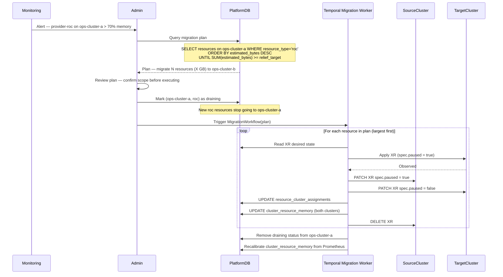
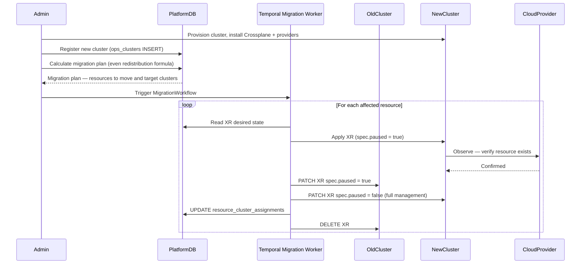
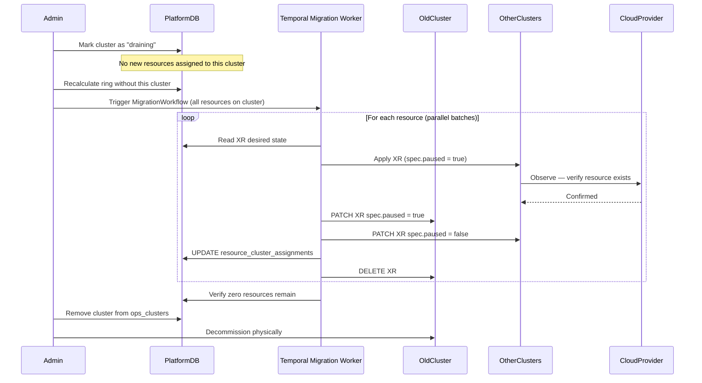
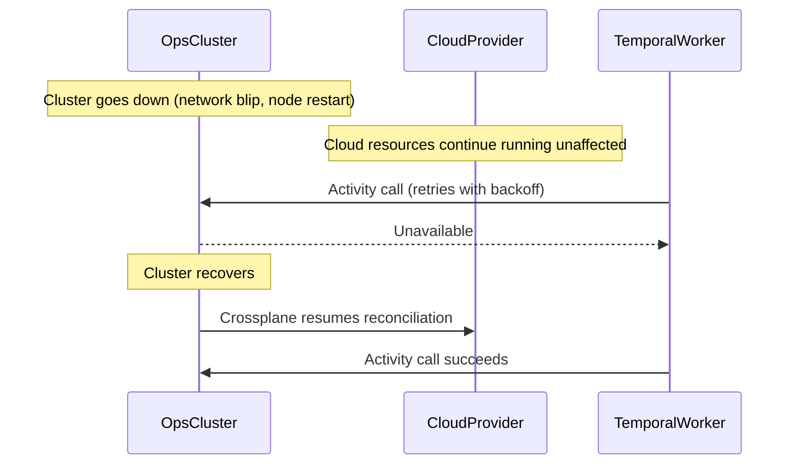
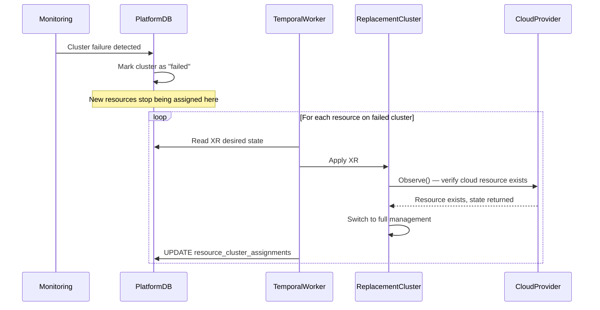
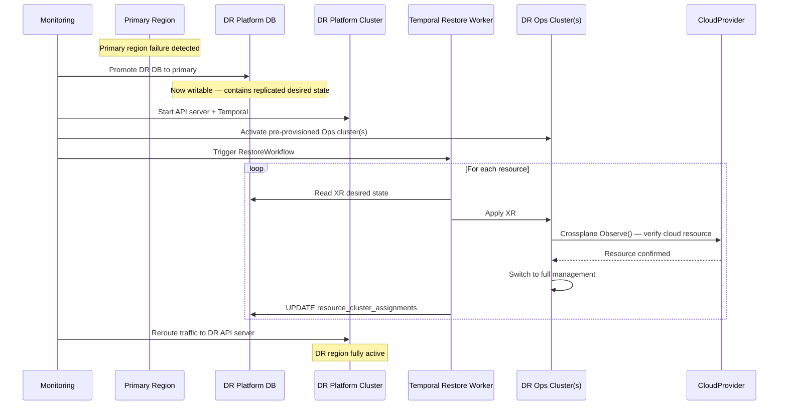

# Scaling Strategy

This document defines how UCP scales as managed resource count grows, including
sharding logic, migration strategy, and per-level replication and failure handling.

---

## Starting Topology

UCP starts with **two clusters from day one** — Platform and Ops.

```
JPE Region
┌─────────────────────────────┐
│  Platform Cluster           │
│  (multi-AZ/DC)              │
│                             │
│  ┌─────────────────────┐    │
│  │     API Server      │    │
│  └─────────────────────┘    │
│  ┌─────────────────────┐    │
│  │     Platform DB     │    │
│  └─────────────────────┘    │
│  ┌─────────────────────┐    │
│  │   Temporal Server   │    │
│  └─────────────────────┘    │         ┌─────────────────────────────┐
│  ┌─────────────────────┐    │         │  Ops Cluster                │
│  │    Temporal DB      │    │         │  (multi-AZ/DC)              │
│  └─────────────────────┘    │         │                             │
│  ┌─────────────────────┐    │         │  ┌─────────────────────┐    │
│  │  Temporal Workers   │─────────────→│  │     Crossplane      │    │
│  └─────────────────────┘    │         │  └─────────────────────┘    │
│  ┌─────────────────────┐    │         │  ┌─────────────────────┐    │
│  │       KEDA          │    │         │  │    Provider Pods    │────────→ Cloud Platform(s)
│  └─────────────────────┘    │         │  └─────────────────────┘    │
│  ┌─────────────────────┐    │         │  ┌─────────────────────┐    │
│  │  Redis (shared      │    │         │  │        ESO          │    │
│  │  cache)             │    │         │  └─────────────────────┘    │
│  └─────────────────────┘    │         └─────────────────────────────┘
│  ┌─────────────────────┐    │
│  │  Secret Manager     │    │
│  │      (TBD)          │    │
│  └─────────────────────┘    │
└─────────────────────────────┘
```

Temporal Server and Temporal workers both live on the Platform cluster. Ops cluster
CPU and memory are reserved exclusively for Crossplane provider pods. Temporal
workers call Ops cluster K8s APIs cross-cluster via kubeconfig — the same pattern
the API server uses for XR operations.

Redis serves as the shared cache for the ring, cluster memory state, and other
runtime data — ensuring all API server pods see consistent state.

---

## Scaling Indicator

The correct scaling indicator is **total MR object count per provider pod**, because:

- Provider pod memory is bounded by the informer cache — it holds all MR objects of
  its type in memory
- etcd write pressure scales with MR reconcile frequency × MR count
- Drift scan load scales with GVR count × MR count

Tenant count is a secondary metric. For example, based on observation, One tenant (CaaS) owns ~51% of all LBaaS
resources. Tenant-based sharding produces uneven distribution by definition.

---

## Scaling Levels

### Level 1 — Single Ops Cluster

**Entry condition:** Initial deployment.

**Configuration:**

```
JPE Region
┌─────────────────────────────┐
│  Platform Cluster           │
│  (multi-AZ/DC)              │
│                             │
│  ┌─────────────────────┐    │
│  │     API Server      │    │
│  └─────────────────────┘    │
│  ┌─────────────────────┐    │
│  │     Platform DB     │    │
│  └─────────────────────┘    │
│  ┌─────────────────────┐    │
│  │   Temporal Server   │    │
│  └─────────────────────┘    │         ┌─────────────────────────────┐
│  ┌─────────────────────┐    │         │  Ops Cluster                │
│  │    Temporal DB      │    │         │  (multi-AZ/DC)              │
│  └─────────────────────┘    │         │                             │
│  ┌─────────────────────┐    │         │  ┌─────────────────────┐    │
│  │  Temporal Workers   │─────────────→│  │     Crossplane      │    │
│  └─────────────────────┘    │         │  └─────────────────────┘    │
│  ┌─────────────────────┐    │         │  ┌─────────────────────┐    │
│  │       KEDA          │    │         │  │    Provider Pods    │────────→ Cloud Platform(s)
│  └─────────────────────┘    │         │  └─────────────────────┘    │
│  ┌─────────────────────┐    │         │  ┌─────────────────────┐    │
│  │  Secret Manager     │    │         │  │        ESO          │    │
│  │      (TBD)          │    │         │  └─────────────────────┘    │
│  └─────────────────────┘    │         └─────────────────────────────┘
└─────────────────────────────┘
```

**Within-level vertical scaling (exhausted in order before going horizontal):**

| Step | Action | Limit |
|---|---|---|
| 1 | Increase provider pod memory limit via DeploymentRuntimeConfig | Node capacity |
| 2 | Add larger nodes to Ops cluster | Available node sizes (e.g CaaS physical limit or cost) |
| 3 | Vertical scaling exhausted → move to Level 2 | — |

Memory pressure at 70% on any provider pod is a **leading indicator** to start
preparing Level 2 — not an immediate trigger to act.

**Exit trigger:**

> Provider pod memory limit cannot be increased further without exceeding available
> node capacity, or node upgrade is not operationally viable.

**Replication:**

| Component | Strategy |
|---|---|
| Provider pods | 2 replicas, leader election — standby takes over in < 30s |
| Crossplane core | 2 replicas, leader election |
| Ops cluster nodes | Multi-AZ via PodAntiAffinity |
| etcd | Managed control plane (GKE) or 3-node HA (CaaS) |

**Failure scenarios:**

| Failure | Impact | Recovery |
|---|---|---|
| Provider pod dies | Standby takes over, < 30s gap | Automatic |
| Single node dies | Pods reschedule to healthy nodes | Automatic, minutes |
| AZ goes down | Surviving AZs continue | Automatic |
| Entire Ops cluster down | Management paused, cloud resources unaffected | Manual — re-apply from Platform DB desired state |

---

### Level 2 — Multiple Ops Clusters

**Entry condition:** Level 1 exit trigger met — vertical scaling on the single Ops
cluster is exhausted.

**What changes:** A second Ops cluster is added. Resources are redistributed across
both clusters using the even redistribution formula. Each subsequent Ops cluster
addition follows the same pattern — triggered by the same exit condition, with
migration scope determined by the current memory distribution, not a fixed fraction.

**Configuration:**

```
JPE Region
┌─────────────────────────────┐         ┌─────────────────────────────┐
│  Platform Cluster           │    ┌───→│  Ops Cluster 1              │
│  (multi-AZ/DC)              │    │    │  (multi-AZ/DC)              │
│                             │    │    │                             │
│  [ same as Level 1 ]        │    │    │  ┌─────────────────────┐    │
│                             │    │    │  │     Crossplane      │    │
│  ┌─────────────────────┐    │    │    │  └─────────────────────┘    │
│  │  Temporal Workers   │─────────┤    │  ┌─────────────────────┐    │
│  └─────────────────────┘    │    │    │  │    Provider Pods    │──────┐
│                             │    │    │  └─────────────────────┘    │ │
└─────────────────────────────┘    │    │  ┌─────────────────────┐    │ │
                                   │    │  │        ESO          │    │ │
                                   │    │  └─────────────────────┘    │ │
                                   │    └─────────────────────────────┘ │
                                   │    ┌─────────────────────────────┐ │
                                   └───→│  Ops Cluster 2              │ ├──→ Cloud Platform(s)
                                        │  (multi-AZ/DC)              │ │
                                        │                             │ │
                                        │  ┌─────────────────────┐    │ │
                                        │  │     Crossplane      │    │ │
                                        │  └─────────────────────┘    │ │
                                        │  ┌─────────────────────┐    │ │
                                        │  │    Provider Pods    │──────┘
                                        │  └─────────────────────┘    │
                                        │  ┌─────────────────────┐    │
                                        │  │        ESO          │    │
                                        │  └─────────────────────┘    │
                                        └─────────────────────────────┘
                                                    ... Ops Cluster N
```

**Exit trigger:** Same as Level 1 — any provider pod on any Ops cluster hitting
memory pressure after vertical scaling is exhausted. Add another Ops cluster and
repeat.

**Replication:** Same per cluster as Level 1. Each Ops cluster is independent —
failure on one does not affect the others.

**Failure scenarios:**

| Failure | Impact | Recovery |
|---|---|---|
| Provider pod dies on Cluster X | Standby takes over on Cluster X, < 30s | Automatic |
| Single node dies on Cluster X | Pods reschedule within Cluster X | Automatic, minutes |
| Entire Ops Cluster X goes down | Only resources on Cluster X affected — all other clusters continue normally | Re-apply from Platform DB desired state to replacement cluster |

---

---

## What Hits Limits First

The binding constraint is the provider pod informer cache — each provider pod holds
all MR objects of its type in memory. At ~10KB per MR:

| MR count | Memory per provider pod |
|---|---|
| 10,000 | ~100MB |
| 50,000 | ~500MB |
| 100,000 | ~1GB |
| 500,000 | ~5GB |

Memory pressure is monitored at two layers:

| Layer | What to monitor | What it triggers |
|---|---|---|
| Individual provider pod | Pod memory utilization | Increase that pod's memory limit via DeploymentRuntimeConfig, or migrate its resources to a new Ops cluster |
| Ops cluster node pool | Total memory utilization across all pods | Add nodes to the cluster |

The individual pod threshold fires first and more granularly. The cluster node pool
total is a secondary signal — all provider pods share the same node pool, so even
if each pod is within its own limit, combined pressure can exhaust node capacity.

---

## Sharding Logic

### Sharding key

Each resource is assigned a **UUID v7** as its internal `resource_id` at creation
time. UUID v7 is:
- Time-sortable prefix → good PostgreSQL B-tree index performance
- Random suffix → good hash ring distribution (xxHash64 destroys time ordering)
- Immutable — assigned once, never changes

The cloud resource's user-defined name is stored separately as `external_name`.
UCP generates `resource_id` independently of what the user names their resource.

---

### Consistent hashing

Resources are assigned to Ops clusters via consistent hashing on `resource_id`.

```
Hash ring (0 → 2³²):

    A1(100) ─── B1(200) ─── A2(350) ─── B2(500) ─── A3(700) ─── B3(900)
        ↑                                                              ↑
        └──────────────────────── wrap ────────────────────────────────┘

resource_id hashes to position 250
→ walk clockwise → first node ≥ 250 is A2(350) → Ops Cluster A
```

**Hash formula:**

```
pos(r) = uint32( xxhash64(r) )
```

Where `r` is the `resource_id` string. xxHash64 returns a uint64 natively — casting
to uint32 takes the lower 32 bits as an integer value, no byte-order handling needed.
This gives a ring of 2³² = ~4 billion positions.

**Why uint32:** At 150 virtual nodes × 1,000 clusters = 150,000 ring positions.
Collision probability in a 4 billion space is ~0.0003% — negligible. uint64 would
work but is unnecessary at UCP's scale.

**Why xxHash64** (`github.com/cespare/xxhash/v2`)**:**

| Option | Speed | Uniformity | Collision resistance | Notes |
|---|---|---|---|---|
| **xxHash64** | Fastest | Excellent (passes SMHasher) | No known issues | Chosen |
| MurmurHash3 | Fast | Excellent (passes SMHasher) | No known issues | Proven in Cassandra/Kafka, valid alternative |
| SHA-256 | Slow | Excellent | Cryptographic | Overkill — no security requirement here |
| MD5 | Fast | Good | Known collisions | Ruled out |
| FNV-1a | Fast | Weaker | No known issues | Go stdlib, weaker distribution |

xxHash64 is chosen for its combination of speed, distribution uniformity, and
collision resistance. It passes the SMHasher statistical test suite — the standard
benchmark for non-cryptographic hash functions.

**Why distribution is uniform despite UUID v7's time-sorted prefix:** UUID v7
values created at the same time share a nearly identical 48-bit timestamp prefix.
xxHash64's avalanche effect means a single bit difference in input produces a
completely different output — sequential UUIDs map to unrelated ring positions.

**Cluster assignment formula:**

```
Ring     = sorted { pos("cluster_id#vnodeK") | cluster_id ∈ clusters, K ∈ [0, 150) }

cluster(resource_id) = posToNode[ min{ p ∈ Ring | p ≥ pos(resource_id) } ]
                       wrap to min(Ring) if no such p exists
```

With memory weighting:

```
candidates(resource_id) = clusters in clockwise Ring order from pos(resource_id)

cluster(resource_id, resource_type) = first c ∈ candidates(resource_id)
    where memory(c, resource_type) + size(resource_type) ≤ limit(resource_type)
```

Each physical Ops cluster gets **150 virtual node positions** on the ring. Virtual
nodes are not separate clusters — they are multiple positions on the ring that all
map back to the same physical cluster. More virtual nodes = more even count
distribution across few clusters.

Virtual node positions are deterministically derived:
```
position = uint32( xxhash64("ops-cluster-a#vnode0") )
position = uint32( xxhash64("ops-cluster-a#vnode1") )
...
```

The ring is never persisted directly. It is always rebuilt from Platform DB on startup.

---

### Ring initialization

Two structures are loaded into shared cache on API server startup:

**1. Ring** — built from `ops_clusters`
**2. Cluster memory state** — built from `cluster_resource_memory`

**Initialization flow:**

```
On API server startup:

  Step 1 — Build ring
    SELECT cluster_id FROM ops_clusters WHERE status = 'active'
    For each cluster_id:
      For K in 0..149:
        pos = uint32( xxhash64("cluster_id#vnodeK") )
        ring.positions.append(pos)
        ring.posToNode[pos] = cluster_id
    Sort ring.positions ascending

  Step 2 — Load cluster memory state
    SELECT ops_cluster_id, resource_type, estimated_bytes, actual_bytes
    FROM cluster_resource_memory

  All three are loaded from Platform DB into a shared cache (e.g. Redis) on
  startup. API server pods read from the shared cache — no per-pod in-memory
  copies. This ensures all pods see consistent ring state and cluster memory
  state at all times.
```

**When cluster is added:**
```
  INSERT INTO ops_clusters
  Add 150 virtual nodes to shared cache ring
  INSERT INTO cluster_resource_memory (new cluster, all resource types, 0)
```

**When cluster is removed or failed:**
```
  UPDATE ops_clusters SET status = 'draining' or 'failed'
  Remove its 150 virtual nodes from shared cache ring
```

**Initialization time complexity:**

| Structure | Operation | Complexity |
|---|---|---|
| Ring | Hash N×V virtual node keys | O(N×V) |
| Ring | Sort positions | O(N×V × log(N×V)) |
| Ring | Build posToNode map | O(N×V) |
| Cluster memory | DB query + load N×T rows | O(N×T) |
| **Total** | dominated by ring sort | **O(N×V × log(N×V))** |

In practice, initialization is dominated by the DB reads and cache writes on startup (~1-5ms each). At runtime, all reads and updates go through the shared cache.

**Initialization space complexity:**

| Structure | What's stored | Complexity |
|---|---|---|
| Ring positions slice | N×V uint32 values | O(N×V) |
| Ring posToNode map | N×V (uint32 → cluster_id) | O(N×V) |
| Cluster memory map | N×T (cluster, type → int64) | O(N×T) |
| **Total** | dominated by ring | **O(N×V)** |

At N=20 clusters, V=150 virtual nodes, T=20 resource types:
- Ring: 3,000 entries × ~28 bytes ≈ **84KB**
- Size map + cluster memory: **negligible**
- **Total: ~84KB** in shared cache — not per-pod

**Time complexity of ring lookup:**

| Operation | Complexity | Actual time |
|---|---|---|
| Hash resource_id | O(1) | ~100ns |
| Binary search on ring (150 × N virtual nodes) | O(log(150N)) | ~1μs for N=20 |
| Memory headroom check per candidate | O(1) in-memory | ~10ns |
| Worst case (all clusters near capacity, walk all N) | O(N) | ~1μs for N=20 |
| Platform DB write for assignment | O(log M) | ~1-5ms |

Total placement time is dominated by the DB write. Ring lookup itself is
microseconds. Placement runs inside a Temporal workflow so millisecond latency
is acceptable.

---

### Size-weighted placement

Pure consistent hashing distributes resources evenly **by count** — but memory
pressure per provider pod depends on **object size**, not count. Two clusters with
equal resource counts can have very different memory footprints depending on which
resources landed where.

For example:
```
Cluster A: 10,000 GKE clusters  @ 50KB each = 500MB
Cluster B: 10,000 GCS buckets   @  2KB each =  20MB
→ Count balanced. Memory severely imbalanced.
```

To address this, placement is weighted by estimated memory per `(cluster, resource_type)`.

**Per-resource size estimate:**

At provisioning time, the XR spec payload size is measured and stored as
`estimated_bytes` per resource:

```
estimated_bytes = len(serialize(XR spec from request))
```

This is a slight underestimate — actual in-memory size will be larger as Crossplane
writes back status fields, conditions, and observed state after reconciliation.
Per-resource estimates are never updated after creation.

`actual_bytes` in `cluster_resource_memory` is the total provider pod memory for
that resource type on that cluster, sourced from Prometheus. It corrects the
cluster-level total periodically but cannot be broken down per individual resource.

Each resource carries its own measured size, so resources of the same type with
different spec complexity are sized independently — enabling accurate sorting by
size when redistributing.

**Placement algorithm:**

```
1. Compute position = hash(resource_id)
2. Get candidate clusters in clockwise ring order from position
3. For each candidate:
   a. estimated = cluster_resource_memory[cluster][resource_type].estimated_bytes
   b. resource_size = len(serialize(XR spec from request))
   c. If estimated + resource_size ≤ memory_limit[resource_type] → assign here
4. If all candidates are over threshold → assign to first candidate anyway
   + emit alert: scaling action required
5. Platform DB: INSERT (resource_id, ops_cluster_id)
6. Update: cluster_resource_memory[cluster][resource_type] += resource_size
```

Step 4 ensures placement never blocks — even if all clusters are near capacity,
the resource is still placed (on the least-loaded candidate) and the alert triggers
the operator to act.

---

### Memory tracking

Platform DB tracks estimated and actual memory per `(cluster, resource_type)`:

```sql
CREATE TABLE cluster_resource_memory (
    ops_cluster_id  TEXT REFERENCES ops_clusters(cluster_id),
    resource_type   TEXT NOT NULL,
    estimated_bytes BIGINT NOT NULL DEFAULT 0,
    actual_bytes    BIGINT,          -- from Prometheus, updated periodically
    updated_at      TIMESTAMPTZ NOT NULL DEFAULT now(),
    PRIMARY KEY (ops_cluster_id, resource_type)
);
```

`estimated_bytes` is updated synchronously at placement and deletion time.
`actual_bytes` is updated periodically by a background job reading provider pod
memory metrics from Prometheus — this is the recalibration mechanism that corrects
estimate drift over time.

**Imbalance detection formula:**

```
imbalance_ratio(resource_type) = max(actual_bytes across clusters) /
                                  min(actual_bytes across clusters)
```

Alert threshold: `imbalance_ratio > 2.0` — one cluster holds more than 2× the
memory of another for the same resource type. This fires before pod memory limits
are hit, giving time to rebalance proactively.

---

### Platform DB routing tables

```sql
-- Cluster registry
CREATE TABLE ops_clusters (
    cluster_id   TEXT PRIMARY KEY,
    api_endpoint TEXT NOT NULL,
    status       TEXT NOT NULL, -- active | draining | failed
    created_at   TIMESTAMPTZ NOT NULL DEFAULT now()
);

-- Resource routing
CREATE TABLE resource_cluster_assignments (
    resource_id     UUID PRIMARY KEY,
    ops_cluster_id  TEXT NOT NULL REFERENCES ops_clusters(cluster_id),
    resource_type   TEXT NOT NULL,
    estimated_bytes BIGINT NOT NULL,
    assigned_at     TIMESTAMPTZ NOT NULL DEFAULT now()
);

-- Memory tracking per (cluster, resource type)
CREATE TABLE cluster_resource_memory (
    ops_cluster_id  TEXT REFERENCES ops_clusters(cluster_id),
    resource_type   TEXT NOT NULL,
    estimated_bytes BIGINT NOT NULL DEFAULT 0,  -- updated at placement/deletion
    actual_bytes    BIGINT,                      -- updated from Prometheus periodically
    updated_at      TIMESTAMPTZ NOT NULL DEFAULT now(),
    PRIMARY KEY (ops_cluster_id, resource_type)
);
```

---

### When the ring is consulted

The ring is consulted **exactly once per resource: at creation time**.

```
New provisioning request
    │
    ├─ ring.GetCluster(resourceID, resourceType) → ops-cluster-b
    ├─ Platform DB: INSERT resource_id, ops_cluster_id, estimated_bytes
    ├─ Platform DB: UPDATE cluster_resource_memory += estimated_bytes
    └─ Temporal workflow starts with ops_cluster_id as input parameter

All future operations (drift, status, delete, migration)
    └─ Platform DB: SELECT ops_cluster_id WHERE resource_id = ?
       No ring lookup — direct table read
```

Temporal workers receive `ops_cluster_id` as a workflow input parameter. They do
not hold or consult the ring.

---

### Resharding strategy

Resharding is triggered by actual provider pod memory pressure — not by count or
estimate alone. **Adding a new Ops cluster is the last resort.** The priority order
is:

```
1. Rebalance within existing clusters  ← cheapest, no new infrastructure
2. Increase pod memory limit (DeploymentRuntimeConfig)
3. Add nodes to the existing Ops cluster
4. Add new Ops cluster  ← last resort, significant operational cost
```

#### Case 1: Rebalancing within existing clusters

**Trigger:** actual provider pod memory > 70% sustained on any `(cluster, resource_type)`.

**Process:**



**Migration scope is not ~1/N by count.** The goal is even redistribution across
all clusters for the affected resource type:

```
total(resource_type)  = Σ actual_bytes(cᵢ, resource_type)  ∀ cᵢ
target(resource_type) = total / N

excess(cᵢ) = actual_bytes(cᵢ, resource_type) − target(resource_type)

→ migrate from clusters where excess(cᵢ) > 0
  to clusters where excess(cᵢ) < 0
  largest resources first, until all |excess(cᵢ)| ≈ 0
```

Moving largest resources first maximizes memory relief per migration operation.
The exact count is unknown until the plan is calculated — but it can always be
calculated ahead of time and shown to the operator before execution.

**Potential problems:**

| Problem | Description | Mitigation |
|---|---|---|
| Estimate drift | Static estimates don't reflect actual object growth over time | Periodic recalibration from Prometheus metrics |
| Migration storm | Multiple clusters hit threshold simultaneously, all trigger migrations at once | Global migration lock — only one migration per resource type active at a time |
| Temporary imbalance during migration | Source cluster is draining (no new resources), causing pile-up on other clusters | Accept short-term imbalance; draining status is removed once migration completes |
| Target cluster fills during migration | Migrating resources to a target that itself becomes overloaded mid-migration | Check target headroom before each individual resource move, not just at plan time |

---

#### Case 2: Adding a new Ops cluster

**Trigger:** all existing clusters' provider pod memory cannot be relieved by rebalancing
(all clusters are at or near capacity for that resource type).

Migration scope with weighted placement is **not ~1/N by count**. The new cluster
is treated as an additional participant in the even redistribution formula:

```
total(resource_type)      = Σ actual_bytes(cᵢ, resource_type)  ∀ existing cᵢ
target(resource_type)     = total / (N + 1)   ← N existing + 1 new cluster

excess(cᵢ) = actual_bytes(cᵢ, resource_type) − target(resource_type)

→ migrate from clusters where excess(cᵢ) > 0 to the new cluster
  largest resources first, until new cluster reaches target
```

The total migration scope depends on the current memory distribution. Calculate
and review the plan before executing — same process as Case 1.

---

#### Case 3: Removing a cluster

Same as rebalancing (Case 1) but all resources on the cluster must move. Mark
cluster as draining first, then execute migration plan for all resource types.
Remove cluster from `ops_clusters` only after zero resources remain.

---

## Migration Strategy

The mechanism enabling zero-downtime migration between clusters is
**`spec.paused: true`** on the XR object. When paused, the provider pod on that
cluster stops all reconciliation and cloud provider API calls for that resource —
no observe, no create, no update, no delete.

> **Note:** The sequence diagrams below are reference flows. Actual implementation
> details may differ.

---

### Scenario 1: Adding a New Ops Cluster

Migration scope is determined by the even redistribution formula — not ~1/N by count.
See Resharding Strategy Case 2 for the formula.



Both clusters are paused simultaneously during the swap — no cloud provider API
calls from either cluster during the handoff window. The window is milliseconds
(two sequential K8s API calls). Migrations run in parallel batches via Temporal
fan-out with rate limiting to avoid cloud provider API bursts.

---

### Scenario 2: Removing a Cluster (Planned Decommission)

Same migration mechanism as Scenario 1 but for all resources on the cluster.



---

### Scenario 3: Cluster Temporarily Down

No migration needed.



Cloud resources are not managed by UCP's control plane — they exist independently
in the cloud provider. Drift detection is blind for those resources during the
outage but resumes automatically on recovery.

---

### Scenario 4: Cluster Permanently Down

XRs cannot be read from the dead cluster. DB-backed desired state is the recovery
mechanism — Platform DB holds the XR spec for every resource.



Cloud resources survive because they live in the cloud provider, not in etcd.
Management resumes within RTO target (< 15 min).

---

### Scenario 5: DR Site Failover

Replication tooling and RPO/RTO targets are deferred — see open decisions. The
high-level failover sequence is:



Cloud resources continue running throughout — they are not affected by UCP control
plane failure. The failover restores management capability, not the cloud resources
themselves.

## Open Decisions

| Decision | Status |
|---|---|
| DR site failover — replication tooling, RPO/RTO, automation level | Deferred |
| Migration rate limiting — max parallel migrations per batch | TBD |
| Ring virtual node count — 150 as default, validate with load testing | TBD |
