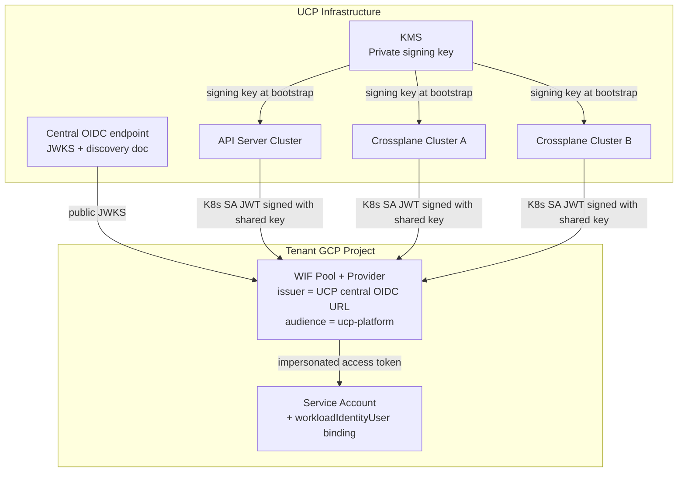

# WIF OIDC Issuer Federation — Multi-Cluster Identity

**Status:** In progress — architecture decided, implementation pending
**Related stories:** MCUCP-131, MCUCP-219, MCUCP-264

---

## Problem

UCP uses Workload Identity Federation (WIF) to authenticate to GCP without storing credentials. The tenant configures a WIF provider in their GCP project pointing to UCP's OIDC issuer URL and grants `roles/iam.workloadIdentityUser` to UCP's stable K8s ServiceAccount principal.

UCP runs multiple clusters:
- One **API server cluster** — handles CLI requests, runs connection verification
- One or more **Crossplane clusters** — execute provisioning workflows (resource sharding)

Each K8s cluster natively has its own OIDC issuer and signing key pair. If each cluster had a different issuer, the tenant would need to configure a WIF provider per UCP cluster and grant multiple IAM bindings — unacceptable.

---

## Decision

**All UCP clusters share a single OIDC issuer URL and a single signing key pair, backed by a KMS.**

| Component | Role |
|---|---|
| Central OIDC issuer URL | A stable URL UCP owns and publishes (e.g. a GCS bucket hosting the JWKS and discovery document) |
| KMS (GCP KMS / Vault) | Stores the private signing key — never exists in plaintext outside KMS |
| Bootstrap mechanism | New clusters authenticate to KMS using their cloud identity and receive the signing key at startup |
| JWKS rotation | Rotate the key in KMS, update the JWKS at the central URL, roll out to all clusters — tenants see no change |

Tenant configuration stays constant across all UCP cluster additions and key rotations:
- ONE WIF provider pointing to UCP's central OIDC issuer URL
- ONE IAM binding on their SA for UCP's stable K8s SA principal

---

## Architecture

---

## Cluster Bootstrap Procedure

When a new UCP cluster is provisioned:

1. The cluster authenticates to KMS using its cloud identity (GCP VM service account, or a pre-shared attestation token managed by the cluster provisioning pipeline)
2. KMS returns the private signing key only to authenticated clusters
3. The K8s API server starts with:
   - `--service-account-issuer=<central-oidc-url>`
   - `--service-account-signing-key-file=<path-to-key-from-kms>`
4. The stable provisioning SA (`ucp-provider-gcp-storage` or equivalent) must be created in the cluster with the same name used in all existing clusters — this is what the tenant has in their IAM binding

---

## Key Rotation

1. Generate new key pair in KMS
2. Publish new public key to the central JWKS endpoint (alongside the old key — dual JWKS during transition)
3. Roll out new private key to all clusters (rolling cluster restart)
4. After all clusters are using the new key, remove the old key from JWKS
5. Tenant sees no change — the issuer URL and principal string are unchanged

---

## Security Properties

| Property | How achieved |
|---|---|
| Private key never in plaintext | Key lives in KMS; clusters receive it only at bootstrap via authenticated channel |
| Cluster isolation | Each cluster authenticates to KMS independently; a compromised cluster cannot fetch keys for other clusters |
| Blast radius of key compromise | All clusters share one key — full key compromise affects all tenants. Mitigated by KMS access controls and audit logging. |
| Key rotation | Supported without tenant-side changes (dual JWKS during transition) |

---

## Current State (MVP)

The multi-cluster key distribution via KMS is not yet implemented. MVP runs with a **single-cluster OIDC issuer** — the API server and Crossplane run on the same cluster or share the same OIDC issuer by other means.

The `VerifyWIFConnection` function in `api-server/internal/shared/gcp/` abstracts K8s SA token acquisition behind a `TokenProvider` interface so the KMS-backed implementation can be plugged in when ready, without changing any other code.

---

## Open Items

1. **KMS selection** — GCP KMS vs HashiCorp Vault. Depends on UCP's cluster hosting environment. Decide when cluster topology is finalized.
2. **Bootstrap authentication mechanism** — how new clusters prove their identity to KMS (GCP VM SA, OIDC-based attestation, pre-shared one-time token). Depends on cluster provisioning pipeline.
3. **JWKS hosting** — GCS bucket vs a UCP-owned well-known endpoint. GCS is simpler; a well-known endpoint is more portable.
4. **GP 106** — CCoE must add UCP's central OIDC issuer URL to the allowed list before WIF can be used in real tenant GCP projects. Track with CCoE separately.
