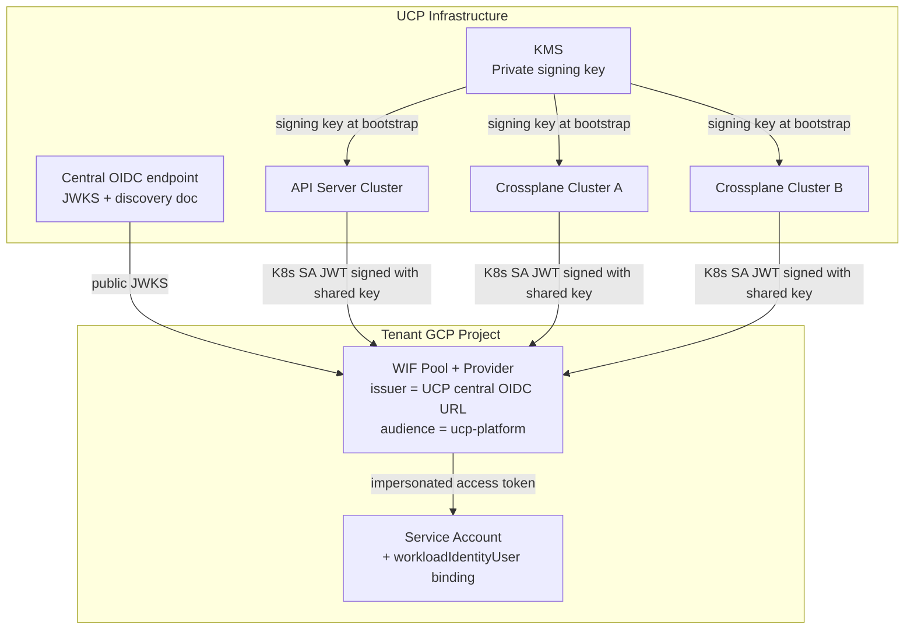

# WIF OIDC Issuer Federation — Multi-Cluster Identity

**Status:** Pending decision — recommendation documented, awaiting approval
**Related stories:** MCUCP-131, MCUCP-219, MCUCP-264

---

## Problem

UCP uses Workload Identity Federation (WIF) to authenticate to GCP without storing credentials. The tenant configures a WIF provider in their GCP project pointing to UCP's OIDC issuer URL and grants `roles/iam.workloadIdentityUser` to UCP's stable K8s ServiceAccount principal.

UCP runs multiple clusters:
- One **API server cluster** — handles CLI requests, runs connection verification
- One or more **Crossplane clusters** — execute provisioning workflows (resource sharding)

Each K8s cluster natively has its own OIDC issuer and signing key pair. If each cluster had a different issuer, the tenant would need to configure a WIF provider per UCP cluster and grant multiple IAM bindings — unacceptable.

---

## Options Considered

### Option A — Per-cluster OIDC (default GKE behavior)

Each cluster uses its own GKE-managed OIDC issuer. No additional infrastructure.

| Aspect | Detail |
|---|---|
| Day 1 setup | Nothing. Works out of the box. |
| Single cluster | Tenant adds 1 OIDC provider to their WIF pool. |
| Adding a 2nd cluster | Tenant must add a 2nd OIDC provider — requires coordinating with every onboarded tenant. |
| Replacing a cluster | Tenant must remove old and add new OIDC provider. |
| Migration to Option B later | Cannot change `--service-account-issuer` on a live GKE cluster. Requires Ops cluster recreation, MR state migration, and simultaneous WIF config update across all tenants. Highly disruptive. |
| Cost | $0 |
| Operational overhead | None at MVP. Grows linearly with cluster count and tenant count. |

### Option B — Shared OIDC issuer via Cloud KMS

All clusters share a single stable OIDC issuer URL, with tokens signed by a KMS key. OIDC discovery document hosted at a UCP-owned stable URL (e.g. GCS bucket).

| Aspect | Detail |
|---|---|
| Day 1 setup | Cloud KMS key, GCS bucket hosting JWKS + discovery document, GKE cluster configured with `--service-account-issuer` at creation time. ~1–2 days of setup. |
| Single cluster | Tenant adds 1 OIDC provider. Same as Option A. |
| Adding a 2nd cluster | No tenant action required. New cluster shares same issuer and signing key. |
| Replacing a cluster | No tenant action required. |
| Migration risk | None — baked in from the start. |
| Cost | ~$0.06/month per KMS key + negligible GCS cost. |
| Operational overhead | KMS key rotation procedure, OIDC discovery document hosting. Low but present. |

### Option C — GSA Impersonation with UCP-managed internal WIF pool

Instead of tenants trusting UCP's cluster OIDC issuer directly, tenants grant impersonation access to a stable UCP GSA. UCP's provider pods authenticate as that GSA using whatever mechanism is available per cluster type. UCP manages its own internal WIF pool for non-GKE clusters — tenants never see it.

```
GKE cluster   → GKE Workload Identity   → provider-roc@ucp-project.iam.gserviceaccount.com
EKS cluster   → UCP internal WIF pool   → provider-roc@ucp-project.iam.gserviceaccount.com
CaaS cluster  → UCP internal WIF pool   → provider-roc@ucp-project.iam.gserviceaccount.com
                                                    ↓
                                         tenant GSA (impersonated)
```

Tenant configuration: grant `roles/iam.serviceAccountTokenCreator` to `provider-roc@ucp-project.iam.gserviceaccount.com` on their SA. This is a project-level GSA principal — stable regardless of cluster count, cluster additions, or cluster replacements.

| Aspect | Detail |
|---|---|
| Day 1 setup | Standard GKE Workload Identity binding. UCP-managed WIF pool for non-GKE clusters when needed. |
| Adding a Crossplane cluster | UCP adds the new cluster's OIDC to its internal pool. No tenant action. |
| Replacing a cluster | UCP updates its internal pool. No tenant action. |
| Multi-cloud (EKS, AKS, CaaS) | Each cluster type added as a provider to UCP's internal WIF pool. Still no tenant action. |
| Custom signing key / KMS | Not needed. |
| Tenant configuration stability | Tenant configures once, never touches it again. |
| Cost | No additional infrastructure. |
| Risk / open questions | GSA impersonation (`serviceAccountTokenCreator`) is a powerful role — grants ability to generate tokens for any identity the target SA can assume. Security implications need validation. PoC required to confirm the full authentication flow works end-to-end across cluster types. |

**Why Option B was recommended over Option C initially:** Option C was identified later. It eliminates the multi-cluster OIDC problem by changing the trust model from cluster-level to project-level. A PoC is needed to validate the full flow before this can be adopted as the approach.

---

## Recommendation

**Provisional — pending PoC of Option C.**

Option B (shared OIDC issuer via KMS) is the current working recommendation. Option C (GSA impersonation with UCP-managed internal WIF pool) is a simpler alternative that may eliminate the need for a custom signing key and KMS entirely. A PoC is required to validate Option C's authentication flow across GKE and non-GKE cluster types before a final decision is made.

If Option C is validated: it becomes the recommendation. If it fails (e.g. security constraints on `serviceAccountTokenCreator`, or non-GKE flow cannot be made to work): Option B stands.

---

**Option B detail (current working recommendation):**

**All UCP clusters share a single OIDC issuer URL and a single signing key pair, backed by a KMS.**

| Component | Role |
|---|---|
| Central OIDC issuer URL | A stable URL UCP owns and publishes (e.g. a GCS bucket hosting the JWKS and discovery document) |
| KMS (GCP KMS / Vault) | Stores the private signing key — never exists in plaintext outside KMS |
| Bootstrap mechanism | New clusters authenticate to KMS using their cloud identity and receive the signing key at startup |
| JWKS rotation | Rotate the key in KMS, update the JWKS at the central URL, roll out to all clusters — tenants see no change |

Tenant configuration stays constant across all UCP cluster additions and key rotations:
- ONE WIF provider pointing to UCP's central OIDC issuer URL
- ONE IAM binding on their SA for UCP's stable K8s SA principal

---

## Architecture



---

## Cluster Bootstrap Procedure

When a new UCP cluster is provisioned:

1. The cluster authenticates to KMS using its cloud identity (GCP VM service account, or a pre-shared attestation token managed by the cluster provisioning pipeline)
2. KMS returns the private signing key only to authenticated clusters
3. The K8s API server starts with:
   - `--service-account-issuer=<central-oidc-url>`
   - `--service-account-signing-key-file=<path-to-key-from-kms>`
4. The stable provisioning SA (`ucp-provider-gcp-storage` or equivalent) must be created in the cluster with the same name used in all existing clusters — this is what the tenant has in their IAM binding

---

## Key Rotation

1. Generate new key pair in KMS
2. Publish new public key to the central JWKS endpoint (alongside the old key — dual JWKS during transition)
3. Roll out new private key to all clusters (rolling cluster restart)
4. After all clusters are using the new key, remove the old key from JWKS
5. Tenant sees no change — the issuer URL and principal string are unchanged

---

## Security Properties

| Property | How achieved |
|---|---|
| Private key never in plaintext | Key lives in KMS; clusters receive it only at bootstrap via authenticated channel |
| Cluster isolation | Each cluster authenticates to KMS independently; a compromised cluster cannot fetch keys for other clusters |
| Blast radius of key compromise | All clusters share one key — full key compromise affects all tenants. Mitigated by KMS access controls and audit logging. |
| Key rotation | Supported without tenant-side changes (dual JWKS during transition) |

---

## Current State (MVP)

KMS-backed shared OIDC is not yet implemented. MVP runs with a **single-cluster OIDC issuer** — the API server and Crossplane run on the same cluster or share the same OIDC issuer by other means. This is acceptable at MVP since only one Crossplane cluster exists.

The `VerifyWIFConnection` function in `api-server/internal/shared/gcp/` abstracts K8s SA token acquisition behind a `TokenProvider` interface so the KMS-backed implementation can be plugged in when ready, without changing any other code.

---

## Open Items

1. **Option C PoC** — validate GSA impersonation flow end-to-end: GKE provider pod → GKE Workload Identity → UCP GSA → impersonate tenant GSA → call tenant GCP APIs. If validated, supersedes Option B as the recommendation.
2. **Option C security review** — `roles/iam.serviceAccountTokenCreator` is a powerful grant. Confirm with CSDD that this trust model is acceptable for UCP's cross-project access pattern.
3. **Option B: KMS selection** — GCP KMS vs HashiCorp Vault vs GCP Secret Manager. Note: K8s `--service-account-signing-key-file` requires the raw private key, so a non-exportable KMS key does not apply. The actual need is a secure key store for distribution (Secret Manager or Vault KV), not a signing service. Only relevant if Option C is not adopted.
4. **Option B: Bootstrap authentication** — how new clusters retrieve the signing key from the key store. Depends on cluster type (GKE Workload Identity, SA key for non-GKE). Only relevant if Option C is not adopted.
5. **Option B: JWKS hosting** — GCS bucket vs a UCP-owned well-known endpoint. GCS is simpler; a well-known endpoint is more portable. Only relevant if Option C is not adopted.
6. **GP 106** — CCoE must add UCP's central OIDC issuer URL to the allowed list before WIF can be used in real tenant GCP projects. Applies to both Option B and Option C. Track with CCoE separately.
