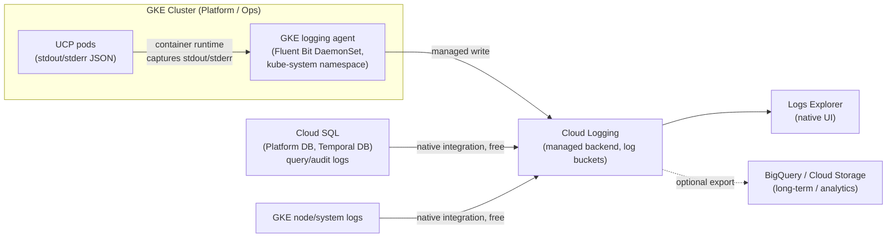
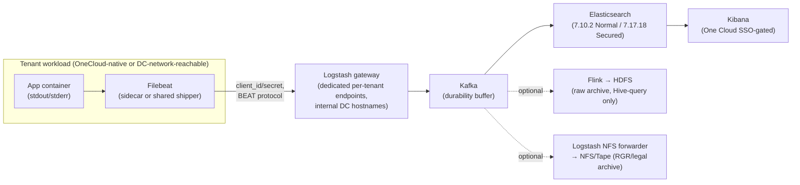
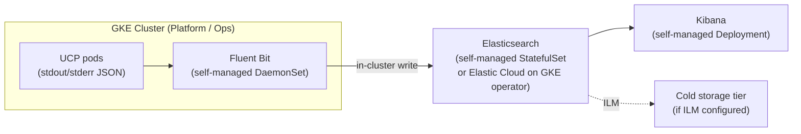

# Research — Application Log Monitoring

**Jira:** [MCUCP-258](https://jira.rakuten-it.com/jira/browse/MCUCP-258)
**Date:** 2026-09-11

## Summary

UCP needs a decision on where application and system logs are collected, stored, searched,
and (eventually) archived, across every component it runs — the API Server, Temporal Server,
Temporal Workers, Crossplane core and its ten provider pods, Platform DB, Temporal DB, and the
future Redis/KEDA/ESO components — across Dev, QA, Prod-Tokyo, and Prod-Osaka (DR). The Jira
ticket's own success criteria name log collection, log platform, and UI ("e.g. Kibana index")
as the three things this RFC must define.

Three options are compared: **GCP Cloud Logging**, **EaaS** (Rakuten OneCloud's Elasticsearch-
based logging platform), and **self-hosted EFK** (Elasticsearch + Fluent Bit + Kibana on GKE).
This mirrors the three-option shape of the [System Resource Monitoring
research](system-resource-monitoring.md) (MCUCP-259), which compared GCP Cloud Monitoring,
MonaaS, and self-hosted Prometheus/Grafana for metrics.

**No recommendation is made in this document.** Each option's findings, pros, cons, and
quantitative/qualitative comparisons are presented for stakeholder discussion. This is a
deliberate departure from the MCUCP-259 research, which did conclude with a recommendation —
see [Why no recommendation yet](#why-no-recommendation-yet) for the reason specific to this
decision.

**Important cross-reference:** [ADR-007 (Observability Stack)](../../../source/ucp-platform/docs/adr/ADR-007-observability-stack.md)
already states, as an accepted decision, that "EaaS (Filebeat) collects and ships to
Elasticsearch," and [logging-and-audit.md](logging-and-audit.md) (MCUCP-256/257) treats this as
settled infrastructure that its own logging-policy and audit-log research builds on top of. This
document's findings on EaaS (see [Option B](#option-b--eaas-rakuten-onecloud-logging-platform))
surface a connectivity gap that ADR-007 does not address: EaaS's documented ingestion model
assumes shippers running inside Rakuten's DC network, and UCP runs entirely on GCP. Whether that
assumption still holds is the central open question this document raises for MCUCP-258 to
resolve — it does not overturn ADR-007 on its own.

## Problem

### Application log platform (MCUCP-258)

UCP needs a decision on:

1. **Log collection** — how logs are captured from every UCP component (container
   stdout/stderr, plus any component-specific log sources like Cloud SQL query/audit logs)
   and shipped off the node.
2. **Log platform** — where those logs are stored, indexed, and retained.
3. **User interface** — how engineers search and view logs (the ticket names Kibana as an
   example).

This is distinct from [MCUCP-256/257](logging-and-audit.md), which defines *what* gets logged
(level policy, field conventions, audit event coverage) assuming the transport/platform layer is
already fixed. MCUCP-258 is about the transport/platform layer itself.

## Why it matters

Every incident response, every "why did this reconciliation fail" question, and every
compliance audit UCP will face depends on logs being collected reliably, searchable quickly, and
retained long enough. Unlike metrics (MCUCP-259), which mainly answers "is the system healthy,"
logs are the forensic record — a platform choice that turns out not to work reliably (or not to
work at all, for a GCP-hosted service) is discovered at the worst possible time: during an
incident, not during evaluation.

## Scope: components to log

Same infrastructure footprint as [MCUCP-259's scope](system-resource-monitoring.md#scope-components-to-monitor) —
all components run on GCP (GKE Platform/Ops clusters, Cloud SQL) across Dev, QA, Prod-Tokyo, and
Prod-Osaka:

| Component | Type | Log sources needed |
|---|---|---|
| API Server | Go service, stateless | Request/response logs, application logs (structured JSON per [ADR-007](../../../source/ucp-platform/docs/adr/ADR-007-observability-stack.md)) |
| Temporal Server (Frontend, History, Matching, Internal Worker) | Go services | Service logs, workflow execution errors |
| Temporal Workers (Provisioning, Drift) | Go workers | Task/activity execution logs, retry/error logs |
| Crossplane Core + providers (roc-lbaas/vmaas/dbaas/staas/caas, upjet-gcp, gcp-sql/container/compute/storage) + Composition Functions | K8s controllers | Controller-runtime reconcile logs, error logs per provider |
| Platform DB / Temporal DB (Cloud SQL PostgreSQL) | Managed DB | Query logs, audit logs (Primary + Sync Standby) |
| Redis (deferred) | Managed/self-hosted cache | Connection/error logs (when introduced) |
| KEDA (deferred Year 3-4) | K8s autoscaler | Scaling decision logs (when introduced) |
| ESO | K8s controller | Sync logs, secret-fetch error logs |
| GKE nodes (Platform + Ops clusters) | Infra | Kubelet/system logs, audit logs |

All application-level logs are container stdout/stderr carrying structured JSON (per ADR-007) —
the collection mechanism only needs to capture stdout/stderr and ship it; no in-app log-shipping
library is being considered for any option.

## Findings

### Option A — GCP Cloud Logging

**How it works**

- GKE clusters run a logging agent (a Fluent Bit-based DaemonSet in `kube-system`, enabled by
  default when Cloud Logging is enabled for the cluster) that captures every container's
  stdout/stderr with no per-app configuration — the same "zero setup" pattern GMP uses for
  metrics in the MCUCP-259 research.
- Structured JSON written to stdout is parsed automatically into the `jsonPayload` field,
  making individual fields (`level`, `request_id`, `user_id`, etc., per ADR-007's `slog`
  convention) directly queryable in Logs Explorer without a custom parser/GROK pattern.
- Cloud SQL query logs and audit logs are exported to Cloud Logging automatically via GCP's
  native Cloud SQL integration — same "automatic, zero-component" pattern as Cloud SQL metrics
  in Option A of the metrics research.
- **Retention**: the default `_Default` log bucket retains logs for **30 days**, configurable
  per bucket from **1 to 3,650 days** (10 years) [[Cloud Logging bucket retention
  docs](https://cloud.google.com/logging/docs/buckets)].
- **UI**: native **Logs Explorer** — not Kibana. There is no first-party Kibana-compatible UI
  for Cloud Logging; approximating one would mean exporting logs to BigQuery/Cloud Storage and
  building a separate visualization layer, which is out of scope for "using Cloud Logging as
  the platform."
- Long-term/analytical use cases route through log sinks to BigQuery, Cloud Storage, or
  Pub/Sub — the same export mechanism used for cost control (routing noisy/low-value logs
  to cheaper storage or excluding them from ingestion entirely).

**Pros**

- Zero collection infrastructure for container logs and Cloud SQL logs — no DaemonSet to
  configure beyond what GKE already runs, no shipper to size or upgrade.
- Structured JSON logs (already the ADR-007 standard) are queryable field-by-field with no
  parser/GROK-pattern authoring — a real gap in EaaS's onboarding process (see Option B).
- Retention is self-service and configurable per bucket via Terraform/`gcloud` — no ticket to
  extend retention, unlike EaaS's negotiated extensions.
- Same-project integration with Cloud Trace/Cloud Monitoring for cross-signal correlation
  (log line ↔ trace ↔ metric) with no additional network path.
- IAM-based access control — consistent with the rest of UCP's GCP-native access model.

**Cons**

- No Kibana or Kibana-equivalent UI — does not satisfy the ticket's literal UI example.
  Logs Explorer is a capable but different tool; teams used to Kibana-style querying (Lucene
  query syntax, saved searches, dashboards) face a retraining cost.
- Ingested volume is billable beyond a free allocation, and every export sink (BigQuery, Cloud
  Storage) adds its own storage cost on top.
- Some vendor lock-in: log-based alerting and Logs Explorer saved queries use GCP-proprietary
  configuration, not portable to another logging backend without rework.

**Trade-offs**

- Trades a native Kibana UI for zero collection overhead and tight integration with UCP's
  already-GCP-native metrics/tracing stack.
- Trades retention flexibility (self-service, per-bucket) for GCP-proprietary query/dashboard
  configuration that doesn't travel to another platform.

### Option B — EaaS (Rakuten OneCloud Logging Platform)

**How it works — as designed for OneCloud-native tenants**

- Core stack: **Kafka + Elasticsearch + Logstash + Kibana**. Two tiers exist — **Normal**
  (Elasticsearch 7.10.2, unencrypted Logstash↔Elasticsearch↔Kibana traffic, not PCI-DSS
  compliant, "elastic-free license") and **Secured** (Elasticsearch 7.17.18, end-to-end TLS
  1.2, PCI-DSS compliant, "elastic platinum license," ~1.4–2.2x the price of Normal).
  Elasticsearch version numbers are **inconsistent across EaaS's own documentation** — one FAQ
  page cites "7.5 and 7.13" in a different context — treat the exact current version as
  unconfirmed pending direct confirmation with the EaaS team.
- Ingestion is shipper-based: **Filebeat** is the default/primary shipper (versions 7.5.x for
  Normal, 7.13.1 for Secured, matching the target Elasticsearch version), authenticated with a
  per-tenant `client_id`/`client_secret` embedded in the shipper config. Logstash-to-gateway via
  the Lumberjack plugin is possible but restricted to Secured/dedicated clusters and requires
  EaaS-team-side gateway configuration. Supported raw protocols on Normal EaaS gateways are
  **BEAT, HTTP, TCP/Syslog, GELF**; Secured EaaS narrows this to **BEAT with SSL, HTTPS**.
  Direct Kafka access is prohibited on Normal EaaS, allowed on Secured EaaS.
- **Connectivity constraint — the central finding for UCP:** EaaS's gateway endpoints are
  documented with internal DC hostnames (e.g. `*.bdd.local`), and EaaS's own technical
  documentation and FAQ both state: *"Due to general DEV VPN access policies, you cannot send
  logs from your local PC. You can use nodes in the DC network to test the connectivity."* No
  EaaS documentation describes a formal public-cloud/multi-cloud ingestion path analogous to
  MonaaS's documented tenant-cloud bridge (self-managed Prometheus/OTel Collector →
  `gateway-tenant-cloud` → Cortex, see [MCUCP-259's Option B
  findings](system-resource-monitoring.md#option-b--monaas-onecloud-monitoring-as-a-service)).
  Reaching an EaaS gateway from a GCP-hosted GKE cluster would require some private network path
  between GCP and Rakuten's DC network (e.g. Cloud Interconnect or a site-to-site VPN) — whether
  that path already exists for UCP, and whether EaaS's gateway ACLs would even accept traffic
  from it, is **unconfirmed** and not addressed in any EaaS documentation reviewed.
- **No documented ingestion API.** `eaas-api-guide.md` is an empty stub with no REST/OTLP
  ingestion spec — ingestion is shipper-only.
- **Onboarding is fully manual/ticket-based**: a JIRA-ticketed "New pipeline Form" and
  "Adding Log-groups Form" process, with the EaaS team creating the pipeline and sharing
  connection details via a tenant-specific Confluence page. Message parsing requires
  **hand-authored GROK patterns** per log group — there is no automatic structured-JSON field
  extraction like Cloud Logging's `jsonPayload`, even though ADR-007 already standardizes UCP's
  logs as JSON.
- **Retention is short by design**: 7 days production / 3 days staging default, extendable only
  by negotiating with the EaaS team (no self-service control). EaaS's own documentation frames
  it as "preferable for short-term retention, but not cost-effective for long-term storage,"
  redirecting long-term needs to HDFS (Hadoop) for investigation/analysis or NAS/Tape for
  legal/RGR-compliant archival — both are separate services with separate onboarding, and HDFS
  archives are **not searchable in Kibana** (Hive Query only) since they're sourced pre-filter
  from Kafka via Flink.
- **UI**: **Kibana**, gated by One Cloud SSO (KeyCloak Gatekeeper for Normal, native SSO for
  Secured). A "One Kibana" cross-cluster-search feature exists for querying across
  availability zones (free, default-enabled) or across datacenters (requires a dedicated,
  billed Kibana instance) — but One Kibana **cannot bridge the Normal/Secured boundary**, so a
  tenant split across both tiers cannot search both from one Kibana.

**Pros**

- Native Kibana UI — directly satisfies the ticket's literal UI example, with no
  export/rebuild step required (unlike Option A).
- Kafka as a durability buffer ahead of Elasticsearch gives some resilience against short
  Elasticsearch outages, compared to a direct-write pipeline.
- Aligns with [ADR-007](../../../source/ucp-platform/docs/adr/ADR-007-observability-stack.md)'s
  existing (currently unverified-for-GCP) assumption and with the MCUCP-259 metrics decision's
  strategic preference for Rakuten's own OneCloud services over third-party cloud-proprietary
  ones.
- Secured EaaS tier provides a PCI-DSS-compliant path if that certification becomes a
  requirement.

**Cons**

- **Unconfirmed whether EaaS is reachable at all from a GCP-hosted GKE cluster** without a
  private network path that does not currently exist or is not confirmed to exist — this is a
  qualitatively different risk than MonaaS's dedicated-line *cost* question in the metrics
  research; there, the bridge is documented and working, only its line-item cost was
  unquantified. Here, the bridge itself is undocumented.
- Fully manual, multi-step, ticket-driven onboarding — no Terraform/API-driven provisioning,
  unlike Cloud Logging's Terraform-managed buckets/sinks.
- Hand-authored GROK parsing per log group discards the automatic structured-field extraction
  UCP's JSON logs would otherwise get for free with Cloud Logging.
- Short default retention (7 days prod) with no self-service extension; long-term archival
  paths (HDFS, NAS/Tape) are separate services, are not Kibana-searchable (HDFS) or are
  narrowly scoped to RGR/legal use (NAS/Tape), and add their own onboarding and cost.
- **Explicitly does not guarantee zero data loss**, on either tier: EaaS's own documentation
  states the ELK architecture is "oriented towards throughput, not... reliability" and that
  "data loss is inevitable and is not guaranteed" even on the Secured tier.
- Elasticsearch version inconsistency across EaaS's own docs (7.10.2/7.17.18 vs. "7.5 and
  7.13" elsewhere) makes it hard to plan for compatibility (e.g. with Graylog or specific
  Filebeat versions) without direct confirmation from the EaaS team.
- Shared multi-tenant default tier carries a documented noisy-neighbor risk (the CaaS
  DaemonSet shipping path explicitly warns "if one tenant sends lots of logs, performance can
  be degraded" for other tenants on the shared shipper).

**Trade-offs**

- Trades a native Kibana UI and organizational/strategic alignment with Rakuten's own logging
  platform for an unresolved — and possibly blocking — network-reachability question, a fully
  manual onboarding process, and an explicit no-data-loss-guarantee posture.
- Trades short-term Elasticsearch search convenience for a fragmented long-term story: recent
  logs in Kibana, older logs in a separate, non-Kibana-searchable archive (HDFS/Hive) or a
  narrowly-scoped legal archive (NAS/Tape).

### Option C — Self-hosted EFK (Elasticsearch + Fluent Bit + Kibana) on GKE

**How it works**

Included as the baseline "own everything" option, giving a real Kibana UI with no vendor or
cross-network dependency — the direct analog to Option C (self-hosted Prometheus/Grafana) in
the metrics research.

**Pros**

- Full Kibana UI with no cross-network dependency, no manual ticket-based onboarding, and no
  reliance on either GCP's proprietary UI or an unconfirmed cross-cloud bridge.
- Structured JSON logs (per ADR-007) index into Elasticsearch with automatic field mapping —
  no GROK-pattern authoring is needed for JSON sources, unlike EaaS's onboarding process.
- Full control over Index Lifecycle Management (ILM) policies, retention, and shard sizing —
  no negotiated extensions, no ticket to change retention.
- No vendor lock-in and no per-GB ingestion/query billing from a third party.

**Cons**

- UCP operates the entire stack: Elasticsearch cluster sizing/scaling, version upgrades,
  shard/index management, Kibana hosting, and Fluent Bit configuration — the same category of
  operational burden Option C carries in the metrics research, just for logs instead of
  metrics.
- Elasticsearch is materially heavier to operate than Prometheus/Loki: it needs persistent
  disk per node, JVM heap tuning, and shard-count planning that grows with retention and log
  volume — under-provisioning risks the same kind of resource exhaustion the metrics research
  documented for self-hosted Prometheus (OOM at moderate cardinality).
- No built-in HA without a deliberate multi-node Elasticsearch cluster design (replica shards
  across nodes/zones) — a single-node setup is a single point of failure for the entire log
  platform.
- Every version upgrade, reindex, and storage expansion is a manual operational task, and
  Elastic's licensing terms for certain features (e.g. some security/ML features bundled free
  in EaaS's "platinum license" tier) may require a paid Elastic subscription to match EaaS
  Secured's feature set.

**Trade-offs**

- Trades the guaranteed reachability and Kibana-native UI of a "known to work" option for the
  full operational and licensing burden of running Elasticsearch at production scale — the same
  category of trade the metrics research identified for self-hosted Prometheus, historically
  converting into a comparable or higher total cost once engineering time is counted.

## Quantitative comparison

| Aspect | GCP Cloud Logging | EaaS (Rakuten OneCloud) | Self-hosted EFK |
|---|---|---|---|
| Default retention | 30 days ([confirmed](https://cloud.google.com/logging/docs/buckets)) | 7 days prod / 3 days staging (EaaS docs) | Configurable, no default ceiling (ILM-managed) |
| Max/extended retention | 1–3,650 days per bucket, self-service | Negotiated extension via EaaS team; long-term via separate HDFS (investigation-only, not Kibana-searchable) or NAS/Tape (RGR/legal only) | Unlimited, bounded by disk/cost, self-managed |
| Ingestion pricing | Per-GiB ingestion cost beyond a per-project monthly free allocation (exact current figures not independently re-confirmed in this pass — see [Open questions](#open-questions)) | Shared tier: ¥95.90/GiB-stored-at-month-end (Normal), ¥135.69/GiB (Secured), FY25 rates | No per-GiB billing; cost is compute + disk + ops time |
| Dedicated/fixed cost | None (pay-per-use) | Dedicated nodes: ¥21,082–50,919/node/month depending on flavor/tier (FY25) | Compute + persistent disk + cluster management fee (no published figure for this specific stack; directionally similar to the ~$800/month self-hosted Prometheus/Grafana baseline the metrics research measured for a comparable operational profile) |
| Professional/paid support | N/A (standard GCP support tiers apply) | ¥12,242.56/hour (FY25) | N/A (in-house ops) |
| SLA | Standard GCP SLA for Cloud Logging (not independently re-verified in this pass) | 99.95% single-DC / 99.99% multi-DC uptime; support hours JST 09:00–17:00 only (incident response is the only 24/7 coverage) | No platform SLA — availability is whatever UCP's own HA design achieves |

## Qualitative comparison

| Aspect | GCP Cloud Logging | EaaS (Rakuten OneCloud) | Self-hosted EFK |
|---|---|---|---|
| UI | Native Logs Explorer — not Kibana | Kibana, One Cloud SSO-gated; "One Kibana" for cross-cluster search (free same-DC, billed cross-DC) | Kibana, fully self-managed access control |
| Structured JSON field extraction | Automatic (`jsonPayload`) | Manual — hand-authored GROK patterns per log group | Automatic (native Elasticsearch JSON mapping) |
| Onboarding model | Self-service, Terraform/`gcloud` | Manual, ticket-based (JIRA + Confluence forms), EaaS team as provisioning bottleneck | Self-service, but UCP builds and owns the whole stack |
| Network path from GCP | Native — same project | **Unconfirmed** — no documented public-cloud ingestion path; DC-network-only ingestion stated explicitly in EaaS docs | Native — runs inside UCP's own GKE clusters |
| Data-loss posture | Standard GCP managed-service durability guarantees | Explicitly **not** loss-guaranteed on either tier, per EaaS's own documentation | Whatever UCP's own Elasticsearch replication/backup design achieves |
| Compliance | Standard GCP compliance certifications apply | PCI-DSS: No (Normal) / Yes (Secured); Super-Confidential data (PII) prohibited on Normal, conditional/negotiated even on Secured | Whatever UCP configures — no built-in compliance certification |
| Cross-signal correlation | Native, same-project with Cloud Trace/Cloud Monitoring | Not integrated with UCP's metrics platform (MonaaS) — separate systems, separate UIs | Would need to be built (e.g. correlating via `request_id` across Grafana and Kibana manually) |
| Organizational alignment | Deepens single-vendor (GCP) dependency, same concern the metrics research raised for Cloud Monitoring | Aligns with Rakuten's own internal platform strategy, same as MonaaS in the metrics decision — but only if the connectivity gap is resolved | Neutral — no vendor dependency either direction |

## Why no recommendation yet

The MCUCP-259 metrics research reached a recommendation despite Option A (Cloud Monitoring)
being technically simpler than Option B (MonaaS), because the strategic case for Option B
rested on a **documented, working** tenant-cloud bridge — the operational cost of that bridge
was measured and quantified via two executed PoCs.

For logs, Option B's viability rests on a **network path that is not documented to exist**: no
EaaS documentation describes ingestion from outside Rakuten's DC network, and the DC-network-VPN
constraint is stated explicitly and repeatedly across EaaS's technical guide and FAQ. Recommending
Option B here would mean asserting a bridge exists without evidence; recommending against it
purely on that basis, without giving the EaaS team a chance to confirm or deny it, risks
discarding the option ADR-007 already assumed and the option most aligned with UCP's stated
OneCloud/organizational-alignment goals. This document intentionally stops short of a
recommendation so that the connectivity question in [Open questions](#open-questions) can be
answered by the EaaS/network teams before MCUCP-258's RFC commits to a platform.

## Open questions

- **Does a network path from UCP's GCP projects to Rakuten's DC network (where EaaS gateway
  endpoints live) already exist, or would one need to be provisioned (e.g. Cloud Interconnect,
  site-to-site VPN)?** This is the single highest-priority question — it determines whether
  Option B is viable at all, not just how much it costs.
- If such a path exists or is provisioned, would EaaS's gateway ACLs accept traffic from it, and
  would the "DC-network-only" ingestion constraint documented in EaaS's technical guide and FAQ
  still apply, or is that constraint specific to VPN-based developer/test access rather than a
  hard architectural limit?
- What is UCP's actual expected log volume across all environments, to convert Cloud Logging's
  per-GiB pricing and EaaS's stored-volume-at-month-end pricing into concrete monthly cost
  estimates? (This document did not re-confirm Cloud Logging's current exact per-GiB price —
  GCP's pricing pages did not render fetchable content during this research pass, the same
  issue the MCUCP-259 research hit for some GCP documentation pages.)
- Does ADR-007's EaaS/Filebeat decision need to be revisited or reconfirmed once the
  connectivity question above is answered? This document does not edit ADR-007 — it surfaces
  the open question ADR-007 does not address.
- If Option A (Cloud Logging) or Option C (self-hosted EFK) is chosen instead of EaaS, does that
  change or conflict with anything already implemented in code per ADR-007 (which currently
  assumes EaaS/Filebeat)? A codebase check for existing Filebeat configuration/sidecar setup
  would clarify how much rework a change of direction implies.
- Is EaaS's short default retention (7 days prod) combined with a separate,
  non-Kibana-searchable archive path acceptable for UCP's operational/compliance needs, or does
  [MCUCP-256/257's](logging-and-audit.md) RGR MON-10 retention baseline (90 days hot, 1 year
  total — established for audit logs, but a reasonable bar for application logs too) argue
  against Option B's retention model regardless of the connectivity question?
- What is the current, authoritative Elasticsearch version EaaS runs, given the inconsistency
  between EaaS's service-description doc (7.10.2 Normal / 7.17.18 Secured) and its FAQ ("7.5 and
  7.13")? Relevant for any Filebeat-version compatibility planning if Option B is pursued.
- Should UCP's log platform integrate with its metrics platform (MonaaS, per the MCUCP-259
  recommendation) for cross-signal correlation, and does that argue for keeping logs and metrics
  on the same vendor (both OneCloud, i.e. EaaS + MonaaS) once/if EaaS's connectivity question is
  resolved?

## Related PoCs

None yet. If the connectivity question above is answered in favor of EaaS being viable, a PoC
analogous to the [MonaaS OTel Collector PoC](../pocs/monaas-otel-collector.md) — provisioning a
Filebeat shipper from a GCP-hosted GKE pod and confirming it can actually reach an EaaS gateway
endpoint and produce a searchable Kibana index — would be the natural next step before
committing to Option B. If Cloud Logging or self-hosted EFK is chosen instead, a PoC verifying
automatic GKE/Cloud SQL log collection (Option A) or a minimal EFK deployment's resource footprint
(Option C) would parallel the PoCs already executed for the metrics decision.

## References

- [MCUCP-258 — UCP Application Log monitoring](https://jira.rakuten-it.com/jira/browse/MCUCP-258)
- [System Resource Monitoring research (MCUCP-259)](system-resource-monitoring.md) — parallel
  three-option structure and MonaaS tenant-cloud bridge precedent this document compares against
- [Logging Policy and Audit Logging research (MCUCP-256/257)](logging-and-audit.md) — policy and
  audit-coverage layer built on top of the transport/platform decision this document addresses
- [ADR-007 Observability Stack](../../../source/ucp-platform/docs/adr/ADR-007-observability-stack.md) —
  existing accepted decision assuming EaaS/Filebeat as log transport
- [Cloud Logging bucket retention](https://cloud.google.com/logging/docs/buckets) — 30-day
  default, 1–3,650-day configurable range (confirmed)
- Rakuten OneCloud EaaS documentation set (`docs/Others/EaaS/*`, `docs/Compute/CaaS/caas-technical-guide-logging.md`,
  `docs/roc-tos/eaas-sla.md`, `docs/FAQs/EaaS/EaaS-faqs-general.md`) — internal Docusaurus source
  provided directly for this research; not independently web-linkable, cited by file path
