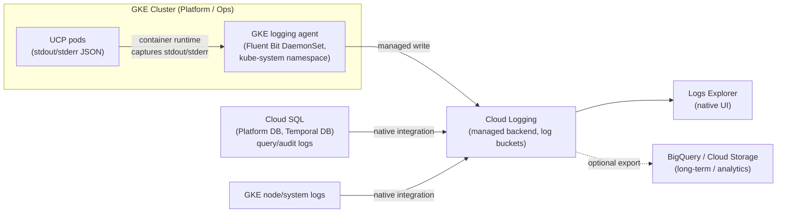
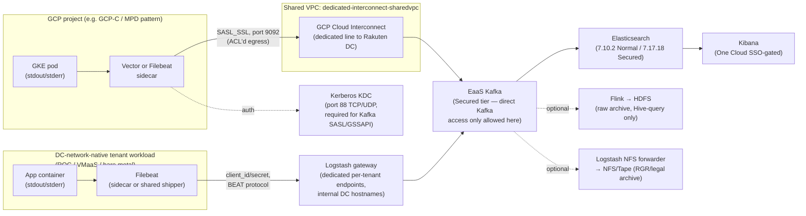
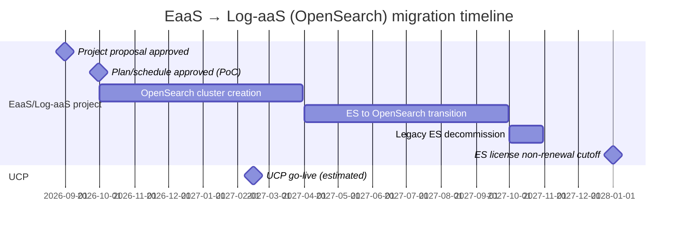
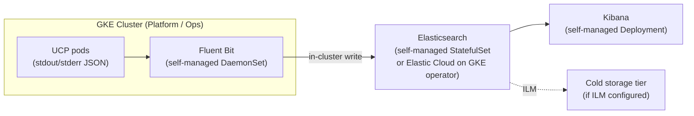
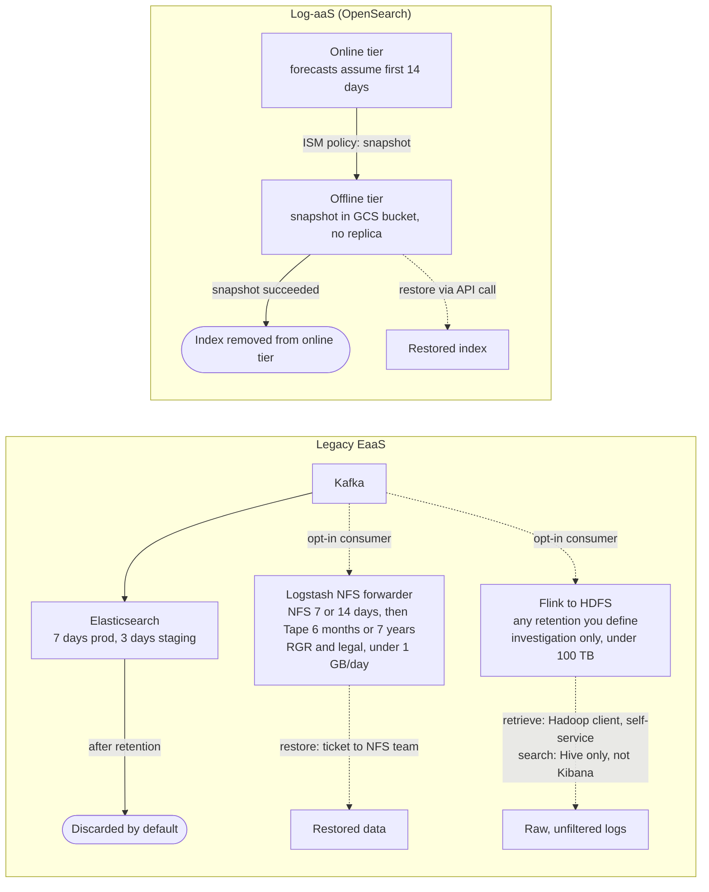

# Research — Application Log Monitoring

**Jira:** [MCUCP-258](https://jira.rakuten-it.com/jira/browse/MCUCP-258)
**Date:** 2026-09-11

## Summary

UCP needs a decision on where application and system logs are collected, stored, searched,
and (eventually) archived, across every component it runs — the API Server, Temporal Server,
Temporal Workers, Crossplane core and its ten provider pods, Platform DB, Temporal DB, and the
future Redis/KEDA/ESO components — across Dev, QA, Prod-Tokyo, and Prod-Osaka (DR). The Jira
ticket's own success criteria name log collection, log platform, and UI ("e.g. Kibana index")
as the three things this RFC must define.

Three options are compared: **GCP Cloud Logging**, **EaaS** (Rakuten OneCloud's Elasticsearch-
based logging platform), and **self-hosted EFK** (Elasticsearch + Fluent Bit + Kibana on GKE).
This mirrors the three-option shape of the [System Resource Monitoring
research](system-resource-monitoring.md) (MCUCP-259), which compared GCP Cloud Monitoring,
MonaaS, and self-hosted Prometheus/Grafana for metrics.

**This document recommends Option B — EaaS.** Each option's findings, pros, cons, and
quantitative/qualitative comparisons are presented in full below for stakeholder review, the
same as the MCUCP-259 metrics research's structure — see [Recommendation](#recommendation) for
the reasoning and the one open item the recommendation still depends on.

**Important cross-reference:** [ADR-007 (Observability Stack)](../../../source/ucp-platform/docs/adr/ADR-007-observability-stack.md)
already states, as an accepted decision, that "EaaS (Filebeat) collects and ships to
Elasticsearch," and [logging-and-audit.md](logging-and-audit.md) (MCUCP-256/257) treats this as
settled infrastructure that its own logging-policy and audit-log research builds on top of. This
document's findings on EaaS (see [Option B](#option-b--eaas-rakuten-onecloud-logging-platform))
surface a gap that ADR-007 does not address: EaaS's own documentation describes a DC-network-only
ingestion model with no public-cloud-aware feature, and says nothing about GCP. Internal
Confluence records show this is not actually a blocker in practice — other Rakuten GCP-hosted
services already ship logs to EaaS in production — but the mechanism that makes it work
(a GCP shared VPC with Cloud Interconnect to Rakuten's DC network, provisioned and ACL'd
per-project) lives entirely outside EaaS and is not documented by the EaaS team at all. Whether
UCP's own GCP projects already have this connectivity, or would need to provision it, is the
central open question this document raises for MCUCP-258 to resolve — it does not overturn
ADR-007 on its own.

## Problem

### Application log platform (MCUCP-258)

UCP needs a decision on:

1. **Log collection** — how logs are captured from every UCP component (container
   stdout/stderr, plus any component-specific log sources like Cloud SQL query/audit logs)
   and shipped off the node.
2. **Log platform** — where those logs are stored, indexed, and retained.
3. **User interface** — how engineers search and view logs (the ticket names Kibana as an
   example).

This is distinct from [MCUCP-256/257](logging-and-audit.md), which defines *what* gets logged
(level policy, field conventions, audit event coverage) assuming the transport/platform layer is
already fixed. MCUCP-258 is about the transport/platform layer itself.

## Why it matters

Every incident response, every "why did this reconciliation fail" question, and every
compliance audit UCP will face depends on logs being collected reliably, searchable quickly, and
retained long enough. Unlike metrics (MCUCP-259), which mainly answers "is the system healthy,"
logs are the forensic record — a platform choice that turns out not to work reliably (or not to
work at all, for a GCP-hosted service) is discovered at the worst possible time: during an
incident, not during evaluation.

## Scope: components to log

Same infrastructure footprint as [MCUCP-259's scope](system-resource-monitoring.md#scope-components-to-monitor) —
all components run on GCP (GKE Platform/Ops clusters, Cloud SQL) across Dev, QA, Prod-Tokyo, and
Prod-Osaka:

| Component | Type | Log sources needed |
|---|---|---|
| API Server | Go service, stateless | Request/response logs, application logs (structured JSON per [ADR-007](../../../source/ucp-platform/docs/adr/ADR-007-observability-stack.md)) |
| Temporal Server (Frontend, History, Matching, Internal Worker) | Go services | Service logs, workflow execution errors |
| Temporal Workers (Provisioning, Drift) | Go workers | Task/activity execution logs, retry/error logs |
| Crossplane Core + providers (roc-lbaas/vmaas/dbaas/staas/caas, upjet-gcp, gcp-sql/container/compute/storage) + Composition Functions | K8s controllers | Controller-runtime reconcile logs, error logs per provider |
| Platform DB / Temporal DB (Cloud SQL PostgreSQL) | Managed DB | Query logs, audit logs (Primary + Sync Standby) |
| Redis (deferred) | Managed/self-hosted cache | Connection/error logs (when introduced) |
| KEDA (deferred Year 3-4) | K8s autoscaler | Scaling decision logs (when introduced) |
| ESO | K8s controller | Sync logs, secret-fetch error logs |
| GKE nodes (Platform + Ops clusters) | Infra | Kubelet/system logs, audit logs |

All application-level logs are container stdout/stderr carrying structured JSON (per ADR-007) —
the collection mechanism only needs to capture stdout/stderr and ship it; no in-app log-shipping
library is being considered for any option.

## Findings

### Option A — GCP Cloud Logging

**How it works**

```mermaid
flowchart LR
    subgraph GKE["GKE Cluster (Platform / Ops)"]
        Pods["UCP pods\n(stdout/stderr JSON)"]
        Agent["GKE logging agent\n(Fluent Bit DaemonSet,\nkube-system namespace)"]
        Pods -- "container runtime\ncaptures stdout/stderr" --> Agent
    end
    CloudSQL["Cloud SQL\n(Platform DB, Temporal DB)\nquery/audit logs"]
    NodeLogs["GKE node/system logs"]
    Agent -- "managed write" --> CL["Cloud Logging\n(managed backend, log buckets)"]
    CloudSQL -- "native integration" --> CL
    NodeLogs -- "native integration" --> CL
    CL --> Explorer["Logs Explorer\n(native UI)"]
    CL -.optional export.-> BQ["BigQuery / Cloud Storage\n(long-term / analytics)"]
```

- GKE clusters run a logging agent (a Fluent Bit-based DaemonSet in `kube-system`, enabled by
  default when Cloud Logging is enabled for the cluster) that captures every container's
  stdout/stderr with no per-app configuration — the same "zero setup" pattern GMP uses for
  metrics in the MCUCP-259 research.
- Structured JSON written to stdout is parsed automatically into the `jsonPayload` field,
  making individual fields (`level`, `request_id`, `user_id`, etc., per ADR-007's `slog`
  convention) directly queryable in Logs Explorer without a custom parser/GROK pattern.
- Cloud SQL query logs and audit logs are exported to Cloud Logging automatically via GCP's
  native Cloud SQL integration — same "automatic, zero-component" pattern as Cloud SQL metrics
  in Option A of the metrics research. Basic database logging is on by default; query logging
  (`log_statement`) and `pgaudit` require database flags. Cloud SQL's documentation defers billing
  to the Cloud Logging pricing page, so these logs count as ordinary ingestion against the free
  allocation and the per-GiB rate (see [Cost](#cost)); which audit log types are exempt is not
  confirmed here.
- **Retention**: the default `_Default` log bucket retains logs for **30 days**, configurable
  per bucket from **1 to 3,650 days** (10 years) [[Cloud Logging bucket retention
  docs](https://cloud.google.com/logging/docs/buckets)].
- **UI**: native **Logs Explorer** — not Kibana. There is no first-party Kibana-compatible UI
  for Cloud Logging; approximating one would mean exporting logs to BigQuery/Cloud Storage and
  building a separate visualization layer, which is out of scope for "using Cloud Logging as
  the platform."
- Long-term/analytical use cases route through log sinks to BigQuery, Cloud Storage, or
  Pub/Sub — the same export mechanism used for cost control (routing noisy/low-value logs
  to cheaper storage or excluding them from ingestion entirely).

**Pros**

- Zero collection infrastructure for container logs and Cloud SQL logs — no DaemonSet to
  configure beyond what GKE already runs, no shipper to size or upgrade.
- Structured JSON logs (already the ADR-007 standard) are queryable field-by-field with no
  parser/GROK-pattern authoring — a real gap in EaaS's onboarding process (see Option B).
- Retention is self-service and configurable per bucket via Terraform/`gcloud` — no ticket to
  extend retention, unlike EaaS's negotiated extensions.
- Same-project integration with Cloud Trace/Cloud Monitoring for cross-signal correlation
  (log line ↔ trace ↔ metric) with no additional network path.
- IAM-based access control — consistent with the rest of UCP's GCP-native access model.

**Cons**

- No Kibana or Kibana-equivalent UI — does not satisfy the ticket's literal UI example.
  Logs Explorer is a capable but different tool; teams used to Kibana-style querying (Lucene
  query syntax, saved searches, dashboards) face a retraining cost.
- Ingested volume is billable beyond a free allocation, and every export sink (BigQuery, Cloud
  Storage) adds its own storage cost on top.
- Some vendor lock-in: log-based alerting and Logs Explorer saved queries use GCP-proprietary
  configuration, not portable to another logging backend without rework.

**Trade-offs**

- Trades a native Kibana UI for zero collection overhead and tight integration with UCP's
  already-GCP-native metrics/tracing stack.
- Trades retention flexibility (self-service, per-bucket) for GCP-proprietary query/dashboard
  configuration that doesn't travel to another platform.

### Option B — EaaS (Rakuten OneCloud Logging Platform)

**How it works — as designed for OneCloud-native tenants**

```mermaid
flowchart LR
    subgraph GCP["GCP project (e.g. GCP-C / MPD pattern)"]
        Pod["GKE pod\n(stdout/stderr)"]
        Vector["Vector or Filebeat\nsidecar"]
        Pod --> Vector
    end
    subgraph SharedVPC["Shared VPC: dedicated-interconnect-sharedvpc"]
        Interconnect["GCP Cloud Interconnect\n(dedicated line to Rakuten DC)"]
    end
    Vector -- "SASL_SSL, port 9092\n(ACL'd egress)" --> Interconnect
    KDC["Kerberos KDC\n(port 88 TCP/UDP,\nrequired for Kafka SASL/GSSAPI)"]
    Vector -. "auth" .-> KDC
    Interconnect --> Kafka["EaaS Kafka\n(Secured tier — direct Kafka\naccess only allowed here)"]

    subgraph Tenant["DC-network-native tenant workload\n(ROC / VMaaS / bare metal)"]
        App["App container\n(stdout/stderr)"]
        Filebeat["Filebeat\n(sidecar or shared shipper)"]
        App --> Filebeat
    end
    Filebeat -- "client_id/secret,\nBEAT protocol" --> GW["Logstash gateway\n(dedicated per-tenant endpoints,\ninternal DC hostnames)"]
    GW --> Kafka

    Kafka --> ES["Elasticsearch\n(7.10.2 Normal / 7.17.18 Secured)"]
    ES --> Kibana["Kibana\n(One Cloud SSO-gated)"]
    Kafka -.optional.-> Flink["Flink → HDFS\n(raw archive, Hive-query only)"]
    Kafka -.optional.-> NFSFwd["Logstash NFS forwarder\n→ NFS/Tape (RGR/legal archive)"]
```

The GCP-side path is not an EaaS feature — EaaS's own documentation has no concept of it. It works
because the GCP project sits on a shared VPC with a dedicated GCP Cloud Interconnect line into
Rakuten's DC network, provisioned and ACL'd by the network/GCP-C team; once that line exists,
traffic from the GKE pod looks like ordinary DC-network traffic to EaaS, which still only ever
sees DC-network-origin connections. This is the pattern documented for other Rakuten GCP-hosted
services (Confluence: *[Session Hint Cookie][PROD] GCP Cluster Onboarding
Checklist*, *[GCP-C] Common ACL List* — see [References](#references)).

- Core stack: **Kafka + Elasticsearch + Logstash + Kibana**. Two tiers exist — **Normal**
  (Elasticsearch 7.10.2, unencrypted Logstash↔Elasticsearch↔Kibana traffic, not PCI-DSS
  compliant, "elastic-free license") and **Secured** (Elasticsearch 7.17.18, end-to-end TLS
  1.2, PCI-DSS compliant, "elastic platinum license," ~1.4–2.2x the price of Normal).
  Elasticsearch version numbers are **inconsistent across EaaS's own documentation** — one FAQ
  page cites "7.5 and 7.13" in a different context — treat the exact current version as
  unconfirmed pending direct confirmation with the EaaS team.
- Ingestion is shipper-based: **Filebeat** is the default/primary shipper (versions 7.5.x for
  Normal, 7.13.1 for Secured, matching the target Elasticsearch version), authenticated with a
  per-tenant `client_id`/`client_secret` embedded in the shipper config. Logstash-to-gateway via
  the Lumberjack plugin is possible but restricted to Secured/dedicated clusters and requires
  EaaS-team-side gateway configuration. Supported raw protocols on Normal EaaS gateways are
  **BEAT, HTTP, TCP/Syslog, GELF**; Secured EaaS narrows this to **BEAT with SSL, HTTPS**.
  Direct Kafka access is prohibited on Normal EaaS, allowed on Secured EaaS.
- **Connectivity constraint — revised finding for UCP.** EaaS's gateway endpoints are documented
  with internal DC hostnames (e.g. `*.bdd.local`), and EaaS's own technical documentation and FAQ
  both state: *"Due to general DEV VPN access policies, you cannot send logs from your local PC.
  You can use nodes in the DC network to test the connectivity."* No EaaS documentation describes
  a formal public-cloud/multi-cloud ingestion path analogous to MonaaS's documented tenant-cloud
  bridge (self-managed Prometheus/OTel Collector → `gateway-tenant-cloud` → Cortex, see
  [MCUCP-259's Option B
  findings](system-resource-monitoring.md#option-b--monaas-onecloud-monitoring-as-a-service)).
  However, internal Confluence records (not part of EaaS's own documentation set) show this is
  **not a blocker in practice**: several Rakuten GCP-hosted services already ship logs to EaaS in
  production —
  - The `[Session Hint Cookie][PROD] GCP Cluster Onboarding Checklist` documents a GKE pod
    (Vector sidecar) egressing directly to an EaaS Kafka broker
    (`*.kaas.jpe2d.dcnw.rakuten:9092`, SASL_SSL), with a Kerberos KDC dependency on port 88
    (TCP/UDP) for Kafka SASL/GSSAPI, over a GCP shared VPC named
    `dedicated-interconnect-sharedvpc` — measured at **~23 Mbps per leg at 13.28K QPS**.
  - The `[GCP-C] Common ACL List` shows a standing, repeated ACL pattern of
    `GCP Subnet → EaaS kafka servers` across multiple GCP-C (MPD) projects, non-prod and prod.
  - Multiple 2026 QA/regression reports (e.g. *JumboV2 app logs EaaS migration for GCP region*)
    confirm GCP-hosted applications dual-writing logs to both Cloud Logging and EaaS in
    production today.

  The mechanism is infrastructure-level, not an EaaS feature: a GCP project on a shared VPC with
  a **GCP Cloud Interconnect** dedicated line into Rakuten's DC network, provisioned and ACL'd by
  the network/GCP-C team. Once that line exists, EaaS still only ever sees DC-network-origin
  traffic — its DC-network-only posture is unchanged, satisfied invisibly at the network layer.
  **What's still open for UCP specifically** is whether UCP's GCP projects already sit on such a
  shared VPC, or whether provisioning one (plus the ACL request and Kerberos KDC access) needs to
  happen — a concrete, answerable infrastructure question, not an open feasibility question. See
  [Open questions](#open-questions).
- **No documented ingestion API.** `eaas-api-guide.md` is an empty stub with no REST/OTLP
  ingestion spec — ingestion is shipper-only.
- **Onboarding is fully manual/ticket-based**: a JIRA-ticketed "New pipeline Form" and
  "Adding Log-groups Form" process, with the EaaS team creating the pipeline and sharing
  connection details via a tenant-specific Confluence page. Message parsing requires
  **hand-authored GROK patterns** per log group — there is no automatic structured-JSON field
  extraction like Cloud Logging's `jsonPayload`, even though ADR-007 already standardizes UCP's
  logs as JSON.
- **Retention is short by design**: 7 days production / 3 days staging default, extendable only
  by negotiating with the EaaS team (no self-service control). EaaS's own documentation frames
  it as "preferable for short-term retention, but not cost-effective for long-term storage,"
  redirecting long-term needs to HDFS (Hadoop) for investigation/analysis or NAS/Tape for
  legal/RGR-compliant archival — both are separate services with separate onboarding, and HDFS
  archives are **not searchable in Kibana** (Hive Query only) since they're sourced pre-filter
  from Kafka via Flink.
- **UI**: **Kibana**, gated by One Cloud SSO (KeyCloak Gatekeeper for Normal, native SSO for
  Secured). A "One Kibana" cross-cluster-search feature exists for querying across
  availability zones (free, default-enabled) or across datacenters (requires a dedicated,
  billed Kibana instance) — but One Kibana **cannot bridge the Normal/Secured boundary**, so a
  tenant split across both tiers cannot search both from one Kibana.

**EaaS → Log-aaS (OpenSearch) migration in progress**

EaaS is not a static platform. Rakuten has an approved project (Confluence, GCSTAT space,
approval ref EPSDPMO-518) to migrate all EaaS Elasticsearch workloads to a new OpenSearch-based
platform, renamed **Log-aaS**, driven by a licensing decision rather than a technical one: the
EaaS team will **not renew Elasticsearch licenses after December 2027** due to a projected 3x
cost increase, after which existing Elasticsearch-licensed clusters become non-compliant.

```mermaid
gantt
    title EaaS → Log-aaS (OpenSearch) migration timeline
    dateFormat YYYY-MM-DD
    todayMarker off
    section EaaS/Log-aaS project
    Project proposal approved      :milestone, 2026-08-31, 0d
    Plan/schedule approved (PoC)   :milestone, 2026-09-30, 0d
    OpenSearch cluster creation    :2026-10-01, 2027-03-31
    ES to OpenSearch transition    :2027-04-01, 2027-09-30
    Legacy ES decommission         :2027-10-01, 2027-10-31
    ES license non-renewal cutoff  :milestone, 2028-01-01, 0d
    section UCP
    UCP go-live (estimated)        :milestone, 2027-02-15, 0d
```

Key differences Log-aaS introduces over legacy EaaS:

- **Self-service by default** — a new API plus a Rakuten OneCloud Portal UI, replacing EaaS's
  fully manual, JIRA-ticket-driven onboarding (see [Option B's onboarding
  finding](#option-b--eaas-rakuten-onecloud-logging-platform) above).
- **Offline/cold storage tier**, restorable via API call — addresses EaaS's current gap where
  long-term retention requires a separate, non-Kibana-searchable HDFS/NAS-Tape archive.
- **New pricing model**: per-GB indexing rate (¥0.717/GB) plus separate online (¥60/GB/month) and
  offline (¥20/GB/month) storage costs, replacing the BMaaS-instance-based dedicated pricing used
  by legacy EaaS today. Log-aaS's own worked example estimates this as materially cheaper than
  the equivalent legacy Secured-tier cost for the same volume/retention profile — but this has not
  been modeled against UCP's own expected log volume (see [Open
  questions](#open-questions)), and it makes the FY25 EaaS pricing figures in the
  [Quantitative comparison](#quantitative-comparison) table above a moving target.
- OpenSearch has been API-compatible with Elasticsearch since forking at the 7.10.2 line, but
  diverged afterward — internal compatibility investigations for other Rakuten OpenSearch
  migrations found query DSL differences and dependency/SDK conflicts (Elasticsearch-Java SDK vs.
  OpenSearch-Java SDK) that required code-level changes for services doing direct
  Elasticsearch-API queries, though **not** for services only using Filebeat/Logstash shipping
  and Kibana/Discover-style search.

**What this means for UCP specifically:** UCP's target go-live is estimated for early 2027, which
falls squarely inside Log-aaS's own "OpenSearch cluster creation" execution phase (through
2027-03-31) — the new
platform will not be feature-complete or the default onboarding target yet. If Option B is
chosen, UCP would onboard onto **legacy EaaS (Elasticsearch)** first, then be carried through the
EaaS team's own ES→OpenSearch cutover sometime before September 30, 2027 — on the EaaS team's
schedule, not UCP's choice. Whether that second migration is trivial for UCP depends entirely on
what UCP builds on top of EaaS: if UCP only ships structured JSON stdout/stderr via
Filebeat/Vector and uses Kibana Discover for search (the pattern this document's [Option B
findings](#option-b--eaas-rakuten-onecloud-logging-platform) describe), the migration is expected
to be a shipper-config/endpoint swap, per Log-aaS's own migration note ("need to create a new
cluster with OpenSearch and update shipper (filebeat etc) config"). If UCP were to build direct
Elasticsearch-API integrations, custom alerting against the Elasticsearch query DSL, or ML/security
features specific to Elastic's platinum license, those would need separate validation against
OpenSearch and are a materially higher-effort migration. This is a factor for MCUCP-258 to weigh,
not a reason to delay the platform decision — UCP cannot wait for Log-aaS to be ready given its
own estimated early-2027 timeline.

**Pros**

- Native Kibana UI — directly satisfies the ticket's literal UI example, with no
  export/rebuild step required (unlike Option A).
- Kafka as a durability buffer ahead of Elasticsearch gives some resilience against short
  Elasticsearch outages, compared to a direct-write pipeline.
- Aligns with [ADR-007](../../../source/ucp-platform/docs/adr/ADR-007-observability-stack.md)'s
  existing assumption and with the MCUCP-259 metrics decision's strategic preference for
  Rakuten's own OneCloud services over third-party cloud-proprietary ones.
- The GCP-to-EaaS network path is a **known, replicable pattern** already operated by other
  Rakuten GCP-hosted services (GCP-C/MPD projects, Jumbo V2, hint-cookie-service) — this is not
  a novel integration UCP would be the first to attempt.
- Secured EaaS tier provides a PCI-DSS-compliant path if that certification becomes a
  requirement.

**Cons**

- **Requires a GCP Cloud Interconnect / shared-VPC path into Rakuten's DC network**, which is a
  provisioning dependency outside EaaS's own onboarding process — whether UCP's GCP projects
  already have this is unconfirmed (see [Open questions](#open-questions)), and if not, it needs
  its own ACL request and Kerberos KDC access (port 88 TCP/UDP) for Kafka SASL/GSSAPI, on top of
  EaaS's own ticket-driven onboarding. None of this is documented by the EaaS team — it is only
  known from other teams' operational history.
- Fully manual, multi-step, ticket-driven onboarding — no Terraform/API-driven provisioning,
  unlike Cloud Logging's Terraform-managed buckets/sinks.
- Hand-authored GROK parsing per log group discards the automatic structured-field extraction
  UCP's JSON logs would otherwise get for free with Cloud Logging.
- Short default retention (7 days prod) with no self-service extension; long-term archival
  paths (HDFS, NAS/Tape) are separate services, are not Kibana-searchable (HDFS) or are
  narrowly scoped to RGR/legal use (NAS/Tape), and add their own onboarding and cost.
- **Explicitly does not guarantee zero data loss**, on either tier: EaaS's own documentation
  states the ELK architecture is "oriented towards throughput, not... reliability" and that
  "data loss is inevitable and is not guaranteed" even on the Secured tier.
- Elasticsearch version inconsistency across EaaS's own docs (7.10.2/7.17.18 vs. "7.5 and
  7.13" elsewhere) makes it hard to plan for compatibility (e.g. with Graylog or specific
  Filebeat versions) without direct confirmation from the EaaS team.
- Normal (shared) tier carries a documented **backend-side** noisy-neighbor risk: the shared
  Kafka/Elasticsearch cluster is used concurrently by many unrelated Rakuten tenants, so another
  tenant's ingestion spike can affect UCP's own indexing/query performance — this is a real,
  UCP-applicable risk if the Normal tier is chosen, separate from anything about UCP's own
  client-side log collection.
- CaaS's own technical guide separately warns of a **client-side** noisy-neighbor risk on its
  shared DaemonSet shipping path ("if one tenant sends lots of logs, performance can be
  degraded" for other tenants sharing that shipper) — this does **not** apply to UCP the same
  way, since UCP runs on its own dedicated GKE clusters rather than CaaS's shared node pools; a
  DaemonSet on UCP's own nodes would only ever share resources with UCP's own pods. The residual
  version of this — e.g. Crossplane's provider controllers producing a reconcile-log burst that
  competes with the API Server's logs on a shared node — is ordinary DaemonSet capacity
  planning, not a multi-tenant risk.
- **Onboarding onto EaaS today means being carried through a second, EaaS-team-driven
  migration** (legacy Elasticsearch → Log-aaS/OpenSearch, target cutover by September 30, 2027)
  on a timeline UCP does not control — see [EaaS → Log-aaS migration in
  progress](#eaas--log-aas-opensearch-migration-in-progress) above. Expected low effort for
  UCP's own Filebeat/Kibana-only usage pattern, but not yet validated against UCP's actual
  design.

**Trade-offs**

- Trades a native Kibana UI and organizational/strategic alignment with Rakuten's own logging
  platform for an additional infrastructure dependency (Cloud Interconnect/shared VPC + Kerberos
  KDC access) that sits outside EaaS's own onboarding process, a fully manual EaaS-side
  onboarding process, and an explicit no-data-loss-guarantee posture.
- Trades short-term Elasticsearch search convenience for a fragmented long-term story: recent
  logs in Kibana, older logs in a separate, non-Kibana-searchable archive (HDFS/Hive) or a
  narrowly-scoped legal archive (NAS/Tape).

### Option C — Self-hosted EFK (Elasticsearch + Fluent Bit + Kibana) on GKE

**How it works**

```mermaid
flowchart LR
    subgraph GKE["GKE Cluster (Platform / Ops)"]
        Pods["UCP pods\n(stdout/stderr JSON)"]
        FluentBit["Fluent Bit\n(self-managed DaemonSet)"]
        Pods --> FluentBit
    end
    FluentBit -- "in-cluster write" --> ES["Elasticsearch\n(self-managed StatefulSet\nor Elastic Cloud on GKE operator)"]
    ES --> Kibana["Kibana\n(self-managed Deployment)"]
    ES -.ILM.-> ColdStore["Cold storage tier\n(if ILM configured)"]
```

Included as the baseline "own everything" option, giving a real Kibana UI with no vendor or
cross-network dependency — the direct analog to Option C (self-hosted Prometheus/Grafana) in
the metrics research.

**Pros**

- Full Kibana UI with no cross-network dependency, no manual ticket-based onboarding, and no
  reliance on either GCP's proprietary UI or an unconfirmed cross-cloud bridge.
- Structured JSON logs (per ADR-007) index into Elasticsearch with automatic field mapping —
  no GROK-pattern authoring is needed for JSON sources, unlike EaaS's onboarding process.
- Full control over Index Lifecycle Management (ILM) policies, retention, and shard sizing —
  no negotiated extensions, no ticket to change retention.
- No vendor lock-in and no per-GB ingestion/query billing from a third party.

**Cons**

- UCP operates the entire stack: Elasticsearch cluster sizing/scaling, version upgrades,
  shard/index management, Kibana hosting, and Fluent Bit configuration — the same category of
  operational burden Option C carries in the metrics research, just for logs instead of
  metrics.
- Elasticsearch is materially heavier to operate than Prometheus/Loki: it needs persistent
  disk per node, JVM heap tuning, and shard-count planning that grows with retention and log
  volume — under-provisioning risks the same kind of resource exhaustion the metrics research
  documented for self-hosted Prometheus (OOM at moderate cardinality).
- No built-in HA without a deliberate multi-node Elasticsearch cluster design (replica shards
  across nodes/zones) — a single-node setup is a single point of failure for the entire log
  platform.
- Every version upgrade, reindex, and storage expansion is a manual operational task, and
  Elastic's licensing terms for certain features (e.g. some security/ML features bundled free
  in EaaS's "platinum license" tier) may require a paid Elastic subscription to match EaaS
  Secured's feature set.

**Trade-offs**

- Trades the guaranteed reachability and Kibana-native UI of a "known to work" option for the
  full operational and licensing burden of running Elasticsearch at production scale — the same
  category of trade the metrics research identified for self-hosted Prometheus, historically
  converting into a comparable or higher total cost once engineering time is counted.

## Quantitative comparison

| Aspect | GCP Cloud Logging | EaaS (Rakuten OneCloud) | Self-hosted EFK |
|---|---|---|---|
| Default retention | 30 days ([confirmed](https://cloud.google.com/logging/docs/buckets)) | 7 days prod / 3 days staging (EaaS docs) | Configurable, no default ceiling (ILM-managed) |
| Max/extended retention | 1–3,650 days per bucket, self-service | Negotiated extension via EaaS team; long-term via separate HDFS (investigation-only, not Kibana-searchable) or NAS/Tape (RGR/legal only) | Unlimited, bounded by disk/cost, self-managed |
| Ingestion pricing | $0.50/GB ingested beyond 50 GB per project per month free, per the Coupon team's analysis (see [Cost](#cost)) | Shared tier: ¥95.90/GiB-stored-at-month-end (Normal), ¥135.69/GiB (Secured), FY25 rates | No per-GiB billing; cost is compute + disk + ops time |
| Dedicated/fixed cost | None (pay-per-use) | Dedicated nodes: ¥21,082–50,919/node/month depending on flavor/tier (FY25) | Compute + persistent disk + cluster management fee (no published figure for this specific stack; directionally similar to the ~$800/month self-hosted Prometheus/Grafana baseline the metrics research measured for a comparable operational profile) |
| Professional/paid support | N/A (standard GCP support tiers apply) | ¥12,242.56/hour (FY25) | N/A (in-house ops) |
| SLA | Standard GCP SLA for Cloud Logging (not independently re-verified in this pass) | 99.95% single-DC / 99.99% multi-DC uptime; support hours JST 09:00–17:00 only (incident response is the only 24/7 coverage) | No platform SLA — availability is whatever UCP's own HA design achieves |

## Qualitative comparison

| Aspect | GCP Cloud Logging | EaaS (Rakuten OneCloud) | Self-hosted EFK |
|---|---|---|---|
| UI | Native Logs Explorer — not Kibana | Kibana, One Cloud SSO-gated; "One Kibana" for cross-cluster search (free same-DC, billed cross-DC) | Kibana, fully self-managed access control |
| Structured JSON field extraction | Automatic (`jsonPayload`) | Manual — hand-authored GROK patterns per log group | Automatic (native Elasticsearch JSON mapping) |
| Onboarding model | Self-service, Terraform/`gcloud` | Manual, ticket-based (JIRA + Confluence forms), EaaS team as provisioning bottleneck | Self-service, but UCP builds and owns the whole stack |
| Network path from GCP | Native — same project | No EaaS-side feature for this (DC-network-only per EaaS docs), but a **known infra pattern** exists: GCP shared VPC + Cloud Interconnect to Rakuten DC, already used by other GCP-hosted Rakuten services; open question is whether UCP's GCP projects have it | Native — runs inside UCP's own GKE clusters |
| Data-loss posture | Standard GCP managed-service durability guarantees | Explicitly **not** loss-guaranteed on either tier, per EaaS's own documentation | Whatever UCP's own Elasticsearch replication/backup design achieves |
| Compliance | Standard GCP compliance certifications apply | PCI-DSS: No (Normal) / Yes (Secured); Super-Confidential data (PII) prohibited on Normal, conditional/negotiated even on Secured | Whatever UCP configures — no built-in compliance certification |
| Cross-signal correlation | Native, same-project with Cloud Trace/Cloud Monitoring | Not integrated with UCP's metrics platform (MonaaS) — separate systems, separate UIs | Would need to be built (e.g. correlating via `request_id` across Grafana and Kibana manually) |
| Organizational alignment | Deepens single-vendor (GCP) dependency, same concern the metrics research raised for Cloud Monitoring | Aligns with Rakuten's own internal platform strategy, same as MonaaS in the metrics decision — but only if the connectivity gap is resolved | Neutral — no vendor dependency either direction |
| Operational overhead | Lowest: GKE's logging agent needs no UCP-managed shipper; retention and Log Router sinks are configured per project | Medium: UCP maintains the shipper (one Filebeat DaemonSet with RBAC per cluster, measured in the PoC) and files tickets for pipelines and parsers; EaaS runs the backend | Highest: UCP runs Elasticsearch, Kibana, and the shipper, including upgrades, HA, sizing, and licensing |
| Long-term retention and restore | In-bucket retention up to 3,650 days with no restore; Log Router archive to Cloud Storage or BigQuery, queried with Log Analytics | Legacy: 7 days, then opt-in NFS/Tape or HDFS archives with ticket-based or Hive-only retrieval. Log-aaS: offline tier restored by API call, limits undocumented | UCP-defined ILM and snapshot policy; retention, archive location, and restore procedure are all UCP-owned |

## Cost

Cost is modeled for the two EaaS generations and Cloud Logging. Self-hosted EFK has no published
figure and is not modeled; it remains as described in the [Quantitative
comparison](#quantitative-comparison). Cloud Logging figures come from the Coupon platform team's
logging cost analysis, which uses GCP's published rates at ¥77 per $0.50.

### Billing models

| | Legacy EaaS (FY25) | Log-aaS | Cloud Logging |
|---|---|---|---|
| Basis | Data stored in Elasticsearch at month-end | Data ingested, plus data stored per tier | Data ingested, plus storage beyond 30 days |
| Shared tier | ¥95.9/GB (Normal), ¥135.7/GB (Secured) | Not applicable — dedicated pipeline by default | Not applicable |
| Dedicated | About ¥21K/node/month (Normal), ¥47K/node/month (Secured) | Not applicable | Not applicable |
| Ingestion | Included | ¥0.717/GB ingested | $0.50/GB (about ¥77/GB); first 50 GB per project per month free |
| Online storage | Included (7-day retention) | ¥60/GB/month | Included for the first 30 days; $0.01/GB/month beyond |
| Offline / archive | Separate services (NFS/Tape billed by the Storage team, HDFS billed by EaaS) | ¥20/GB/month, no replica stored | Log Router sink to Cloud Storage: Standard $0.023/GB/month, Archive $0.0025/GB/month plus $0.01/GB retrieval; BigQuery $0.02/GB/month storage plus $5/TB scanned |

### Forecast for comparable MPD tenants

The Log-aaS team published forecasts for existing tenants using their prior utilization
(14 days online, the remainder offline). The `cls-mpd` tenants are the closest comparables, since
MPD is also GCP-hosted.

| Tenant | Ingest/day | Log-aaS cost/month | Difference from legacy |
|---|---|---|---|
| `cls-mpd` | about 967 GB | ¥1,115,399 | Saves ¥337,928 |
| `cls-mpd-ra` | about 1,316 GB | ¥1,484,666 | Costs ¥488,056 more |
| `cls-mpd-stg` | about 203 GB | ¥166,184 | Saves ¥385,240 |

Log-aaS is not uniformly cheaper than legacy EaaS; the result depends on volume and the
online/offline retention mix. These tenants ingest 200 to 1,300 GB/day; UCP's volume is not yet
estimated.

### Illustrative UCP estimate

Using the forecast pages' convention (14 days online, all remaining retention offline), Log-aaS
costs about ¥21.5 for indexing, ¥840 for the online tier, and ¥20 per additional offline day, per
GB/day of ingest, per month. Legacy EaaS at its 7-day default costs ¥671 (Normal) or ¥950
(Secured) per GB/day per month, assuming replicas are not counted in the stored volume.

| Ingest/day | Log-aaS, 14-day retention | Log-aaS, 90-day | Log-aaS, 365-day | Legacy Normal, 7-day | Legacy Secured, 7-day |
|---|---|---|---|---|---|
| 10 GB | ¥8.6K | ¥23.8K | ¥78.8K | ¥6.7K | ¥9.5K |
| 20 GB | ¥17.2K | ¥47.6K | ¥157.6K | ¥13.4K | ¥19.0K |
| 50 GB | ¥43.1K | ¥119.1K | ¥394.1K | ¥33.6K | ¥47.5K |
| 100 GB | ¥86.2K | ¥238.2K | ¥788.2K | ¥67.1K | ¥95.0K |

Cloud Logging at the same volumes, using the Coupon analysis rates (¥77/GB ingested, about
¥1.5/GB/month for storage beyond the included 30 days, free tier ignored):

| Ingest/day | Cloud Logging, 14-day retention | Cloud Logging, 90-day | Cloud Logging, 365-day |
|---|---|---|---|
| 10 GB | ¥23.1K | ¥24.0K | ¥28.3K |
| 20 GB | ¥46.2K | ¥48.0K | ¥56.5K |
| 50 GB | ¥115.5K | ¥120.1K | ¥141.3K |
| 100 GB | ¥231.0K | ¥240.2K | ¥282.6K |

The ranking depends on retention. At short retention, legacy EaaS is the cheapest (roughly 30 to
40% of Cloud Logging's cost at 7 days) because it bills on stored volume while Cloud Logging bills
every ingested GB. At long retention, Cloud Logging is the cheapest, because storage beyond 30 days
costs about ¥1.5/GB/month against Log-aaS's ¥20/GB/month offline tier. The Coupon analysis
reports the same shape at 1,245 GB/day: ¥893K/month on EaaS against ¥2.81M on Cloud Logging
ingesting everything, and ¥291K after cutting log volume 90% with sampling, so Cloud Logging cost
is highly sensitive to volume reduction.

The ingest volumes are placeholders, not UCP estimates. Legacy EaaS retention beyond 7 days
requires the archive services described in [Retention and housekeeping](#retention-and-housekeeping),
whose pricing is not included here. The Log-aaS billing page's worked example states 3 days of
offline storage but computes 7; its total is not used in this document.

## Retention and housekeeping

What happens to a log after the online retention window differs between legacy EaaS and Log-aaS.
Legacy EaaS discards it unless an archive service was requested; Log-aaS moves it to an offline
tier.

```mermaid
flowchart LR
    subgraph Legacy["Legacy EaaS"]
        K1["Kafka"] --> ES1["Elasticsearch\n7 days prod, 3 days staging"]
        ES1 -->|"after retention"| D1(["Discarded by default"])
        K1 -.->|"opt-in consumer"| NFS["Logstash NFS forwarder\nNFS 7 or 14 days, then Tape 6 months or 7 years\nRGR and legal, under 1 GB/day"]
        K1 -.->|"opt-in consumer"| HDFS["Flink to HDFS\nany retention you define\ninvestigation only, under 100 TB"]
        NFS -.->|"restore: ticket to NFS team"| R1["Restored data"]
        HDFS -.->|"retrieve: Hadoop client, self-service\nsearch: Hive only, not Kibana"| R2["Raw, unfiltered logs"]
    end
    subgraph LogaaS["Log-aaS (OpenSearch)"]
        ON["Online tier\nforecasts assume first 14 days"] -->|"ISM policy: snapshot"| OFF["Offline tier\nsnapshot in GCS bucket, no replica"]
        OFF -->|"snapshot succeeded"| GONE(["Index removed from online tier"])
        OFF -.->|"restore via API call"| ON2["Restored index"]
    end
```

| Aspect | Legacy EaaS | Log-aaS |
|---|---|---|
| Online retention | 7 days prod, 3 days staging; extension negotiated with the EaaS team | Online tier; the forecast pages assume the first 14 days; the maximum is not documented |
| After online retention | Discarded by default; NFS/Tape and HDFS archives are opt-in | Snapshotted to offline storage, then removed from the online tier; if the snapshot step fails, the index is kept |
| Archive retention | NFS 7 or 14 days (temporary), then Tape 6 months or 7 years; HDFS any period, bounded by Hadoop platform capacity and service level | Not documented |
| Restore | NFS/Tape: request to the NFS team. HDFS: self-service download with the Hadoop client | Self-service API call; restore time and limits are not documented |
| Searchable while archived | Tape: no. HDFS: not in Kibana; Hive queries only, on raw unfiltered logs | Not documented; snapshot-based storage implies a restore before searching |
| Loss and compliance | NFS: data loss unlikely but possible if all Logstash forwarders fail. HDFS: no loss guarantee, does not satisfy RGR or PCI-DSS. NFS/Tape is the RGR/legal path | Not documented for the archive |
| Cost | NFS/Tape billed by the Storage team; HDFS billed by EaaS including Hadoop-as-a-Service | Offline storage ¥20/GB/month |

The Log-aaS GCS snapshot behavior comes from the Log-aaS failure-test plan (snapshot-to-GCS
failure cases halt the index deletion), not from a user-facing document. The billing page
describes offline storage as "cold storage that can be restored using API call".

**Cloud Logging and self-hosted EFK.** Cloud Logging keeps logs searchable in Logs Explorer for
the bucket's retention period (30 days by default, configurable per bucket up to 3,650 days), so
retention inside the bucket needs no restore step. For cheaper long-term storage, a Log Router
sink sends logs to Cloud Storage (Standard or Archive) or BigQuery; the Coupon team's design
queries archived logs with Log Analytics and keeps the Archive tier for 31 to 365 days of
compliance retention. Self-hosted EFK has no platform default: UCP defines the Index Lifecycle
Management policy, the snapshot or archive location, and the restore procedure itself.

**Implications for UCP.** The audit-log baseline from [MCUCP-256/257](logging-and-audit.md) is 90
days hot and 1 year total. Legacy EaaS Tape offers 6 months or 7 years, so meeting that baseline
on legacy EaaS requires the 7-year option. NFS/Tape is limited to under 1 GB/day, which audit
logs may fit, but general application logs do not; application logs that need retention beyond 7
days go to HDFS, which is not searchable in Kibana and does not meet RGR.

## Recommendation

**Use EaaS as UCP's application log platform.**

The MCUCP-259 metrics research reached a recommendation for MonaaS despite Option A (Cloud
Monitoring) being technically simpler, because the strategic case for Option B rested on a
**documented, working** tenant-cloud bridge — the operational cost of that bridge was measured
and quantified via two executed PoCs. The same shape of evidence now exists for logs: internal
Confluence records confirm other Rakuten GCP-hosted services already ship logs to EaaS in
production via a GCP Cloud Interconnect / shared-VPC pattern (see [Option B
findings](#option-b--eaas-rakuten-onecloud-logging-platform)), and the [EaaS Log Shipping
Simulation PoC](../pocs/eaas-log-shipping-simulation/poc-report.md) independently confirmed a
shared Filebeat DaemonSet correctly ships and parses every one of UCP's real log shapes (a Go
service, Temporal Server, Temporal Worker, Crossplane core) into a pipeline shaped like EaaS's
own.

Rationale:

1. **Connectivity is a known, replicable pattern, not an open feasibility question.** GCP-C/MPD
   projects, Jumbo V2, and hint-cookie-service all already run this bridge in production —
   what's left is confirming UCP's own GCP projects have it or provisioning one, a
   timeline/cost question, not a "does this work at all" question.
2. **Shipper/parsing correctness is proven, hands-on, for UCP's actual log shapes** — not just a
   generic sample. The PoC found and fixed real Filebeat/Logstash routing bugs before they could
   surface during a real EaaS onboarding, and confirmed UCP's Temporal Workers already emit
   ADR-007-compliant structured JSON.
3. **Native Kibana UI** directly satisfies the Jira ticket's literal success criterion, with no
   export/rebuild step (Option A) or self-managed hosting decision (Option C).
4. **Organizational alignment** — EaaS keeps logs on Rakuten's own OneCloud platform, the same
   direction already taken for metrics (MonaaS, MCUCP-259), rather than deepening a single-vendor
   GCP dependency (Option A) or taking on the full operational/licensing burden of running
   Elasticsearch UCP would otherwise own outright (Option C).
5. **EaaS's own upcoming platform migration (Log-aaS/OpenSearch) works in UCP's favor, not
   against it** — self-service APIs and a genuine long-term storage tier are coming, addressing
   two of legacy EaaS's current cons (manual onboarding, short retention). UCP's estimated
   early-2027 go-live means onboarding onto legacy EaaS first, then being carried through that
   cutover on the EaaS team's schedule — expected to be low-effort for UCP's shipper/Kibana-only
   usage pattern (see [EaaS → Log-aaS migration in
   progress](#eaas--log-aas-opensearch-migration-in-progress)).

**Confirmed risk to resolve before onboarding:** whether UCP's own GCP projects already sit on a
shared VPC with a GCP Cloud Interconnect line into Rakuten's DC network, or whether one needs to
be provisioned — and the resulting lead time/cost. This must be confirmed directly with the
EaaS/network team (see [Open questions](#open-questions)) before onboarding starts, but it is a
provisioning detail to resolve, not a reason to withhold the platform decision itself.

## Open questions

- **Network connectivity — confirm directly with the EaaS team.** Other GCP-hosted Rakuten
  services already ship logs to EaaS in production via a GCP Cloud Interconnect / shared-VPC
  path (GCP-C/MPD projects, Jumbo V2, hint-cookie-service — see [Option B
  findings](#option-b--eaas-rakuten-onecloud-logging-platform)), so this is confirmed working in
  principle, not a documented EaaS feature. Before MCUCP-258 commits to Option B, confirm with
  the EaaS team (not just inferred from other teams' Confluence pages):
  - Do UCP's GCP projects already sit on a shared VPC with a Cloud Interconnect line into
    Rakuten's DC network, or would one need to be provisioned — and if so, what's the lead
    time/cost (per the `[GCP-C] Common ACL List` and `[Session Hint Cookie]` onboarding-checklist
    pattern)?
  - Does reaching EaaS's Kafka brokers directly (Vector-sidecar pattern, port 9092 SASL_SSL)
    require the **Secured** EaaS tier specifically, since direct Kafka access is documented as
    prohibited on Normal EaaS?
  - Is Kerberos KDC connectivity (port 88, TCP and UDP) already available from UCP's GCP
    projects, or does it need its own ACL request? The onboarding checklist notes this
    dependency is easy to miss and causes logging to fail silently if absent.
  - **Known issues/risks/caveats from the EaaS team's own operational experience with this
    pattern** — e.g. added latency over Cloud Interconnect vs. DC-native shipping, any history of
    missing/dropped logs specific to the cross-network path, throughput ceilings, or extra
    failure modes beyond what EaaS's standard no-loss-guarantee posture already covers. This
    hasn't been confirmed anywhere reviewed so far — the Confluence evidence shows the pattern
    works, not how well it performs or what has gone wrong with it.
- If Option B is chosen, does UCP onboard directly onto legacy EaaS (Elasticsearch) given its
  estimated early-2027 go-live, then get migrated to Log-aaS (OpenSearch) on the EaaS team's own
  schedule (target cutover by 2027-09-30)? Confirm this sequencing with the EaaS/Log-aaS project
  team (`Wang, Jialei | Jonsnow | MPD`) rather than assuming it.
- Does UCP's planned use of EaaS/Log-aaS stay within Filebeat/Vector shipping + Kibana Discover
  search (low migration effort per Log-aaS's own migration note), or would it need any direct
  Elasticsearch-API queries, custom ElastAlert-style alerting, or Elastic-platinum-license
  features (ML, advanced security) that would need separate OpenSearch compatibility validation?
- **Does the shipper side of the Log-aaS cutover stay a Filebeat config change, or does it
  require a different ingestion mechanism?** Log-aaS's own migration note says to "update
  shipper (filebeat etc) config" — implying Filebeat keeps working, just repointed at the new
  cluster — consistent with OpenSearch forking Elasticsearch at the 7.10.2 line and retaining
  much of that era's ingestion protocol. But Log-aaS is also described as shipping with "our new
  API," fully self-service — if that new API changes the ingestion mechanism itself rather than
  just the endpoint, the migration is more than a config change. Not confirmed either way;
  confirm with the EaaS/Log-aaS project team before assuming a config-only migration.
- **The UI changes from Kibana to OpenSearch Dashboards** — OpenSearch's own fork of Kibana from
  before Elastic's license change, not an unrelated product, but with documented divergence
  since the fork point (query-DSL and API differences have required code-level changes for other
  Rakuten OpenSearch migrations). Whoever owns UCP's log-search workflows should expect to
  re-familiarize with OpenSearch Dashboards specifically, not assume Kibana knowledge transfers
  unchanged.
- What would UCP's estimated cost be under Log-aaS's new per-GB indexing + online/offline storage
  pricing model (¥0.717/GB indexing, ¥60/GB/month online, ¥20/GB/month offline), once UCP's
  expected log volume (see the [earlier open question on log
  volume](#open-questions)) is known? This is a different pricing model from the FY25 EaaS figures
  in the [Quantitative comparison](#quantitative-comparison) table above, which only reflect
  legacy EaaS and will not apply once UCP is migrated to Log-aaS.
- What is UCP's actual expected log volume across all environments, to convert Cloud Logging's
  per-GiB pricing and EaaS's stored-volume-at-month-end pricing into concrete monthly cost
  estimates? (Cloud Logging's rates in [Cost](#cost) come from the Coupon team's analysis rather
  than GCP's pricing pages, which did not render fetchable content during this research pass, the
  same issue the MCUCP-259 research hit for some GCP documentation pages.)
- Does ADR-007's EaaS/Filebeat decision need to be revisited or reconfirmed once the
  connectivity question above is answered? This document does not edit ADR-007 — it surfaces
  the open question ADR-007 does not address.
- If Option A (Cloud Logging) or Option C (self-hosted EFK) is chosen instead of EaaS, does that
  change or conflict with anything already implemented in code per ADR-007 (which currently
  assumes EaaS/Filebeat)? A codebase check for existing Filebeat configuration/sidecar setup
  would clarify how much rework a change of direction implies.
- Is EaaS's short default retention (7 days prod) combined with a separate,
  non-Kibana-searchable archive path acceptable for UCP's operational/compliance needs, or does
  [MCUCP-256/257's](logging-and-audit.md) RGR MON-10 retention baseline (90 days hot, 1 year
  total — established for audit logs, but a reasonable bar for application logs too) argue
  against Option B's retention model regardless of the connectivity question?
- What is Log-aaS's maximum offline retention, and what are the restore time and limits? Neither
  is documented; see [Retention and housekeeping](#retention-and-housekeeping).
- Is Log-aaS offline storage searchable without restoring it first, or does every lookup require
  an API-driven restore?
- Does Log-aaS's archive satisfy RGR and legal retention, or does NFS/Tape remain the compliance
  path for audit logs after the migration?
- Is archived data on legacy EaaS (NFS/Tape, HDFS) carried over to Log-aaS at cutover, or does it
  stay on the legacy archive services?
- What is UCP's expected ingest volume per environment? The [cost
  estimate](#illustrative-ucp-estimate) uses placeholder volumes until this is known.
- What is the current, authoritative Elasticsearch version EaaS runs, given the inconsistency
  between EaaS's service-description doc (7.10.2 Normal / 7.17.18 Secured) and its FAQ ("7.5 and
  7.13")? Relevant for any Filebeat-version compatibility planning if Option B is pursued.
- Should UCP's log platform integrate with its metrics platform (MonaaS, per the MCUCP-259
  recommendation) for cross-signal correlation, and does that argue for keeping logs and metrics
  on the same vendor (both OneCloud, i.e. EaaS + MonaaS) once/if EaaS's connectivity question is
  resolved?

## Related PoCs

Real end-to-end connectivity from UCP's own GKE clusters to EaaS's gateway/Kafka endpoints
cannot be tested yet — UCP's actual GCP environment isn't provisioned, and that question is
tracked as a direct confirmation with the EaaS team in [Open
questions](#open-questions) rather than something a PoC can resolve today.

What can be tested now is the shipper side, decoupled from real network access: the
[EaaS Log Shipping Simulation PoC](../pocs/eaas-log-shipping-simulation.md) deploys a
log-generating workload plus a Filebeat shipper in the sandbox GKE cluster, shipping to a
locally-simulated stand-in for EaaS's pipeline (Logstash → Kafka → Elasticsearch/Kibana, run via
docker-compose on a local device) to validate shipper config correctness, GROK/JSON field
parsing, and log-group tagging — the same "stand-in backend" pattern the [MonaaS OTel Collector
PoC](../pocs/monaas-otel-collector.md) used for its collector variant. This PoC proves the
shipper-configuration side of Option B works as expected; it does not and cannot prove GCP→EaaS
network reachability, which stays an open question for the EaaS team to confirm.

If Cloud Logging or self-hosted EFK is chosen instead, a PoC verifying automatic GKE/Cloud SQL
log collection (Option A) or a minimal EFK deployment's resource footprint (Option C) would
parallel the PoCs already executed for the metrics decision.

## References

- [MCUCP-258 — UCP Application Log monitoring](https://jira.rakuten-it.com/jira/browse/MCUCP-258)
- [System Resource Monitoring research (MCUCP-259)](system-resource-monitoring.md) — parallel
  three-option structure and MonaaS tenant-cloud bridge precedent this document compares against
- [Logging Policy and Audit Logging research (MCUCP-256/257)](logging-and-audit.md) — policy and
  audit-coverage layer built on top of the transport/platform decision this document addresses
- [ADR-007 Observability Stack](../../../source/ucp-platform/docs/adr/ADR-007-observability-stack.md) —
  existing accepted decision assuming EaaS/Filebeat as log transport
- [Cloud Logging bucket retention](https://cloud.google.com/logging/docs/buckets) — 30-day
  default, 1–3,650-day configurable range (confirmed)
- Rakuten OneCloud EaaS documentation set (`docs/Others/EaaS/*`, `docs/Compute/CaaS/caas-technical-guide-logging.md`,
  `docs/roc-tos/eaas-sla.md`, `docs/FAQs/EaaS/EaaS-faqs-general.md`) — internal Docusaurus source
  provided directly for this research; not independently web-linkable, cited by file path
- [\[Session Hint Cookie\]\[PROD\] GCP Cluster Onboarding Checklist](https://confluence.rakuten-it.com/confluence/pages/viewpage.action?pageId=6846493805) —
  documents the Vector-sidecar-to-EaaS-Kafka pattern from a GKE pod, Cloud Interconnect shared
  VPC, and Kerberos KDC dependency
- [\[GCP-C\] Common ACL List](https://confluence.rakuten-it.com/confluence/pages/viewpage.action?pageId=6108637334) —
  shows the standing `GCP Subnet → EaaS kafka servers` ACL pattern across GCP-C/MPD projects
- [Redis Cluster Log Shipping to EaaS — Design & Implementation](https://confluence.rakuten-it.com/confluence/pages/viewpage.action?pageId=6681343690) —
  Filebeat-to-EaaS-Logstash-gateway implementation detail (DC-network-native example)
- [How To Implement - Eaas logging using filebeat](https://confluence.rakuten-it.com/confluence/pages/viewpage.action?pageId=3952695496) —
  general Filebeat-to-EaaS-gateway onboarding walkthrough (DC-network-native example)
- [Test Report: JumboV2 app logs EaaS migration for GCP region](https://confluence.rakuten-it.com/confluence/pages/viewpage.action?pageId=6471669851) —
  QA evidence of a GCP-hosted application dual-writing logs to Cloud Logging and EaaS in
  production
- [EaaS migration (Elasticsearch → OpenSearch) — Project Proposal](https://confluence.rakuten-it.com/confluence/pages/viewpage.action?pageId=6814285895) —
  approved project driving the EaaS→Log-aaS/OpenSearch migration, license non-renewal driver,
  timeline, scope
- [EaaS migration (Elasticsearch → OpenSearch) — Note](https://confluence.rakuten-it.com/confluence/pages/viewpage.action?pageId=6894900976) —
  license non-renewal date (2028-01) and senior-manager/official-announcement references
- [Log-aaS New Infrastructure Billing](https://confluence.rakuten-it.com/confluence/pages/viewpage.action?pageId=6907710088) —
  Log-aaS's new OpenSearch-based self-service platform, pricing model, and offline-storage tier
- [Log-aaS forecasted costs based on prior utilization — CLS-MPD tenant](https://confluence.rakuten-it.com/confluence/pages/viewpage.action?pageId=6907710907) —
  per-tenant Log-aaS cost forecasts for `cls-mpd`, `cls-mpd-ra`, and `cls-mpd-stg`, with
  difference from legacy
- [\[Public Cloud Integration\] GCP Logging Cost Optimization Strategy](https://confluence.rakuten-it.com/confluence/pages/viewpage.action?pageId=6418116160) —
  Coupon platform team's EaaS versus Cloud Logging cost analysis, Cloud Logging and Cloud Storage
  rates, and Log Router archive design
- [Log-aaS V1 Failure Test](https://confluence.rakuten-it.com/confluence/pages/viewpage.action?pageId=6859646879) —
  failure-test plan showing ISM snapshotting indices to a GCS bucket before deletion
- EaaS Backup and Archiving Guide and EaaS Pricing (`docs/Others/EaaS/eaas-backup-and-archiving-guide.md`,
  `docs/Others/EaaS/eaas-pricing.md`) — legacy EaaS archive options, retention, restore, and FY25
  pricing; covered by the EaaS documentation set entry above, cited by file path
