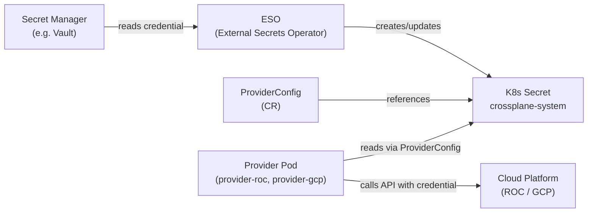
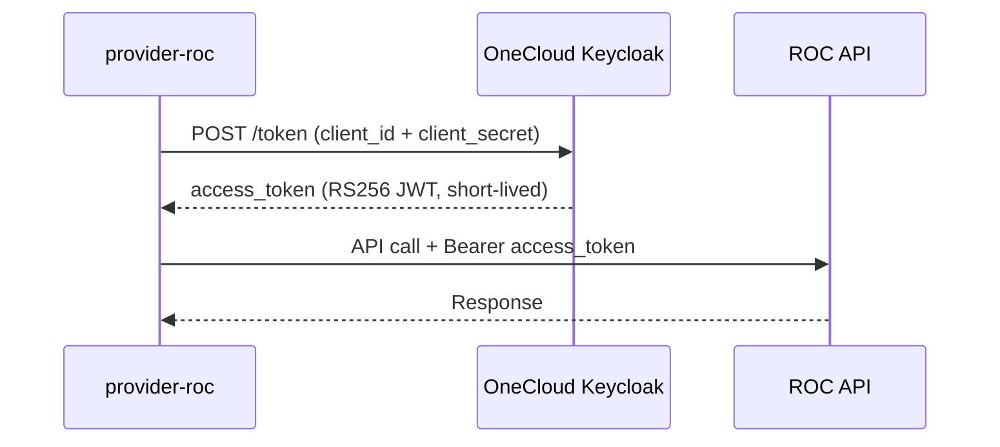

# Credential Management for UCP

---

## Summary

UCP's Crossplane provider pods need cloud credentials to call provider APIs (GCP, ROC). This document investigates how those credentials should be stored, accessed, and secured across the full chain from secret store to provider pod — and whether a dedicated secret manager (Vault) is justified given UCP's threat model and roadmap.

**Recommendation:** Skip Vault for MVP. Use WIF for GCP (no credentials stored) and OAuth2 Client Credentials Flow for ROC (store `client_id` + `client_secret` as K8s Secrets with encryption at rest via KMS). Revisit Vault if multi-cluster credential management becomes operationally painful at scale.

---

## Problem

Crossplane provider pods need credentials to call cloud APIs. The naive approach is storing long-lived tokens in K8s Secrets, but this introduces several concerns:

- K8s Secrets are base64-encoded — readable by anyone with `kubectl get secret` and cluster access
- Long-lived tokens have a large blast radius if leaked
- Credentials need to be synced to all Ops clusters as sharding is introduced
- Secret rotation requires coordination across clusters

---

## Why It Matters

As UCP scales to multiple Ops clusters (via consistent hashing sharding), credentials must exist on every cluster where a tenant has resources. The operational burden of managing, rotating, and auditing credentials across N clusters grows proportionally. The choice of credential mechanism determines how complex this becomes.

---

## How Credentials Flow Today (Reference Architecture)



**Key limitation:** K8s Secrets are the exposure point. Anyone with `kubectl get secret -n crossplane-system` and sufficient RBAC can read the plaintext credential. ESO and Vault add operational value but do not eliminate this exposure.

---

## Findings

### K8s Secrets — Base64, Not Encrypted

K8s Secrets are base64-encoded at rest in etcd by default. Base64 is not encryption — it is encoding. Any cluster admin with API access reads the plaintext value.

### Encryption at Rest (KMS)

K8s supports encrypting secrets in etcd via an external KMS (e.g. GCP Cloud KMS). The API server transparently encrypts before writing to etcd and decrypts before serving to callers.

```
ESO writes K8s Secret (plaintext)
  → K8s API server encrypts with KMS key
  → stores encrypted blob in etcd

Provider reads K8s Secret
  → K8s API server decrypts
  → returns plaintext to provider
```

Neither ESO nor the provider knows about encryption — it is fully transparent. Protection: raw etcd access (e.g. backup compromise) exposes only encrypted blobs. K8s API access with correct RBAC still returns plaintext.

**On GKE:** Application-layer secrets encryption is a single toggle pointing at Cloud KMS. Minimal overhead.
**On CaaS:** Depends on whether CaaS supports `--encryption-provider-config` on the API server. Needs confirmation.

### Vault — What It Actually Adds

Vault provides:
- Audit trail per secret access (who read which secret, when)
- Centralized lifecycle management across multiple clusters
- Fine-grained access policies per service account per cluster
- Dynamic secrets and TTL-based credentials

Vault does **not** prevent a cluster admin from reading the K8s Secret once ESO has synced it. The K8s Secret remains the exposure point.

Vault adds operational value for **audit and rotation at scale**. At MVP scale with few clusters and a small team, its value is limited relative to the operational overhead of running a 3-node Raft HA deployment.

### WIF for GCP — No Credentials Stored

With Workload Identity Federation, the provider pod's Kubernetes ServiceAccount identity is federated to GCP IAM. No credentials are stored anywhere — the pod authenticates by presenting its OIDC token, which GCP validates against the registered WIF provider.

```
Provider pod → presents K8s ServiceAccount OIDC token
  → GCP validates token against WIF provider
  → issues short-lived GCP access token
  → provider calls GCP API
```

This eliminates the credential storage problem entirely for GCP. See [Workload Identity Federation (WIF) on GCP](workload-identity-federation-gcp.md) for the full investigation and PoC findings.

### OAuth2 Client Credentials Flow for ROC

ROC authentication via OneCloud Keycloak supports the OAuth2 Client Credentials Flow. Instead of storing a long-lived API token, UCP stores `client_id` + `client_secret` and exchanges them for short-lived access tokens at call time.



**Implementation in provider-roc:** The provider reads `client_id` + `client_secret` from a K8s Secret via ProviderConfig, calls Keycloak at startup and on token expiry, caches the access token in memory, and uses it for all ROC API calls. This is analogous to how upjet-gcp handles GCP credentials via the `SetupFn` pattern.

**Security improvement over long-lived tokens:**
- If `client_secret` is leaked → rotate it → attacker can no longer get new tokens
- Existing access tokens expire naturally (short TTL)
- Blast radius is significantly smaller than a long-lived API token

### ProviderConfig Cannot Point to Secret Manager Directly

Crossplane's ProviderConfig `spec.credentials` supports: `Secret`, `Environment`, `Filesystem`, `InjectedIdentity` (WIF). It does not support pointing directly to Vault, GCP Secret Manager, or other external stores.

The K8s Secret intermediary exists because Crossplane treats K8s as the API. ESO is the intentional bridge layer.

**Exception:** For provider-roc (custom-built by the UCP team), a direct GCP Secret Manager reference can be implemented in the provider code. The provider pod's WIF identity can read from GCP Secret Manager without creating a K8s Secret at all.

An alternative for upstream providers is the **Secrets Store CSI Driver** — mounts secrets directly into pods as files from external stores. ProviderConfig `source: Filesystem` reads from the mounted file. No K8s Secret is created. More secure but adds operational complexity.

### Multi-Cluster Credential Distribution

As Ops clusters are added via sharding, each cluster where a tenant has resources needs:
- A K8s Secret in `crossplane-system` with the tenant's credentials
- A ProviderConfig referencing that secret

Two strategies:

**Eager (pre-create on all clusters):** When a tenant registers credentials, create ExternalSecret + ProviderConfig on all active Ops clusters immediately. ESO on each cluster syncs from the secret store automatically. Simple, no provisioning workflow complexity.

**Lazy (create on demand):** `ApplyYAMLActivity` in the Temporal provisioning workflow checks whether ProviderConfig exists on the target cluster, creates it if not. More resource-efficient but adds provisioning workflow complexity and introduces race conditions if two requests for the same tenant hit a new cluster simultaneously.

Eager is recommended. The overhead of syncing credentials to all clusters is minimal.

---

## Options

| Option | Credential stored | Security | Operational overhead | Recommended? |
|---|---|---|---|---|
| Long-lived API token in K8s Secret | Yes (token) | Low — readable by cluster admin | Low | No |
| K8s Secret + KMS encryption at rest | Yes (token) | Medium — etcd encrypted, API still readable | Low (GKE: checkbox) | As baseline |
| Vault + ESO + K8s Secret | Yes (token) | Medium — same as above + audit trail | High — 3-node HA, cross-cluster auth | Deferred |
| WIF (GCP) | No | High — no credentials | Low | Yes (GCP) |
| OAuth2 Client Credentials (ROC) | Yes (client_id + secret) | Medium-High — short-lived tokens, rotatable | Low | Yes (ROC) |
| Secrets Store CSI Driver | No K8s Secret | High — never in K8s | Medium | Future consideration |

---

## Recommendation

**MVP:**

1. **GCP:** WIF — no credentials stored. See [WIF research doc](workload-identity-federation-gcp.md). Pending CCoE GP 106 allowlist.
2. **ROC:** OAuth2 Client Credentials Flow implemented in provider-roc. Store `client_id` + `client_secret` as K8s Secret in `crossplane-system`.
3. **K8s Secrets encryption at rest:** Enable via KMS. On GKE: Cloud KMS application-layer encryption (checkbox). On CaaS: confirm support with CaaS team.
4. **Strict RBAC on `crossplane-system` namespace:** Only provider ServiceAccounts can read credential secrets.
5. **Skip Vault for MVP.** Operational overhead is not justified at initial scale.

**Multi-cluster (when sharding is introduced):**
- Use eager ProviderConfig creation: when tenant registers credentials, create ExternalSecret + ProviderConfig on all active Ops clusters.
- Each new Ops cluster provisioning must include ESO installation and KMS configuration as a required step.

**Future:**
- Revisit Vault if cross-cluster credential audit becomes a compliance requirement.
- Evaluate Secrets Store CSI Driver to eliminate K8s Secret intermediary entirely once Crossplane CSI support matures.

---

## Open Questions

| Question | Status |
|---|---|
| Does CaaS support `--encryption-provider-config` for K8s Secrets encryption at rest? | Open — CaaS meeting agenda item |
| ROC client credentials flow — what is the access token TTL in production? | Open |
| Can provider-roc read directly from GCP Secret Manager via WIF identity without K8s Secret? | Open — requires implementation investigation |

---

## References

- [Workload Identity Federation (WIF) on GCP — UCP Research](workload-identity-federation-gcp.md)
- [RFC 6749 — OAuth 2.0 Client Credentials Grant](https://www.rfc-editor.org/rfc/rfc6749#section-4.4)
- [Kubernetes — Encrypting Secret Data at Rest](https://kubernetes.io/docs/tasks/administer-cluster/encrypt-data/)
- [External Secrets Operator Documentation](https://external-secrets.io/latest/)
- [Crossplane ProviderConfig Credentials Sources](https://docs.crossplane.io/latest/concepts/providers/#authentication)
- [Secrets Store CSI Driver](https://secrets-store-csi-driver.sigs.k8s.io/)
- [Manage Kubernetes Secrets with Crossplane and External Secrets (HiredScore Engineering)](https://medium.com/hiredscore-engineering/manage-kubernetes-secrets-with-crossplane-and-external-secrets-1423302c92fd)
