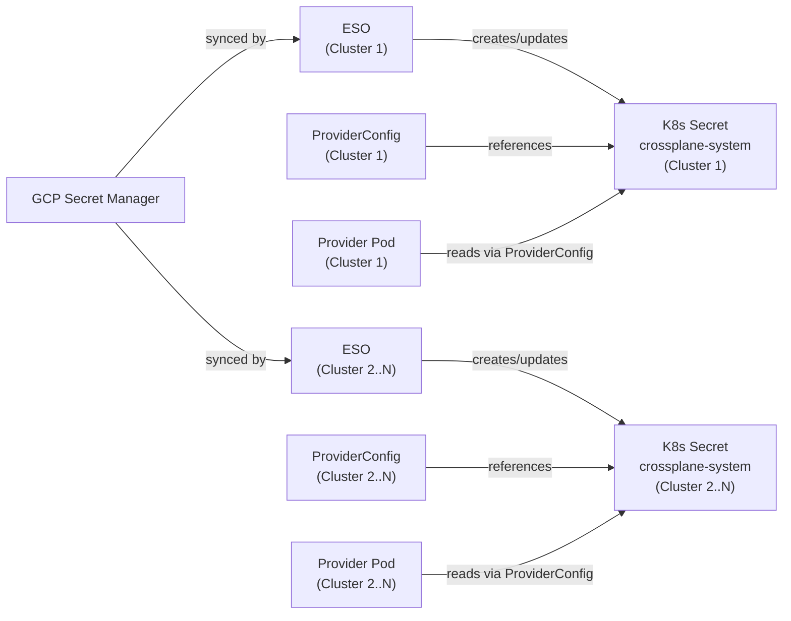
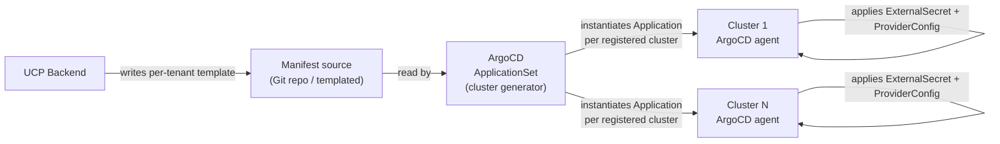
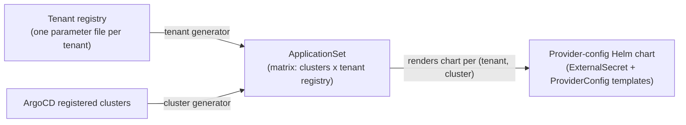
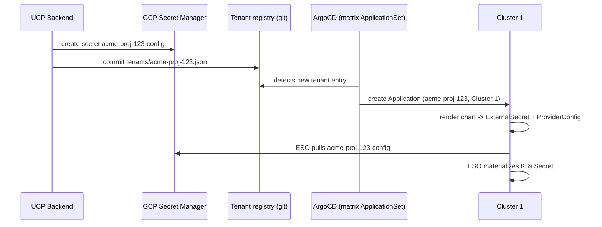

# Multi-Cluster ProviderConfig Sync via GCP Secret Manager

| | |
|---|---|
| **Ticket** | [MCUCP-306](https://jira.rakuten-it.com/jira/browse/MCUCP-306) |
| **Related research** | [Credential Management for UCP](credential-management.md) |

---

## Summary

UCP runs Crossplane on more than one cluster over time, starting from a single cluster. Each cluster's Crossplane provider pods need a `ProviderConfig` and the K8s `Secret` it references to authenticate to a cloud provider. This document investigates how to keep those objects synchronized across a growing, changing set of clusters using **GCP Secret Manager** as the source of truth and **ESO (External Secrets Operator)** as the in-cluster sync bridge.

This is a distribution problem, not a credential-format problem — the credential-format decisions (WIF for GCP, OAuth2 client credentials for ROC) are already made in [Credential Management for UCP](credential-management.md) and are treated as input here, not re-derived.

---

## Problem

A `ProviderConfig` and the `Secret` it references are cluster-local objects: a Crossplane provider pod only reads from the cluster it runs on, so there is no cross-cluster lookup. As UCP adds Crossplane clusters, the same tenant's `ProviderConfig` + `Secret` pair must exist independently on every cluster where that tenant's resources are reconciled.

UCP starts with one Crossplane cluster and expects to add more over time. The distribution mechanism must not require a redesign at the point a second cluster is added — the same mechanism that works for one cluster must extend to N.

What is stored per provider:

| Provider | Auth mechanism | What the Secret holds |
|---|---|---|
| GCP | Workload Identity Federation (WIF) | GCP service account email + GCP project ID — no credential material, since the provider pod authenticates via its own K8s ServiceAccount OIDC token |
| ROC | OAuth2 / long-lived token | A long-lived ROC API token |

---

## Why It Matters

GCP Secret Manager removes payload duplication — the credential material is written once and rotated once — but it does not remove the need for something to reach every cluster's API server and create the `ExternalSecret` + `ProviderConfig` pair. That fan-out problem exists independently of the secret store choice, and UCP's cluster count is expected to grow from one, so the mechanism chosen must extend to new clusters without a redesign.

---

## Reference Architecture



Each cluster runs its own ESO instance pointed at the same GCP Secret Manager project. GCP Secret Manager is the single write path; every cluster's ESO is an independent read path. This means the sync fan-out (going from 1 to N clusters) is a question of **which clusters have an ESO `ExternalSecret` + `ProviderConfig` pointed at a given tenant's secret**, not a question of replicating the secret value itself — GCP Secret Manager is already global to the sync problem.

---

## Findings

### GCP Secret Manager as source of truth, not per-cluster storage

UCP runs a single GCP Secret Manager instance shared across all secrets — both UCP-owned secrets (e.g. database credentials) and every tenant's `ProviderConfig`-bound secret. Because it is a single regional/multi-regional store outside any cluster, adding a cluster does not require copying secret material anywhere. Adding a cluster only requires:
1. ESO installed and configured on the new cluster, pointed at the same GCP Secret Manager project (via WIF — the ESO pod itself needs a WIF-bound identity with `secretmanager.versions.access` on the relevant secrets).
2. An `ExternalSecret` object per tenant created on the new cluster, so ESO knows to pull that tenant's secret.
3. A `ProviderConfig` object per tenant created on the new cluster, referencing the resulting K8s `Secret`.

Steps 2 and 3 are what must be "synchronized" across clusters — GCP Secret Manager itself does not need per-cluster replication logic.

### What "synchronization" actually means here

There are two independent questions, both scoped by MCUCP-306:

**When does the `ExternalSecret` + `ProviderConfig` pair get created for a (tenant, cluster) combination?**

- **Eager:** created for all active clusters at the moment a tenant registers credentials.
- **Lazy:** created for a specific cluster only when that cluster is about to host a resource for that tenant, checked by the provisioning workflow.

**How does the set of (tenant, cluster) pairs stay correct as clusters are added or removed?**

This is a fan-out mechanism, not a secret-storage mechanism — see [Options](#options).

Starting from one cluster does not remove the need to decide this: even with a single cluster, the mechanism chosen for "how does a (tenant, cluster) pair get created" is exactly what runs again when a second cluster appears. A self-healing mechanism handles the second cluster showing up for free; a purely imperative one requires a dedicated backfill path built before it is needed.

### ESO components relevant to multi-cluster fan-out

- `ClusterSecretStore` (cluster-scoped) vs `SecretStore` (namespace-scoped) — determines whether one GCP Secret Manager connection config serves all tenant namespaces on a cluster or must be duplicated per namespace.
- `ExternalSecret` — one per tenant per cluster, references the `ClusterSecretStore`/`SecretStore` and a GCP Secret Manager secret name, and materializes the K8s `Secret` that `ProviderConfig` points to.
- ESO's own GCP Secret Manager access must be scoped tightly — ESO's WIF identity should only read the secrets it is authorized to sync, not the whole project.

---

## Options

Two mechanisms can keep the (tenant, cluster) set of `ExternalSecret` + `ProviderConfig` pairs correct as clusters and tenants are added or removed:

### GitOps pull (ArgoCD `ApplicationSet` cluster generator, or Rancher Fleet)

Manifests for `ExternalSecret` + `ProviderConfig` are generated per tenant from a template and applied by a GitOps controller running per cluster, rather than by UCP backend calling each cluster's API server directly. ArgoCD's `ApplicationSet` cluster generator instantiates one `Application` per registered cluster from a single template; Fleet does the same via `GitRepo` + `targetCustomizations`.



- Cluster add/remove is native — registering a cluster with ArgoCD/Fleet's cluster list is the only action needed; existing templates apply to it automatically, with no new UCP backend code path.
- UCP backend's responsibility shrinks to one manifest per tenant, not one per (tenant, cluster) — the cluster fan-out is the GitOps tool's job.
- Drift detection and per-cluster sync status are built into ArgoCD/Fleet's dashboards.
- Introduces a new trust boundary: the GitOps controller (or its hub instance) holds broad write access across every Ops cluster's `crossplane-system` namespace.
- `ExternalSecret` and `ProviderConfig` contain no credential material — only references — so storing their templates in Git carries no secret-exposure risk.

### Custom reconciler via Temporal

UCP backend keeps a direct push model, but wraps it in a reconcile loop instead of a one-shot imperative action per event. Desired state is tenant registry × active-cluster inventory; actual state is queried from each cluster (or tracked in UCP's own database). The loop runs on a schedule or on inventory change, and applies whatever is missing.

- Cluster add/remove is handled by adding/removing a row in the active-cluster inventory — the next reconcile pass diffs against it and backfills automatically.
- Reuses UCP's existing Temporal provisioning infrastructure (`ApplyYAMLActivity`) — no new infrastructure component to operate.
- No new trust boundary — UCP backend already needs direct API-server access to every cluster's `crossplane-system` namespace regardless of mechanism.
- The reconcile-diff logic, retries, and drift visibility have to be built from scratch; ArgoCD/Fleet provide this for free.

### Comparison

| | GitOps pull (ArgoCD/Fleet) | Custom reconciler (Temporal) |
|---|---|---|
| New infra to operate | Yes, unless already running one | No — reuses existing Temporal |
| Cluster add/remove handling | Native, zero new code | Requires building the reconcile-diff logic |
| Drift visibility | Built-in dashboards | Must be built |
| New trust boundary | Yes — GitOps controller gets broad multi-cluster write access | No — same access UCP backend already needs |
| Fit with UCP backend owning tenant lifecycle | GitOps tool becomes an intermediary | Direct — same codebase owns the whole flow |

ArgoCD is already planned as UCP's deployment tooling independent of this problem, which changes the "new infra to operate" trade-off in the GitOps option's favor — the cost is templating and cluster-registration wiring on top of an already-planned system, not standing up a new one.

---

## GitOps Pull Mechanics (ArgoCD)

The terms in this section are ArgoCD-specific — other GitOps tools have analogous concepts under different names (Rancher Fleet: `Cluster`/`ClusterGroup`, `GitRepo`+`targetCustomizations`, `Bundle`).

- **Cluster registration** — ArgoCD deploys to a target cluster only after that cluster's API server address and credentials are registered as a `Secret` in ArgoCD's own namespace, labeled `argocd.argoproj.io/secret-type: cluster`. This registered-cluster list is what an `ApplicationSet`'s cluster generator reads from.
- **`ApplicationSet`** — a CRD that expands one or more *generators* into many `Application` objects from a single template. An `Application` is ArgoCD's unit of "sync this manifest source to this destination cluster/namespace."
- **`matrix` generator** — combines two (or more) generators into their cross-product, producing one `Application` per combination instead of per single generator output. For this problem: cluster generator × a generator over the tenant registry → one `Application` per (provider-config registration, cluster) pair.

### Where the manifest content actually lives

The generators only produce *identity and parameters* (which clusters exist; which provider-config registrations exist, and each one's `secret_manager_secret_name`/project ID). The `ExternalSecret`+`ProviderConfig` shape itself lives once, as a single reusable Helm chart, parameterized by those values — not duplicated per registration.

The registry entry is keyed per **provider-config registration**, not per tenant — a tenant can register more than one (e.g. multiple GCP projects, per the [multi-project-gcp](../pocs/multi-project-gcp.md) PoC, or both GCP and ROC). Each registration gets its own file, its own Secret Manager entry, and its own rendered `ProviderConfig`, so a resource can select which registration to provision against:

```
tenants/acme-proj-123.json   -> {"tenant": "acme", "gcp_project_id": "proj-123", "secret_manager_secret_name": "acme-proj-123-config"}
tenants/acme-proj-456.json   -> {"tenant": "acme", "gcp_project_id": "proj-456", "secret_manager_secret_name": "acme-proj-456-config"}
```

Adding a registration means adding one parameter entry to the registry, not writing a new manifest.



### Lifecycle walkthrough

**Platform bootstrap (once, before any tenant exists):** register Cluster 1 with ArgoCD; install ESO + a `ClusterSecretStore` on Cluster 1 (via its own cluster-generator-only `ApplicationSet`, separate from the tenant one); create the provider-config Helm chart repo; create an empty tenant registry; create the matrix `ApplicationSet` pointed at both. With zero tenants in the registry, it renders zero `Application` objects.

**Tenant onboarded in UCP, no cloud provider registered yet:** no effect on this pipeline — nothing is written to the tenant registry until the tenant actually submits provider credentials, since there is no secret to sync yet.

**Tenant registers a GCP project:** two writes, to two different places — the credential payload to GCP Secret Manager, and a small parameter file (no credential material) to the tenant registry.



**A second cluster is added:** register Cluster 2 with ArgoCD; the platform `ApplicationSet` installs ESO + `ClusterSecretStore` there. The tenant matrix `ApplicationSet` re-evaluates automatically — cluster generator now yields `[Cluster 1, Cluster 2]` — and backfills an `Application` for every tenant already in the registry onto Cluster 2, with no new commits and no new UCP backend action.

### Scale Considerations

The matrix `ApplicationSet` reconciles the entire (registration × cluster) set on every pass, not just changed entries — the controller re-renders every combination and diffs it against existing `Application` objects each time. Reconcile cost therefore scales with total registration count times cluster count, not with how many changed since the last pass.

UCP is an internal IDP, not a customer-facing platform, so the registration count is bounded by the number of onboarded tenants and their provider-config registrations — an order of magnitude lower than a consumer-facing system. This makes the scale ceiling unlikely to matter in practice, but the mitigations exist if it ever does: sharding the matrix into several `ApplicationSet`s (e.g. by cluster group), switching from polling to webhook-triggered refresh, and scaling ArgoCD's `application-controller`/`repo-server` replicas (ArgoCD's own HA guidance covers sharding for large `Application` counts). Actual reconcile latency at representative scale is something the PoC should measure rather than assume.

### Terminology mapping

| Concept | ArgoCD | Rancher Fleet |
|---|---|---|
| Register a target cluster | Cluster `Secret` | `Cluster` / `ClusterGroup` |
| Fan a template to many clusters | `ApplicationSet` (cluster generator) | `GitRepo` + `targetCustomizations` |
| Unit of "sync this to that cluster" | `Application` | `Bundle` |

---

## Open Questions

| Question | Status |
|---|---|
| Eager vs. lazy `ExternalSecret`/`ProviderConfig` creation per tenant per cluster — which fits UCP's tenant/cluster scale? | Open — PoC to validate |
| GitOps pull (ArgoCD `ApplicationSet`) vs. custom Temporal reconciler for cluster-membership fan-out — which mechanism to build? | Resolved — GitOps pull via ArgoCD matrix `ApplicationSet` confirmed end-to-end in the [PoC](../pocs/multi-cluster-provider-config-sync/poc-report.md); a newly added cluster backfills existing registrations with no new commit and no UCP backend code path |
| Should UCP backend write tenant-registry entries via a Git provider API directly, or only ever commit to Git and rely on ArgoCD's poll/webhook to pick it up? The former is more responsive but couples UCP backend to the Git provider's API; the latter is more idiomatically GitOps but adds sync latency to tenant onboarding | Open |
| Cluster onboarding runbook — how does a newly provisioned Ops cluster get registered with ArgoCD's cluster list, and is that automated or a manual platform step? | Open |
| Matrix `ApplicationSet` reconcile latency at representative registration × cluster scale | Open — low priority, UCP's registration count is bounded by an internal-IDP tenant base rather than a customer-facing one; measure in PoC if convenient, not a blocker |
| `ClusterSecretStore` vs. per-namespace `SecretStore` — which fits UCP's tenant-namespace isolation model? | Open |
| Cleanup semantics when a cluster is decommissioned vs. simply removed from an active-cluster list | Resolved — the matrix `ApplicationSet` controller [auto-deletes its own `Application` objects](../pocs/multi-cluster-provider-config-sync/poc-report.md) for a deregistered cluster within one reconcile pass; a cluster deregistered but still running keeps its already-applied resources unmanaged, since ArgoCD no longer has credentials to reach it — a runbook is only needed for that specific case |
| GCP Secret Manager IAM scoping per-cluster ESO identity — one project-wide role vs. per-secret conditional IAM | Open |
| Naming/labeling convention for tenant secrets in the shared UCP Secret Manager instance (which also holds UCP-owned secrets, e.g. DB credentials), to keep IAM scoping simple | Open |

---

## Related PoCs

- [Multi-Cluster ProviderConfig Sync](../pocs/multi-cluster-provider-config-sync.md) — validates the GCP Secret Manager → ESO → K8s Secret → ProviderConfig sync path across multiple clusters

---

## References

- [Credential Management for UCP — Secret Store, ProviderConfig, and ESO](credential-management.md)
- [Crossplane ProviderConfig Credentials Sources](https://docs.crossplane.io/latest/concepts/providers/#authentication)
- [External Secrets Operator — ClusterSecretStore](https://external-secrets.io/latest/api/clustersecretstore/)
- [External Secrets Operator — GCP Secret Manager provider](https://external-secrets.io/latest/provider/google-secrets-manager/)
- [GCP Secret Manager — IAM permissions reference](https://cloud.google.com/secret-manager/docs/access-control)
- [ArgoCD ApplicationSet — Cluster Generator](https://argo-cd.readthedocs.io/en/stable/operator-manual/applicationset/Generators-Cluster/)
- [ArgoCD ApplicationSet — Matrix Generator](https://argo-cd.readthedocs.io/en/stable/operator-manual/applicationset/Generators-Matrix/)
- [ArgoCD ApplicationSet — Git Generator](https://argo-cd.readthedocs.io/en/stable/operator-manual/applicationset/Generators-Git/)
- [ArgoCD — Cluster Management (registering clusters)](https://argo-cd.readthedocs.io/en/stable/operator-manual/declarative-setup/#clusters)
- [ArgoCD — High Availability and Scaling](https://argo-cd.readthedocs.io/en/stable/operator-manual/high_availability/)
- [Rancher Fleet — Multi-Cluster GitOps](https://fleet.rancher.io/)
- [MCUCP-306 — Feasibility study for Crossplane provider config over multiple clusters](https://jira.rakuten-it.com/jira/browse/MCUCP-306)
