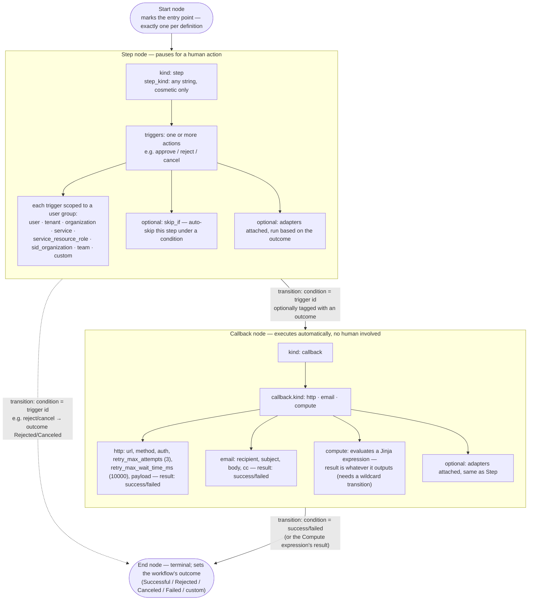
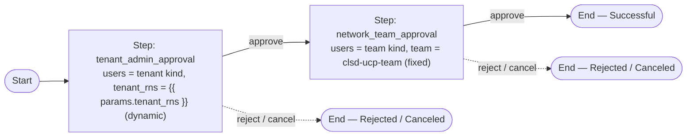
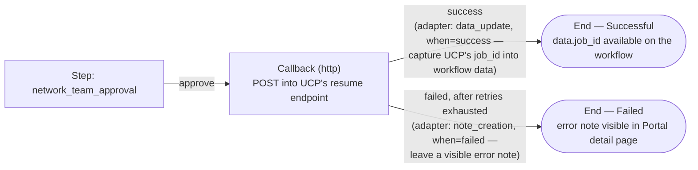

# OneCloud Horizon Workflow Service as UCP's Approval Gate — Feasibility Research

**Ticket:** [MCUCP-304](https://jira.rakuten-it.com/jira/browse/MCUCP-304) — Feasibility study for Horizon workflow service

## Summary

UCP needs an approval gate: when a tenant submits a provisioning request, or drift is detected on a managed resource, an approval step should sit between the request and the actual provisioning/reconciliation action. UCP shipped Sprint 1 with **no gate at all** (an explicit, tracked decision), and UCP's own QA Test Strategy already models the eventual gate as an **"Approval activity" inside UCP's Temporal workflow** (Provision workflow → PolicyCheck activity → Approval activity → Crossplane XR apply).

Horizon Workflow is OneCloud's existing WaaS platform, already used by several -aaS platforms (CaaS, DBaaS, Redis-aaS, BMaaS, LBaaS, Billing) for exactly this shape of gate: a provisioning-style request pauses for admin approval before the underlying resource action proceeds. There is a **directly reusable integration blueprint** for this — the CoreData "Tenant Creation Flow" — where the requesting service creates a Horizon Workflow instance, the workflow pauses for approval, and on approval a **callback** fires back into the requesting service's own API to resume the real action. This is architecturally the same shape UCP would need: Temporal's Approval activity would create a Horizon Workflow instance, wait, and be resumed via a callback that Horizon Workflow's engine calls after approval/rejection.

**It is feasible, and this is no longer just inference from other teams' usage** — a hands-on PoC (see Related PoCs) built a real two-layer approval Kind in the QA environment and confirmed, end to end: self-service Kind/definition registration with no Workflow-team involvement; a first approval layer whose approver group resolves dynamically from the request's own tenant parameter (proven against the real list of a tenant's admins, not just the operator); a second, independent layer scoped to a fixed Team; clean rejection short-circuiting that never instantiates the second layer; and — critically — that a workflow created this way is genuinely visible and actionable through the `/jobs` API once published as a production workflow, the same resource that backs the OneCloud Portal's own Approvals/My Requests tabs. That last point directly answers whether UCP could drive approvals from its own interface (e.g. a CLI) instead of requiring a Portal login: yes, since UCP already shares the same Keycloak IdP as OneCloud, a UCP CLI can call `GET /jobs` and `POST /jobs/{id}/{action}` directly with a bearer token from that shared login. The resume-callback mechanism itself (Part B of the PoC) was deferred rather than tested — see the dedicated Callback/Adapter section below for what it would involve if picked back up.

The remaining open work is integration-shaped, not conceptual: registering UCP as a Workflow tenant for real, defining Workflow Kinds for "provisioning approval" and "drift-reconciliation approval," deciding whether the resume side is a callback into UCP or driven by UCP's own polling/CLI against `/jobs`, and confirming UCP's tenant model maps cleanly onto the built-in `tenant` user group kind (see Open Questions).

## Problem

Should UCP's Approval activity (the gate between "request submitted" and "provisioning/reconciliation executes") be implemented by delegating to Horizon Workflow, or built natively inside UCP (Temporal signals + UCP's own Postgres + a UCP-built approver UI)? This requires understanding: how Horizon Workflow's existing approval-gate integrations actually work end-to-end, what the OneCloud Portal "Approvals" UI (visible in the Workflow Dashboard) shows and who can use it, and what integration cost/constraints an adopting service takes on.

## Why it matters

This directly unblocks the deferred "Approval Policies PRD" that UCP's Sprint 1 decision explicitly punted on ([Decision — No approval gate on provisioning for Sprint 1](https://confluence.rakuten-it.com/confluence/pages/viewpage.action?pageId=6846254194)). UCP's QA Test Strategy has already committed to testing an "Approval activity" (approve → continues, reject → stops cleanly, timeout → cancels) as a Phase 1 foundation feature — so this decision has a real deadline pressure, not just a nice-to-have evaluation.

## Findings

### Confirmed by hands-on testing, not just by reading other teams' usage

The [Horizon Workflow Approval Gate PoC](../pocs/horizon-workflow-approval-gate.md) built a real Workflow Kind (`ucp_poc_vm_creation_approval`) in the QA environment and ran it as both a test workflow and a real production workflow, across approve, reject, and (by structural inference) cancel outcomes. Confirmed directly, with real API responses as evidence (full detail in the PoC's `implementation.md`):

- A step's approver group can resolve dynamically from the request's own parameter (`{"kind": "tenant", "tenant_rns": "{{ params.tenant_rns }}", "role": "admins"}`) — proven against the real, full list of a tenant's admins (seven real people), not just the operator's own identity.
- A second, independent step can resolve against a fixed Team (`{"kind": "team", "team": "...", "role": "admins"}`) regardless of which tenant submitted the request — i.e. a genuine multi-level approval chain (e.g. submitting tenant's admin, then a separate network/platform team) works as designed.
- Rejecting at the first layer means the second layer's step object is **never instantiated** — not merely inaccessible — confirmed by its total absence from the workflow's state history.
- Production and test workflows behave identically for this logic; the only differences are publishing (required for production) and which API surface drives them (`test-workflows` vs. `/jobs`).
- A production workflow created this way is genuinely visible via `GET /jobs?approver=<email>` / `?created_by=<email>` while open — the same query surface that returned the operator's own real, pre-existing approvals from other services, confirming `/jobs` is the actual API backing the Portal's Approvals tab. A workflow only seems to drop out of that listing once it reaches a terminal state, consistent with the Portal's own default "in-progress" filter, not with a visibility defect.
- Two real operational gotchas surfaced that matter for any integration: `process` (test workflows) is only valid immediately after creation or when there's an automated node to advance through — calling it again after a trigger returns `400 WF0050`; and every `execution_status` read immediately after an action can transiently show `processing` before settling into `waiting`/`completed`, since the transition itself resolves asynchronously server-side — a real integration must poll until stable, not trust one read.

### The Workflow definition model: nodes, transitions, and what each can do

A Workflow definition is a state machine: a set of **nodes** connected by **transitions**. Every node kind and its options, confirmed against the live OpenAPI spec ([Workflow 2.39.0 - Reference](https://confluence.rakuten-it.com/confluence/pages/viewpage.action?pageId=6881495342)) and against [Workflow 2.39.0 - Explanation](https://confluence.rakuten-it.com/confluence/pages/viewpage.action?pageId=6881495339):



The exact shape the PoC built and proved (see Related PoCs) is a direct instance of this model — two chained Step nodes, no Callback:



A definition can chain any number of Step and Callback nodes in any order before reaching End — the Billing "Edit Flavor Pricing" definition (from [Operation HOR-15764](https://confluence.rakuten-it.com/confluence/pages/viewpage.action?pageId=6082700412)) chains four Step nodes before a single Callback back into Billing's own API; the PoC proved two Step nodes with no Callback at all (Part A) is equally valid, since a Callback is optional, not a required terminator.

### Approver scoping is dynamic, not hardcoded to named users

The tutorial [Workflow 2.39.0 - Tutorial](https://confluence.rakuten-it.com/confluence/pages/viewpage.action?pageId=6881495341) walks through exactly the scoping UCP needs. A step's `users` list accepts a **Tenant** user group kind:

```json
{
  "kind": "tenant",
  "tenant_rns": "{{ params.tenant_rns }}",
  "role": "admins"
}
```

`tenant_rns` is a Jinja expression evaluated against the workflow's own parameters at runtime — so a single Workflow Kind definition can resolve "admins of whichever tenant submitted this request" dynamically, without hardcoding a team per tenant the way the Tenant Creation Flow's static ROC/MAPS team mapping does. `role` defaults to `"admins"`. This is the direct mechanism for "someone with tenant-admin role from the same tenant that created the request can approve it."

The caveat is scope: "tenant" and "admins" here are Horizon/OneCloud's own IAM concepts (Tenant Management), not UCP's. This resolves cleanly **if** each UCP tenant corresponds 1:1 to an OneCloud tenant RNS and UCP's `tenant-admin` role is granted to the same users as that OneCloud tenant's `admins` role. If UCP's tenant/RBAC model is independent of OneCloud IAM (its own Postgres-backed tenant table, not synced to Core Data), the built-in Tenant kind won't resolve the right people. The platform's fallback for that case is a **custom user group kind** ([Workflow 2.39.0 - Explanation](https://confluence.rakuten-it.com/confluence/pages/viewpage.action?pageId=6881495339), "Custom user group kinds" section): a tenant-defined method for Workflow to fetch a list of users, which could point back at a UCP-owned endpoint that resolves "admins of tenant X" from UCP's own data. Other predefined kinds exist too — Organisation, Service, Service resource role, SID organisation, Team — none of which is a closer match than Tenant for this use case, but Service resource role (scoped to a `service_rns` + `resource_rns` + `role`) is worth keeping in mind if UCP registers per-resource approval scopes rather than per-tenant ones later.

### Callback and adapter nodes: how the state machine reaches out and remembers things

These two node/component kinds are what would carry Part B (the resume mechanism) if it's picked back up, and they're worth understanding as a pair since they solve two different problems in the same flow — callbacks reach *out* of the workflow, adapters mutate the workflow's *own* data — per the confirmed schema in [Workflow 2.39.0 - Reference](https://confluence.rakuten-it.com/confluence/pages/viewpage.action?pageId=6881495342) ("Callback kinds" / "Adapters kinds" sections):

**Callback nodes** are a node type on their own (`"kind": "callback"`) — they sit in the state machine like a Step node, but instead of waiting for a human, they execute automatically and their *result* (`success`/`failed`, or something more specific for one kind) is what the outgoing transitions branch on. Three kinds exist:

- **HTTP request** — the one this research's whole integration pattern is built on (the Tenant Creation Flow's callback into Billing/CoreData, the Billing pricing workflow's callback into Billing's own API). Configurable `url`/`method`/`headers`/`query_parameters`/`payload` (all Jinja-templated against the workflow's own data), `auth` (`oauth2_client_credentials` or an `rsession`/JWT-bearer flow using the tenant's own service account secrets), and retry controls (`retry_max_attempts`, default 3; `retry_max_wait_time_ms`, default 10000ms; `retry_extra_retryable_methods` — `POST` must be explicitly added here to be retried, confirmed in the Tenant Creation Flow's own decision log). Result is `success`/`failed`, with `output_contains` controlling whether the full HTTP response or just the body is captured for later use.
- **Email** — sends an email (`recipient`/`subject`/`body`/`cc`, Jinja-templated). Result is `success`/`failed`, same as HTTP.
- **Compute** — doesn't call anything external; it evaluates a Jinja expression (`result`) and branches on whatever that expression outputs (e.g. `{{ data.warnings | length > 0 }}` → `True`/`False`). Because the result isn't a fixed enum, a Compute node's outgoing transitions must include a wildcard transition so there's always a match. This is the mechanism for conditional branching *inside* the state machine without an external call — e.g. "if the drift diff is below some threshold, skip the second approval layer" could be modeled as a Compute node feeding a conditional transition, without needing UCP's API at all for that decision.

**Adapters** are not node types — they're optional components *attached* to a node (any kind, including Step nodes), and they run based on that node's outcome via a shared `when` property (a single result like `"success"`, or a list). Where callbacks affect the outside world, adapters affect the workflow's own internal data/notes:

- **Update data** (`data_update`) — extracts fields from a preceding node's output via JSONPath (`{"warnings": "$.output.warnings"}`) and stores them in the workflow's `data`, making them available to later Jinja expressions (`{{ data.warnings }}`) — including in a *later* callback's own `payload`, or in a UI customisation card. This is the mechanism the docs describe for chaining "make an HTTP call → extract a field from the response → use that field to decide who approves the next step."
- **Create note** (`note_creation`) — attaches an info/warning/error-level message (Jinja-templated, with optional tags) to the workflow, visible in the Portal detail page. Useful for surfacing e.g. "the callback failed on attempt 2/3, retrying" without changing the state machine's actual path.
- **Remove notes** (`notes_removal`) — clears notes matching Kubernetes-`LabelSelectorRequirement`-style matchers (by level, node, or tag).

**How they tie into the whole workflow**, concretely for a UCP-shaped integration: a Callback (HTTP) node fires after the last approval step and calls back into UCP; a `data_update` adapter on that callback node (`when: "success"`) could capture whatever UCP's endpoint returns (e.g. a provisioning job ID) into the workflow's `data`; a subsequent transition or a UI card could then reference `{{ data.job_id }}`; and if the callback instead fails after exhausting retries, a `note_creation` adapter (`when: "failed"`) could leave a visible error note without silently dead-ending the workflow:



None of this was exercised in the PoC (Part B is deferred), but it's the concrete shape Part B would take if picked back up.

### Idempotency of the resume callback

Whichever of the two provisioning-side options gets chosen — Temporal activity blocks on a signal, or the callback directly writes deployment status and starts a separate provisioning workflow — the callback API itself needs to be idempotent regardless, since Horizon Workflow's callback nodes retry on failure by design (3 retries by default, configurable per node; `POST` must be explicitly added to `retry_extra_retryable_methods` to be retried, per the [Tenant Creation Flow](https://confluence.rakuten-it.com/confluence/pages/viewpage.action?pageId=6534579570) decision log). The platform also supports manually **resetting a production workflow to a prior state and reprocessing an action** ([How-to guides](https://confluence.rakuten-it.com/confluence/pages/viewpage.action?pageId=6882888886), "How to retry an action from a failed workflow") — an operational path that can replay the same callback a second time. Both are platform-level reasons the callback must tolerate at-least-once delivery: keying off the workflow instance ID (or a request ID passed through as a workflow parameter) to detect and no-op a duplicate resume is necessary either way, not just a nice-to-have.

### The exact integration pattern already exists in production: Tenant Creation Flow

[Tenant Creation Flow](https://confluence.rakuten-it.com/confluence/pages/viewpage.action?pageId=6534579570) documents, with a full sequence diagram, precisely the "submit request → gate on approval → resume and execute" shape UCP needs:

```
Portal → CoreData: POST /tenants/request
CoreData → Workflow: POST /tenants/:rns/kinds/:kind/versions/:id/workflows   (create workflow instance)
Workflow: waits for billing account admin approval
Workflow → Billing: POST .../core_data_create_tenant/approve      (callback fired on approval)
Billing → Workflow: success
Workflow → CoreData: POST /tenants                                 (resume — actually create the tenant)
Workflow → CoreData: POST /tenants/:rns/subscriptions
Workflow → CoreData: PUT .../access/roles/:role
```

The requesting service (CoreData) does not poll — it creates the workflow and returns immediately. The **actual provisioning action only happens after Workflow calls back** into the requester's own API once a human approves. Retries for the callback are configurable in the Workflow definition (3 retries by default; `POST` must be explicitly added to `retry_extra_retryable_methods`). Approvers for this specific flow are defined as **teams** (`rns:roc:iam:::teams:tam` for ROC tenants, a MAPS-specific team for MAPS tenants) — i.e. approval is scoped to a durable group, not individual named users, consistent with the "user groups" model in the platform's core docs.

This is the concrete template for a UCP integration: UCP's Temporal Approval activity would (1) call Workflow's creation API to open an approval request, (2) the activity blocks/waits (a Temporal activity can wait on a signal), (3) Horizon Workflow's callback node — after a human approves or rejects — calls a UCP-owned endpoint, which (4) sends the Temporal signal that resumes the workflow toward provisioning or a clean stop.

### The approval gate pattern is already in wide production use across other -aaS platforms

[Guide to Workflow Types: Overview, Processes and Approvals](https://confluence.rakuten-it.com/confluence/pages/viewpage.action?pageId=5110023427) is a maintained catalog of every Workflow Kind in production. Directly comparable "provisioning request → admin approval → resource action" gates already exist for:

| Service | Workflow Kind | Shape |
|---|---|---|
| CaaS | Request Namespace, Allocate Dedicated Nodes, Namespace Pod/LB/Resources/Object Quota, Delete Namespace | Resource provisioning/quota change gated by approval |
| DBaaS | DBaaS Server Provisioning | Cluster provisioning gated by admin approval |
| Redis-aaS | Redis Create Cluster, Redis Migrate Cluster | Cluster creation/migration gated by admin approval |
| BMaaS | Request Servers, Switch ACL | Bare-metal allocation gated by approval |
| LBaaS | Change Quotas | Quota increase gated by approval |
| CICD-aaS | Create/Update Jenkins Project | Onboarding gated by approval |

This is strong evidence the platform is designed for, and battle-tested on, exactly UCP's use case (resource provisioning gates), not just administrative/billing approvals. It is not yet a catalog of *drift-reconciliation* approval gates specifically — no existing Workflow Kind in this catalog matches "an already-provisioned resource drifted, gate the reconciliation action" — that would likely be a new pattern for UCP to define, though structurally no different from a provisioning-request kind (same node/transition/callback model, different trigger).

### What the OneCloud Portal "Approvals" UI actually is

Per the [Workflow 2.39.0 - Explanation](https://confluence.rakuten-it.com/confluence/pages/viewpage.action?pageId=6881495339) documentation, the screen in your screenshot is the **Workflow Dashboard**, and it lists production workflow instances a user can act on because they are the requester, a viewer-group member, or a member of a user group with permission to act at the current step (ABAC). It is a platform-wide, cross-tenant surface — every service's pending approvals show up in the same dashboard, distinguished by the `Type` column (e.g. "Tenant Creation," "CaaS Request Namespace" in your screenshot). This means UCP would **not** need to build its own approver-facing UI — approvers would see UCP's approval requests in the same dashboard they already use for CaaS/Billing/etc., as long as UCP registers Workflow Kinds and configures the right approver user groups. Whether that's desirable (consistency with the rest of OneCloud) or a constraint (no ability to customize the approval UI beyond the [documented UI customisation components](https://confluence.rakuten-it.com/confluence/display/CLDCPS/Workflow+2.39.0+-+Reference#ui-customisation-components)) is a product decision, not a technical blocker.

### Integration mechanics for a new adopting service

Concretely, onboarding UCP as a Workflow tenant/consumer would require ([2. Grant Workflow Service Roles](https://confluence.rakuten-it.com/confluence/pages/viewpage.action?pageId=6859627666), [7. Update your workflow creation API call](https://confluence.rakuten-it.com/confluence/pages/viewpage.action?pageId=6857878512)):

1. A service account (Keycloak or tenant service account) granted the Workflow `creator` role (to create workflow instances) — via OneCloud Tenant Management, not via Workflow directly.
2. One or more Workflow Kinds registered under UCP's tenant RNS (e.g. `ucp_provisioning_approval`, and potentially a separate `ucp_drift_reconciliation_approval`), each with a definition draft (state machine: Start → Step [approval] → Callback [resume UCP] → End) that is tested, then published.
3. UCP's Temporal Approval activity calling `POST /workflow-sapi/2/tenants/{tenant_rns}/kinds/{kind}/versions/{version}/workflows` (the current WaaS endpoint — not the deprecated legacy `/jobs` endpoint) with the provisioning/drift request's parameters as payload, using a service-account bearer token.
4. A UCP-owned callback endpoint that Horizon Workflow's callback node calls on approval/rejection, which signals the waiting Temporal activity.
5. Deciding the approver **user group** — e.g. a `tenant-admin` team per UCP tenant, mirroring how CoreData scoped Tenant Creation approvers to a durable team rather than named users.

Test workflows (RBAC-based, don't appear in the dashboard, don't send notifications) would let UCP validate a Workflow Kind definition before publishing it to production — useful for a dry run of the whole gate before it's user-facing.

### Who actually calls the API: creation vs. list/act are not symmetric

These two halves of the integration have different callers, and it matters for how UCP wires this up:

**Creating a workflow instance is not something the requesting end user does directly.** The `creator` role (required for `POST /tenants/{tenant_rns}/kinds/{kind}/versions/{version}/workflows`) is granted per-tenant, scoped to the tenant that *owns the Kind* — i.e. UCP's own tenant, not whichever tenant the requesting user belongs to. So the caller of that endpoint has to be a principal within UCP's own tenant — in practice, **UCP's own service account** — not an arbitrary user from tenant XYZ. This exactly mirrors the Tenant Creation Flow precedent: CoreData's own service account calls the create-workflow endpoint; the actual requesting tenant/user is passed as **data**, via `payload.tenant_rns` (what the dynamic `tenant_admin_approval` group resolves against) and an `owner` field (`{"email": "<string>"}`, confirmed against the live OpenAPI spec's `OwnershipDelegationPayload` schema) that records the real requesting user as the workflow's requester instead of the service account. The concrete end-to-end flow:

```
UCP user → UCP: submits provisioning request (UCP's own auth)
UCP (service account, `creator` role on UCP's tenant) → Horizon Workflow:
    POST /tenants/{ucp_tenant_rns}/kinds/{kind}/versions/{version}/workflows
    { "payload": { "tenant_rns": "<requesting user's tenant RNS>", ... },
      "owner": { "email": "<requesting user's email>" } }
Horizon Workflow: resolves tenant_admin_approval's approver group dynamically from payload.tenant_rns
Horizon Workflow: sends a notification email to the resolved tenant admins automatically (mandatory, not configurable off)
```

**Listing and acting on a workflow is ABAC, keyed to the caller's own identity — not routed through UCP's service account at all.** `GET /jobs` and `POST /jobs/{workflow_id}/{action}` are checked against whether the *caller* (via their own bearer token) is the requester, a viewer-group member, or a member of a user group with permission at the current step. This means the requesting tenant's admins, or the fixed approver Team, call these endpoints directly with **their own** bearer token from the shared Keycloak realm — confirmed empirically in the PoC across two different real users (one created a workflow, a different one viewed/acted on it via `approver=` filtering, without going through the creator's credentials at all).

One nuance on "their own bearer token": it only works if that token's `aud`/`scope` includes `rns:roc:workflow` — which depends on how the token was requested (client/scope), not automatic for every OneCloud-issued token. A token minted via the `rns:roc:portal` client during this research carried it; whether UCP's own OIDC client is configured the same way is a one-line check against UCP's client config, not yet confirmed either way.

### Testing environment and who to consult

A full QA environment exists, separate from production, with its own Swagger UI, Redoc, and Keycloak realm ([Workflow 2.39.0 - Reference](https://confluence.rakuten-it.com/confluence/pages/viewpage.action?pageId=6881495342) — Environments table; QA API base is `qa-horizon-workflow-api.r-local.net`, QA portal is `qa-portal-onecloud.rakuten-it.com`). **Test workflows** are the intended mechanism for trying out a new Workflow Kind before it's real: they use RBAC instead of ABAC, support **impersonation** (so you can simulate "approve as a specific user" without that user actually having the role yet), don't send notifications, and don't appear in the shared dashboard. The recommended flow ([How-to guides](https://confluence.rakuten-it.com/confluence/pages/viewpage.action?pageId=6882888886), "How to efficiently create a definition") is: build the simplest possible state machine first (start → end), create a test workflow, then iteratively add nodes one at a time, resetting and reprocessing the test workflow after each change, before finally publishing.

Onboarding a **brand-new** Workflow Kind (UCP's case — no pre-existing legacy workflow to move) is self-service end to end, per the platform's own [Migration Guide](https://confluence.rakuten-it.com/confluence/pages/viewpage.action?pageId=6859627659) phase table: subscribe the tenant to the Workflow service via OneCloud Portal/Tenant Management, grant the workflow service roles to a service account (also via Tenant Management), then register the Kind and author/test/publish the definition via the Workflow API/tutorial — no request to the Workflow team is required at any of these steps. The only step in that guide requiring the Workflow team is **"Request a workflow kind transfer"**, which is explicitly marked conditional and only applies to services migrating a **pre-existing legacy** Workflow kind into their own tenant — not applicable to UCP, which would be creating a new Kind from scratch.

That said, the **Workflow Core Team** ([Workflow Stakeholders List](https://confluence.rakuten-it.com/confluence/pages/viewpage.action?pageId=5985737056)), part of the Horizon Process Solutions Team (Cloud Management Department), is worth reaching out to for a design sanity-check before committing to a Kind definition — particularly to resolve the tenant-mapping open question above:

| Name | Role | Email |
|---|---|---|
| Soeren Medard | Architect, Backend Tech Lead | soeren.medard@rakuten.com |
| Melle Dumas | Product Manager (Product Owner) | mellechristian.dumas@rakuten.com |
| Alexandre Perez | Frontend Tech Lead | alexandre.perez@rakuten.com |
| Jonalyn Valencia | Backend Engineer | jonalyn.valencia@rakuten.com |

The [Workflow 2.39.0 - User Documentation](https://confluence.rakuten-it.com/confluence/pages/viewpage.action?pageId=6882369151) page has a "Contact us" section as the official channel for this kind of ad-hoc question.

### Constraints and open risks carried over from the platform-level research

These still apply and matter for a governance-critical gate like this:

- **Notifications are mandatory and not configurable off** — every production workflow sends email at creation, at reaching a step, and at completion. This is a platform behavior UCP would inherit, not something to design from scratch, but also not something UCP can suppress if it's undesirable for high-frequency drift-reconciliation approvals.
- **Fingerprinting** could be directly useful for drift reconciliation: it can block duplicate active approval requests for the same resource (e.g. one fingerprint per `tenant_rns + resource_id`), preventing duplicate reconciliation approvals from piling up if drift is detected repeatedly before the first request is resolved.
- **Maturity gaps** in the platform itself (from the [Maturity Assessment Report](https://confluence.rakuten-it.com/confluence/pages/viewpage.action?pageId=6499814686)): Security & Compliance is the weakest area (2.5/5 — partial scan enforcement, limited pen-testing) and Continuous Improvement is reactive rather than SLO-driven. Given UCP's Approval activity is meant to be a governance/safety gate, this is worth weighing against building the same primitive natively where UCP controls its own security posture end-to-end.
- **Release coupling risk is real and documented**, not hypothetical: the Billing "Edit Flavor Pricing" rollout ([Operation HOR-15764](https://confluence.rakuten-it.com/confluence/pages/viewpage.action?pageId=6082700412)) was explicitly tied to a specific Workflow release version, and a slip on either side could have delayed the feature. A UCP integration would carry the same kind of cross-team release dependency on the Workflow team's roadmap.
- **No quantitative usage baseline exists** for the platform (active users, call frequency are explicitly "not measured" in the API review doc) — so there's no data on how the platform performs under load patterns resembling UCP's (potentially higher-frequency, more automated resource-lifecycle events vs. the largely human-initiated administrative approvals it's used for today).

### Clarifying the "JTBD Coverage Matrix" reference

An earlier pass of this research cited a "JTBD Coverage Matrix" as if it were Horizon-Workflow-specific feasibility work. Having now read it directly, it is **not**: [RFB → Horizon Product Suite: JTBD Coverage Matrix](https://confluence.rakuten-it.com/confluence/pages/viewpage.action?pageId=6648346233) is a different team's gap analysis comparing a B2B partner-onboarding platform (RFB) against Horizon's **Core Data/IAM** layer (tenants, subscriptions, client hierarchies) — it explicitly states Workflow (WaaS) has "no dedicated specification ingested yet" and treats it only as an open question (whether WaaS can support an application-approval queue). It is tangential background, not evidence bearing on UCP's approval-gate feasibility, and is not cited further in this document.

## Options

Two integration architectures for UCP's Approval activity, based purely on what this research found — this is a decision to discuss explicitly before it's written anywhere as settled, per the team's technical-decision workflow:

1. **Delegate to Horizon Workflow** (per the Tenant Creation Flow blueprint): Temporal's Approval activity creates a Horizon Workflow instance and waits for a callback to resume. Approvers act through the existing, shared OneCloud Portal "Approvals" dashboard — no new UI to build, and UCP inherits a proven ABAC/user-group model. Cost: cross-team dependency on the Workflow team's roadmap/releases, inherited notification behavior, and the platform's current security/compliance maturity gaps.
2. **Build the approval gate natively in UCP**: Temporal already supports pausing on a signal; UCP could implement its own approval-request table, its own notification path, and its own minimal approver UI (or CLI) scoped to UCP's RBAC model, without any external dependency. Cost: UCP owns building and maintaining everything the platform would otherwise provide for free (notifications, dashboard, user-group management, versioned definitions), and duplicates a fair amount of what other -aaS platforms already get "for free" from Horizon Workflow.

## Open questions

- **Does UCP want approvers to act through the shared OneCloud Portal dashboard, through UCP's own interface calling `/jobs` directly, or both?** The PoC confirmed both are technically viable (same underlying API); this is now a product decision, not a feasibility question — a hybrid (Horizon Workflow as backend, UCP builds a thin CLI/UI against `/jobs`) is also on the table now that `/jobs` is confirmed to be a normal, callable REST resource rather than something the Portal has exclusive access to.
- No existing Workflow Kind in the catalog models "drift detected → reconciliation approval" — this would be a new pattern for UCP to define, not a like-for-like reuse. The PoC's two-sequential-step chain (with clean short-circuit on rejection) is a proven building block for this, but a drift-specific trigger shape hasn't itself been tried.
- What is the expected volume/frequency of drift-detection approval requests? The platform has no published capacity data, and drift reconciliation could be far higher-frequency and more automation-driven than the largely-human-initiated administrative approvals the platform serves today.
- If Part B (the resume callback) gets picked back up: exact mechanics of "resuming a paused Temporal activity from an external HTTP callback" need a technical spike for how the callback maps to a Temporal signal — this wasn't found documented anywhere in Confluence and is UCP-side design work either way. The PoC's design doc also flags that callback reachability itself (whether Workflow's backend can reach any endpoint UCP stands up) is unconfirmed — every real callback URL found in this research is an internal `r-local.net` service, not a public one.
- Should UCP register one Workflow Kind or two (provisioning approval vs. drift-reconciliation approval)? The existing catalog suggests one Kind per distinct operation, mirroring how CaaS has separate Kinds per quota/resource type rather than one generic "CaaS approval" Kind.
- Does UCP's tenant model map 1:1 onto OneCloud/Horizon tenant RNS, with UCP's `tenant-admin` role granted to the same users as that tenant's Horizon `admins` role? The PoC's own tenant (`clsd-ucp`) is already a real OneCloud tenant, so its clean resolution doesn't generalize to UCP's actual multi-tenant case. If UCP's tenant model is independent, UCP needs a custom user group kind (an HTTP-based resolver pointing back at UCP's own tenant data) rather than the built-in Tenant kind — this changes the integration shape and should be confirmed with the Workflow Core Team before designing the real Kind definition.

## Related PoCs

- [Horizon Workflow Approval Gate](../pocs/horizon-workflow-approval-gate.md) — **Complete.** Self-service Kind registration, parameter-driven tenant-admin approver resolution, a fixed-Team second layer, and `/jobs`-based production-workflow visibility, all confirmed against the QA environment with real evidence. The resume callback (Part B) is deferred, not attempted. See its [PoC Report](../pocs/horizon-workflow-approval-gate/poc-report.md) for the verdict.

## References

- [Tenant Creation Flow](https://confluence.rakuten-it.com/confluence/pages/viewpage.action?pageId=6534579570) — the direct integration blueprint: sequence diagram, endpoints, callback/retry design decisions
- [Guide to Workflow Types: Overview, Processes and Approvals](https://confluence.rakuten-it.com/confluence/pages/viewpage.action?pageId=5110023427) — catalog of existing production approval-gate Workflow Kinds across -aaS platforms
- [Workflow 2.39.0 - Explanation](https://confluence.rakuten-it.com/confluence/pages/viewpage.action?pageId=6881495339) — core product documentation: resource model, ABAC access, notifications, fingerprinting
- [2. Grant Workflow Service Roles](https://confluence.rakuten-it.com/confluence/pages/viewpage.action?pageId=6859627666) — onboarding/integration how-to for roles and service accounts
- [7. Update your workflow creation API call](https://confluence.rakuten-it.com/confluence/pages/viewpage.action?pageId=6857878512) — current (WaaS) vs. legacy workflow-creation endpoint contract
- [Review Horizon Workflow](https://confluence.rakuten-it.com/confluence/pages/viewpage.action?pageId=5869626757) — API catalog entry (tech stack, docs links, test coverage, compliance)
- [Operation HOR-15764: Create Horizon Workflow: Edit Pricing](https://confluence.rakuten-it.com/confluence/pages/viewpage.action?pageId=6082700412) — real production integration runbook; evidence of cross-team release coupling risk
- [Maturity report - Horizon Workflow](https://confluence.rakuten-it.com/confluence/pages/viewpage.action?pageId=6499814686) — maturity assessment; weakest areas are Security & Compliance and Continuous Improvement
- [Decision — No approval gate on provisioning for Sprint 1](https://confluence.rakuten-it.com/confluence/pages/viewpage.action?pageId=6846254194) — UCP's own record of why the gate was deferred out of Sprint 1
- [Draft-UCP QA Test Strategy — Phase 1](https://confluence.rakuten-it.com/confluence/pages/viewpage.action?pageId=6763053812) — confirms UCP already models Approval as a Temporal activity (approve/reject/timeout) in its own architecture
- [Workflow 2.39.0 - Tutorial](https://confluence.rakuten-it.com/confluence/pages/viewpage.action?pageId=6881495341) — hands-on walkthrough of building an approval Workflow, including the Tenant user group kind example
- [Workflow 2.39.0 - Reference](https://confluence.rakuten-it.com/confluence/pages/viewpage.action?pageId=6881495342) — API environments table, user group kinds schema, error codes
- [Workflow 2.39.0 - How-to guides](https://confluence.rakuten-it.com/confluence/pages/viewpage.action?pageId=6882888886) — definition-authoring workflow, retry/reset mechanics for production workflows
- [Workflow 2.39.0 - User Documentation](https://confluence.rakuten-it.com/confluence/pages/viewpage.action?pageId=6882369151) — documentation landing page with the "Contact us" onboarding channel
- [Workflow Stakeholders List](https://confluence.rakuten-it.com/confluence/pages/viewpage.action?pageId=5985737056) — Workflow Core Team contacts and per-service Workflow Owner mapping
- [Migration Guide](https://confluence.rakuten-it.com/confluence/pages/viewpage.action?pageId=6859627659) — phase-by-phase onboarding guide; clarifies which steps are self-service vs. require the Workflow team
- [RFB → Horizon Product Suite: JTBD Coverage Matrix](https://confluence.rakuten-it.com/confluence/pages/viewpage.action?pageId=6648346233) — read for completeness; confirmed tangential (Core Data/IAM gap analysis, not Workflow-specific)
