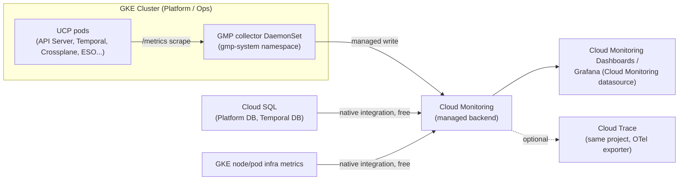
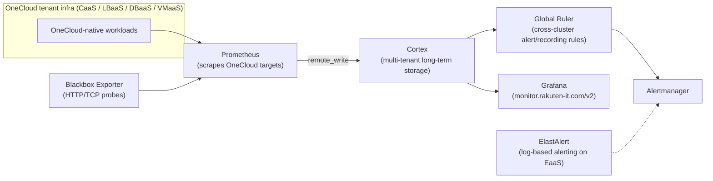
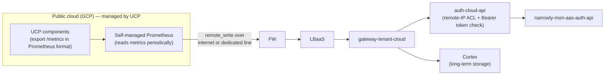

# Research — System Resource Monitoring

**Jira:** [MCUCP-259](https://jira.rakuten-it.com/jira/browse/MCUCP-259)
**Date:** 2026-08-31

## Summary

UCP needs a metrics platform that covers system resource monitoring (node/pod/container
CPU, memory, disk, network) and application metrics (custom counters, histograms, business
metrics) for every component it runs: the API Server, Temporal Server, Temporal Workers,
Crossplane core and its ten provider pods, Platform DB, Temporal DB, and the future Redis,
KEDA, and ESO components, across Dev, QA, Prod-Tokyo, and Prod-Osaka (DR).

Two platforms are compared: **GCP Cloud Monitoring** (with Google Managed Service for
Prometheus for Prometheus-format application metrics) and **MonaaS**, Rakuten OneCloud's
managed observability service. A third option, **self-hosted Prometheus + Grafana on GKE**,
is included as a baseline because it is the only alternative that avoids depending on either
managed platform, and because two other Rakuten teams have already evaluated and rejected it
for GCP-hosted workloads.

**Recommendation:** MonaaS, using the OTel Collector variant of its tenant-cloud bridge for
GKE resource metrics, Cloud SQL metrics, and application metrics. UCP's infrastructure runs
entirely on GCP today, but MonaaS keeps UCP's metrics collection pipeline cloud-agnostic and
directly reusable on any future cloud or OneCloud-native deployment, avoids deepening a
single-vendor dependency on GCP, and puts UCP's metrics on Rakuten's own internal monitoring
service rather than a third-party managed offering. This costs UCP three self-managed
components (`cert-manager`, `opentelemetry-operator`, the OTel Collector itself) — a
manageable addition for a platform team already running Crossplane and its ten providers —
and requires resolving a confirmed gap where Cloud SQL metrics collected through MonaaS's
`googlecloudmonitoringreceiver` carry no per-instance resource label, ahead of onboarding a
second Cloud SQL instance per site (Platform DB and Temporal DB, active/standby). See
Findings and Measured comparison for detail.

## Problem

### System resource monitoring and application metrics platform (MCUCP-259)

UCP needs a decision on:

1. **Metrics collection** — how system and application metrics are scraped/exported from
   every UCP component.
2. **Metrics platform** — where those metrics are stored, queried, and alerted on.
3. **User interface scope** — how engineers view metrics (e.g. Grafana card UI).

Tracing is out of scope for this decision but is noted as a pro wherever an option supports
it natively without extra integration cost.

## Why it matters

UCP is a control plane responsible for provisioning and reconciling infrastructure for
tenants. Its own components (API Server, Temporal, Crossplane providers) must be observable
to detect saturation, reconciliation backlogs, and Cloud SQL health before they cause
tenant-facing incidents. The chosen platform is a long-term operational dependency — it
determines who maintains the collection pipeline, what happens during scrape/query load
growth, and how much manual work is needed to add every new component (Redis, KEDA, ESO)
as UCP grows.

## Scope: components to monitor

All components run on GCP — GKE (Platform cluster + Ops cluster) and Cloud SQL — across Dev,
QA, Prod-Tokyo (primary), and Prod-Osaka (DR).

| Component | Type | Metrics needed |
|---|---|---|
| API Server | Go service, stateless | Request rate/latency/errors, resource usage |
| Temporal Server (Frontend, History, Matching, Internal Worker) | Go services | Per-service resource usage, workflow/task queue metrics |
| Temporal Workers (Provisioning, Drift) | Go workers | Task execution rate/latency/errors, resource usage |
| Crossplane Core + providers (roc-lbaas/vmaas/dbaas/staas/caas, upjet-gcp, gcp-sql/container/compute/storage) + Composition Functions | K8s controllers | Reconcile rate/errors/latency, resource usage per provider pod |
| Platform DB (Cloud SQL PostgreSQL) | Managed DB | CPU/memory/disk, connections, replication lag (Primary + Sync Standby) |
| Temporal DB (Cloud SQL PostgreSQL) | Managed DB | Same as above |
| Redis (deferred) | Managed/self-hosted cache | Resource usage, hit rate (when introduced) |
| KEDA (deferred Year 3-4) | K8s autoscaler | Scaler metrics, resource usage (when introduced) |
| ESO | K8s controller | Sync rate/errors, resource usage |
| GKE nodes (Platform + Ops clusters) | Infra | Node/pod CPU, memory, disk, network |

## APM and business-metric signals

System resource metrics (CPU/memory/disk/network) only show whether a component is
resourced correctly — they do not show whether UCP is doing its job. Each component needs
an additional layer of application-level metrics, and Crossplane in particular needs a
different monitoring model than a typical stateless service.

### Temporal Workers (Provisioning, Drift) — custom business metrics

Temporal Workers execute UCP's actual provisioning/drift-detection logic, so their signal is
entirely custom/business metrics, not framework-provided:

- Task/activity execution rate, latency, and error rate per workflow type (provisioning,
  drift detection).
- Retry count and reason (transient vs permanent failures), since retries indicate upstream
  provider instability (e.g. a OneCloud/GCP API being slow or rate-limited).
- Task queue backlog / poller count — Temporal Server exposes queue and scheduling metrics
  natively via its own Prometheus endpoint, which should be scraped alongside the worker's
  own custom metrics for a complete queue-health picture.
- Business outcome metrics — e.g. "managed resource provisioning duration" or "drift
  remediation count" — instrumented directly in the worker code and exported as Prometheus
  counters/histograms, then visualized on a custom dashboard. This instrumentation approach
  is the same regardless of which metrics platform is chosen (Cloud Monitoring/GMP or
  MonaaS) — only the collector endpoint differs.

### Crossplane — controller-level and resource-level signals

Crossplane is a set of Kubernetes controllers, so its monitoring model is different from a
typical service and needs two layers:

1. **Controller-level (reconcile health)** — Crossplane and its providers are built on
   `sigs.k8s.io/controller-runtime`, which exposes a standard set of Prometheus metrics for
   every controller: reconcile count and result (success/error) by controller, reconcile
   duration, and workqueue depth/retry count. These are scraped the same way as any other
   Prometheus-format `/metrics` endpoint (native GMP scrape for Option A, or a self-managed
   Prometheus scrape for Option B/C) and answer "is Crossplane keeping up, and is it
   failing?" for Core and every provider (roc-lbaas/vmaas/dbaas/staas/caas, upjet-gcp,
   gcp-sql/container/compute/storage) individually.
2. **Resource-level (managed resource health)** — controller-level metrics do not show
   *which* managed resources are unhealthy, only that reconciliation is happening. UCP
   additionally needs a signal for the proportion of Managed Resources (MRs) in `Ready` /
   `Synced` condition vs not, per resource type. This can come either from Crossplane's own
   resource-condition metrics or from generating custom-resource-state metrics from MR
   status conditions (e.g. with `kube-state-metrics`'s custom resource state feature) — the
   exact metric names depend on the Crossplane/provider versions UCP runs and need to be
   confirmed during implementation. This is an implementation detail, not a platform
   decision — both Cloud Monitoring/GMP and a self-managed Prometheus can scrape whichever
   exporter produces this signal.

### What to monitor for UCP as a whole

Beyond per-component metrics, UCP needs a small number of top-level signals that answer
"is UCP doing its job" without requiring an engineer to know which component is at fault:

| Signal | What it answers | Primary source |
|---|---|---|
| API availability & latency | Is the control plane API reachable and responsive? | API Server RED metrics |
| Provisioning success rate | Are tenant-requested resources being provisioned successfully? | Temporal workflow completion + Crossplane MR Ready ratio |
| Reconciliation backlog / lag | Is Crossplane keeping up with desired-state changes, or falling behind? | Controller-runtime workqueue depth + MR time-to-Ready |
| Drift remediation rate | Is drift being detected and corrected within SLA? | Drift worker business metrics |
| Platform/Temporal DB health | Is the control plane's own state store healthy? | Cloud SQL CPU/memory/connections/replication lag |

This follows the standard SRE "golden signals" model (latency, traffic, errors, saturation)
applied per component, plus a RED (rate/errors/duration) view for Crossplane's reconcile
loops, rolled up into the five UCP-wide signals above. These signals are the same regardless
of which metrics platform is chosen — the platform decision only affects how cheaply and
reliably they can be collected and queried, which is what the rest of this document compares.

## Findings

### Option A — GCP Cloud Monitoring + Google Managed Service for Prometheus (GMP)

**How it works**

- GKE and Cloud SQL system metrics (CPU, memory, disk, network, replication lag) are
  collected automatically through GCP's native monitoring integration — no collector to
  deploy, no cost beyond the managed service itself.
- Application/custom metrics are exposed in Prometheus format by each UCP component and
  scraped by the GMP collector, a managed DaemonSet (`gmp-operator`, `collector`,
  `rule-evaluator`) running in the `gmp-system` namespace. Google operates the storage,
  scaling, and upgrades of this pipeline.
- Query language is PromQL (Google deprecated MQL in favor of PromQL). PromQL queries
  against Cloud Monitoring require no separate Prometheus server.
- UI options: native Cloud Monitoring Dashboards, or Grafana using the official Cloud
  Monitoring datasource plugin (used by other Rakuten GCP teams, see below).
- Cloud Trace integrates natively in the same GCP project via OpenTelemetry exporters —
  usable later with no separate tracing backend to provision.

**Pros**

- GKE and Cloud SQL system metrics collected automatically at no extra cost — covers every
  UCP infra component (nodes, pods, both Cloud SQL instances) without any setup.
- Managed collector for application metrics: no Prometheus server to size, scale, or
  upgrade; horizontal scaling and long-term storage are handled by Google.
- 24-month retention included at no additional storage cost.
- PromQL compatible — same query language as self-hosted Prometheus, easing future
  portability of dashboards/alerts.
- Officially listed as a recommended tool for GCP system development in Rakuten's CCoE
  "Public Cloud (GCP) Quick Guide."
- Tracing (Cloud Trace) and profiling are same-project add-ons with no new infrastructure.
- Grafana can still be used as the UI via the Cloud Monitoring datasource plugin if a
  Grafana-first UI is preferred over native dashboards.

**Cons**

- Ingested sample volume and Read API queries are billable (see quantitative comparison).
- Some vendor lock-in to GCP's proprietary dashboard/alerting configuration format if native
  dashboards are used instead of Grafana.
- Native Cloud Monitoring dashboard customization is more limited than Grafana's.

**Trade-offs**

- Trades a small, predictable per-sample/per-query cost for zero operational burden on the
  collection and storage pipeline.
- Trades some dashboard customization flexibility (if using native dashboards) for tighter
  IAM integration and no separate Grafana hosting/maintenance cost — this is avoidable by
  choosing Grafana-with-Cloud-Monitoring-datasource instead.

### Option B — MonaaS (OneCloud Monitoring-as-a-Service)

**How it works — OneCloud-native workloads**

**How it works — external/public-cloud tenants (tenant-cloud bridge)**

MonaaS also provides a documented bridge for tenants running outside OneCloud, including
public cloud. This is the path UCP would use, since UCP has no OneCloud-native
infrastructure:

- UCP would still run its own Prometheus (or an OTel client) inside GKE to scrape every
  component's `/metrics` endpoint — MonaaS does not scrape targets outside OneCloud itself.
- That self-managed Prometheus `remote_write`s to a dedicated **tenant-cloud gateway**
  (`gateway-tenant-cloud`), fronted by a firewall and LBaaS, which authenticates the
  connection via a source-IP allowlist plus a Bearer token issued by a dedicated
  `narrowly-mon-aas-auth-api` before writing into Cortex.
- The connection can run over the public internet or an existing dedicated line between
  GCP and OneCloud, depending on what UCP already has provisioned; this is a per-onboarding
  choice confirmed with the MonaaS team during setup, not a self-service default.
- Onboarding is a manual, multi-team workflow, not Terraform/self-service:
  1. UCP requests onboarding; the MonaaS team confirms cloud provider, connection type
     (internet vs dedicated line), client IP range, client type (Prometheus or OTel), and
     target datasource.
  2. The MonaaS team adds the source IP, datasource, and connection info to an allowlist,
     and issues a Bearer token via `narrowly-mon-aas-auth-api`.
  3. The MonaaS team shares the destination domain, token, and a client setup example with
     UCP, and asks UCP to open its own ACL for the destination (port 443).
  4. If connecting via a dedicated line, an ACL request (source: UCP's client IP range,
     destination: from the MonaaS team) is routed through Rakuten's network team to open
     the line-level ACL before the client can connect. If connecting over the internet,
     the MonaaS team updates ACL rules on their LBaaS directly, with no network team step.
  5. UCP sets up its Prometheus/OTel client and runs a connection test before metrics start
     flowing into Cortex.
- GKE and Cloud SQL system metrics are still not natively collected through this bridge —
  MonaaS only receives whatever the self-managed Prometheus scrapes, so infra-level metrics
  (node/pod/Cloud SQL) still require the same exporters (e.g. `node-exporter`,
  `kube-state-metrics`, a Cloud SQL exporter) that a fully self-hosted Prometheus stack
  would need.
- No documented pricing was found for the dedicated-line path specifically; a dedicated line
  between GCP and OneCloud is a network-team-provisioned resource with its own cost,
  separate from MonaaS's per-sample/per-query pricing — this needs to be confirmed with the
  network team (see Open questions).
- No evidence of tracing support anywhere in the documented stack; ElastAlert is log-based
  alerting, not distributed tracing.

**Self-managed collector variant: OTel Collector instead of Prometheus**

The onboarding workflow above explicitly allows either a self-managed Prometheus **or an OTel
client** as the thing that `remote_write`s into `gateway-tenant-cloud`. The OTel Collector
consolidates several pieces a Prometheus-based setup runs as separate components, by using
built-in receivers instead of separate exporter binaries:

| Concern | Prometheus-based self-managed stack | OTel Collector-based self-managed stack |
|---|---|---|
| Node-level OS metrics | `node-exporter` DaemonSet (separate binary) | `hostmetricsreceiver`, built into the Collector — same DaemonSet deployment shape, one binary type instead of two |
| Container/pod resource metrics | Scrape kubelet's cAdvisor endpoint (config only, no extra binary) | `kubeletstatsreceiver` — same "no extra binary" outcome, built into the Collector |
| K8s object-state metrics | `kube-state-metrics` Deployment (separate binary) | `k8sclusterreceiver` — built into the Collector, removes the separate KSM deployment |
| Scrape-config engine + operator | Prometheus Operator + Prometheus server (two distinct components), each with their own CRDs/config | `opentelemetry-operator` + `OpenTelemetryCollector` CRD — one operator, one collector binary type across all roles |
| App-metric scrape config | `ServiceMonitor`/`PodMonitor` CRD | `prometheusreceiver` inside the Collector, driven by the same CRD-style Target Allocator config |
| Sending to MonaaS | `remote_write` from the Prometheus server | `prometheusremotewritexporter` from the Collector — identical wire protocol and auth (Bearer token, IP allowlist) |

This reduces the number of *distinct software components* UCP would operate — from roughly
four separate binaries/operators down to one collector binary type running in a couple of
deployment shapes (DaemonSet for host/kubelet metrics, a Deployment for cluster-level
metrics). It does not remove the facts that already drive Option B's Cons below: UCP still
owns the entire collector fleet, still needs a separate Cloud SQL metrics exporter (no OTel
receiver replaces this, since Cloud SQL is not a Kubernetes-native target), and still goes
through the same manual MonaaS onboarding process for connectivity. The specific receiver
names above are standard OTel Collector Contrib components; which of them MonaaS's onboarding
process actually supports or has tested has not been confirmed (see Open questions).

**Third variant: OTel SDK pushing directly to a MonaaS-managed OTel Collector**

Per an architecture diagram shared directly by the MonaaS team ("Deploy OTel Collector on
OneCloud"), MonaaS documents a distinct pattern for public-cloud tenants, separate from the
self-managed-Prometheus/self-managed-OTel-Collector bridge above: the application itself is
instrumented with the **OTel SDK** and pushes metrics (OTLP) directly — over the internet or
an existing dedicated line — through the same FW → LBaaS → `gateway-tenant-cloud` →
`auth-cloud-api` chain, into an **OTel Collector that runs on the OneCloud side, marked as a
new (not tenant-managed) component in that diagram**, which then writes into Cortex.

If this Collector is genuinely provisioned and operated by MonaaS end-to-end, this removes
the "who runs the collector" burden entirely for application-level metrics — UCP would own
only its app-level OTel SDK instrumentation, no collector infrastructure at all. Two things
materially change how large this benefit actually is and are not yet confirmed:

- **Dedicated vs. shared Collector, and who manages its lifecycle.** Whether each tenant gets
  a dedicated Collector instance that MonaaS provisions/scales/patches, or a shared instance,
  or something UCP would still need to request/configure, is not distinguishable from the
  diagram alone. Needs a direct question to the MonaaS team (see Open questions).
- **Scope of what this path covers.** The diagram only shows `APP + OTEL SDK` as the metric
  source — no host-metrics or Kubernetes-object-state component is depicted. This path
  appears to cover application/business metrics only; node/pod resource metrics and Cloud SQL
  metrics likely still require a separately-run exporter/collector (one of the self-managed
  variants above), since resource and cluster-state metrics are read from the node/API server,
  not something an application process can emit as its own instrumentation.

If confirmed as MonaaS-managed end-to-end, this would be the lowest-overhead path for
*application metrics specifically* across every option in this document, including Option A
(which is zero-overhead but still requires deploying a lightweight `PodMonitoring` CRD). It
does not change the resource-metrics comparison, since that gap is inherent to the metric
type, not to the collector.

This diagram also reveals that ADR-007's stated assumption — "MonaaS (Prometheus + Cortex)
scrapes this endpoint" (pull) — does not match how MonaaS actually integrates with a
public-cloud tenant like UCP: MonaaS never pulls from outside OneCloud in any of the three
documented patterns above (self-managed Prometheus, self-managed OTel Collector, or OTel SDK
push to a MonaaS-managed Collector) — all three are push-based from the tenant side. This is
independent of which application metrics library UCP uses.

`auth-cloud-api`'s check is on the *connecting* party's remote IP, which implies MonaaS's
gateway is architecturally designed to always be the receiving side of the connection. MonaaS
pulling from tenant infrastructure — the mirror image of this third variant — is therefore
architecturally unlikely, not just undocumented; it would also require opening an inbound path
from OneCloud into UCP's GCP VPC, a firewall/security change independent of whether it is even
supported. Separately, a self-managed Collector exporting via OTLP directly into MonaaS's
managed Collector, instead of `remote_write` into Cortex, is a standard Collector-to-Collector
OTLP chaining pattern and is architecturally plausible, but does not change anything about
UCP's own architecture either way — which MonaaS-side path the tenant's traffic lands on is
MonaaS's internal plumbing, invisible from UCP's side of the gateway.

**Holistic verdict — push is not recommended even if confirmed as MonaaS-managed
end-to-end.** Node/pod resource metrics and Cloud SQL metrics cannot be pushed from their
source under any architecture: there is no SDK a kernel, kubelet, or a managed database
instance can call out with, so both categories always need a local pull-based agent
(`node-exporter`/`hostmetricsreceiver`, a cAdvisor scrape, `kube-state-metrics`/
`k8sclusterreceiver`, a Cloud SQL exporter) regardless of which library or path application
metrics use. Because one of the self-managed Collector variants above is mandatory anyway for
resource and database metrics, switching only application metrics to OTel SDK push removes
just one scrape-target block from an already-necessary Collector — a marginal reduction, not an
elimination of collector infrastructure. It also introduces three real costs: an application
code migration off `prometheus/client_golang`, a push-model data-loss window (up to one push
interval — RFC-002's own library comparison documents this as roughly 15 seconds if the network
path or destination Collector is briefly unavailable; pull has no equivalent loss, since a
missed scrape is simply retried on the next interval), and a split collection architecture — two
different mechanisms (SDK push for app metrics, Collector pull for resource/DB metrics) instead
of one uniform pipeline. This document's conclusion is to keep application metrics on the pull
model — via whichever self-managed Collector variant is chosen — alongside resource and
database metrics, not to adopt this third variant, independent of whether MonaaS's Collector
turns out to be dedicated or shared.

**Pros**

- Free system metrics for onboarded OneCloud infrastructure (not applicable to UCP, which
  has none).
- Managed Cortex backend gives long-term, multi-tenant storage without UCP operating
  Prometheus storage directly.
- A documented tenant-cloud bridge exists for public-cloud tenants like UCP, with an
  authenticated (IP allowlist + Bearer token) gateway rather than an ad hoc integration.
- Grafana UI already provided (`monitor.rakuten-it.com/v2`), consistent with a Grafana-first
  UI if other Rakuten teams' dashboards are a reference point.
- Alerting (Alertmanager + Global Ruler) and HTTP/TCP probing (Blackbox Exporter) are
  included as platform features once metrics are in Cortex.
- A third documented pattern (OTel SDK push to a MonaaS-managed OTel Collector) exists for
  application metrics specifically, but this document does not recommend it (see Third
  variant) — resource and database metrics always require a self-managed Collector regardless,
  so the pattern only marginally reduces scope while adding a library migration, push-model
  data-loss risk, and a split collection architecture.

**Cons**

- UCP would still need to deploy and operate its own Prometheus or OTel Collector inside
  GKE to scrape every component — the tenant-cloud bridge removes the "where does it go"
  problem but not the "who runs the collector" problem; this is the same operational
  burden as Option C, just remote-written to a different backend. The OTel Collector variant
  reduces the *number* of distinct components (see above) but does not remove this burden
  category entirely.
- GKE and Cloud SQL system metrics are not natively collected — every infra metric needs a
  custom exporter, unlike GCP Cloud Monitoring's automatic collection.
- Onboarding is a manual, multi-team coordination process (MonaaS team, and the network
  team if using a dedicated line), not self-service — this adds lead time to any change in
  scope (new component, new environment, IP range change).
- Requires a OneCloud tenant dependency, ACL/allowlist maintenance, and (if using a
  dedicated line) a separate network-team-managed cost that is not yet quantified.
- **Confirmed risk:** Cloud SQL metrics collected through the OTel Collector variant's
  `googlecloudmonitoringreceiver` carry no per-instance resource label (no `database_id` or
  equivalent), unlike Option A's native Cloud Monitoring query path. With 2+ Cloud SQL
  instances per site (Platform DB and Temporal DB, each active/standby), this is a real
  disambiguation gap, not a theoretical one — confirmed hands-on in the [MonaaS OTel
  Collector PoC](../pocs/monaas-otel-collector/poc-report.md). Needs a fix (e.g. a static
  resource label injected per Collector instance) before a second same-type Cloud SQL
  instance is onboarded.
- No evidence of native tracing support anywhere in the documented stack.

**Trade-offs**

- Trades a lower per-sample metrics cost for a mandatory self-managed collector layer,
  cross-cloud ACL/token administration, and (potentially) a dedicated-line cost that GCP
  Cloud Monitoring does not require.
- The tenant-cloud bridge makes MonaaS *reachable* from GCP, but does not remove the need
  to build and operate the exact collector layer that a managed platform is meant to
  eliminate — the trade-off is the same as Option C with an added onboarding/ACL process
  and an additional network dependency.

### Option C — Self-hosted Prometheus + Grafana on GKE (baseline)

Included because it is the only alternative that avoids both managed platforms, and because
it has already been evaluated and rejected by other Rakuten GCP teams for reasons directly
relevant to UCP.

**Pros**

- Fully open-source, no vendor lock-in, complete control over retention and configuration.
- No per-sample or per-query billing.

**Cons**

- Single monolithic TSDB runs out of memory under moderate cardinality (documented case:
  OOM at 32Gi RAM) — horizontal scaling requires adding Thanos or Cortex, which is
  additional infrastructure to operate, not a reduction in scope.
- No built-in HA — a second Prometheus replica or Thanos sidecar is required for
  availability.
- Every version upgrade, scaling event, and storage expansion is a manual operational task.
- Ops cost has been observed to exceed infrastructure cost at scale in a real Rakuten GCP
  team's cost analysis (~$800/month for a self-hosted Grafana/Prometheus stack: compute,
  cluster management fee, persistent disk storage, cross-project egress, and Cloud
  Monitoring API read costs where Cloud Monitoring is also used as a datasource).
- Requires a separate tracing backend (e.g. Jaeger/Tempo) to be added later — no tracing
  included.

**Trade-offs**

- Trades the lowest direct billing cost for the highest operational maintenance burden,
  which historically converts into a comparable or higher total cost once engineering time
  is counted.

## Components to configure and manage

A side-by-side of every component involved in getting metrics from a UCP workload into each
platform's backend — this is the practical basis for comparing operational overhead, expanded
beyond the summary Cons lists above.

| Concern | Option A — Cloud Monitoring + GMP | Option B — MonaaS (self-managed Prometheus) | Option B — MonaaS (self-managed OTel Collector) | Option B — MonaaS (OTel SDK → managed Collector)* | Option C — Self-hosted Prometheus + Grafana |
|---|---|---|---|---|---|
| Node-level OS metrics | Automatic, zero components | `node-exporter` DaemonSet (deploy + maintain) | `hostmetricsreceiver` in Collector DaemonSet | Not covered by this path — still needs one of the self-managed variants | `node-exporter` DaemonSet |
| Container/pod resource metrics | Automatic, zero components | Scrape config targeting kubelet's cAdvisor endpoint (no extra binary) | `kubeletstatsreceiver` (no extra binary) | Not covered by this path | Scrape config targeting kubelet's cAdvisor endpoint |
| K8s object-state metrics | Automatic, zero components | `kube-state-metrics` Deployment | `k8sclusterreceiver` in Collector | Not covered by this path | `kube-state-metrics` Deployment |
| Cloud SQL metrics | Automatic, zero components | Custom Cloud SQL Prometheus exporter (Deployment) — exact tooling unconfirmed | Same requirement | Not covered by this path | Custom Cloud SQL Prometheus exporter (Deployment) |
| App-metric instrumentation/collection | `PodMonitoring`/`ClusterPodMonitoring` CRD (app keeps `/metrics`, pull) | `ServiceMonitor`/`PodMonitor` CRD (pull) | `prometheusreceiver` + Target Allocator (pull), same CRD-driven shape | App instrumented with OTel SDK, pushes OTLP directly — **zero collector components on the tenant side*** | `ServiceMonitor`/`PodMonitor` CRD (pull) |
| Config controller / operator | `gmp-operator` (Google-managed) | Prometheus Operator (self-managed) | `opentelemetry-operator` (self-managed), plus `cert-manager` as its webhook-cert prerequisite | None on tenant side* | Prometheus Operator (self-managed) |
| Collector/scraper binary | `collector` DaemonSet (Google-managed) | Prometheus server (self-managed) | OTel Collector (self-managed) | None on tenant side — Collector runs on MonaaS's OneCloud side* | Prometheus server (self-managed) |
| Rule evaluation | `rule-evaluator` (Google-managed) | Local `PrometheusRule` eval, or Cortex ruler — unconfirmed which | Same as Prometheus variant | Cortex ruler (MonaaS-side) — same as other Option B variants | Local `PrometheusRule` eval via Alertmanager |
| Sending metrics off-cluster | Not needed — same GCP project | `remote_write` config on Prometheus, plus onboarding token/ACL | `prometheusremotewritexporter` config on Collector, plus onboarding token/ACL | OTLP export config in-app, plus onboarding token/ACL | Not applicable — stored locally |
| Storage/query backend | Cloud Monitoring backend (Google-managed) | MonaaS Cortex (OneCloud-managed) | MonaaS Cortex (OneCloud-managed) | MonaaS Cortex (OneCloud-managed) | Self-run Prometheus TSDB (Thanos/Mimir if scaling beyond one node) |
| Dashboards | Cloud Monitoring Dashboards (Terraform/`gcloud`) | MonaaS Grafana | MonaaS Grafana | MonaaS Grafana | Self-hosted Grafana provisioning |
| Alerting UI | Cloud Monitoring Alert Policies (Terraform/`gcloud`) | Alertmanager + Global Ruler (MonaaS-managed) | Same as Prometheus variant | Same as other Option B variants | Self-hosted Alertmanager |
| Onboarding / connectivity | None — already in the same GCP project | Manual MonaaS ticket (ACL, token, possibly a billed dedicated line) | Same manual MonaaS ticket | Same manual MonaaS ticket | None — same cluster |
| Distinct self-managed software components (app metrics only) | 0 (GMP handles it) | ~2 (Operator, Prometheus server) | ~1 (Operator, Collector — receivers built in) | 0* | ~2 (Operator, Prometheus server) |
| Distinct self-managed software components (full scope incl. resource metrics) | 0 | ~4 (+ `node-exporter`, `kube-state-metrics`) + Cloud SQL exporter | 3, confirmed by the [MonaaS OTel Collector Variant PoC](../pocs/monaas-otel-collector.md) (`cert-manager`, `opentelemetry-operator`, Collector) + Cloud SQL exporter | Same as the self-managed OTel Collector variant, since resource metrics still need it | ~4 + Cloud SQL exporter + Grafana + Alertmanager |

\* Not yet confirmed with the MonaaS team — depends on whether the Collector shown in their
architecture diagram is genuinely provisioned/operated by MonaaS end-to-end (dedicated or
shared), or something UCP would still need to request/configure. Kept in this table for
completeness of the options considered; this document's conclusion is not to pursue this
variant regardless of the answer (see Third variant in Findings).

The last two rows are the closest proxy to "operational overhead" in component-count terms:
Option A requires zero self-managed components; Option C requires the most (it also
self-hosts the UI/alerting layer that MonaaS and Cloud Monitoring provide as a managed
service); Option B's Prometheus/OTel Collector variants sit in between. The OTel SDK →
managed-Collector column shows what the *application-metrics-only* component count would be if
pursued, but this document recommends against it (see Third variant) — resource metrics remain
a fixed cost across every Option B variant, which is the reason a zero-collector outcome for
application metrics alone is not, on its own, a reason to adopt push. Component count is a
proxy, not a substitute for hands-on measurement of actual setup/maintenance effort — see
[Related PoCs](../pocs/cloud-monitoring.md) for the objective comparison this table is meant
to be validated against.

## What other Rakuten teams do

| Team | Workload | Approach | Notes |
|---|---|---|---|
| DPD-GCP | GCP-hosted | On-prem Grafana + native GCP Cloud Monitoring / BigQuery / Cloud Logging as datasources (official Grafana plugins) | Explicitly considered and rejected "On-Prem Grafana with MonaaS/Prometheus as datasource" for their GCP workload; cited GCP's free 6-week full-resolution retention and avoided self-hosted Prometheus infra entirely |
| RAIL | GKE-hosted | Migrated from self-hosted GKE Prometheus to GCP Managed Service for Prometheus | Migration driven by reliability and operational-burden problems with the self-hosted setup; produced a before/after architecture and cost comparison favoring GMP |
| (Cross-team cost comparison) | GKE-hosted | Compared self-hosted Grafana/Prometheus (~$800/month) vs GCP Cloud Monitoring Dashboards (near-$0 beyond ingestion) | Cited GCP-native pros: multi-project Metrics Scope, built-in SLO/error-budget/uptime-check features, IAM-integrated security, native Logging/Trace/Profiler integration |
| TMS | OneCloud CaaS/LBaaS/DBaaS | Uses MonaaS as the metrics backend, federates select MonaaS data into their own AD Prometheus | Confirms MonaaS's documented scope is OneCloud-native infra only; no GKE/GCP metrics found in their platform's metric exposure table |

No Rakuten team survey result shows MonaaS being used as the primary metrics platform for a
GKE/GCP-hosted workload. Every GCP-hosted team surveyed either uses native GCP Cloud
Monitoring/GMP directly, or uses Grafana with GCP services as the datasource.

## Quantitative comparison

| Aspect | GCP Cloud Monitoring + GMP | MonaaS | Self-hosted Prometheus + Grafana |
|---|---|---|---|
| System metrics (GKE, Cloud SQL) | Free, automatic | Not natively collected — custom exporters required | Free, but self-managed exporters |
| Application metric ingestion | $0.06/M samples (0–50B/month tier), tiering down to $0.024/M | ~2.697 JPY/M samples/month | No per-sample cost |
| Query cost | $0.50/M time series returned (1M free/month) | ~0.39 JPY/K queries/month (1M free) | No per-query cost |
| Storage/retention | Free up to 24 months (full resolution 7 days, 1-min downsample 5 weeks, 10-min beyond) | Included in cluster plan | Self-managed disk cost, no long-term retention without Thanos/Cortex |
| Fixed platform cost | None (pay-per-use only) | None documented — MonaaS's own pricing page shows only the two usage-based rates above; a tenant is charged the Monitoring fee directly only when it isn't already paying through a OneCloud service-provider fee (CaaS/DBaaS/etc.), which is UCP's case via the tenant-cloud bridge | Compute + PD + cluster management fee (~$800/month observed at scale for a comparable stack) |
| Example cost at 100k series | ≈ $260/month (per GMP cost-example table) | Not quantified — depends on sample/query volume once bridged from GCP | Included in the ~$800/month baseline above |
| Collector operational cost | $0 (managed DaemonSet) | Requires self-managed Prometheus for the tenant-cloud bridge (same cost profile as Option C) | High — manual scaling/upgrades |
| Dedicated-line cost (GCP↔OneCloud) | Not applicable | Unquantified — network-team-provisioned resource, separate from MonaaS pricing; needs confirmation | Not applicable |

## Analysis

UCP's infrastructure is 100% GCP-native (GKE Platform/Ops clusters, Cloud SQL for Platform DB
and Temporal DB) across Dev, QA, Prod-Tokyo, and Prod-Osaka. This single fact drives the
comparison:

- GCP Cloud Monitoring collects the majority of UCP's monitoring scope — GKE node/pod
  metrics and both Cloud SQL instances — automatically and at no extra cost, before any
  application-level instrumentation is added.
- MonaaS's directly-managed scope (CaaS/LBaaS/DBaaS/VMaaS) does not include any of UCP's
  infrastructure. A tenant-cloud bridge exists for public-cloud tenants, but using it still
  means building the same collector UCP would need for Option C (self-hosted Prometheus in
  GKE), remote-written across a GCP↔OneCloud network boundary through a manual onboarding
  process — the same operational burden Option C already demonstrates is costly to
  maintain, with added ACL/token administration on top.
- Self-hosted Prometheus is a valid fallback only if neither managed platform is viable, and
  two independent Rakuten GCP teams have already reached the same conclusion for comparable
  workloads.

Tracing was deferred for MCUCP-259's scope, but GCP Cloud Monitoring's same-project Cloud
Trace integration is a meaningful future-proofing pro: it requires no new infrastructure or
cross-cloud dependency when tracing is prioritized, unlike MonaaS (no documented tracing
support) or self-hosted (requires standing up Jaeger/Tempo separately).

**Strategic factor: multi-cloud and vendor independence.** UCP's goals extend beyond this
single decision — it aims to demonstrate a workable multi-cloud/OneCloud path for other
Rakuten teams, which weighs against deepening UCP's dependency on a single external
(non-OneCloud) cloud provider's proprietary services. On pure technical/operational grounds,
Option A is the lower-effort, lower-cost, zero-collector choice (see Findings, Components to
configure and manage, Quantitative comparison). The OTel Collector variant narrows Option B's
operational-overhead gap by consolidating several self-managed components into one collector
binary type, without closing the manual-onboarding process. The [Measured
comparison](#measured-comparison--option-a-vs-option-b) section quantifies this gap using both
PoCs: 3 self-managed components and 6 manifests for Option B against Option A's zero — a real
but manageable gap for a platform team already operating Crossplane and its ten providers —
plus a confirmed Cloud SQL resource-label correctness gap that needs a fix, not just an
overhead number. This strategic factor is the basis for the Recommendation below.

**Push vs pull for application metrics — resolved independently of Option A/B.** If Option B
is chosen, the collection model for application metrics should still be pull (a self-managed
Prometheus or OTel Collector scraping `/metrics`), not push (OTel SDK to a MonaaS-managed OTel
Collector). Resource metrics (node/pod OS stats) and Cloud SQL metrics can never be pushed from
their source — no SDK exists for a kernel, kubelet, or a managed database instance — so a
self-managed Collector is mandatory under every Option B variant regardless of which library or
model application metrics use. Adopting push for application metrics alone would only remove
one scrape-target block from that already-necessary Collector, while adding an application code
migration, a push-model data-loss window that pull does not have, and a second, inconsistent
collection mechanism running alongside the mandatory pull path for resource/DB metrics (see
Third variant under Option B findings for the full reasoning). This also resolves ADR-007's
metrics-library question: `prometheus/client_golang`'s pull model remains the right choice
regardless of which option (A or B) MCUCP-259 lands on, since GMP (Option A) is also
pull-based.

## Measured comparison — Option A vs Option B

Both PoCs referenced under [Related PoCs](#related-pocs) have run against the sandbox GKE
cluster, replacing the component-count estimates in
[Components to configure and manage](#components-to-configure-and-manage) with measured
results.

| | Option A — Cloud Monitoring + GMP | Option B — MonaaS (OTel Collector variant) |
|---|---|---|
| Manifests applied | 1 | 6 |
| Self-managed components | 0 | 3 (`cert-manager`, `opentelemetry-operator`, Collector) |
| GKE resource metrics | Automatic, zero setup | Required `hostmetricsreceiver`/`kubeletstatsreceiver` config |
| Cloud SQL metrics | Automatic, zero setup, carries a `database_id` resource label | Required `googlecloudmonitoringreceiver` config, carries no resource label |
| Ongoing maintenance | Zero for GKE/Cloud SQL; one `PodMonitoring` CRD per new app | Editing a shared Collector CR's `scrape_configs` per new target |

Three self-managed components is a manageable addition for a platform team already operating
Crossplane and its ten providers, Temporal, and ESO — the component-count gap against Option
A's zero is real but not, on its own, a large operational risk. The Cloud SQL resource-label
gap is a different kind of finding: it is a functional correctness gap, not an operational-
overhead number. With 2+ Cloud SQL instances per site (Platform DB and Temporal DB, each
active/standby), Option B's metrics cannot be disambiguated by instance without a fix (e.g. a
static resource label injected per Collector instance) — see the flagged risk in [Option B
Cons](#option-b--monaas-onecloud-monitoring-as-a-service).

MonaaS's own pricing page documents only two usage-based rates (2.697 JPY/M samples/month, no
free tier; 0.39 JPY/K queries/month, 1M free/month) for tenants billed directly rather than
through a OneCloud service-provider fee — no fixed monitoring-cluster plan fee is
documented for this path. The cross-network cost of the tenant-cloud bridge itself (a
dedicated line between GCP and OneCloud, if used instead of the public internet) remains
unquantified (see Open questions).

This measured gap — smaller in absolute component-count terms than the relative "0 vs 3"
framing suggests, offset by MonaaS's bundled Grafana UI, cloud-agnostic collector pattern, and
alignment with Rakuten's internal OneCloud monitoring service — is why the Recommendation
below selects Option B over the technical/operational case for Option A described in Findings
and Analysis above.

## Portability — OneCloud mandate and multi-cloud

Two forward-looking risks affect how much of today's Cloud Monitoring setup would survive
unchanged: being mandated to move to MonaaS/OneCloud later, and UCP eventually spanning
multiple clouds.

### What survives a forced migration to MonaaS

| Layer | Portable? | Why |
|---|---|---|
| Application Prometheus instrumentation (client libraries in code) | Yes | Standard Prometheus format regardless of backend |
| GKE / Cloud SQL automatic system metrics | No | Google-proprietary collection; must be rebuilt with `node-exporter`, `kube-state-metrics`, and a Cloud SQL exporter |
| Native Cloud Monitoring Dashboards | No | Proprietary dashboard format; must be rebuilt in Grafana |
| Native Cloud Monitoring Alerting Policies | No | Proprietary alerting format; must be rebuilt as Alertmanager/Global Ruler rules |
| Grafana dashboards/alerts (if chosen as the UI/alerting layer instead of native) | Partially | Only the datasource configuration changes; panel/alert definitions mostly carry over, though Cloud Monitoring's PromQL label/metric naming differs somewhat from raw Prometheus scraped directly, so some query adjustment is expected |

Application-level Prometheus instrumentation is never at risk — that choice is independent
of the platform decision. What is at risk is the UI/alerting layer: choosing native Cloud
Monitoring Dashboards and Alerting Policies is simpler today but ties UI/alerting
definitions to a proprietary format; choosing Grafana (self-hosted or on-prem) as the
UI/alerting layer now — even while Cloud Monitoring is the backend — insulates that layer
from a future platform change, at the cost of hosting/maintaining Grafana today for a
requirement that has not materialized. This is a direct trade-off against the dashboard
customization conclusion below, and should be an explicit choice rather than a default.

### Multi-cloud reachability with Cloud Monitoring as the platform

Cloud Monitoring is not strictly single-cloud in capability. Google Managed Service for
Prometheus's collector is not GKE-exclusive — it can run self-deployed on any environment
able to reach a GCP project (EC2/EKS, on-prem, or OneCloud), so any Prometheus/
OpenTelemetry-emitting workload can, in principle, be scraped and written into Cloud
Monitoring from outside GCP.

- **AWS** — Google Cloud Monitoring has historically offered a "connect an AWS account"
  integration that pulls select CloudWatch metrics into a GCP Metrics Scope without a
  self-managed bridge. This could not be confirmed with a working citation in this pass
  (GCP's documentation pages returned 404s / unrenderable JavaScript during this research);
  treat as **unconfirmed** until verified directly against current GCP documentation or a
  support conversation (see Open questions).
- **OneCloud** — there is no equivalent first-party pull integration. Getting OneCloud
  metrics into Cloud Monitoring would require standing up a collector inside OneCloud that
  pushes out to a GCP project — the mirror image of MonaaS's tenant-cloud bridge (see Option
  B), with equivalent ACL/network setup, just in the opposite direction.

Net effect: if UCP becomes multi-cloud, Cloud Monitoring can plausibly remain the single
platform, but reaching non-GCP environments is not free — it requires the same category of
bridge-building work (a self-managed collector plus a cross-network ACL path) that this
document already identifies as MonaaS's core operational cost for reaching GCP. The
difference is Cloud Monitoring may have a lighter, first-party path for AWS specifically (if
confirmed), while OneCloud requires a custom bridge either way.

## UI and alerting comparison

| Aspect | Cloud Monitoring (native) | Grafana + Cloud Monitoring datasource | MonaaS Grafana (`monitor.rakuten-it.com/v2`) |
|---|---|---|---|
| Hosting | Fully managed, no hosting | Requires a Grafana instance (self-hosted on GKE, existing on-prem Grafana per DPD-GCP precedent, or Grafana Cloud) | Already hosted by the MonaaS team at no extra hosting cost — but only useful if UCP's metrics already live in MonaaS's Cortex |
| Access to Cloud Monitoring data | Native, no plugin needed | Via the official Cloud Monitoring datasource plugin; needs a GCP service account with a monitoring-viewer IAM role | Not confirmed — see below |
| Query cost per dashboard view | Counted against the $0.50/M Read API tier (1M free/month) | Same Read API cost as native, paid the same way, plus Grafana's own refresh interval multiplies query volume | Free query volume up to 1M/month if data is in Cortex; not applicable for viewing Cloud Monitoring data |
| Customization | Good, but a more limited panel/plugin ecosystem than Grafana | Full Grafana panel/plugin ecosystem; can combine Cloud Monitoring with other datasources (e.g. BigQuery, Cloud Logging) on one dashboard | Full Grafana ecosystem, but limited to whatever datasources the MonaaS team allows on a tenant Grafana instance |
| IAM / access control | Native GCP IAM, project-scoped | Depends on hosting choice; needs its own auth/IAM setup | Existing OneCloud tenant auth (Bearer token / corporate network) |
| Built-in SRE features | SLO/error-budget tracking, uptime checks, Metrics Scope across projects | Not built in — would need to be built as dashboards/alerts manually | Not built in for Cloud Monitoring-sourced data |

**Alerting**

- **Cloud Monitoring Alerting Policies** — native, condition-based on PromQL/MQL, integrates
  with GCP notification channels (email, Slack webhook, PagerDuty, Pub/Sub), includes an
  incident timeline in the GCP console, and supports SLO burn-rate alerts. No separate
  Alertmanager to run.
- **Grafana Alerting (unified alerting)** — can alert on any configured datasource,
  including Cloud Monitoring, with the same contact-point integrations (Slack, PagerDuty,
  webhook, email). Requires the Grafana instance itself to stay reliably available, since it
  becomes part of the alerting path.
- **MonaaS Alertmanager + Global Ruler** — cross-cluster rule evaluation against data stored
  in Cortex. Only usable for UCP's metrics if those metrics are actually remote-written into
  MonaaS's Cortex (i.e. only relevant if Option B is chosen) — not usable as a
  general-purpose alerting layer on top of Cloud Monitoring data.

**Verdict — is Grafana needed for alerting?** No, not for a single-datasource setup. Cloud
Monitoring's native Alerting Policies already cover threshold/absence/rate-of-change
conditions, SLO burn-rate alerts, and multi-channel notifications. Grafana Alerting's
structural advantage — routing across multiple datasources, and Alertmanager-style
label-based routing trees — doesn't apply when Cloud Monitoring is the only backend.
Grafana's value proposition for UCP is dashboarding, not alerting.

**Verdict — is Grafana-level dashboard customization needed for UCP?** Likely not, given
UCP's current shape: a bounded, known set of component types, with every metric converging
into one backend rather than several disparate datasources. Native Cloud Monitoring
Dashboards (including dashboard-as-code via Terraform's `google_monitoring_dashboard`
resource) cover the identified needs — RED panels per service, resource usage, an MR
Ready/Synced health table, and SLO burn-down — without extra hosting. Grafana's extended
panel/plugin ecosystem would only be justified if UCP wants to combine Cloud Monitoring with
Cloud Logging/BigQuery panels on the same dashboard, or wants to reuse an existing on-prem
Grafana investment (the DPD-GCP precedent did this for that reason). Neither is a confirmed
requirement today. The one reason to choose Grafana anyway is the portability insurance
described above, not a dashboard-capability gap.

**Can UCP reuse MonaaS's Grafana if Cloud Monitoring is chosen as the platform?**

Not confirmed. MonaaS's Grafana (`monitor.rakuten-it.com/v2`) is provisioned per OneCloud
tenant, and every documented use of it visualizes that tenant's own Cortex data. No
Confluence source describes adding an external, non-Cortex datasource (such as GCP Cloud
Monitoring) to a MonaaS-hosted Grafana instance, and multi-tenant Grafana-as-a-service
platforms commonly restrict tenants to their own pre-configured datasource for isolation
reasons. This should be confirmed directly with the MonaaS team before assuming it as an
option (see Open questions). Until confirmed, the practical UI choice for a Cloud
Monitoring-based platform is native Cloud Monitoring Dashboards or a self-hosted/on-prem
Grafana instance with the Cloud Monitoring datasource plugin — not MonaaS's Grafana.

## Monitoring as code

Each option splits into two distinct configuration surfaces — collector/scrape/rule config,
and dashboard/alerting config — and they are not equally codifiable.

| Surface | GCP Cloud Monitoring + GMP | MonaaS | Self-hosted Prometheus + Grafana |
|---|---|---|---|
| Scrape config | Kubernetes-native CRDs (managed collection uses lightweight custom resources for scrape targets and rules) — same Git/ArgoCD/Flux pipeline as any other UCP manifest | Self-managed Prometheus scrape config (YAML or Prometheus Operator CRDs) is fully GitOps-native — identical story to self-hosted | Prometheus Operator CRDs (`ServiceMonitor`, `PodMonitor`) — the canonical Kubernetes GitOps pattern |
| Alerting/recording rules | Kubernetes-native CRDs for the managed rule evaluator | Cortex ruler config on the MonaaS side — whether it is self-service/API-managed per tenant or requires a ticket is unconfirmed | `PrometheusRule` CRDs — fully GitOps-native |
| Dashboards | Terraform (`google_monitoring_dashboard`) or `gcloud`/API — applied via plan/apply against state, not Kubernetes reconciliation, unless Grafana is used instead | MonaaS-hosted Grafana dashboard-as-code (JSON model/API) — unconfirmed whether tenants can manage this declaratively or only through the UI | Grafana provisioning (dashboard YAML providers or the Grafana Terraform provider) — same Git surface as the rest of the stack if Grafana runs in-cluster |
| Alert policies (UI-level) | Terraform (`google_monitoring_alert_policy`) — same plan/apply mechanism as dashboards, not Kubernetes reconciliation | Same as dashboards above — unconfirmed | Grafana Alerting provisioning — same Git surface |
| Onboarding / connectivity | Automatic — no separate onboarding step; GKE and Cloud SQL are already in the same GCP project | Manual, ticket-driven workflow with the MonaaS team (and the network team for a dedicated line) — not expressible as code regardless of how the collector itself is configured | Automatic — no external onboarding step |

**What this means for UCP:**

- The scrape/rule layer is the same story for Option A and Option C: both are fully
  Kubernetes-native and deployable through whatever GitOps pipeline UCP already uses for its
  own manifests. Option B only gets this on the self-managed-collector side — the bridge
  connectivity itself (IP allowlist, Bearer token, ACL request) is inherently a manual,
  ticket-driven process per the documented onboarding workflow, and stays that way regardless
  of how well the collector config is managed as code.
- The dashboard/alert-policy layer is where Option A's mechanism differs from the scrape
  layer: Terraform/`gcloud` applies changes through a plan/apply cycle against a state file
  (a discrete CI job), while Kubernetes manifests (including GMP's scrape CRDs) are
  continuously reconciled by a GitOps controller (ArgoCD/Flux). Both can live in the same
  repository and the same CI pipeline — the distinction is the apply mechanism, not a
  requirement for separate repos or separate review processes. Choosing Grafana as the
  UI/alerting layer instead removes this second mechanism entirely, since Grafana
  provisioning is itself just files reconciled the same way as other Kubernetes-adjacent
  config. This is the same trade-off already identified under Portability: choosing Grafana
  consolidates monitoring-as-code into one apply mechanism and adds portability insurance, at
  the cost of hosting Grafana for a capability gap that otherwise doesn't exist today.
- UCP's own monitoring configuration (dashboards, alert policies, and any Terraform for the
  monitoring platform itself) should be managed the same way the rest of UCP's own
  infrastructure is managed — through Terraform/IaC that runs independently of UCP's own
  Crossplane control loop, not through UCP's own reconciliation. UCP already provisions
  tenant GCP resources via Crossplane, but using that same reconciliation loop to manage
  UCP's own infrastructure — including the monitoring meant to observe UCP's control plane —
  would create a bootstrapping/cyclic dependency: if UCP's control plane degrades (the
  scenario the monitoring exists to catch), the system responsible for fixing or recreating
  that monitoring config would itself be degraded. This is a platform-management principle,
  not specific to Cloud Monitoring, and applies equally if UCP later adopts Grafana
  provisioning for its own dashboards.

## Recommendation

**Use MonaaS, via the OTel Collector variant of its tenant-cloud bridge, as UCP's metrics
platform for GKE resource metrics, Cloud SQL metrics, and application metrics.**

This is a deliberate trade against the technical/operational case for Option A described in
Findings and Analysis — Option A remains the lower-effort, lower-cost, zero-collector choice
in isolation. The decision to choose Option B rests on the strategic factor: keeping UCP's
metrics collection pipeline cloud-agnostic and portable to any future cloud or OneCloud-native
deployment, avoiding a deepening single-vendor dependency on GCP's proprietary monitoring
stack, and putting UCP's metrics on Rakuten's own internal monitoring service rather than a
third-party managed offering.

Rationale:

1. **Cloud-agnostic collection pipeline** — the OTel Collector variant (`cert-manager`,
   `opentelemetry-operator`, the Collector, all scraping via standard OTel receivers) is the
   same self-managed pattern regardless of which cloud UCP's GKE clusters run on, or whether
   a future deployment runs on OneCloud-native infrastructure directly. GMP's collection path
   is GCP-proprietary end to end.
2. **Bundled UI** — MonaaS provides its own Grafana (`monitor.rakuten-it.com/v2`) at no extra
   hosting cost, satisfying the "Grafana card UI" success criterion directly, without the
   native-dashboards-vs-Grafana trade-off Option A would otherwise require (see UI and
   alerting comparison).
3. **Organizational alignment** — using Rakuten's own internal monitoring service supports
   UCP's broader goal of demonstrating a viable multi-cloud/OneCloud path for other teams,
   consistent with an internal mandate to prefer OneCloud-native services over third-party
   cloud-proprietary ones where practical.
4. **Measured component gap is manageable** — 3 self-managed components and 6 manifests
   (confirmed by the [MonaaS OTel Collector PoC](../pocs/monaas-otel-collector/poc-report.md))
   is a real but ordinary addition for a platform team already operating Crossplane and its
   ten providers, Temporal, and ESO — not a step-change in operational risk (see Measured
   comparison).
5. **Cost** — MonaaS's own pricing page documents only usage-based rates (2.697 JPY/M
   samples/month, no free tier; 0.39 JPY/K queries/month, 1M free/month), with no fixed
   monitoring-cluster plan fee found for a tenant billed directly via the tenant-cloud bridge.
   The dedicated-line cost, if used instead of the public internet, remains unquantified (see
   Open questions).

**Confirmed risk to resolve before onboarding:** Cloud SQL metrics collected through
`googlecloudmonitoringreceiver` carry no per-instance resource label. UCP has 2+ Cloud SQL
instances per site (Platform DB and Temporal DB, each active/standby); without a fix, these
metrics cannot be disambiguated by instance. A static resource label injected per Collector
instance (or an equivalent tagging approach) needs to be implemented and verified before a
second same-type Cloud SQL instance is onboarded — this is a prerequisite, not a blocker to
adopting Option B overall.

UI scope: MonaaS's own Grafana satisfies the UI requirement directly, with no separate hosting
decision needed (contrast with Option A, where choosing Grafana over native dashboards would
have been an explicit additional trade-off — see Portability and UI and alerting comparison,
which remain accurate as a description of that trade-off had Option A been chosen).

## Open questions

- Which UI is preferred for the "Grafana card UI" success criterion: native Cloud Monitoring
  Dashboards, or Grafana with the Cloud Monitoring datasource plugin? This affects whether a
  Grafana instance needs to be hosted, but not the underlying metrics platform choice.
- What is UCP's expected steady-state sample/query volume across all environments, to convert
  the per-unit GMP pricing into a concrete monthly cost estimate (similar to the
  `component-sizing.md`/`cost-estimation.md` pattern used for other UCP infra decisions)?
- Should Redis, KEDA, and ESO be instrumented with Prometheus-format `/metrics` endpoints
  from day one so GMP scraping requires no rework when those components are introduced?
- Does a dedicated line between GCP and OneCloud already exist, and if not, what would it
  cost to provision one for MonaaS's tenant-cloud bridge? MonaaS's own pricing page documents
  only the per-sample/per-query rates (see Measured comparison); a dedicated line is
  provisioned and billed separately by Rakuten's network team and is not yet quantified.
- What are the exact Crossplane/provider-version metric names for resource-level (Ready/
  Synced) managed-resource health? Needs confirmation during implementation, not a platform
  decision.
- Does Google Cloud Monitoring's AWS account integration (pull-based CloudWatch metrics into
  a GCP Metrics Scope) still exist, and what does it require? Could not be confirmed with a
  working citation in this pass — needed before relying on it for any multi-cloud
  portability claim.
- Which existing Terraform/IaC repository and pipeline (already used for UCP's own
  infrastructure) should own the monitoring dashboards/alert-policy resources, and does it
  need any new module rather than a new repo? UCP's own monitoring config is managed through
  that same external IaC, not through UCP's own Crossplane reconciliation loop, to avoid a
  bootstrapping/cyclic dependency (see Monitoring as code).
- Does MonaaS's onboarding process actually support an OTel Collector client — and if so,
  which specific receivers/exporters (`hostmetricsreceiver`, `kubeletstatsreceiver`,
  `k8sclusterreceiver`, `prometheusremotewritexporter`) has the MonaaS team tested or
  supports, versus only a generic "OTel client" label in the architecture diagrams? Needs
  confirmation with the MonaaS team.
- For the OTel SDK → MonaaS-managed Collector path shown in the MonaaS team's "Deploy OTel
  Collector on OneCloud" diagram: is the Collector dedicated per tenant or shared, and who
  provisions/scales/patches it — MonaaS, or UCP? This is worth confirming for completeness of
  the documented options, but does not change this document's recommendation either way (see
  Analysis, "Push vs pull for application metrics") — resource and database metrics keep a
  self-managed Collector mandatory under Option B regardless of the answer.
- ADR-007 (Observability Stack) and RFC-002 (Go Codebase Standard), both in the `ucp-platform`
  source repo, chose `prometheus/client_golang` under the stated assumption that "MonaaS
  scrapes this endpoint" (a pull model). This assumption does not exactly match how MonaaS
  integrates with a public-cloud tenant like UCP — all three documented MonaaS patterns push
  from the tenant side rather than being pulled from outside OneCloud — but this research
  concludes the library decision itself does not need revisiting: pull remains the correct
  model for application metrics regardless of whether MCUCP-259 lands on Option A (GMP, always
  pull) or Option B (resource/database metrics force a pull-based Collector either way, making
  a push-based library switch a net-negative trade for app metrics alone; see Analysis). This
  is left here as a pointer only — ADR-007/RFC-002 are not edited by this research.

## Related PoCs

- [Cloud Monitoring (GMP) — GKE Sandbox PoC](../pocs/cloud-monitoring.md) — hands-on
  verification of GMP's claims (automatic GKE resource-metric and Cloud SQL infra-metric
  collection, and CRD-only scraping of a custom Prometheus-format metric) on the sandbox GKE
  cluster. **Executed.** All three metric categories were queryable with 1 manifest applied (a
  single `PodMonitoring` CRD) and 0 self-managed components — GKE resource metrics and Cloud SQL
  infra metrics were already present in Cloud Monitoring before the PoC started. Cloud SQL
  metrics also carry a `database_id` resource label natively, which the MonaaS OTel Collector
  PoC's equivalent output does not. See that PoC's
  [poc-report.md](../pocs/cloud-monitoring/poc-report.md) for full results.
- [MonaaS OTel Collector Variant — Sandbox PoC](../pocs/monaas-otel-collector.md) — measures
  Option B's OTel Collector variant operational overhead (component count, manifest count, and
  which components require ongoing maintenance) on the sandbox cluster. **Executed.** All four
  receivers (`hostmetrics`, `kubeletstats`, `k8scluster`, `prometheus`) produced queryable
  metrics in an in-cluster Mimir; the component count came in at 3 self-managed components, one
  more than the [Components table](#components-to-configure-and-manage)'s original ~2 estimate
  (`cert-manager` was missing from the count). See that PoC's
  [poc-report.md](../pocs/monaas-otel-collector/poc-report.md) for full results. Combined with
  the Cloud Monitoring PoC's Option A numbers above, this replaces the estimate with a measured
  comparison — the comparison itself is written here in the parent research once both PoCs have
  run, not inside either PoC. This is the pair of PoCs the Analysis and Open Questions sections
  refer to when resolving the strategic multi-cloud/vendor-independence trade-off.

## References

- [MCUCP-259 — UCP System resource monitoring](https://jira.rakuten-it.com/jira/browse/MCUCP-259)
- [GCP Cloud Monitoring / Observability pricing](https://cloud.google.com/products/observability/pricing)
- [Google Cloud Managed Service for Prometheus — managed collection overview](https://docs.cloud.google.com/stackdriver/docs/managed-prometheus)
- [Rakuten CCoE — 50. Public Cloud (GCP) Quick Guide](https://confluence.rakuten-it.com/confluence/pages/viewpage.action?pageId=6801726724)
- [MonaaS pricing — onecloud.rakuten-it.com](https://onecloud.rakuten-it.com/one-docs/docs/Monitoring/MonaaS/monaas-pricing/)
- [MonaaS Service Description — Explained (Confluence)](https://confluence.rakuten-it.com/confluence/pages/viewpage.action?pageId=6876365245)
- [TMS Infra Knowledge - MonaaS (Confluence)](https://confluence.rakuten-it.com/confluence/pages/viewpage.action?pageId=6769122497)
- [MonaaS Task breakup and Costing (Confluence)](https://confluence.rakuten-it.com/confluence/pages/viewpage.action?pageId=6440793209)
- [DPD-GCP Monitoring Design (DRAFT) (Confluence)](https://confluence.rakuten-it.com/confluence/pages/viewpage.action?pageId=6693723301)
- [GKE Self-Hosted Prometheus → GCP Managed Prometheus: Migration Analysis (Confluence)](https://confluence.rakuten-it.com/confluence/pages/viewpage.action?pageId=6806366066)
- [Prod & Cons of Grafana & GCP monitoring dashboards (Confluence)](https://confluence.rakuten-it.com/confluence/pages/viewpage.action?pageId=6512920901)
- [UCP Component Sizing](../production-design/component-sizing.md)
