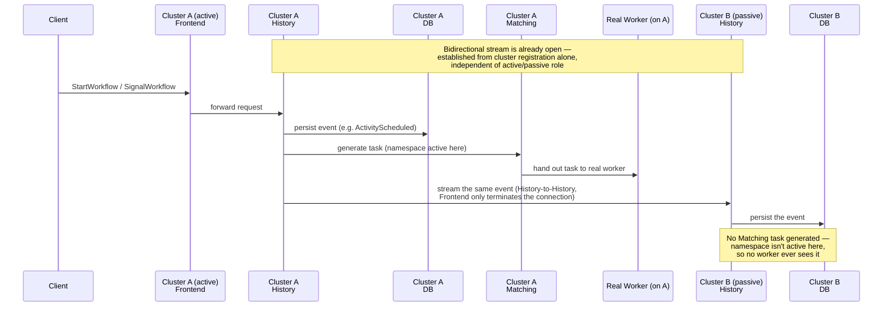
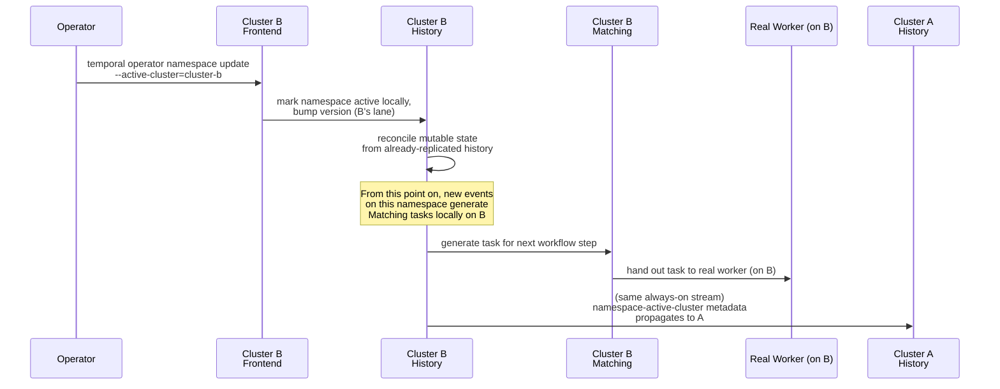

# Temporal Multi-Cluster Replication for Disaster Recovery — Research

| | |
|---|---|
| **Author** | aripermana.putra |
| **Date** | 2026-09-10 |
| **Related ticket** | [MCUCP-307](https://jira.rakuten-it.com/jira/browse/MCUCP-307) — Feasibility study for DR scenario with temporal server |
| **Purpose** | Understand self-hosted Temporal's disaster-recovery capabilities, specifically Multi-Cluster Replication (MCR), and identify a feasible DR approach for UCP |

---

## Summary

Self-hosted Temporal ships an experimental feature called **Multi-Cluster Replication (MCR)** that asynchronously replicates Workflow Execution history from an active cluster to one or more passive clusters, for backup and state reconstruction in a DR scenario. It provides eventual consistency, not strong consistency, and requires explicit CLI-driven failover — there is no automatic failover. A companion **namespace handover** mechanism reduces (but does not eliminate) data loss during a *planned* failover by waiting for replication lag to drain before flipping the active cluster.

MCR is one of at least three architectural options for Temporal DR; the others rely on Cloud SQL cross-region replication or periodic backup/restore instead of a Temporal-native feature. MCR (Option A below) is the direction being pursued, validated through the linked PoC before any production commitment.

## Problem

UCP needs Temporal Server to survive a regional/cluster outage without losing significant workflow state or requiring a full rebuild from scratch. Self-hosted Temporal does not natively behave like a stretched, multi-region cluster the way some managed databases do, so the DR mechanism has to be understood before any architecture decision is made.

## Why It Matters

Temporal Server is the durable-execution backbone for UCP's provisioning and orchestration workflows. If Temporal's persistence store or cluster becomes unavailable, every in-flight workflow (subscription provisioning, quota changes, drift reconciliation, etc.) stalls until it recovers. A DR strategy determines the acceptable RPO/RTO for the entire platform's workflow layer, not just Temporal itself.

## Findings

### What MCR is

> "Multi-Cluster Replication is a feature which asynchronously replicates Workflow Executions from active Clusters to other passive Clusters, for backup and state reconstruction." — [Temporal docs](https://docs.temporal.io/self-hosted-guide/multi-cluster-replication)

MCR replicates at the **namespace** level, not the cluster level. A namespace is registered as "global," and is active on exactly one cluster at a time. Other clusters registered against that namespace passively receive replicated history. Only one cluster can accept writes for a given namespace at any moment — MCR is active-passive per namespace, not active-active.

### Versioning and conflict resolution

- Each global namespace tracks a monotonically increasing **failover version** per event.
- Every cluster has a unique `initialFailoverVersion` and shares the same `failoverVersionIncrement` across all clusters in the replication group. Version numbers satisfy `version % failoverVersionIncrement == cluster's initialFailoverVersion`, which is how Temporal attributes a given history version to the cluster that wrote it.
- On failover, the new active cluster's version becomes the smallest value ≥ the old version that fits its own pattern.
- History is modeled as a tree; if two clusters both write branches for the same run (e.g., after an out-of-order failover), the branch with the highest version becomes the current branch, and the losing branch's in-flight tasks are discarded/rebuilt — with external events (signals) re-injected first so the workflow doesn't stall.

Confirmed directly, not just from source: the linked PoC forced this mechanism to actually
fire — a workflow in-flight on Cluster A when it's stopped, completed on Cluster B, then
Cluster A restarted with a worker racing its own stale-belief window to grab the same work a
second time. The race landed: both clusters' workers genuinely believed they owned the same
activity attempt simultaneously. Cluster A's worker ran its full (duplicate) execution, then
had its result **rejected outright** when it tried to report back —
`Error workflow execution already completed` — a clean server-side rejection, not a silent
overwrite or a hang. Querying Cluster A's own history afterward showed no trace of its
attempt at all: byte-for-byte identical to Cluster B's history, carrying Cluster B's
timestamps, not Cluster A's. Both clusters converged to one consistent final result. This
matches "highest failover version wins, losing branch discarded" exactly as described from
source — now watched happening, not just read.

### Prerequisites and configuration

- `enableGlobalNamespace: true` on every participating cluster.
- Identical `failoverVersionIncrement` across all clusters.
- Unique `initialFailoverVersion` per cluster (no duplicates in the replication group).
- Temporal v1.14+ only needs minimal local `clusterMetadata`; cluster connections are then added dynamically via CLI:
  ```shell
  temporal operator cluster upsert --frontend_address="127.0.2.1:8233"
  ```
  Connections can be disabled (`--enable_connection false`) or removed (`temporal operator cluster remove --name=...`) without restarting the server.
- The network connection between clusters terminates at each cluster's **Frontend** service — `frontend_address` is literally Frontend's address, since Frontend is the only service either cluster exposes externally. Frontend does not do the replication work itself: it hosts the `AdminService` RPCs (e.g. `GetReplicationMessages`) and forwards them internally to its own cluster's **History** service, which is where events are actually fetched, applied, and persisted. There is no shared/replicated database underneath — each cluster keeps its own independent persistence store; MCR is a server-level feature, not a storage-layer one.

### Cloud SQL topology for MCR

UCP's target persistence store is Cloud SQL, in both Tokyo and Osaka. MCR requires each
region's Temporal cluster to own an independent, always-writable database from the moment it
starts — the passive cluster's History service still needs read-write access to persist
replicated events, even though it never generates Matching tasks for them. A Cloud SQL
**cross-region read replica** cannot serve that role: it is read-only until explicitly
promoted, and promotion is a one-way, manual operation with no way to pause or disable
replication while keeping both sides independently writable — confirmed against
[Cloud SQL's cross-region replica documentation](https://cloud.google.com/sql/docs/postgres/replication/cross-region-replicas),
which states promotion "is not the same as high availability" and cannot be undone.

The correct topology is therefore two standalone Cloud SQL primary instances — one in Tokyo,
one in Osaka — with no cross-region replica relationship ever established between them at the
GCP layer. Cross-region consistency for Temporal's data is handled exclusively by MCR's own
application-layer replication (the stream described below); Cloud SQL's job in each region is
only to be a reliable local database for that region's cluster.

This does not apply uniformly to every database UCP runs on Cloud SQL. The Platform DB has no
MCR-equivalent application-layer replication available to it, so a Cloud SQL cross-region
read replica, promoted on disaster, is a reasonable — arguably the only reasonable — DR
pattern for it, accepting the Cloud SQL cross-region replication trade-offs described below.
That pattern must not be reused for Temporal's database specifically, since MCR already occupies
that layer and needs both sides independently writable to function.

Cloud SQL's **regional HA** configuration (a standby in a different zone, same region) is
unrelated and unaffected by any of this. It replicates synchronously at the storage layer
behind a single, unchanging connection endpoint — Temporal Server never becomes aware a
zone-level failover happened, let alone that it's talking to a replica. Enabling regional HA
independently on both Tokyo's and Osaka's Temporal Cloud SQL instances is complementary to
MCR, not redundant with it: HA absorbs a zone failure without any Temporal-level failover;
MCR is reserved for a full regional outage.

### Replication data flow

Two generations of the replication mechanism exist in the server source. The **fetcher** is the older, poll-based approach: a component periodically calls `GetReplicationMessages` (the `AdminService` RPC) against the peer's Frontend on a fixed interval. The **stream** is the current approach: a persistent, bidirectional gRPC stream stays open between the two clusters' History services (via `stream_sender.go`/`stream_receiver.go`/`bi_direction_stream.go`), and events flow continuously as they're generated rather than on a poll. The two are mutually exclusive, controlled by a single dynamic config flag: `enableFetcher := !config.EnableReplicationStream()`. `history.enableReplicationStream` defaults to `true`, so a current self-hosted cluster runs the stream by default; the fetcher only activates if streaming is explicitly disabled.

The stream's existence is **not** gated by which cluster is active or passive for any given namespace. It is established purely from cluster registration — as soon as a cluster's History service starts up and finds a peer in its `clusterMetadata`/`cluster upsert` config, it opens a bidirectional stream to that peer, unconditionally, in both directions at once. Active/passive status controls exactly one thing on top of that stream: whether a cluster's own local write for a given namespace is allowed to generate a Matching-service task (i.e., whether a real worker gets handed work). It does not control whether the stream exists, or whether incoming replication tasks get applied to the local database. This is why a replicated event sits durably in the passive cluster's database without any worker ever picking it up — the write happens either way, only the Matching task is withheld.



Failover does not move any data — the passive cluster already has (almost) everything from the steady-state flow above, since the stream was running the whole time. It only flips which cluster's History service is allowed to generate Matching tasks for the namespace, and stamps a new failover version on whatever gets written from that point on:



### Failover mechanics

- **No automatic failover.** Failover is an explicit operator action; standby-cluster requests are redirected to the active cluster via `dcRedirectionPolicy`, which is disabled by default. `dcRedirectionPolicy` only redirects a request that lands on a live-but-passive cluster to the active one — it cannot help if the passive cluster's peer is actually down, since there is nothing there to redirect from.
- Two distinct mechanisms exist for changing which cluster is active, and they are not interchangeable:
  - **`temporal operator namespace update --active-cluster=X`** is a direct, immediate metadata flip. Whichever cluster's Frontend receives it writes the new active-cluster value right away — no draining, no health check on the peer. This is the only option available when the current active cluster is actually down, since the alternative below depends on that cluster being reachable.
  - **Namespace handover** (confirmed in [temporalio/temporal source](https://github.com/temporalio/temporal/blob/main/service/worker/migration/handover_workflow.go)) is a separate, internal Temporal workflow for a *planned* failover: it queries the current replication watermark, waits for the target cluster to catch up within an `AllowedLaggingSeconds` threshold, puts the namespace into `HANDOVER` state (which rejects **all** requests to that namespace, on either cluster, for a short window — confirmed via the `ErrNamespaceHandover` check in [`common/util.go`](https://github.com/temporalio/temporal/blob/main/common/util.go)), waits for the target to fully drain to zero lag, flips the active cluster, then resets state to normal. It minimizes — but does not guarantee zero — data loss, and it cannot run at all if either cluster is unreachable.
- For an *unplanned* failover (active cluster is actually down), handover is off the table entirely — the operator must use the direct metadata flip against the surviving cluster, accepting whatever replication lag existed at the moment of the outage as the RPO loss window.

UCP runs a single active site with no automatic cross-region failover; an in-region issue is
handled by the regional cluster itself, not by failing over to another region. Every failover
in this model is an explicit operator action against a site the operator has already assessed
— confirmed dead (unplanned) or confirmed healthy (planned). This rules out the scenario where
a site is alive but merely network-partitioned and continues believing it is active while
unreachable: that scenario only matters for automatic, unattended failover, which is not part
of this architecture. The two mechanics above — a direct metadata flip against a surviving
cluster, and namespace handover against two clusters the operator already knows are both
reachable — are the only two paths this architecture ever exercises, and both were validated
by the linked PoC.

### Rejoining after an outage

When a cluster that was active goes down and later restarts, it does not know it has been failed over — its local namespace record is whatever it last persisted before crashing, which still says "I'm active" if it was active at the time. It finds out purely as a side effect of the always-on stream described above:

1. On startup, the returning cluster's History service opens its stream to the peer again — this happens unconditionally, from cluster registration, the same as any other boot.
2. The peer (now active) has been continuously sending its new events over that stream regardless of whether the returning cluster was reachable; once the stream reconnects, the returning cluster starts consuming the backlog.
3. Namespace metadata changes — including the active-cluster flip itself — replicate through the same mechanism as workflow history (handled by a dedicated `namespaceReplicationTaskExecutor` in `service/worker/replicator`). Applying that task is what actually corrects the returning cluster's local belief; there is no separate "check in with peer" handshake.

There is a genuine, if narrow, window between step 1 and step 3 where the returning cluster's local state is still stale. If a write were somehow routed to it during that window, it would be accepted under its old, lower failover version. This isn't prevented — it's cleaned up after the fact by the same version-based conflict resolution described above: the returning cluster's stale branch loses to the new active cluster's higher-versioned branch once both sides reconcile.

Separately, an outstanding backlog of un-consumed replication tasks sitting in an active
cluster's own database while its peer is unreachable is durable — it lives in the same
persisted task tables as everything else, not a separate broker with its own retention
policy — and there is nothing in the mechanism that implies a hard time or size limit on how
long it can safely wait there. This PoC's own outages were only seconds long, so this has not
been stress-tested at the scale of, say, a multi-day outage; it is noted here as an open
question rather than asserted as safe at any scale (see Open Questions).

### Adding a cluster to an already-populated deployment

MCR's replication tasks are only ever generated at the moment a new event is written. Nothing
retroactively creates a task for data that existed before a peer cluster was ever registered
— there was no registered peer to target when that data was originally written. This matters
for a specific, distinct scenario from the rejoin case above: not "a registered peer went
away and came back," but "a peer didn't exist yet when this data was created."

Concretely: if Cluster A runs single-cluster for a while — with a namespace that may not
even be global yet — and Cluster B is introduced later, registering Cluster B as a peer and
promoting the namespace to global does not backfill anything. Promotion itself is a real,
supported operation — the underlying field is `UpdateNamespaceRequest.PromoteNamespace`
(confirmed from Temporal's own test suite,
`tests/xdc/stream_based_replication_test.go`, where it's set together with the cluster list
in a single request) — but the `temporal` CLI's actual flag for it is **`--promote-global`**,
and confirmed empirically, the CLI **cannot combine `--promote-global` and `--cluster` in one
call** — it explicitly says the other flag will be omitted if you try. Promoting a namespace
and setting its multi-cluster replication config is two separate `operator namespace update`
calls in practice, not the one-call form the source-level test suggested. Either way, it only
takes effect going forward. Everything written to Cluster A before that point stays exactly
where it was written; Cluster B has zero record of it, not partial or delayed data, none at
all.

Temporal ships a separate, explicit mechanism for exactly this: the `force-replication`
(and `force-replication-v2`) migration workflow, alongside `namespace-handover` in the same
internal package. It lists a namespace's existing workflow executions (via a visibility
query, so scope is controllable) and manually generates a replication task for each one
against a target cluster — retroactively, as if each had just been written. It is
paginated, rate-limited, supports optional per-workflow verification against the target
cluster, and continues-as-new to avoid unbounded history growth — built for bulk migration,
not something that completes instantly.

The operational consequence: registering a second cluster against an already-populated
deployment does not make that deployment DR-ready by itself. Only activity from that point
forward is protected until `force-replication` has actually completed (and ideally been
verified). If the original cluster were to fail before that backfill finishes, everything
not yet backfilled is genuinely unreachable from the new cluster — not lagged, absent — and
recoverable only once the original cluster itself comes back.

A simpler alternative worth naming, not yet tested: seed the new cluster's persistence store
from a backup/restore of the existing cluster's data before registering it as an MCR peer, so
that live replication only has to cover the (small) gap between the snapshot and the moment
registration happens, rather than needing `force-replication` to backfill the entire prior
history. This trades an upfront backup/restore step for a much smaller `force-replication`
scope afterward — plausible, but not validated here.

> **Side note — not a current UCP requirement.** UCP's actual rollout creates both clusters
> from the start, so this entire subsection is reference material for a scenario that isn't
> the planned path, kept here in case it ever comes up. If it ever does, the following is
> worth being deliberate about:
>
> - **The window between promotion/registration and backfill completion is the real risk, not
>   a footnote.** New activity is protected immediately; pre-existing history is not, until
>   `force-replication` finishes. If the original cluster fails during that window, everything
>   not yet backfilled is unreachable, not lagged. Don't treat a successful `cluster upsert`
>   as "DR is now in place" — the guarantee only starts once backfill is complete and verified.
> - **`force-replication` is designed to run alongside live traffic, not during a freeze.** It
>   only reads existing executions and writes new replication tasks for them; it doesn't touch
>   live processing. Its `OverallRps`/`ConcurrentActivityCount`/`GetParentInfoRPS` throttling
>   knobs exist specifically so it can coexist with production load — a tool meant for a quiet
>   maintenance window wouldn't need rate limiting. Not stress-tested under real concurrent
>   load here, though — this PoC ran it with no competing live traffic, at a scale (5
>   workflows) too small for resource impact to be visible either way.
> - **Estimate resource impact on both clusters before running it for real.** On the source
>   cluster, it adds read load (visibility queries, per-execution history reads) competing
>   with live traffic for the same database. On the target cluster, it adds a burst of
>   replication tasks to apply, competing with whatever else that cluster is already
>   processing. Network bandwidth for shipping full history payloads is a third, smaller
>   factor. None of this was load-tested at realistic volume here — only structurally inferred
>   from the throttling knobs existing at all.
> - **Verify completeness explicitly rather than trusting the run finished cleanly.** The
>   `Query` field scopes what gets backfilled, and an empty string does not reliably mean
>   "everything" — confirmed empirically. Compare `TotalWorkflowCount` against
>   `ReplicatedWorkflowCount` from the workflow's own query handler, and consider enabling
>   `EnableVerification` despite the extra time it adds, given how consequential silently
>   missing a subset would be.
> - **Don't verify against the target cluster through the normal API if `dcRedirectionPolicy`
>   forwards requests** — confirmed directly in this PoC that `all-apis-forwarding` makes a
>   query against the target silently relay the source's answer, giving a false "yes it's
>   there." Verification needs either a different redirection policy or a direct query
>   against the target's own persistence store.
> - **It's namespace-scoped and not a documented CLI verb.** Each namespace needs its own
>   `force-replication` run; there's no cluster-wide equivalent. And like `namespace-handover`,
>   it's an internal workflow type invoked directly, not something in Temporal's own
>   operator-facing documentation — a real runbook would need this written down internally.
> - **CLI flag names differ from the source-level field names.** The real flag is
>   `--promote-global`, not `--promote-namespace`, and it cannot be combined with `--cluster`
>   in the same call — confirmed empirically, not assumed from source.

### RPO/operational implications

- Activity **completions do not replicate** across clusters. Outstanding activities at failover time eventually time out on the new active cluster and must be retried — application code needs retry-safe activities.
- Query consistency on a standby cluster lags behind the active cluster by the replication delay.
- Whether visibility (workflow list/search) APIs are actually served locally by a standby cluster, or forwarded to the active one, depends entirely on `dcRedirectionPolicy` — this is not a fixed MCR property. Confirmed empirically: with `all-apis-forwarding` (the policy used throughout this PoC, copied from Temporal's own reference config), a standby cluster forwards *every* frontend call, visibility included, to the active cluster — it is not served from local, possibly-stale data at all. This has two consequences worth being explicit about: reads against a standby under this policy reflect the active cluster's current state, not the standby's own replication lag; and if the active cluster is unreachable, those same forwarded calls simply hang until timeout rather than falling back to whatever the standby has locally — a standby under `all-apis-forwarding` cannot serve *any* frontend request, visibility or otherwise, once its peer is down. A different `dcRedirectionPolicy` value could behave differently; not tested here.
- "Zombie" workflow states can occur if replicated runs arrive out of order (e.g., run 2 arrives before run 1); the earlier run stays in a zombie state until its replication catches up.

### Status

Temporal's own docs mark MCR **experimental** — "outside normal versioning and support policies" — and route troubleshooting to the community Slack rather than to a supported-feature process. This is a material input to any recommendation, not just a technical detail.

### MCR vs. Cloud SQL cross-region replication

A natural alternative to MCR is skipping Temporal's own replication entirely and relying on
**Cloud SQL for PostgreSQL's** own replication — UCP's actual target persistence store, not a
self-managed database. Concretely, this means Cloud SQL's built-in cross-region read replica,
promoted on disaster, into a warm, traffic-free standby. This is a distinct feature from
Cloud SQL's separately configurable PostgreSQL logical replication (publications/subscriptions
for selective-table or change-data-capture use cases) — the standard "create replica" flow
does not use it. Because there is no self-managed database in UCP's environment, anything below
that would only apply to self-hosted Postgres (installing HA/fencing tooling, running
`pg_basebackup` by hand, etc.) is called out explicitly as not applicable, rather than assumed.

The comparison below is qualitative where the underlying mechanism differs categorically, and
quantitative where a defensible order-of-magnitude bound exists — the numbers are structural
estimates from how each mechanism works, not measured benchmarks; validating them is exactly
what the linked PoC is for.

**Qualitative**

| Dimension | MCR | Cloud SQL cross-region replication |
|---|---|---|
| Conflict resolution on divergence | Built in — failover-version stamping, highest-version-wins, applied automatically and incrementally at the workflow level | None. Cloud SQL's built-in replica is physical (streaming) replication under the hood, which refuses to reattach across a timeline split once the two sides have diverged — there is no merge path |
| Recovery from a real split-brain | Incremental — the losing branch's tasks are discarded, the workflow keeps running | Full rebuild — the diverged instance must be deleted and a new Cloud SQL replica created from the surviving instance. Google manages the underlying resync mechanics, but from an operator's perspective this is a full instance recreation, not an incremental repair; no partial merge exists |
| Standby readiness | Passive cluster's Temporal Server is already running, shards already replicated | No live Temporal Server can run against a Cloud SQL read replica — it's read-only, and Temporal assumes read-write DB access even when idle — so the standby region's Temporal Server must be off until promotion |
| Split-brain prevention | Application-layer, always on, requires no separate tooling | Cloud SQL is fully managed — there's no OS access to install self-hosted fencing tools even if one wanted to. Google's own promote-replica flow only transforms the replica; it takes no action on the original primary, and its documentation does not address the network-partitioned-but-alive case. Fencing the old primary is left entirely to the operator, via GCP-native controls (revoking network access, or stopping/deleting the instance through the Cloud SQL Admin API) |
| Coverage of non-OLTP state | N/A — history and namespace metadata are both first-class replicated objects | Advanced visibility (Elasticsearch, if used) sits outside Cloud SQL entirely and needs its own replication/reindex story |
| Schema evolution | Handled as part of normal cluster operation | Cloud SQL's built-in replica, being physical replication, carries schema changes automatically since it replicates at the byte level including system catalogs. This would only become a problem if Cloud SQL's separate logical-replication feature were deliberately used instead of the standard replica flow — logical replication does not carry DDL at all — which is not the default path and not assumed here |
| Vendor validation | Documented, if experimental, first-party Temporal feature | Not a Temporal feature at all; Temporal's own maintainers have not even validated the simpler read-replica-for-reads case (open, unresolved [GitHub issue](https://github.com/temporalio/temporal/issues/10442)) |
| Failover-runbook shape | One command; rejoin is automatic | A multi-branch decision tree — dead vs. partitioned-but-alive, clean reattach vs. rebuild, lag-zero gate before restarting Temporal Server — order-sensitive and brittle under incident pressure |

**Quantitative (order-of-magnitude, not yet measured)**

| Dimension | MCR | Cloud SQL cross-region replication |
|---|---|---|
| RPO, unplanned failover | Bounded by stream lag — sub-second to low-seconds under normal load | Same order of magnitude — bounded by Cloud SQL's replication lag. No structural advantage either way |
| RPO, planned failover | Near-zero — handover drains to a configurable `AllowedLaggingSeconds` window (server-side bounds seen in source: 5–120s) before flipping | No equivalent drain workflow exists; a "planned" version is a manual stop-writes-and-wait procedure, achievable but entirely operator-executed |
| RTO, failover execution | Seconds — one metadata flip against an already-running standby cluster | Minutes to tens of minutes — Cloud SQL replica promotion plus a full cold start of an entire Temporal Server deployment |
| RTO, clean rejoin after outage | Automatic; bounded by remaining stream lag (seconds to low-minutes) | Manual, gated multi-step reattachment (minutes), assuming no divergence occurred |
| RTO, rejoin after real divergence | N/A — MCR has no destructive-rebuild path; divergence resolves incrementally | Delete and recreate the Cloud SQL replica from the surviving instance; Google manages the resync, but it scales with total database size — plausibly hours for a non-trivial deployment |
| New standing infrastructure | Persistent cross-cluster gRPC connectivity between clusters' Frontend services | Cross-region Cloud SQL replication itself is fully managed by Google — no new infrastructure to run there. What's missing instead is a runbook-level fencing step (see above), which is process, not infrastructure, and is not provided by the managed service |

## Options

Three architecturally distinct ways to get DR for a self-hosted Temporal deployment:

| Option | Mechanism | RPO | RTO | Failover | Operational complexity | Maturity |
|---|---|---|---|---|---|---|
| **A. Multi-Cluster Replication (MCR)** | Temporal-native async replication of workflow history between independently-persisted clusters | Non-zero; bounded by replication lag at failure time (unplanned) or near-zero via handover (planned) | Manual CLI failover; standby cluster is already warm/running | Manual, per-namespace | Moderate — cluster metadata, CLI cluster registration, redirection policy | Experimental, unsupported by normal Temporal versioning policy |
| **B. Cloud SQL cross-region replication** | Single logical Temporal cluster backed by Cloud SQL for PostgreSQL's built-in cross-region read replica, promoted on disaster, into a warm, traffic-free standby; Temporal server layer is unaware of DR | Same order of magnitude as Option A — still async, still lag-bounded | Worse than Option A — standby Temporal Server can't run warm against a read-only Cloud SQL replica, so failover means promoting the replica and cold-starting an entire dormant deployment | Handled by Cloud SQL, not Temporal; no built-in cross-cluster conflict resolution, so a botched cutover produces silent, permanent divergence requiring the replica to be deleted and recreated, not a resolvable conflict | High — Cloud SQL is fully managed, so there's no self-hosted fencing/HA tooling to install even if desired; Google's promote-replica flow doesn't fence the old primary either, leaving a runbook-level gap plus a multi-branch, order-sensitive failover procedure | Relies on Cloud SQL's own mature replication mechanism, but Temporal's own maintainers have not validated even the simpler read-replica-for-reads case for this ([open issue](https://github.com/temporalio/temporal/issues/10442)) — no validated precedent for DR specifically |
| **C. Backup/restore** | Periodic snapshot of the persistence store (and visibility store) shipped to a DR region; cold cluster stood up from the latest snapshot on disaster | Bounded by backup interval (likely minutes to hours, not seconds) | Bounded by restore + cluster bring-up time (likely tens of minutes) | Manual, whole-cluster | Low — no cross-cluster networking or cluster-metadata coordination needed at all | Standard ops practice, no Temporal-specific feature involved |

Note: Temporal does not support true active-active for a given namespace under any of these options — only one cluster can accept writes for a namespace at a time. Distributing *different* namespaces as "active" across different clusters (namespace-level load spreading) is possible but is a placement strategy, not redundancy for a given namespace.

## Recommendation

Pursue **Option A, Multi-Cluster Replication**, validated through the PoC linked below before
it is adopted as UCP's DR direction.

MCR and the most plausible alternative, Cloud SQL cross-region replication into a warm
standby (Option B), share the same RPO profile — both are asynchronous and lag-bounded, so
neither has a structural edge on how much data a real outage can lose. Everywhere else, they
diverge sharply in MCR's favor. Option B's standby Temporal Server cannot run warm against a
read-only Cloud SQL replica, so its RTO requires a replica promotion followed by a full cold
start of an entire dormant deployment — categorically slower than MCR's single metadata flip
against an already-running cluster. More importantly, MCR has a purpose-built,
application-layer mechanism for the failure mode that matters most in a real regional
incident — two sides briefly diverging — and resolves it incrementally and automatically
(failover-version stamping, highest-version-wins). Option B has no equivalent: a botched
cutover produces silent, permanent divergence that can only be recovered by deleting one
side's Cloud SQL instance and recreating it from the other, and there is no self-hosted
fencing tooling available to prevent it in the first place — Cloud SQL is fully managed, and
Google's own promote-replica flow does not fence the original primary either. That gap turns
Option B's DR runbook into a multi-branch, order-sensitive decision tree executed by a human
under incident pressure, where MCR's equivalent is a single command followed by automatic,
self-healing rejoin.

MCR's experimental status is a real, unresolved risk (see Open Questions) — but it is a risk
about Temporal's support posture, not about the mechanism's design. Option B's risks are
structural: they follow from what Cloud SQL's cross-region replication fundamentally cannot do
(resolve cross-cluster conflicts, keep a standby warm), not from how mature or well-supported
Cloud SQL itself is in general. Given that, MCR is the direction worth validating through
implementation, with its experimental status tracked as an explicit, separate risk to resolve
before production commitment — not a reason to default to an alternative with weaker
guarantees on every dimension except one they tie on.

## Open Questions

- What RPO/RTO does UCP actually need for the Temporal-backed workflow layer? This isn't established yet and materially changes which option (A/B/C) is viable.
- Is "experimental, unsupported by normal versioning policy" an acceptable risk for a production DR mechanism, or does that alone rule out Option A regardless of its RPO/RTO profile?
- Does UCP need cross-cluster DR at all in the near term, or is single-cluster + backup/restore (Option C) sufficient for the current stage of the platform?
- Is there a practical ceiling on how long an outstanding replication-task backlog can safely sit in an active cluster's own database while its peer is unreachable? Not something this PoC's short (seconds-scale) outages exercised — durability of the mechanism is confirmed, but not its behavior at hours/days scale or under heavy write volume during the outage.

Out of scope given UCP's architecture (single active site, no automatic cross-region
failover; in-region issues are handled by the regional cluster) — not pursued further:

- Live client-visible rejection during the `HANDOVER` window under real replication lag, and
  behavior under an actual network partition (as opposed to a stopped cluster) where the old
  site stays alive and unreachable. Both scenarios only matter for automatic, unattended
  failover between two sites that might disagree about which is active — this architecture
  never puts an operator in that position, since every failover here is a deliberate action
  against a site whose status the operator has already confirmed.

## Related PoCs

- [pocs/temporal-multi-cluster-replication](../pocs/temporal-multi-cluster-replication.md) —
  **complete**. Two independent Temporal clusters (each in its own Colima VM) established
  cluster-to-cluster connectivity, replicated a namespace's workflow history, and completed
  both a manual flip and a forced failover with the active cluster actually stopped. Critically,
  the previously-failed cluster self-healed on rejoin — matching the other cluster's active
  state and failover version within seconds, no manual rebuild — the specific behavior this
  Recommendation depends on. See [poc-report.md](../pocs/temporal-multi-cluster-replication/poc-report.md)
  for the full verdict, including what was not covered (namespace handover, Cloud SQL itself,
  load testing).

## References

- [Temporal Docs — Cluster Deployment Guide](https://docs.temporal.io/cluster-deployment-guide)
- [Temporal Docs — Multi-Cluster Replication](https://docs.temporal.io/self-hosted-guide/multi-cluster-replication)
- [temporalio/temporal — namespace handover workflow source](https://github.com/temporalio/temporal/blob/main/service/worker/migration/handover_workflow.go)
- [temporalio/temporal — namespace handover interceptor source](https://github.com/temporalio/temporal/blob/main/common/rpc/interceptor/namespace_handover.go)
- [temporalio/temporal — Frontend AdminService replication handler source](https://github.com/temporalio/temporal/blob/main/service/frontend/admin_handler.go)
- [temporalio/temporal — bidirectional replication stream source](https://github.com/temporalio/temporal/blob/main/service/history/replication/bi_direction_stream.go)
- [temporalio/temporal — replication task processor manager (fetcher vs. stream toggle)](https://github.com/temporalio/temporal/blob/main/service/history/replication/task_processor_manager.go)
- [temporalio/temporal — `history.enableReplicationStream` dynamic config definition](https://github.com/temporalio/temporal/blob/main/common/dynamicconfig/constants.go)
- [temporalio/temporal — namespace replication task executor (applies active-cluster changes on the receiving side)](https://github.com/temporalio/temporal/tree/main/service/worker/replicator)
- [temporalio/temporal — `ErrNamespaceHandover` definition](https://github.com/temporalio/temporal/blob/main/common/util.go)
- [Google Cloud SQL — cross-region read replicas (promotion semantics)](https://cloud.google.com/sql/docs/postgres/replication/cross-region-replicas)
- [temporalio/temporal — open issue on read-replica support (unresolved, maintainer comment on consistency assumptions)](https://github.com/temporalio/temporal/issues/10442)
- [temporalio/temporal — `force-replication` / `force-replication-v2` migration workflow source](https://github.com/temporalio/temporal/blob/main/service/worker/migration/force_replication_workflow.go)
- [temporalio/temporal — `catchup` migration workflow source](https://github.com/temporalio/temporal/blob/main/service/worker/migration/catchup_workflow.go)
- [temporalio/temporal — namespace promotion (`PromoteNamespace`) confirmed in server test suite](https://github.com/temporalio/temporal/blob/main/tests/xdc/stream_based_replication_test.go)
